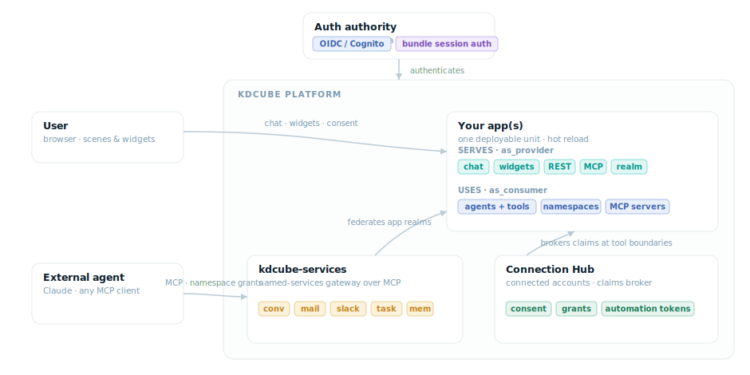

<p align="center">
  
</p>

# KDCube

**The open-source, self-hosted production runtime for AI applications.**

Keep the agent and product code you already have. Run LangGraph, CrewAI,
Claude Agent SDK, your own loop, or KDCube's built-in ReAct agent. KDCube
handles the production work around it: multi-user serving, ordered
conversation delivery, streaming, files, identity, isolated code execution,
cost controls, configuration, secrets, and deployment from Git.

Start with one capability. Put an existing agent behind REST, a webhook, or a
streaming conversation endpoint. Embed the ready-made chat in your site. Add
managed integrations or isolated execution later. You do not need to adopt
the whole platform at once.

<p align="center">
  
</p>

Website: [kdcube.tech](https://kdcube.tech) · Interactive architecture:
[kdcube.tech/architecture.html](https://kdcube.tech/architecture.html)

## Security and deployment scope

KDCube is an application runtime and SDK, not a single MCP server or a
workstation connector. Applications can expose or consume MCP, REST, UI,
event, and agent surfaces under explicit deployment policy.

- One running deployment is bound to one effective `tenant/project` and may
  serve many users and operator-approved applications.
- Application backend code is trusted deployment code. Generated code is a
  separate boundary whose isolation strength depends on the configured
  execution profile.
- In the managed production path, secrets and connected-account credentials
  stay on the trusted server side; trusted tools resolve them only for an
  authorized request. The split executor receives neither the platform secret
  store nor provider credentials.
- Shared backing infrastructure is logically namespaced. Use separate
  deployments or dedicated infrastructure when a stronger boundary is
  required.

Read the canonical [Security And Trust Model](app/ai-app/docs/arch/security-and-trust-model-README.md)
and the repository [security policy](SECURITY.md) before production use.

## Quick start

```bash
pip install kdcube-cli
```

Then create or connect an app, start the local runtime, and reload changes
without rebuilding the platform image. Follow the
[Quick Start](app/ai-app/docs/quick-start-README.md).

## Choose your starting point

| You already have | Add with KDCube |
| --- | --- |
| A LangGraph, CrewAI, Claude Agent SDK, or custom agent | A small execution adapter, ordered multi-user delivery, streaming, persistence hooks, budgets, and deployment |
| A website or product UI | The configurable chat widget, or native integration through streaming and operations APIs |
| Tools and provider integrations | Trackable tools, scoped credentials, user consent, REST/MCP boundaries, and isolated execution |
| A new AI feature to build quickly | Ready chat, ReAct, web search, files, conversation storage, user memory, knowledge access, and configurable tools and skills |
| Several AI services or frontends | Independently deployable apps that provide and consume APIs, tools, MCP services, events, and UI surfaces |

Each app can be as small as one backend service or as broad as a workspace.
Apps may have no UI and no agent, or may host several agents and frontends.

## What the runtime handles

- **Serve and stream.** Ordered per-conversation work, live output, followups,
  external events, reconnectable chat, files, and conversation history.
- **Deploy and update.** App code from Git, descriptor-based configuration,
  secret references, local/cloud parity, and near-live app reloads.
- **Run generated code under explicit isolation policy.** Local subprocess
  mode provides development-time crash containment but inherits the host
  environment and network. Legacy combined Docker adds a container and a
  filtered child environment while retaining one container/mount trust zone.
  The reference split-Docker profile places generated code in a separate,
  networkless executor with narrow mounts. Approved tools run on the trusted
  supervisor side under the current request identity and policy.
- **Connect users and systems.** OIDC and application authority, external
  accounts, Telegram identity linking, managed grants, revocable automation
  access, and protected REST or MCP surfaces.
- **Track economics.** Attribute accountable LLM, embedding, web-search, and
  tool work to the user, app, conversation, and turn; enforce budgets before
  covered calls run.
- **Compose a product.** Ready chat and workspace components, custom widgets,
  scenes, canvases, app-hosted websites, APIs, jobs, and domain services.

<p align="center">
  
</p>

A KDCube deployment is bound to one tenant/project scope and serves many
concurrent users. Shared infrastructure may be namespaced rather than
dedicated, while request identity and policy travel across process, thread,
subprocess, and isolated-runtime boundaries.

## Bring your agent, or use KDCube ReAct Agent

Existing agent frameworks remain responsible for their own graph or loop.
KDCube supplies the surrounding runtime. In scaled serving, a graph is built
for the current turn and then discarded; durable state belongs in its
checkpointer or storage, not in a process-local graph object.

The optional built-in ReAct agent uses an event-aware timeline and semantic
streaming channels rather than requiring a provider-native tool-calling
protocol. It can react to user input, tool results, application events,
followups, steering, and current runtime conditions. With the reference split
isolation profile, model-written code runs in a separate, networkless executor
and reaches privileged capabilities through trusted supervisor tools.

[Settle an existing solution in KDCube](app/ai-app/docs/recipes/kdcube_for_agents/settle-your-solution-in-kdcube-README.md) ·
[ReAct runtime](app/ai-app/docs/sdk/agents/react/flow-README.md) ·
[Why ReAct is not simply tool calling](app/ai-app/docs/sdk/agents/react/why/why-not-simply-tool-calling-README.md) ·
[Isolated execution](app/ai-app/docs/exec/README-iso-runtime.md)

## Apps provide and consume surfaces

An app can **provide** APIs, widgets, named services, MCP endpoints, events,
jobs, or an agent. The same app can **consume** another app's services,
external MCP servers, provider accounts, and shared platform capabilities.
These boundaries are explicit in configuration, so every agent and surface
can have its own tools, grants, models, budgets, and execution policy.

This is the framework layer: the SDK, contracts, configuration, components,
and extension points builders use. The runtime executes and enforces those
contracts. The platform combines both with shared serving, identity,
economics, storage, hosting, and control surfaces.

## Where KDCube fits

| Capability | KDCube | Agent frameworks | Agent ops platforms |
| --- | --- | --- | --- |
| Keep an existing agent implementation | Yes | Native implementation | Integrate it |
| Multi-user conversation serving, streaming, files, and UI | Built in | Assemble around the agent | Not their primary role |
| Pre-run per-user budgets and cross-runtime accounting | Built in | Implement in application code | Primarily observe and analyze |
| Isolated generated-code workspace with brokered trusted tools | Built in | Add separately | Varies by product |
| User identity, connected accounts, delegated operators, and grants | Built in | Add separately | Not their primary role |
| Tracing and evaluation workflows | Runtime records; use your preferred evaluation stack | Integrate an ops tool | Core strength |
| Self-hosted open-source runtime | MIT | Common for libraries | Varies by product and plan |

KDCube complements agent frameworks and observability products. It does not
ask you to discard either.

## Documentation

- [What you can do with KDCube](app/ai-app/docs/what-you-can-do-with-kdcube-README.md)
- [How to integrate with KDCube apps](app/ai-app/docs/how-to-integrate-with-kdcube-apps-README.md)
- [Architecture](app/ai-app/docs/arch/architecture-of-what-we-built-README.md)
- [Security and trust model](app/ai-app/docs/arch/security-and-trust-model-README.md)
- [Docs index](app/ai-app/docs/README.md)
- [Builder navigation](app/ai-app/docs/sdk/bundle/build/how-to-navigate-kdcube-docs-README.md)

## License

[MIT](LICENSE)
