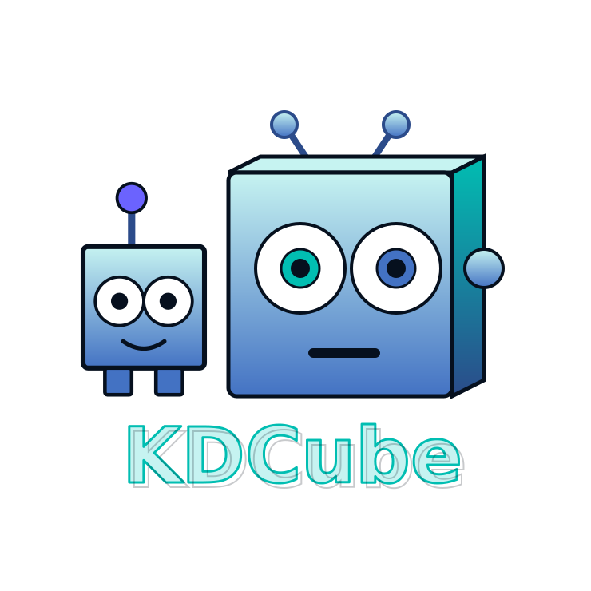

<p align="center">
  
</p>

<p align="center">
  <strong><span style="color:#16a34a;font-size:1.15em;">Build powerful governed AI apps quickly, on infrastructure you control.</span></strong>
</p>

<p align="center">
  KDCube gives developers an app framework, reference ReAct runtime, reusable
  widgets, named-service integration, isolated execution, tenancy, budgets, RBAC,
  and accounting as platform primitives — so a prototype can become a governed
  product without rebuilding the runtime from scratch.
</p>

<p align="center">
  <a href="https://opensource.org/license/MIT">
    
  </a>
  <a href="https://pypi.org/project/kdcube-cli/">
    
  </a>
  <a href="https://pypistats.org/packages/kdcube-cli">
    
  </a>
</p>

---

<p align="center">
  
</p>

## Build powerful AI apps fast. Keep them governable as they grow.

The first reason to use KDCube is speed: developers can assemble chat, tools,
UI widgets, APIs, MCP, cron, memory, Pinboard, named-service objects, and
isolated execution into a working app without inventing the runtime envelope.

That speed matters because the first AI demo ships in a weekend. The trouble
starts at the **second and third app in production**, when someone has to
answer:

- Who is allowed to run what, and which surfaces are visible to which roles?
- What did each app cost, and how do we cap it before it surprises us?
- Where does untrusted, model-generated code actually execute?
- Which events are allowed to leave our boundary — and which never can?
- How do we update a live app without redeploying the whole service?

Managed agent services, flow builders, and agent frameworks each handle part of this well. KDCube focuses on the combination that app builders need: a fast path to real products plus the governed runtime and control plane that are hardest to retrofit later. Isolation, budgets, RBAC, accounting, and an outbound event firewall are part of the platform rather than something you assemble per app.

KDCube is not just an agent framework, not just a chatbot, and not just a flow builder. It lets teams package full AI applications — chat, UI, APIs, MCP surfaces, scheduled jobs, configuration, state — as deployable units called **apps**, and run them with platform controls.

## Who it is for

**Primarily:**

- **Platform and AI-infrastructure teams** running multiple AI apps or agents, who need one runtime with consistent governance instead of per-app scaffolding.
- **Regulated or data-sensitive organizations** — financial services, healthcare, defense, government, or any org where data, prompts, tools, and execution must stay inside controlled infrastructure.
- **Product/application teams and solution builders** packaging internal AI tools as deployable, governed apps with chat, UI, APIs, jobs, MCP, configuration, and owned domain state in one unit.

**Also for:**

- **Coding agents and engineers** building apps — the docs are written to be navigable by both.
- **Operators** responsible for deployment, budgets, accounting, RBAC, isolation, and runtime policy.

It is probably not the first tool to reach for if you only need a one-off prompt demo, a pure no-code flow builder, or a fully managed vendor-hosted agent service.

## What becomes possible

KDCube is not only a place to run a chatbot. It is a way to turn internal systems, files, workflows, and human review loops into governed AI applications that can grow past the first demo.

- **A private AI app store for your organization.** Each app ships as a complete internal product with its own chat, UI, API, jobs, MCP surface, config, secrets, state, and permissions.
- **Domain objects the agent can actually understand.** Tasks, memories, files, incidents, cases, reports — or any namespace you define — become first-class refs with provider-owned schemas, previews, actions, and materialization paths.
- **A governed ReAct runtime, not just a model call.** Apps can include KDCube's timeline-driven agent runtime with tools, event-source policies, ANNOUNCE, compaction, steer/followup, and named-service materialization.
- **A real execution boundary for generated code.** Trusted app logic and secrets stay separate from untrusted/model-generated code, which can run through isolated local, Docker, split supervisor/executor, or Fargate execution modes.
- **A shared work surface, not just a chat transcript.** Chat, canvas, widgets, files, tasks, and tools exchange context through stable refs instead of copy-pasted text.
- **Governed automation at the edge of real systems.** Agents can inspect, update, cite, or attach objects only through configured tools, namespace contracts, and auth-aware provider operations.
- **AI products that can be operated.** Platform teams can see costs, enforce budgets, isolate execution, gate surface visibility, control event egress, and reload/apply configuration at runtime.
- **Reusable intelligence.** An app that owns a namespace can serve its objects to other apps, agents, widgets, canvas, chat, and MCP clients without those consumers learning its storage model.

### See it running

The demo landing scene runs several governed surfaces on a single page — each panel is a separate app widget with its own visibility and runtime boundary: a versatile chat agent, a pin-board canvas, durable user memories, a task tracker, usage/economics, and an industry-news feed. Context is dragged between them as refs; any surface can be summoned or dismissed. One runtime, many independently governed AI surfaces.

Project site and demo: **https://kdcube.tech/**

## Where KDCube fits

These categories overlap, and each is strong at what it is built for. KDCube's distinct combination is self-hosted and code-first, with tenancy, budgets, isolated execution, accounting, **and a reference agent runtime on board** as platform primitives rather than add-ons.

| | **KDCube** | Managed agent services<br>(AWS / Microsoft / Google) | Flow builders<br>(Dify / Flowise) | Agent frameworks<br>(LangGraph / CrewAI) |
| --- | :---: | :---: | :---: | :---: |
| Self-hosted; data stays in your boundary | ✅ | runs in their cloud | ✅ | n/a (a library) |
| Governed runtime: tenancy, RBAC, budgets | ✅ | partial, in their cloud | ❌ | ❌ |
| Isolated execution for untrusted code | ✅ | their sandbox | ❌ | ❌ |
| Reference agent runtime on board (ReAct) | ✅ | their runtime | ❌ | the loop; the runtime is yours |
| Domain objects as governed namespaces | ✅ | ❌ | ❌ | ❌ |
| Full apps (API, UI, MCP, cron), not one loop | ✅ | varies | flows only | loop only |
| Code-first | ✅ | low-code | low-code | ✅ |
| Control plane (enable / gate / reload / apply) | ✅ | partial | ❌ | ❌ |

The table is about fit, not ranking. KDCube's focus is governance depth plus a self-hosted runtime — including a reference ReAct agent runtime, so you are not assembling tenancy, budgets, isolation, and the agent loop yourself.

## Governance as platform primitives

These are the parts a security or platform review actually asks about, and in KDCube they are built into the runtime:

- **Isolated environments** — one `tenant/project` is one isolated environment with its own state, budgets, and configuration. One environment hosts many applications. Use separate environments for `dev`, `staging`, `prod`, or for deployments that must never share runtime state.
- **RBAC + surface visibility** — role-scoped control over the application *and* each individual surface (API, widget, MCP, job).
- **Budgets, rate limits, and accounting** — economic tiers, project budgets, service rate limits, price-table accounting, and billing hooks.
- **A real trust boundary** — trusted calls run through app tools; untrusted, model-generated code runs in isolated exec. These are not interchangeable.
- **Outbound event firewall** — app-level control over which events are allowed to leave the runtime toward the client.
- **Runtime configuration flows** — enable, disable, gate, reload, and re-apply apps and their surfaces without rebuilding or redeploying the whole service for every change.

## What you deploy: an `app`

A deployable AI application in KDCube is called an **app** — one folder of code and resources that carries backend, frontend, APIs, widgets, MCP surfaces, scheduled jobs, configuration, storage, and runtime behavior **together**. It is not a plugin or a prompt wrapper; it is one whole application that can expose several governed surfaces at once. KDCube loads an app from your local filesystem or from Git by repo ref plus the app folder path.

> **Compatibility note** — some lower-level config files, CLI commands, paths, and older SDK docs still use the legacy name **bundle** (`bundles.template.yaml`, `kdcube bundle ...`, `sdk/bundle/...`). In product and builder-facing docs, the deployable unit is an **app**.

Typical app structure:

```text
my.app@1-0/
  README.md
  AGENTS.md
  release.yaml
  entrypoint.py            # decorated surfaces: APIs, widgets, jobs, MCP, Data Bus handlers
  agents/
    main.py                # agent workflow when the app uses ReAct
  services/                # reusable app services/adapters
  tools/                   # optional app-local Python tools
  skills/                  # optional app-local skills
  config/
    bundles.template.yaml
    bundles.secrets.template.yaml
  interface/               # the app's public contract + OpenAPI
  ui/                      # main app + source-folder widgets or mini apps
  docs/  resources/  tests/  requirements.txt
  backend_bridge/          # optional Node/TS backend behind a narrow bridge
```

Tool and skill wiring is **config-first and per agent**: the app declares which tools, namespaces, operations, and skills each agent id may use under `surfaces.as_consumer.agents.<agent>.tools` and `surfaces.as_consumer.agents.<agent>.skills`. Capability is granted per agent, not globally.

Python is the KDCube-native shell. Selected backend logic can live in Node or TypeScript behind a narrow bridge — see [App Node backend bridge](app/ai-app/docs/sdk/bundle/bundle-node-backend-bridge-README.md) and [Node backend sidecar](app/ai-app/docs/sdk/node/node-backend-sidecar-README.md).

## Control over the agent and its runtime

Hosting is half of it. KDCube also gives the app author direct control over how the agent perceives and acts — the parts most stacks leave implicit:

- **How events and objects are represented to the agent.** A tool or domain object declares, through `@event_source(...)` and event policies (`react_phase = block_production / timeline_projection / announce_production / compaction_projection`), exactly how its result becomes timeline blocks and ANNOUNCE, and what the model actually sees. The agent's view of a domain object is authored, not accidental.
- **Timeline and context policies, including "cold" history.** Context length is bounded by compaction (a hard ceiling that summarizes and drops older blocks) and by age-based TTL pruning; after a cold cache, history collapses into compact semantic summary cards instead of a full replay. You can hook `on_before_compaction` / `on_after_compaction`, set the trigger (`context_max_tokens`), and tune how many recent turns stay intact and where prompt-cache breakpoints land.
- **Data retention and exposure.** Timeline retention is TTL-based (`cache_ttl_seconds`, `cache_keep_recent_turns`), and what the agent can pull into its workspace is bounded by explicit read caps. Retention and exposure are configuration, not inherited defaults.
- **Custom ontologic namespaces.** An app can own a semantic namespace — `task:`, `mem:`, `cnv:`, or one you define — by implementing a **named service provider**. The provider owns refs, objects, schemas, previews, actions, block rendering, file hosting, and URI resolution for that namespace. Consumers connect chat, canvas, and agents to those surfaces by configuration, without embedding app-specific logic in common components.
- **Materialization both ways.** Agents can pull namespace refs into their isolated workspace as real files, and host agent-produced files back into a provider-owned namespace — under the provider's contract and the caller's auth context.
- **Per-agent model routing.** Default models per agent role, overridable by app config and again per invocation (`bundle_call_context.role_models`, the current compatibility field name).

In short: you decide, deliberately, what the agent sees, what it can touch, what it remembers, and what it is allowed to emit.

### More than one runtime per app

One app is not limited to one agent or one runtime. Inside a single app you can combine blocks and give each the boundary it needs:

- **ReAct Agent** — the on-board reference agent runtime, strongly isolated, for shared and user-facing work: timeline-driven orchestration, a per-turn git-based isolated workspace, subagents, context compaction, ANNOUNCE, and tool-driven execution. It consumes conversation events from the event bus — user messages, attachments, **steer** (a live control interrupt that stops the active phase and re-enters with the steer on the turn timeline), and **followup** (folded into the open turn, extending it with another decision round and bounded extra iteration credit). It is **not** built on provider-native tool-calling — the loop is controlled by the platform runtime — so a model that follows the ReAct contract, including non-tool-calling models, can be the reasoning brain.
- **Claude Code** — for owner/admin coding flows and complex coding pipelines. Useful, but **not** trust-equivalent to ReAct Agent.
- **Custom Python agents** — domain-specific flows.
- **Isolated exec** — untrusted, generated code under control.
- **`@venv(...)`** — dependency-heavy Python leaf helpers.

The same app also holds ordinary backend logic, APIs, widgets, cron, and MCP that don't need an agent runtime at all. Streaming and transport surfaces run over REST, SSE, Socket.IO, and MCP. Two durable inbound paths keep their own contracts: the **conversation event bus** carries everything meant for the agent's timeline (messages, attachments, steer, followup, attached context), while the **Data Bus** carries app-scoped durable mutations (board patches, object edits) into `@data_bus_handler` workers.

Built-in SDK/runtime capabilities include Neuro Search, rendering tools (PDF / PPTX / DOCX / HTML / PNG), a managed shared Playwright browser runtime, custom tools and skills, and MCP-connected tool surfaces.

## What you can build

- **Internal AI workbenches** where chat, canvas, documents, tasks, memory, and domain widgets cooperate on one shared surface.
- **Operational assistants** that inspect and update owned systems through explicit provider contracts.
- **Governed task/case/incident systems** where attachments, evidence, state changes, and summaries stay inside the organization boundary.
- **AI-backed APIs, webhooks, and MCP surfaces** that let external tools and coding agents consume the same governed capabilities.
- **Scheduled AI pipelines** for reports, monitoring, ingestion, review queues, and background enrichment.
- **Customer or employee-facing mini apps** with their own frontend plus server-side tools, jobs, config, and authorization.
- **Reusable namespace providers** that make domain objects available to chat, canvas, agents, and other apps without leaking implementation details.

## Quick start

```bash
pipx install kdcube-cli   # or: pip install kdcube-cli
kdcube
```

Prerequisites: Python 3.9+, Git, Docker.

KDCube runs on a single machine with Docker Compose, and the same environment model carries to EC2-style and ECS-based deployments. You do not need a cloud control plane to start. The CLI supports guided local setup, descriptor-driven installs, released or source builds, and the local app prototyping/reload flow.

- [Quick Start](app/ai-app/docs/quick-start-README.md)
- [CLI installer](app/ai-app/src/kdcube-ai-app/kdcube_cli/README.md)
- [CLI deployment docs](app/ai-app/docs/service/cicd/cli-README.md)

## For builders and operators

KDCube documents itself for engineers **and** coding agents: a compact Tier 1 authoring pack, a reference app, explicit configuration/runtime ownership rules, and local run/reload/test guidance. An agent can act as creator, integrator, configurator, deployer, or QA on real app work.

**Start with the product map:**

- [What You Can Do With KDCube](app/ai-app/docs/what-you-can-do-with-kdcube-README.md)

**Build an app (Tier 1 pack, read together):**

1. [How To Navigate KDCube App Docs](app/ai-app/docs/sdk/bundle/build/how-to-navigate-kdcube-docs-README.md)
2. [How To Test An App](app/ai-app/docs/sdk/bundle/build/how-to-test-bundle-README.md)
3. [How To Write An App](app/ai-app/docs/sdk/bundle/build/how-to-write-bundle-README.md)
4. [How To Assemble An App With SDK Building Blocks](app/ai-app/docs/sdk/bundle/build/how-to-assemble-bundle-with-sdk-building-blocks-README.md)
5. [App Runtime Settings, Configuration, and Secrets](app/ai-app/docs/configuration/bundle-runtime-configuration-and-secrets-README.md)
6. [How To Configure And Run An App](app/ai-app/docs/sdk/bundle/build/how-to-configure-and-run-bundle-README.md)

**Reference app:**

- [Versatile reference app](app/ai-app/docs/sdk/bundle/versatile-reference-bundle-README.md) · [`versatile@2026-03-31-13-36`](app/ai-app/src/kdcube-ai-app/kdcube_ai_app/apps/chat/sdk/examples/bundles/versatile@2026-03-31-13-36)

Specialized examples: [`with-isoruntime@2026-02-16-14-00`](app/ai-app/src/kdcube-ai-app/kdcube_ai_app/apps/chat/sdk/examples/bundles/with-isoruntime@2026-02-16-14-00) for direct isolated exec · [`node.bridge.mcp@2026-04-24`](app/ai-app/src/kdcube-ai-app/kdcube_ai_app/apps/chat/sdk/examples/bundles/node.bridge.mcp@2026-04-24) for app-local Node/TS backend logic.

**Domain objects, tools, and skills:**

- [Namespace Services](app/ai-app/docs/sdk/namespace-services/README.md) · [Integration walkthrough](app/ai-app/docs/sdk/namespace-services/integration-README.md)
- [Tool subsystem](app/ai-app/docs/sdk/tools/tool-subsystem-README.md) · [Named service tools](app/ai-app/docs/sdk/tools/named-services-tools-README.md)
- [Custom skills](app/ai-app/docs/sdk/skills/custom-skills-README.md)
- [Canvas SDK solution](app/ai-app/docs/sdk/solutions/canvas/canvas-sdk-solution-README.md)
- [ReAct docs](app/ai-app/docs/sdk/agents/react) · [Claude Code integration](app/ai-app/docs/sdk/agents/claude/claude-code-README.md)

**Operate it:**

- [Apps descriptor](app/ai-app/docs/configuration/bundles-descriptor-README.md)
- [Runtime surfaces and boundaries](app/ai-app/docs/runtime/README.md)
- [App runtime](app/ai-app/docs/sdk/bundle/bundle-runtime-README.md)
- [Conversation event bus and Data Bus](app/ai-app/docs/service/comm/conversation-event-bus-and-data-bus-README.md)
- [Architecture](app/ai-app/docs/arch) · [Service docs](app/ai-app/docs/service) · [Exec / isolation](app/ai-app/docs/exec) · [Configuration](app/ai-app/docs/configuration)

**Full docs index:** [app/ai-app/docs/README.md](app/ai-app/docs/README.md)

---

<p align="center"><sub>
Self-hosted AI agent control plane · governed AI runtime with a reference ReAct agent · for platform and AI-infrastructure teams in regulated and data-sensitive organizations.
</sub></p>
