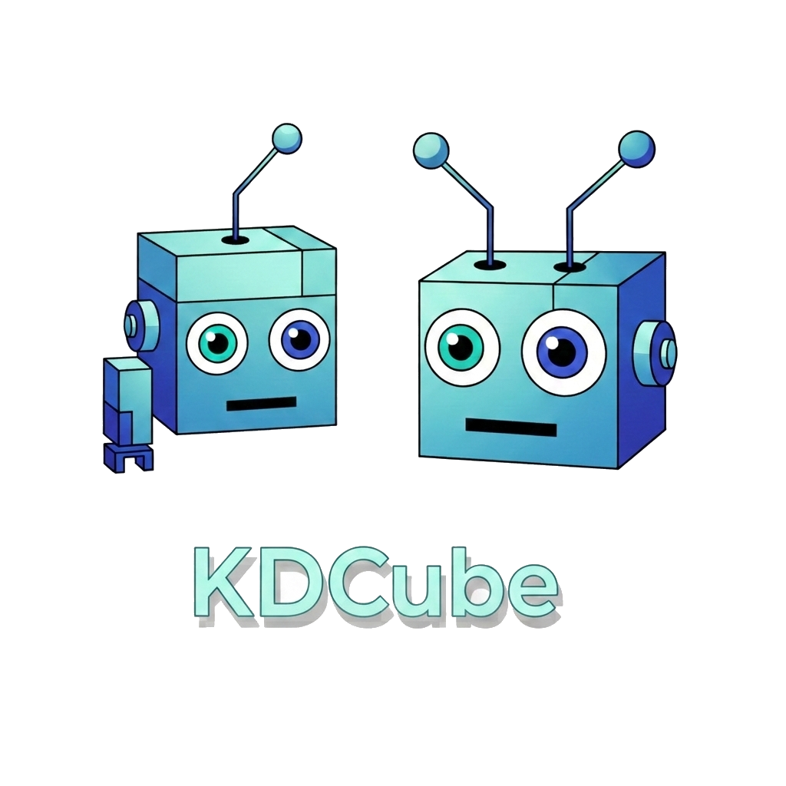

# KDCube — Build, Run, and Ship End-to-End AI Products

KDCube is a self-hosted platform and SDK for packaging AI applications —
APIs, agents, UI, scheduled jobs, configuration, and state — into deployable
bundles and running them in isolated environments.

One KDCube environment can host many bundles. A bundle is not just a prompt, a
chatbot skin, or an agent wrapper. It is one application unit that can combine:

- Python backend logic
- authenticated and public APIs
- widgets and a full custom UI
- React v2, Claude Code, and/or custom agents
- tools, skills, MCP, storage, settings, props, and secrets
- scheduled jobs with `@cron(...)`
- dependency-isolated helpers with `@venv(...)`
- optional Node or TypeScript backend logic behind a Python bridge

KDCube gives you the runtime, streaming, provenance, isolation, configuration
model, and deployment model needed to ship real AI systems rather than only
local agent demos.



## Positioning

Use KDCube when you need more than a model call and a thin web shell.

KDCube is for teams that need to:

- turn a new product idea into a real AI application
- wrap an existing backend, frontend, webhook, or pipeline into a bundle
- run more than one application surface inside one environment
- keep deployment config, bundle config, and user state separated cleanly
- move from local iteration to hosted deployment without changing the app model

Important mental model:

- `tenant/project` = one isolated KDCube environment
- one environment can host many bundles
- one bundle = one end-to-end application unit inside that environment

This lets you use KDCube for lifecycle stages such as `dev`, `staging`, and
`prod`, and for parallel isolated environments that must not share runtime
state.

## What You Can Build

- AI copilots and assistants with custom workflows and domain logic
- internal operational tools with authenticated APIs, admin widgets, and cron
- public AI-backed APIs or webhooks
- full iframe-based applications with their own frontend
- scheduled or background AI pipelines
- wrappers around existing services or codebases that need a KDCube runtime
- multi-surface products where chat, API, widget, UI, and cron logic belong to
  the same application

## Core Capabilities

### Application surfaces

- chat behavior through `@on_message`
- authenticated APIs through `@api(route="operations")`
- public or externally authenticated APIs through `@api(route="public")`
- widgets through `@ui_widget(...)`
- a full custom main UI through `@ui_main`
- scheduled logic through `@cron(...)`
- MCP integration through `@mcp(...)`

### Runtime and execution

- streaming UX over SSE / REST / Socket.IO
- React v2, Claude Code, custom Python agents, and isolated exec
- dependency-isolated Python helpers with `@venv(...)`
- optional Docker and Fargate execution paths

### State, configuration, and provenance

- platform/global settings and secrets
- deployment-scoped bundle props and bundle secrets
- user-scoped bundle state owned by the bundle
- timelines, source pools, citations, artifacts, and rehydration

### Operations and deployment

- isolated environments per `tenant/project`
- gateway controls, backpressure, rate limits, and budgets
- metrics, economics, and operational visibility
- local Docker Compose, EC2-style, and ECS-based deployments

## Bundle Shape

The main unit in KDCube is a bundle.

A bundle can expose several surfaces at once. That is the normal model, not an
edge case.

Typical bundle structure:

```text
my.bundle@1-0/
  entrypoint.py
  orchestrator/
    workflow.py
  tools_descriptor.py
  skills_descriptor.py
  tools/
  skills/
  ui/
  ui-src/
  resources/
  tests/
  requirements.txt
  backend_bridge/
```

Python remains the KDCube-native shell. If you need selected backend logic in
Node or TypeScript, keep the KDCube surface in Python and place the external
backend behind a narrow bridge.

## Build With Agents Too

KDCube now documents itself in a way that works for both engineers and coding
agents.

The docs include:

- a compact Tier 1 bundle-authoring pack
- a reference bundle that demonstrates the platform shape
- explicit configuration and runtime ownership rules
- local run, reload, and test guidance

This means an agent can help with real bundle work as:

- creator
- integrator
- configurator
- deployer
- local QA
- integration QA
- document reader

Start here:

- [What You Can Do With KDCube](app/ai-app/docs/what-you-can-do-with-kdcube-README.md)
- [How To Navigate KDCube Bundle Docs](app/ai-app/docs/sdk/bundle/build/how-to-navigate-kdcube-docs-README.md)

## Quick Start

Install the bootstrap CLI and launch the setup wizard:

```bash
pipx install kdcube-cli
kdcube
```

Alternative:

```bash
pip install kdcube-cli
kdcube
```

`kdcube-setup` remains available as a compatibility alias, but `kdcube` is the
canonical command.

Prerequisites:

- Python 3.9+
- Git
- Docker

Start here:

- [CLI installer](app/ai-app/src/kdcube-ai-app/kdcube_cli/README.md)
- [CLI deployment docs](app/ai-app/docs/service/cicd/cli-README.md)
- [Quick Start (Local Docker Compose)](app/ai-app/docs/quick-start-README.md)
- [Docker Compose (all-in-one)](app/ai-app/deployment/docker/all_in_one/README.md)

## Start Here If You Want To Build Bundles

Read this Tier 1 pack together:

1. [How To Navigate KDCube Bundle Docs](app/ai-app/docs/sdk/bundle/build/how-to-navigate-kdcube-docs-README.md)
2. [How To Test A Bundle](app/ai-app/docs/sdk/bundle/build/how-to-test-bundle-README.md)
3. [How To Write A Bundle](app/ai-app/docs/sdk/bundle/build/how-to-write-bundle-README.md)
4. [Bundle Runtime Settings, Configuration, and Secrets](app/ai-app/docs/configuration/bundle-runtime-configuration-and-secrets-README.md)
5. [How To Configure And Run A Bundle](app/ai-app/docs/sdk/bundle/build/how-to-configure-and-run-bundle-README.md)

Primary reference bundle:

- [Versatile reference bundle doc](app/ai-app/docs/sdk/bundle/versatile-reference-bundle-README.md)
- [`versatile@2026-03-31-13-36`](app/ai-app/src/kdcube-ai-app/kdcube_ai_app/apps/chat/sdk/examples/bundles/versatile@2026-03-31-13-36)

Specialized examples:

- [`kdcube.copilot@2026-04-03-19-05`](app/ai-app/src/kdcube-ai-app/kdcube_ai_app/apps/chat/sdk/examples/bundles/kdcube.copilot@2026-04-03-19-05)
  for bundle-defined `ks:` knowledge space and builder copilot behavior
- [`with-isoruntime@2026-02-16-14-00`](app/ai-app/src/kdcube-ai-app/kdcube_ai_app/apps/chat/sdk/examples/bundles/with-isoruntime@2026-02-16-14-00)
  for direct isolated exec
- [Node/TS backend bridge reference](app/ai-app/docs/sdk/bundle/bundle-node-backend-bridge-README.md)

## Agent and Runtime Model

KDCube is not limited to one agent shape.

Inside one bundle you can use:

- React v2 for timeline-first orchestration, planning, ANNOUNCE, and tool-driven work
- Claude Code for workspace-scoped coding tasks with persistent session identity
- custom Python agents for domain-specific flows
- isolated exec for generated code and controlled execution
- `@venv(...)` for dependency-heavy Python leaf helpers

Important: React v2 is not based on provider-native tool-calling protocol. The
loop is controlled by the platform runtime, not by a model-specific tool-call
format. That lets you use non-tool-calling models as the reasoning brain when
they can follow the ReAct contract.

Read more:

- [React docs](app/ai-app/docs/sdk/agents/react)
- [Claude Code integration](app/ai-app/docs/sdk/agents/claude/claude-code-README.md)
- [Bundle runtime](app/ai-app/docs/sdk/bundle/bundle-runtime-README.md)

## Deployment Model

KDCube supports:

- local Docker Compose for development and small deployments
- EC2-style deployments
- ECS-based hosted deployments

The CLI supports:

- guided local setup
- descriptor-driven installs
- latest released builds
- upstream source builds
- local bundle prototyping and bundle reload flow

Read more:

- [CLI installer](app/ai-app/src/kdcube-ai-app/kdcube_cli/README.md)
- [Configuration docs](app/ai-app/docs/configuration)
- [Deployment docs](app/ai-app/docs/service/cicd)

## Documentation

Start here:

- [What You Can Do With KDCube](app/ai-app/docs/what-you-can-do-with-kdcube-README.md)
- [Docs index](app/ai-app/docs/README.md)
- [Quick Start (Local Docker Compose)](app/ai-app/docs/quick-start-README.md)

Builder-oriented:

- [SDK bundle docs](app/ai-app/docs/sdk/bundle)
- [Bundle docs index](app/ai-app/docs/sdk/bundle/bundle-index-README.md)
- [How To Navigate KDCube Bundle Docs](app/ai-app/docs/sdk/bundle/build/how-to-navigate-kdcube-docs-README.md)
- [Versatile reference bundle](app/ai-app/docs/sdk/bundle/versatile-reference-bundle-README.md)
- [Tools docs](app/ai-app/docs/sdk/tools)
- [Skills docs](app/ai-app/docs/sdk/skills)

Platform-oriented:

- [Architecture docs](app/ai-app/docs/arch)
- [Service docs](app/ai-app/docs/service)
- [Exec / isolation docs](app/ai-app/docs/exec)

## Community

If you want to build AI applications fast but still control runtime, tools,
costs, deployment, provenance, and operations, KDCube is aimed at that use
case.

Project site:

- https://kdcube.tech/
