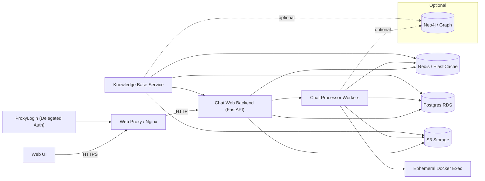
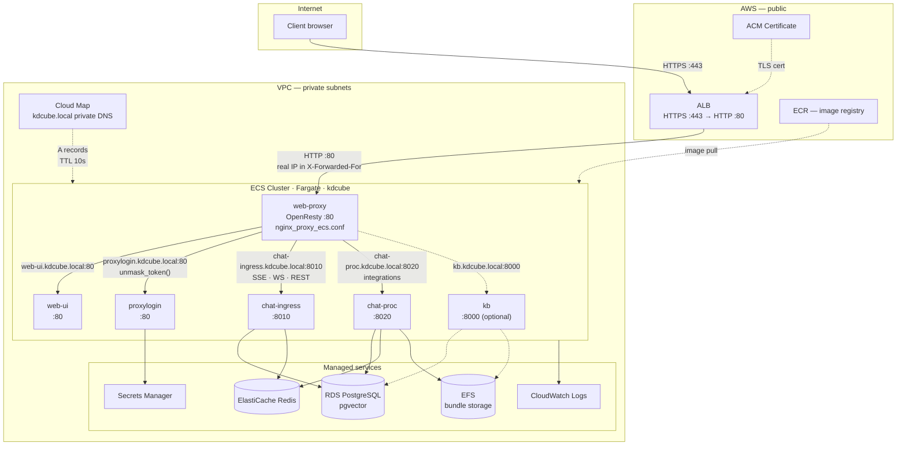
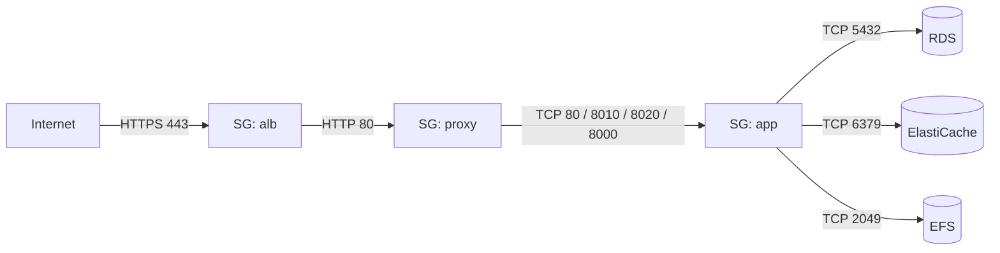
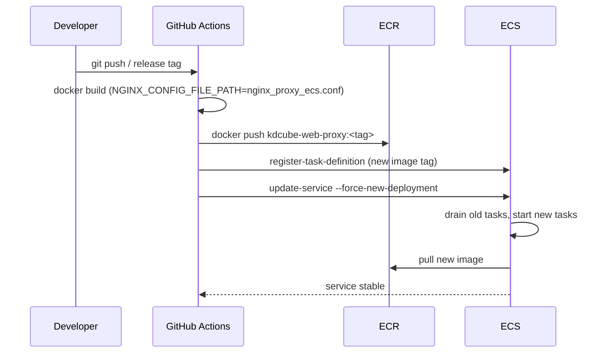
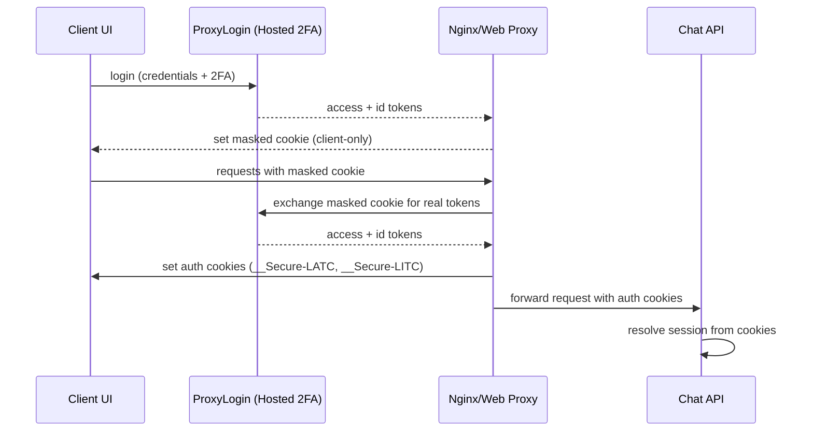
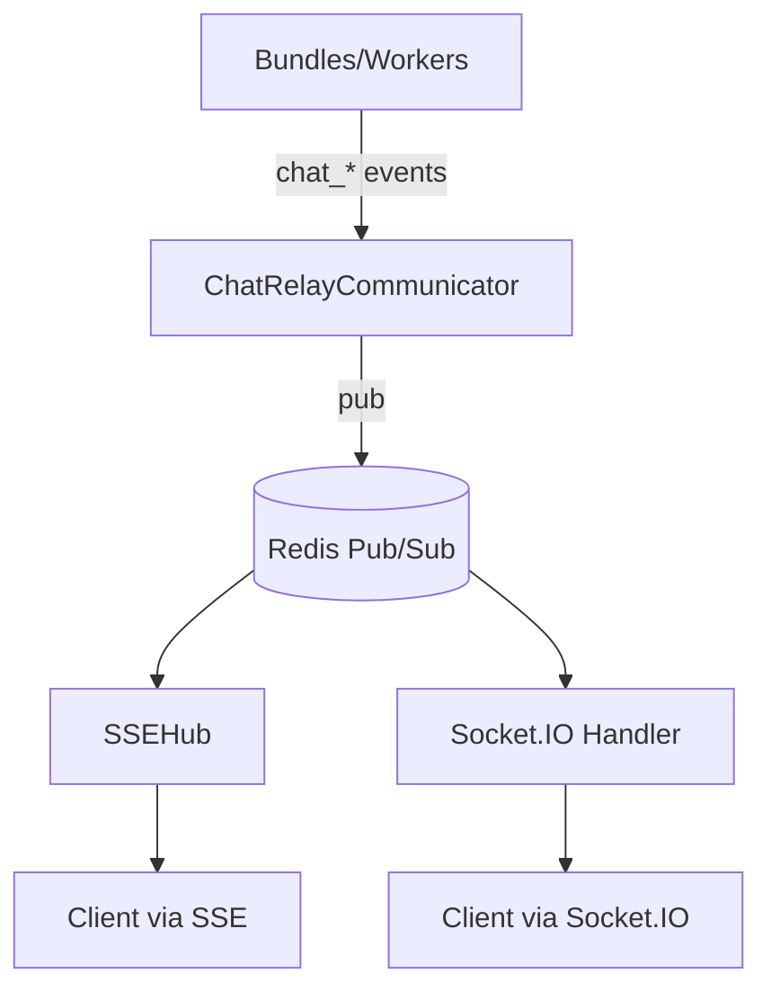
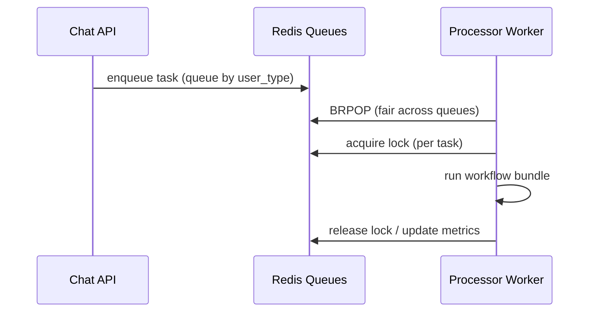
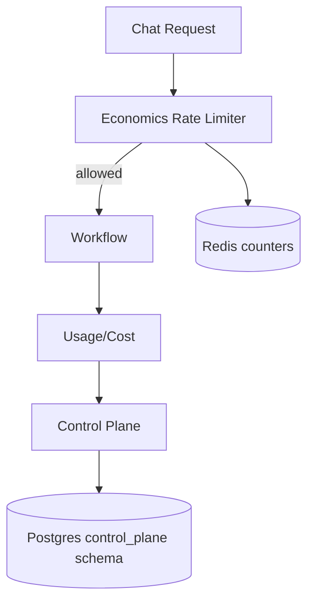

# KDCube AI App — System Architecture (Long)

This document captures the **end‑to‑end architecture**: transports, gateway, processing, relay, storage, economics, and integrations.
It reflects the current production model (SSE‑first, cookie‑based auth, Redis relay, RDS + S3) while keeping Socket.IO fully supported.

---

## 0) Glossary (quick)

- **Gateway**: policy enforcement + rate limiting + backpressure before a request is accepted.
- **Relay**: Redis Pub/Sub transport for async events.
- **Bundle**: a dynamic workflow (agentic app) loaded from the plugin registry.
- **Control Plane**: quotas + budgets + top‑ups + policy cache.
- **Session**: resolved from auth tokens; used for per‑session routing.

---

## 1) Deployment overview (prod/dev)



**Notes**
- **Prod**: Postgres = RDS, Redis = ElastiCache, Storage = S3.
- **Dev**: local Postgres + local Redis; S3 optional.
- **Neo4j** is optional and currently disabled.

---

## 2) ECS/Fargate deployment topology

This section describes how the services in section 1 map onto AWS ECS with Fargate. Each service runs as an independent ECS task; Docker Compose host‑name aliasing is replaced by **AWS Cloud Map private DNS** (`*.kdcube.local`).

### 2.1) Network flow



### 2.2) Key differences from the Docker Compose deployment

| Concern | Docker Compose (EC2 / local) | ECS / Fargate |
|---|---|---|
| Service discovery | Docker internal DNS (`web-ui`, `chat-ingress`, …) | Cloud Map private DNS (`*.kdcube.local`) |
| SSL/TLS | Proxy-level (Let's Encrypt, port 443 in proxy) | ALB + ACM; proxy listens on port 80 only |
| Real client IP | `$remote_addr` is the actual client | Must recover from `X-Forwarded-For`; `real_ip_header` active |
| `X-Forwarded-Proto` | `$scheme` (correct because proxy sees HTTPS) | `$http_x_forwarded_proto` (proxy sees HTTP; ALB injects original scheme) |
| Lua DNS resolution | OS resolver, works automatically | `resolver 169.254.169.253` required in `http {}` for `unmask_token()` subrequests |
| Secret injection | `.env` files / bind‑mounted `.aws` directory | Secrets Manager → ECS secrets (injected as env vars at task start) |
| Shared storage | Host bind mount | EFS access point (uid=1000, transit encryption enabled) |
| Credentials | `~/.aws` bind mount | Task IAM role (no static credentials) |
| Compose-level dependency ordering | `depends_on` | ECS service startup is independent; services must tolerate missing peers on first boot |

### 2.3) Proxy config changes for ECS

The ECS proxy config (`nginx_proxy_ecs.conf`) is derived from the local config with these targeted changes:

1. **`real_ip_header X-Forwarded-For` + `set_real_ip_from <ALB_CIDR>`** — activated. Without this, all clients share the ALB's private IP in `$binary_remote_addr`, breaking rate‑limiting zones entirely.
2. **`resolver 169.254.169.253 valid=10s`** — added to `http {}`. Required for the `$kb_backend` variable proxy and for Lua `ngx.location.capture()` which internally resolves `upstream proxy_login`.
3. **All `upstream server` directives** — changed to Cloud Map FQDNs (`web-ui.kdcube.local:80`, `chat-ingress.kdcube.local:8010`, etc.).
4. **`proxy_set_header X-Forwarded-Proto`** — changed from `$scheme` to `$http_x_forwarded_proto` everywhere. Behind ALB `$scheme` is always `http`; the ALB‑injected header carries the correct `https`.
5. **No SSL block** — `listen 443 ssl http2`, `ssl_certificate`, and the ACME challenge location are removed. ACM handles the certificate at the ALB.
6. **HSTS header** — added to the proxy because ALB does not inject custom response headers by default.
7. **`/auth/` rate limit** — `auth_zone` enabled (was commented out in local config); auth endpoints are now internet‑facing.

### 2.4) ECS service definitions

Each service maps to one ECS task definition and one ECS service:

| ECS service | Task family | Port | CPU | Memory | Notes |
|---|---|---|---|---|---|
| `web-proxy` | `kdcube-web-proxy` | 80 | 256 | 512 MB | Only service registered with ALB target group |
| `web-ui` | `kdcube-web-ui` | 80 | 256 | 512 MB | Internal only; no ALB registration |
| `chat-ingress` | `kdcube-chat-ingress` | 8010 | 1024 | 2048 MB | `stopTimeout: 60` for in‑flight SSE streams |
| `chat-proc` | `kdcube-chat-proc` | 8020 | 1024 | 2048 MB | `stopTimeout: 120` for long‑running bundles; EFS mount |
| `proxylogin` | `kdcube-proxylogin` | 80 | 256 | 512 MB | Cognito config via Secrets Manager |
| `kb` *(optional)* | `kdcube-kb` | 8000 | 512 | 1024 MB | Disabled until KB service is active; EFS mount |

All services run in **private subnets** with `assignPublicIp: DISABLED`. Only `web-proxy` is reachable from outside the VPC (through the ALB). All other services accept traffic only from the proxy security group.

### 2.5) Security group topology



No service in `SG_APP` is reachable from the internet or from the ALB directly — only through `SG_PROXY`.

### 2.6) Cloud Map service discovery

Services register with a **private DNS namespace** `kdcube.local` (type `DNS_PRIVATE`). Each ECS service has a corresponding Cloud Map service; ECS registers/deregisters A records automatically as tasks start and stop.

```
web-ui.kdcube.local          → web-ui task private IP
chat-ingress.kdcube.local    → chat-ingress task private IP
chat-proc.kdcube.local       → chat-proc task private IP
proxylogin.kdcube.local      → proxylogin task private IP
kb.kdcube.local              → kb task private IP (optional)
```

TTL is 10 seconds. With `real_ip_recursive on` in OpenResty, stale DNS entries after a task replacement resolve within one TTL cycle (10 s) — no manual cache flush needed.

### 2.7) IAM roles

| Role | Used by | Key permissions |
|---|---|---|
| `ecsTaskExecutionRole` | All tasks | ECR pull, CloudWatch log stream creation |
| `kdcube-proxy-task-role` | `web-proxy` | EFS mount (if config served from EFS) |
| `kdcube-chat-proc-task-role` | `chat-proc` | S3 read/write, EFS mount, Secrets Manager read |
| `kdcube-chat-ingress-task-role` | `chat-ingress` | S3 read/write, Secrets Manager read |
| `kdcube-proxylogin-task-role` | `proxylogin` | Secrets Manager read (Cognito client secret) |
| `kdcube-kb-task-role` | `kb` | S3 read/write, EFS mount, Secrets Manager read |

The `~/.aws` bind‑mount pattern used in the EC2 and local deployments is absent on ECS — all AWS API access goes through the task IAM role.

### 2.8) Build and deploy pipeline (overview)



The same `Dockerfile_ProxyOpenResty` is used for all deployment variants; the config is selected at build time via the `NGINX_CONFIG_FILE_PATH` build argument:

| Variant | Build arg value |
|---|---|
| Local / all‑in‑one | `deployment/docker/all_in_one_kdcube/nginx_proxy.conf` |
| EC2 + SSL + Cognito | `deployment/docker/custom-ui-managed-infra/nginx_proxy_ssl_cognito.conf` |
| ECS / Fargate | `deployment/proxy/nginx_proxy_ecs.conf` |

References:
- [proxy-ecs-ops-README.md](../service/proxy/proxy-ecs-ops-README.md)
- [proxy-ops-README.md](../service/proxy/proxy-ops-README.md)
- ECS task definitions: `deployment/ecs/task-definitions/`
- Cloud Map setup: `deployment/ecs/setup-cloud-map.sh`

---

## 3) Auth model (delegated + infra cookies)

### Providers
- **Cognito** (production)
- **SimpleIDP** (dev/testing)
- **Delegated auth** via ProxyLogin (UI -> auth service + hosted 2FA)

### Token transport
The server accepts tokens via **headers, cookies, SSE query params, and Socket.IO auth payload**.
In production, the preferred flow is **cookie‑only with infra exchange**:



**Compatibility**: existing clients may still pass tokens (headers or SSE query params); the gateway accepts both.
Hosted UI for 2FA is available in both modes; infra exchange adds cookie-only auth for the client.

References:
- [auth-README.md](../service/auth/auth-README.md)
- [token_extract.py](../../src/kdcube-ai-app/kdcube_ai_app/apps/middleware/token_extract.py)

---

## 4) API surface (chat + monitoring + control plane)

**Chat transports**
- **SSE**: `/sse/stream`, `/sse/chat`, `/sse/conv_status.get`
- **Socket.IO**: `/socket.io` handshake + `chat_message`, `conv_status.get`
- **REST**: `/profile`, admin/monitoring/control‑plane routes

Key entrypoint: [web_app.py](../../src/kdcube-ai-app/kdcube_ai_app/apps/chat/ingress/web_app.py)

---

## 5) Gateway & policy enforcement

The gateway enforces **authentication**, **rate limits**, and **backpressure** before a request is accepted:

- **Gateway rate limiting** (requests / hour / etc.)
- **Backpressure** (queue capacity, system protection)
- **Circuit breakers** (system health and failure protection)
- **Session resolution** (anonymous → registered/privileged upgrade)

Key modules:
- [gateway.py](../../src/kdcube-ai-app/kdcube_ai_app/apps/middleware/gateway.py)
- [gateway-README.md](../service/gateway-README.md)

---

## 6) Streaming & relay (SSE and Socket.IO)

Both SSE and Socket.IO use the same **Redis relay**, which is session‑scoped.



Design goals:
- Dynamic per‑session subscription
- Low fan‑out cost (no global firehose)
- Transport symmetry (SSE + Socket.IO)

References:
- [comm-system.md](../service/comm/comm-system.md)
- [README-comm.md](../service/comm/README-comm.md)
- [SSE relay deep dive](../service/comm/CHAT-RELAY-SESSION-SUBSCR-SSE-SOCKETIO-FUNOUT.README.md)

---

## 7) Processing pipeline (queue + worker)

Requests are enqueued into **user‑type queues** (privileged/registered/anonymous). Workers pop fairly and apply locks.



Key worker: [apps/chat/processor.py](../../src/kdcube-ai-app/kdcube_ai_app/apps/chat/processor.py)

---

## 8) Horizontal scaling & instance load

- Each running process has an **instance id** and maintains load counters.
- Workers respect **max concurrent** limits and fair queue scheduling.
- Gateway + backpressure protect the system from overload before enqueue.

---

## 9) Dynamic bundles (plugin system)

Bundles are **runtime‑loadable workflows** with custom logic and optional endpoints.

- Registry + loader: [bundle-ops-README.md](../sdk/bundle/bundle-ops-README.md)
- Example bundle entrypoint: [react bundle entrypoint](../../src/kdcube-ai-app/kdcube_ai_app/apps/chat/sdk/examples/bundles/react@2026-02-10-02-44/entrypoint.py)

Bundles can:
- Define workflows (agentic graphs)
- Register custom endpoints
- Use storage, KB, economics, control‑plane
- Emit chat events via `ChatCommunicator`

---

## 10) Context management

Context management reconciles per‑turn context, preferences, and artifacts so workflows receive a clean, ordered view.

- Uses **Postgres** for metadata, indexes, and control‑plane policy joins.
- Uses **S3** (prod) for artifacts and large blobs (attachments, generated files).
- Feeds workflows and tools with **turn‑ordered memory blocks** and signals.

---

## 11) Economics & control plane
The economics subsystem provides **tier‑aware rate limiting** and **charging**, while the control plane provides **policy management**.



Key points:
- **Per‑user quotas** + **tier overrides** + **project budgets**
- **Concurrency locks** to prevent oversubscription
- **Control plane** stores policies and replenishments
- Quotas can be enforced **per user across projects** (control‑plane scope).

References:
- [economics-usage.md](../economics/economics-usage.md)
- [instance-config-README.md](../service/maintenance/instance-config-README.md)

---

## 12) Multi‑tenancy & data layout

### Postgres
- **Per‑tenant + per‑project schema** (prod and dev separated by schema)
- **Control plane** uses a shared schema (`kdcube_control_plane`)

### Storage (S3 / FS)
- **Tenant/project bucket** or **shared bucket with prefix**
- Prefix segment forms the tenant/project boundary

### Redis
- Cache + rate‑limit counters + Pub/Sub relay

### Neo4j
- Optional graph context; currently off

---

## 13) Inputs & payload limits

- **Message/attachment limits** enforced at transport layer.
- Socket.IO limits are configured via max buffer size; SSE uses server‑side validation.

References:
- [Socket.IO transport](../../src/kdcube-ai-app/kdcube_ai_app/apps/chat/ingress/socketio/chat.py)
- [SSE transport](../../src/kdcube-ai-app/kdcube_ai_app/apps/chat/ingress/sse/chat.py)

---

## 14) Observability & reporting

- **Monitoring/observability**: [README-monitoring-observability.md](../service/README-monitoring-observability.md)
- **Accounting & spending**: usage envelopes + spend reporting (per tenant/project/user)

---

## 15) Integrations

### Knowledge Base (KB)
- REST + Socket.IO
- Postgres + pgvector, optional S3 storage
- [KB README](../../src/kdcube-ai-app/kdcube_ai_app/apps/knowledge_base/README.md)

### Runtime tools & LLM providers
- Centralized service hub for models, embeddings, and tool adapters.
- Typical providers (configured per deployment):
  - **LLMs**: Anthropic, OpenAI, Gemini
  - **Embeddings**: OpenAI
  - **Web search**: Brave, DuckDuckGo
  - **Code execution**: ephemeral Docker runtime

---

## 16) Appendix — key files

- Chat API entrypoint: [web_app.py](../../src/kdcube-ai-app/kdcube_ai_app/apps/chat/ingress/web_app.py)
- SSE transport: [sse/chat.py](../../src/kdcube-ai-app/kdcube_ai_app/apps/chat/ingress/sse/chat.py)
- Socket.IO transport: [socketio/chat.py](../../src/kdcube-ai-app/kdcube_ai_app/apps/chat/ingress/socketio/chat.py)
- Processor: [apps/chat/processor.py](../../src/kdcube-ai-app/kdcube_ai_app/apps/chat/processor.py)
- Comm subsystem: [comm-system.md](../service/comm/comm-system.md)
- Comm integrations: [README-comm.md](../service/comm/README-comm.md)
- Proxy ECS config: [nginx_proxy_ecs.conf](../../deployment/docker/custom-ui-managed-infra/nginx/conf/nginx_proxy_ecs.conf)
- ECS task definitions: [deployment/ecs/task-definitions](../../deployment/ecs/task-definitions)
- Cloud Map setup: [deployment/ecs/setup-cloud-map.sh](../../deployment/ecs/task-definitions/setup-cloud-map.sh)