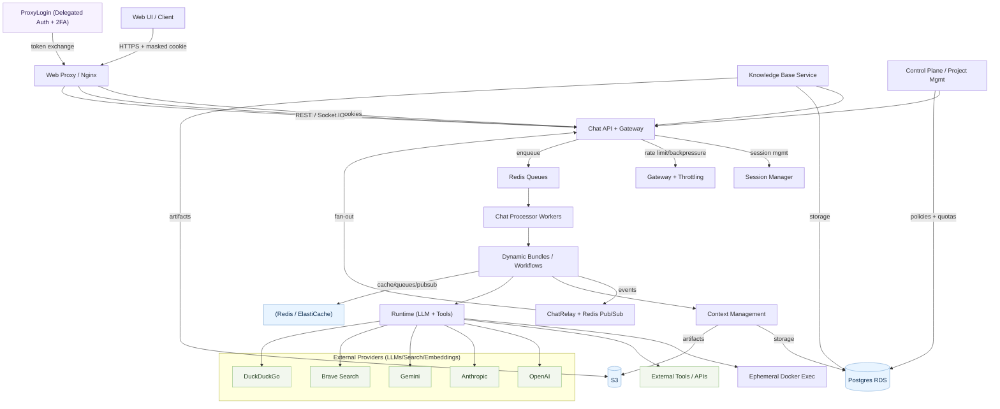
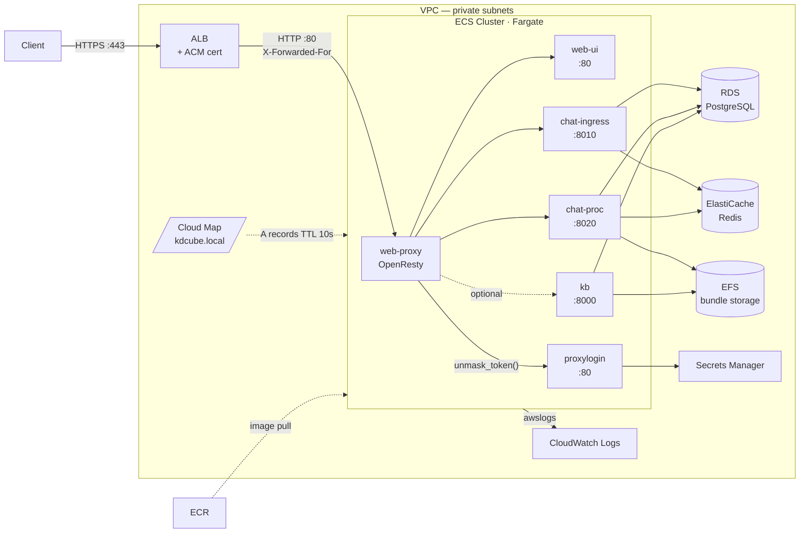
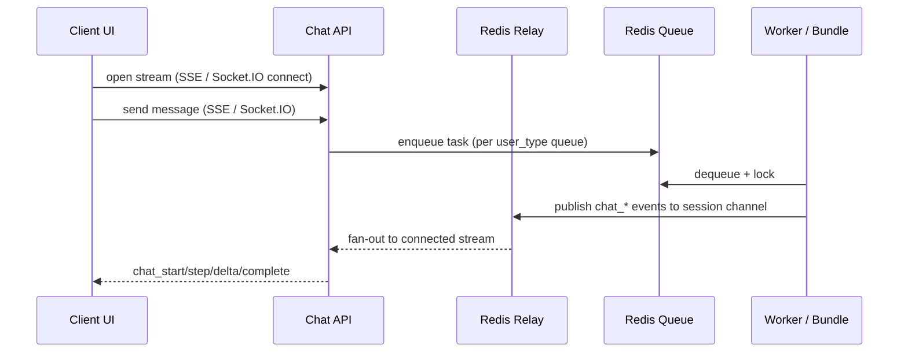

# KDCube AI App — System Architecture (Short)

This is a **concise overview** of the current system and integrations.
For a deeper dive, see `architecture-long.md` in this folder.

---

## 1) System at a glance

---

## 2) ECS / Fargate deployment

In production the services above run as independent **ECS Fargate tasks** inside a private VPC. Docker Compose host‑name aliases are replaced by **AWS Cloud Map DNS** (`*.kdcube.local`). TLS is terminated at the ALB; the proxy listens on HTTP :80 only inside the VPC.

**What changes vs Docker Compose:**

| | Docker Compose | ECS / Fargate |
|---|---|---|
| Service discovery | Docker DNS (`web-ui`, `chat-ingress` …) | Cloud Map (`*.kdcube.local`) |
| TLS | Proxy-level (Let's Encrypt) | ALB + ACM |
| Real client IP | `$remote_addr` direct | Recovered from `X-Forwarded-For` (`real_ip_header` active) |
| Secrets | `.env` / bind-mount | Secrets Manager → task env vars |
| AWS credentials | `~/.aws` bind-mount | Task IAM role |
| Shared storage | Host bind-mount | EFS access point |

See `architecture-long.md §2` for the full breakdown, security group topology, IAM roles, and CI/CD pipeline.

---

## 3) Supported client transports

- **SSE**: primary streaming transport (current UI default)
- **Socket.IO**: fully supported alternative
- **REST**: non‑streaming endpoints (profile/admin/monitoring/etc.)

---

## 3) Auth & token transport

- **Delegated auth** via ProxyLogin; hosted UI for 2FA is always available.
- **Infra auth (cookie‑only mode)**: client stores only a masked (non‑real) token cookie.
  Nginx exchanges it via ProxyLogin to real tokens, sets auth/id cookies, and forwards to API.
- Server accepts tokens from **headers, cookies, SSE query params, Socket.IO auth payload** (for compatibility).

---

## 4) Multi‑tenancy + storage

- **Postgres**: per‑tenant + per‑project schema (prod/dev separated) + **control_plane** schema.
- **S3** (prod): bucket per tenant/project or shared bucket with prefix segmentation; KB artifacts live here too.
- **Redis**: cache + messaging (Pub/Sub) + rate‑limit counters.
- **Neo4j**: optional, currently off.

Processor note:
- proc concurrency is bounded per worker
- each active proc task is guarded by an activity-based idle watchdog plus a hard wall-time cap
- this allows same-turn `followup` / `steer` to keep a turn warm while still terminating silent or runaway tasks

---

## 5) Limits & economics

- **Gateway rate limiting** + backpressure + circuit breakers.
- **Economics rate limiting**: tier policies, per‑user quotas, concurrency locks.
- **Input limits**: message/attachment size limits enforced at transport layer.

---

## 6) Streaming flow (SSE or Socket.IO)

---

## 7) Key docs

- Comm integrations: [README-comm.md](../service/comm/README-comm.md)
- Comm architecture: [comm-system.md](../service/comm/comm-system.md)
- Gateway: [gateway-README.md](../service/gateway-README.md)
- Economics: [economics-usage.md](../economics/economics-usage.md)
- Control plane: [instance-config-README.md](../service/maintenance/instance-config-README.md)
- Monitoring: [README-monitoring-observability.md](../service/README-monitoring-observability.md)
- ECS deployment: [proxy-ecs-ops-README.md](../arch/proxy/proxy-ecs-ops-README.md)
