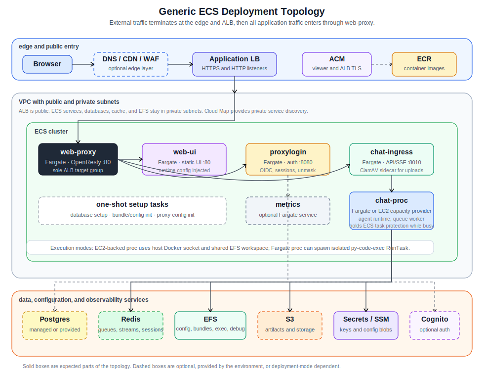

# ECS Service Architecture And Timeouts

This document describes the generic ECS deployment shape used by the platform.
It intentionally avoids deployment-specific domains, bucket names, AWS account ids,
tenant ids, project ids, and descriptor values. Deployment repositories may carry
more concrete diagrams and resource names.



## 1. Topology

External traffic enters through the public edge and then through one ALB-facing
service:

```text
browser
  -> optional DNS / CDN / WAF
  -> Application Load Balancer
  -> web-proxy
  -> internal ECS services through Cloud Map DNS
```

`web-proxy` is the only external application target behind the ALB. Internal
services do not get direct ALB listener rules because that would bypass proxy
auth, rate limiting, real IP handling, and security headers.

## 2. Runtime Services

| Service | Launch model | Port | Role |
| --- | --- | ---: | --- |
| `web-proxy` | Fargate | `80` | OpenResty reverse proxy. Routes UI, auth, API, SSE, integration, and static paths. Applies proxy auth, security headers, rate limits, and service discovery routing. |
| `web-ui` | Fargate | `80` | Static frontend container. Runtime frontend config is injected at startup. |
| `proxylogin` | Fargate | `8080` | Delegated auth service. Handles OIDC/Cognito flows, session token masking/unmasking, refresh, and password-reset flows when enabled. |
| `chat-ingress` | Fargate | `8010` | API and SSE ingress. Validates requests, applies gateway/backpressure checks, accepts uploads, and enqueues work for processors. |
| `clamav` | sidecar in `chat-ingress` | `3310` | Optional upload scanning sidecar used by ingress when AV scanning is enabled. |
| `chat-proc` | Fargate or EC2 capacity provider | `8020` | Queue worker and agent runtime. Runs bundles, model calls, web search/fetch, tools, integrations, and code execution orchestration. |
| `metrics` | optional Fargate service | `8002` | Reads Redis/runtime stats and exports CloudWatch metrics for autoscaling and monitoring. |
| setup tasks | one-shot Fargate tasks | n/a | Initialize database state, write bundle/config descriptors, and write proxy config into runtime storage. |

Cloud Map provides the private DNS namespace for service-to-service calls, for
example `chat-ingress`, `chat-proc`, `proxylogin`, and `web-ui`.

## 3. Data And Configuration Surfaces

| Surface | Deployment mode | Used for |
| --- | --- | --- |
| Postgres | managed RDS or provided host | Conversation state, bundle/runtime records, memory metadata, auth support tables, and operational state. |
| Redis | managed ElastiCache or provided host | Chat queue, inflight locks, SSE chunk stream, proxy sessions, rate limit state, and metrics inputs. |
| EFS | managed filesystem with access points | Live runtime mounts such as platform storage, bundle storage, bundle source cache, config, runtime config, git SSH material, exec workspace, react debug, proxy config, and AV database. |
| S3 | managed bucket(s) or provided URI | Durable object storage, attachments, hosted artifacts, bundle storage URI, and execution snapshot/artifact exchange where configured. |
| Secrets Manager / SSM | managed | Platform secrets, bundle secrets, service API keys, infra credentials, gateway config JSON, frontend config JSON, and runtime config blobs. |
| Cognito/OIDC | managed or provided | User auth, service auth, token verification, groups, password reset, and delegated proxy login. |
| CloudWatch | managed | Logs, custom metrics, alarms, and autoscaling signals. |
| ECR or image registry | provided by release/deployment | Runtime images for proxy, UI, ingress, proc, metrics, and code execution. |

## 4. Execution Modes

`chat-proc` supports two execution deployment modes.

### EC2-backed proc

When proc is placed on a dedicated EC2 capacity provider:

- ECS launches `chat-proc` on EC2 container instances in private subnets.
- Proc uses the host Docker socket to start isolated execution containers.
- Shared host paths point at EFS access points for storage, bundles, exec workspace, and react debug.
- The proc host bootstrap must mount EFS access points and prepare Docker registry auth before the ECS agent joins the cluster.
- This avoids Fargate RunTask startup latency, but the isolation boundary is the Docker container on a dedicated proc host, not a separate Fargate task.

### Fargate proc

When proc runs on Fargate:

- ECS launches `chat-proc` as a normal Fargate service task.
- Code execution uses an on-demand `py-code-exec` task definition through ECS `RunTask`.
- The proc task submits the execution task, waits for completion, and reads back outputs.
- This gives a stronger AWS task boundary but adds RunTask latency and requires the execution task wiring.

## 5. Timeout Matrix

There are three separate timeout concepts.

| Timeout | Typical value | Meaning |
| --- | ---: | --- |
| Ingress ECS stop window | `60s` | How long ECS gives the `chat-ingress` container after stop starts. |
| Ingress Uvicorn graceful shutdown | `15s` | How long ingress spends draining HTTP/SSE shutdown paths. |
| Proc normal turn timeout | `600s` | Maximum normal runtime for one proc task/turn while the proc task is healthy. |
| Proc ECS/container stop window on Fargate | up to `120s` | Fargate task-definition `stopTimeout`, capped by AWS. |
| Proc ECS/container stop window on EC2-backed proc | deployment-configured, commonly `600s` | ECS agent `ECS_CONTAINER_STOP_TIMEOUT` on the dedicated proc host. |
| Proc Uvicorn graceful shutdown | stop window minus about `10s` | App drain budget. Derived from `PROC_CONTAINER_STOP_TIMEOUT_SEC` unless explicitly overridden. |
| Exec normal runtime timeout | commonly `600s` | Maximum runtime for one code execution task/container. |

The proc app derives its graceful shutdown budget from the container stop window:

```text
proc_uvicorn_grace ~= PROC_CONTAINER_STOP_TIMEOUT_SEC - 10s
```

Examples:

```text
Fargate proc:
  ECS stop window          = 120s max
  proc Uvicorn grace       = about 110s

EC2-backed proc:
  ECS agent stop window    = 600s when configured that way
  proc Uvicorn grace       = about 590s
```

The normal turn timeout and the shutdown drain timeout are not the same thing.
During steady state, a turn can use the normal turn budget. Once ECS starts
stopping the proc task, the remaining time is bounded by the shutdown drain
budget and by the remaining normal turn budget.

## 6. Proc Shutdown Flow

When ECS stops a proc task:

1. ECS starts task/container shutdown.
2. The proc app enters drain mode.
3. Proc stops claiming new queue messages.
4. Existing inflight work continues if it can finish inside the remaining budgets.
5. Uvicorn graceful shutdown ends before the ECS hard stop window.
6. ECS force-stops the container if it is still running after the hard stop window.

The remaining graceful time for an inflight turn is approximately:

```text
remaining_grace =
  min(
    proc_uvicorn_graceful_shutdown_budget,
    ecs_container_stop_window,
    remaining_normal_turn_timeout
  )
```

## 7. Task Scale-In Protection

Proc also uses best-effort ECS task scale-in protection when it is running
in ECS and the ECS task protection endpoint is available.

Behavior:

- proc enables task protection when it starts processing inflight work
- multiple worker processes coordinate through a small shared state file
- proc refreshes protection while work remains active
- proc clears protection when the task becomes idle
- stale process claims are reconciled so a crashed worker does not pin protection forever

This is different from extending shutdown after `SIGTERM`.
Task protection attempts to prevent ECS from selecting a busy proc task for
scale-in or replacement in the first place. If shutdown has already started,
the stop window still controls the maximum drain time.

EC2-backed proc deployments can also use an ECS capacity provider with managed
termination protection and an Auto Scaling Group protected from scale-in. That
protects busy container instances during host-level scale-in decisions, while
task protection protects the individual ECS task.

## 8. Operational Conclusions

- Keep all public application traffic behind `web-proxy`.
- Treat `chat-ingress` as API/SSE ingress, not as a long-running execution worker.
- Treat `chat-proc` as the owner of long-running turns and execution orchestration.
- Choose EC2-backed proc when low-latency local Docker execution is more important.
- Choose Fargate proc/execution when a stronger AWS task boundary is more important.
- Keep proc app graceful shutdown below the real ECS/container stop window.
- Use task protection to reduce accidental interruption of busy proc tasks.

## 9. AWS References

- ECS task definition parameters and `stopTimeout`: <https://docs.aws.amazon.com/AmazonECS/latest/developerguide/task_definition_parameters.html>
- ECS graceful shutdown behavior: <https://aws.amazon.com/blogs/containers/graceful-shutdowns-with-ecs/>
- EFS on ECS/Fargate: <https://docs.aws.amazon.com/AmazonECS/latest/developerguide/efs-volumes.html>
- ECS task scale-in protection: <https://docs.aws.amazon.com/AmazonECS/latest/developerguide/task-scale-in-protection.html>
- ECS task protection endpoint: <https://docs.aws.amazon.com/AmazonECS/latest/developerguide/task-scale-in-protection-endpoint.html>
