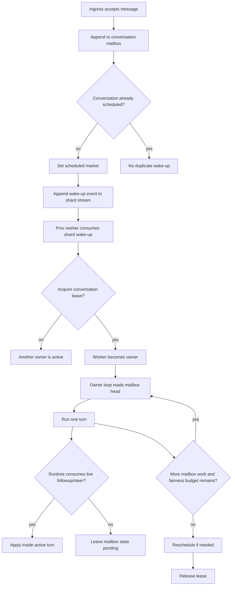

# Design: Conversation Scheduler With Redis Streams

This note captures the **target processor scheduler design**.

It is intentionally not a small queue primitive swap.

The main design point is:

- the system should stop thinking in terms of "proc takes one queue item"
- and start thinking in terms of "proc temporarily owns one conversation"

That is why a move from Redis Lists to Redis Streams was not implemented as a
small isolated refactor.

The hard part is not `BRPOPLPUSH` vs `XREADGROUP`.
The hard part is introducing:

- conversation ownership
- wake-up dedupe
- owner-loop execution
- fairness boundaries
- started-turn recovery semantics

Streams are the right substrate for that model, but they are not the model by themselves.

The same scheduler model can also be implemented on Kafka.

The important boundary is the same in both cases:

- transport/log primitive
- plus explicit scheduler semantics around leases, fairness, and started-turn recovery

So this note uses Redis Streams as the primary target because Redis is already
part of the deployed platform, while also documenting how the same mechanism
maps onto Kafka.

---

## 1. Problem Statement

The current proc architecture works, but it is still built around a **coarse global queue**:

- ingress enqueues into user-type ready queues
- proc claims one task
- proc executes that task
- followup/steer and mailbox promotion patch around the fact that the scheduler is not conversation-native

That model becomes strained once we want all of the following at once:

- same-turn `followup`
- same-turn `steer`
- ordered next-turn mailbox continuation
- explicit conversation ownership
- clean failover and repair
- fairness across many busy conversations

The current Lists-based queue is acceptable for the shipped implementation.
It is a weak fit for the next scheduler.

---

## 2. Design Goals

### 2.1 Goals

- make the **conversation** the scheduling unit
- preserve strict ordered delivery within one conversation
- allow one proc worker to temporarily own a conversation
- support both:
  - reactive runtimes that consume live continuation input
  - non-reactive runtimes that only continue after the current turn ends
- preserve the current safety rule:
  - pre-start work may be replayable
  - started turns are interrupted, not auto-replayed
- make repair and ownership inspection observable
- support fair sharing so one warm conversation cannot monopolize a worker indefinitely

### 2.2 Non-goals

- this design does not try to make all workflows replay-safe
- it does not promise infinite warm turns
- it does not require every bundle to be deeply conversational
- it does not require replacing the public workflow continuation abstraction up front

---

## 3. Current Baseline

Today the platform already uses three different scheduling/storage shapes:

### 3.1 Global proc task queue

- Redis Lists
- ready lanes by user type
- inflight Lists
- lock keys
- started markers

This lives in [processor.py](../../../src/kdcube-ai-app/kdcube_ai_app/apps/chat/processor.py).

### 3.2 Per-conversation continuation mailbox

- Redis Lists
- append with `LPUSH`
- oldest item read from the right side

This lives in [continuations.py](../../../src/kdcube-ai-app/kdcube_ai_app/apps/chat/continuations.py).

### 3.3 Per-conversation external events

- Redis Streams
- consumer-group style promotion/repair support
- ordered per-conversation event log

This lives in [external_events.py](../../../src/kdcube-ai-app/kdcube_ai_app/apps/chat/external_events.py).

So the platform has **not** rejected Streams.
It already uses them where they fit naturally.

What is still missing is a **conversation-native scheduler**.

---

## 4. Why A Pure Queue-Primitive Swap Is Not Enough

If we only replaced:

- `BRPOPLPUSH`

with:

- `XREADGROUP`

we would still not have solved the main scheduling problems:

- who owns the conversation
- how many sequential turns one owner may process
- how to dedupe wake-ups while the conversation is already known to the scheduler
- how to repair stale ownership cleanly
- how to continue non-reactive bundles without bouncing through the coarse global queue

So the migration boundary must be:

- **queue primitive + scheduler semantics**

not just:

- **queue primitive**

---

## 5. Target Architecture Overview

The target model has four core ideas:

1. **Mailbox first**
   All accepted messages land in a per-conversation ordered mailbox.

2. **Wake streams**
   Proc workers do not consume "tasks".
   They consume wake-up events that mean:
   "this conversation may need an owner".

3. **Lease ownership**
   At most one proc worker owns a conversation at a time.

4. **Owner loop**
   Once a worker owns a conversation, it may process one or more mailbox items
   under explicit fairness boundaries.



---

## 6. Redis Data Model

One workable target shape:

```text
{tenant}:{project}:kdcube:chat:bundle:{bundle_id}:user:{user_id}:conv:{conversation_id}:mailbox
{tenant}:{project}:kdcube:chat:bundle:{bundle_id}:shard:{shard_id}:wake
{tenant}:{project}:kdcube:chat:bundle:{bundle_id}:user:{user_id}:conv:{conversation_id}:lease
{tenant}:{project}:kdcube:chat:bundle:{bundle_id}:user:{user_id}:conv:{conversation_id}:scheduled
{tenant}:{project}:kdcube:chat:bundle:{bundle_id}:user:{user_id}:conv:{conversation_id}:state
```

Recommended semantics:

| Key | Type | Purpose |
| --- | --- | --- |
| `...:mailbox` | Redis Stream | Ordered accepted messages for one conversation |
| `...:wake` | Redis Stream | Shard-level wake-up log for conversations needing ownership |
| `...:lease` | Redis key | Renewable ownership lease for one conversation |
| `...:scheduled` | Redis key | Dedupe bit so ingress does not emit unbounded duplicate wake-ups |
| `...:state` | Redis hash/string | Optional execution metadata, last started turn, fairness counters, cursors |

### 6.1 Mailbox event payload

Mailbox events should be append-only and small enough to inspect directly.

Recommended fields:

- `message_id`
- `sequence`
- `message_kind`
- `created_at`
- `turn_id`
- `task_id`
- `payload` or `payload_ref`
- `explicit`
- `target_turn_id`
- `active_turn_id`
- terminal flags if needed:
  - `consumed`
  - `promoted`
  - `failed`

### 6.2 Wake event payload

Wake events should be tiny and cheap.

Recommended fields:

- `conversation_id`
- `bundle_id`
- `user_id`
- `shard_id`
- `latest_mailbox_sequence`
- `cause`

Valid causes might include:

- `new_message`
- `lease_repair`
- `next_turn`
- `fairness_reschedule`

### 6.3 Kafka mapping of the same scheduler

The scheduler model above is not Redis-specific.

One workable Kafka mapping is:

| Scheduler concept | Redis Streams design | Kafka implementation |
| --- | --- | --- |
| Conversation mailbox | one per-conversation mailbox stream | one mailbox topic keyed by `conversation_id`, or a mailbox topic family partitioned by `conversation_id` |
| Wake log | shard wake stream | wake topic keyed by `shard_id` or scheduler shard |
| Worker ownership | Redis lease key | external lease store, or Kafka consumer ownership plus explicit external lease/heartbeat |
| Scheduled dedupe bit | Redis key | external dedupe store or compacted scheduler-state topic |
| Conversation execution state | Redis hash/string | compacted state topic or external store |
| Pending inspection / repair | Redis pending ledger + claim APIs | consumer-group lag/offset inspection plus explicit scheduler repair logic |

Important:

- Kafka replaces the append-only log transport well
- it does **not** remove the need for explicit conversation lease rules
- it does **not** remove the started-boundary replay policy
- it does **not** remove fairness and wake dedupe decisions

Kafka is therefore a valid second backend, not a shortcut around scheduler design.

#### Mailbox modeling on Kafka

The simplest Kafka shape is:

- `chat-conversation-mailbox`
- partition key: `conversation_id`

That gives:

- ordered delivery within one conversation
- horizontal scaling through partitions
- natural lag inspection

But it also means:

- mailbox retention and compaction policy must be chosen carefully
- consumption state is now offset-based rather than stream-id-based
- old mailbox items that are already terminal may still need separate state tracking

#### Wake stream modeling on Kafka

Wake-up events fit Kafka very naturally.

One workable shape:

- `chat-conversation-wake`
- partition key: scheduler shard id

Payload stays small:

- `conversation_id`
- `bundle_id`
- `user_id`
- `shard_id`
- `latest_mailbox_sequence`
- `cause`

As with Redis Streams, the wake topic is not the mailbox itself.
It is the scheduler nudge that says:

- "this conversation may need an owner"

#### Lease and state on Kafka

Kafka alone is not enough for ownership safety.

The scheduler still needs an authoritative notion of:

- active owner
- lease expiry
- scheduled bit / wake dedupe
- last started turn
- fairness counters if they survive process restart

There are two reasonable implementations:

1. Kafka for logs, external store for coordination
   - Kafka topics for mailbox and wake logs
   - Redis or Postgres for lease, scheduled bit, and durable conversation state

2. Kafka-heavy model
   - Kafka topics for mailbox and wake logs
   - compacted topic for conversation scheduler state
   - external short-lived lease/heartbeat still recommended for fast ownership arbitration

The first model is operationally simpler.
The second model is possible, but it is more complex to reason about and slower
to repair if lease-like state is only inferred from compacted-log convergence.

#### Recovery model on Kafka

The recovery rule remains the same as the Redis Streams version:

- pre-start work may be replayable
- started turns are interrupted, not auto-replayed

Kafka consumer-group offsets do not change that product rule.

If a worker dies:

- pre-start mailbox items can be retried by later ownership
- already-started turns must still be surfaced as interrupted
- later mailbox items stay pending for the next owner

So Kafka still needs explicit started-boundary metadata outside "did the offset advance".

#### When Kafka is a good fit

Kafka is a good fit when:

- the platform already operates Kafka reliably
- append-only logs and long retention are desired
- shard/partition ownership is expected to scale beyond what Redis Streams is meant to carry
- we want the scheduler backend abstraction to support more than one transport

Redis Streams remain the recommended first target because:

- the platform already depends on Redis
- external events already use Redis Streams
- operational adoption is smaller
- the scheduler can be evolved incrementally without introducing Kafka at the same time

---

## 7. Ingress Write Path

Ingress should become append-oriented.

Recommended flow:

1. classify the incoming message as:
   - `message`
   - `followup`
   - `steer`
2. append the message to the conversation mailbox stream
3. if the conversation is neither already scheduled nor actively leased:
   - set the scheduled marker
   - append one wake-up event to the shard stream
4. return acceptance immediately

What ingress should **not** decide anymore:

- which proc worker should run this
- whether the message should go directly to a global ready queue

Ingress only decides:

- what the message is
- which mailbox it belongs to
- whether the scheduler must be nudged

---

## 8. Worker Acquisition Path

Proc workers consume shard wake-up streams through consumer groups.

Recommended flow:

1. worker claims a wake event from `...:shard:{shard}:wake`
2. worker attempts to acquire the conversation lease
3. if lease acquisition fails:
   - another owner is active
   - ack or collapse the wake-up according to scheduler policy
4. if lease acquisition succeeds:
   - the worker becomes the conversation owner
   - it renews the lease while active
   - it enters the owner loop

This is the key change:

- the worker now owns a **conversation**
- not just one queue item

---

## 9. Owner Loop

Once a worker owns the lease, it runs an owner loop.

Recommended behavior:

1. read the oldest mailbox item in order
2. start a turn for that item
3. while the turn runs:
   - expose continuation access through the existing workflow abstraction
   - let the runtime consume live `followup` / `steer` when supported
4. after the turn ends:
   - continue with the next mailbox turn if fairness budget remains
   - otherwise reschedule and release the lease

### 9.1 Reactive bundles

Reactive bundles may:

- consume `steer` mid-turn
- consume `followup` mid-turn
- leave some mailbox items pending for the next turn

### 9.2 Non-reactive bundles

Non-reactive bundles may simply:

- run the current turn unchanged
- ignore live continuation
- let the owner loop start the next queued mailbox turn after completion

This is one of the main benefits of the scheduler:

- non-reactive continuation no longer needs to bounce through the coarse global ready queue

---

## 10. Fairness Policy

The owner-loop model needs an explicit fairness boundary.

Otherwise:

- one conversation that keeps receiving followups can monopolize one worker indefinitely

Recommended fairness controls:

- `max_sequential_turns_per_lease`
- `max_owner_wall_time_sec`

Suggested behavior:

1. owner processes up to `K` sequential mailbox turns
2. if mailbox is still non-empty:
   - emit another wake-up event
   - keep mailbox state
   - release the lease
3. another worker may later reacquire the conversation

That keeps:

- ordering
- conversation locality

without allowing:

- permanent monopolization

Important:

- this fairness boundary is different from the current per-task watchdog
- the per-task watchdog protects one active processor task
- the fairness boundary protects global worker sharing across conversations

---

## 11. Message-Kind Semantics

The scheduler must preserve message kinds as accepted.

The framework should not silently reinterpret them.

| Kind | Meaning | Framework behavior |
| --- | --- | --- |
| `message` | Normal user turn | Start a normal turn |
| `followup` | Busy-conversation continuation | May be consumed live or delivered as the next ordered turn |
| `steer` | Control/interrupt message | May be consumed live; if later delivered as a scheduled turn it must still be visible as `steer` |

The bundle/runtime is responsible for deciding whether a given kind is actionable.

---

## 12. Recovery Model

Recovery remains governed by the started-boundary rule.

### 12.1 Owner dies before turn start

If the worker dies before the current turn crosses the started boundary:

- lease expires
- mailbox work remains pending
- scheduler repair can re-wake the conversation
- replay is allowed for pre-start work

### 12.2 Owner dies after turn start

If the worker dies after the turn started:

- the started turn is marked interrupted
- that turn is **not** auto-replayed
- later mailbox items remain pending
- the conversation may be re-woken for subsequent items

This preserves the current rule already documented in proc recovery docs:

- pre-start: recoverable
- post-start: interrupted, not replayed

Streams do not remove this requirement.

---

## 13. Why Streams Fit This Better Than Lists

Lists are still acceptable for the shipped coarse queue.

They become awkward for the target scheduler because they lack:

- native pending inspection
- clean consumer ownership tracking
- easy repair of stale ownership
- natural wake-log modeling

Streams give us:

- append-only ordered logs
- consumer groups
- pending ledgers
- `XACK`
- `XPENDING`
- `XCLAIM` / `XAUTOCLAIM`

That naturally fits:

- mailbox streams
- wake streams
- owner handoff
- observable repair behavior

But the real conclusion is:

- **Streams are necessary but not sufficient**

The actual migration unit is:

- **conversation scheduler + leases + wake streams + owner loop**

The same conclusion applies to Kafka:

- **Kafka topics are also necessary but not sufficient**
- the transport only works once the same lease, wake dedupe, and owner-loop semantics exist above it

---

## 14. Migration Plan

The migration should be incremental.

### Phase A: Keep workflow abstraction stable

- keep `ConversationContinuationSource` as the public workflow surface
- keep explicit continuation metadata in payloads
- do not force bundle changes yet

### Phase B: Add scheduler backend abstraction

Introduce a `ConversationScheduler` backend interface.

Backends:

- current:
  - global ready queue
  - mailbox promotion
- target:
  - mailbox stream
  - wake stream
  - lease ownership

### Phase C: Introduce wake streams and leases

- add shard wake streams
- add conversation leases
- initially use them for next-turn scheduling only
- do not require live continuation migration yet

### Phase D: Move non-reactive next-turn continuation into the owner loop

- stop promoting mailbox items back to the global ready queue
- let the conversation owner start the next queued turn directly
- add fairness boundaries

### Phase E: Move reactive live continuation fully onto the new scheduler

- live `followup` / `steer` read from the owner-managed mailbox view
- reactive and non-reactive bundles share the same scheduler substrate

### Phase F: Retire the old global Lists queue for chat turns

- preserve global capacity and rate-limit accounting
- but move turn execution scheduling fully onto the conversation scheduler

---

## 15. Metrics And Observability

The target scheduler needs first-class observability from day one.

Recommended raw signals:

### 15.1 Scheduler signals

- number of active conversation leases
- wake stream backlog by shard
- pending wake claims by consumer
- mailbox depth by conversation
- fairness reschedule count
- lease repair count

### 15.2 Recovery signals

- pre-start recovered turns
- started turns marked interrupted
- stale lease repairs
- mailbox replay count

### 15.3 Per-conversation inspection

At minimum the admin/control-plane side should be able to answer:

- who owns this conversation now
- what mailbox items are pending
- what wake-up events are pending
- whether this conversation is merely scheduled or actively leased
- whether the last turn was interrupted

---

## 16. Acceptance Criteria

The migration is only successful if these properties hold:

1. one active conversation owner at a time
2. ordered mailbox delivery within a conversation
3. no silent replay of started turns
4. non-reactive next-turn continuation no longer depends on bounce-back to the global ready queue
5. long warm conversations cannot monopolize one worker forever
6. stale ownership and pending wake-up repair are inspectable and testable

---

## 17. Open Questions

These are implementation questions, not reasons to avoid the design.

### 17.1 Shard function

Should shard assignment be based on:

- `conversation_id`
- `bundle_id + user_id + conversation_id`
- a configurable shard function

Recommendation:

- deterministic hash of `bundle_id + user_id + conversation_id`

### 17.2 Mailbox payload size

Should mailbox stream entries store:

- full task payloads
- or references into a separate durable payload store

Recommendation:

- start with full payloads while bounded
- introduce payload references only if mailbox size becomes an operational problem

### 17.3 Fairness defaults

How many sequential turns may one owner process before rescheduling?

Recommendation:

- start conservative
- measure real monopolization before increasing the bound

### 17.4 Relationship to current external-events stream

The platform already has a Streams-based external-events subsystem.

Recommendation:

- do not duplicate semantics
- converge the future scheduler mailbox/wake model with that existing Streams experience
- but do not force the current external-events implementation to become the entire scheduler by itself

---

## 18. Practical Conclusion

The next proc migration should not be framed as:

- "move Lists to Streams"

It should be framed as:

- "introduce a conversation scheduler whose storage and ownership model are Streams-friendly"

That is the technical reason the move has not already happened as a small patch.

The missing piece was never just the Redis primitive.
The missing piece was the scheduler model around it.
