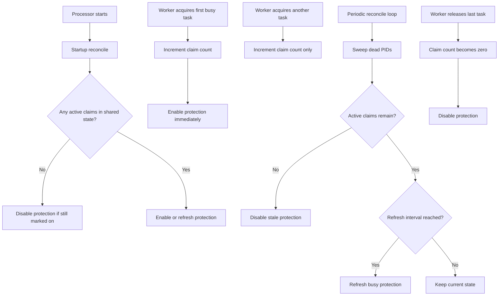
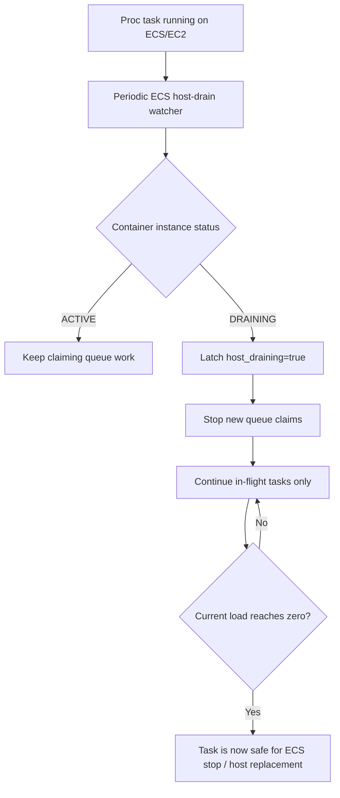
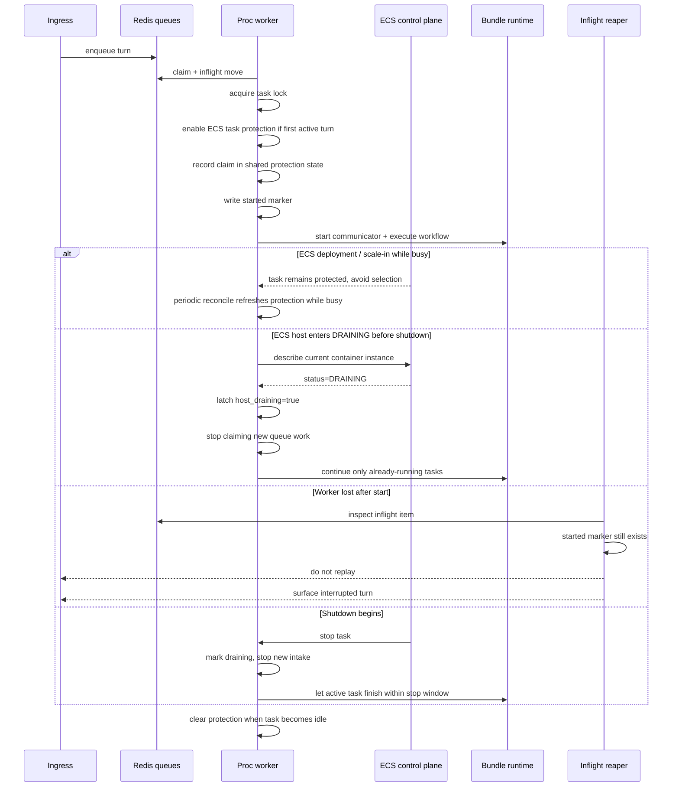

# Proc Long-Run Protection

This document explains the platform approach for protecting long-running bundle requests in the processor service.

The goal is not "never interrupt anything under any circumstance".
The goal is:

- avoid stopping busy proc tasks unnecessarily
- keep a running turn alive through normal drain whenever possible
- never auto-replay a turn after it crossed the non-idempotent boundary

---

## 1. Protection Layers

The processor uses several layers at once.

| Layer | Scope | Purpose |
| --- | --- | --- |
| Conversation state / mailboxing | ingress + proc | Prevents a second normal turn from starting on the same conversation while one is already running. |
| Redis claim lock | proc worker | Ensures only one worker owns a claimed task at a time. |
| Started marker | proc worker + reaper | Marks the non-idempotent boundary after which auto-replay is forbidden. |
| ECS task scale-in protection | ECS service task | Tells ECS not to select a busy proc task for deployment/scale-in while work is active. |
| ECS host-drain watcher | ECS/EC2 proc replica | Detects that the current ECS container instance is already `DRAINING` and stops new queue intake early. |
| Graceful drain | proc task | Stops new work, waits for active tasks to finish. |
| Inflight reaper | proc worker | Resolves lost claims as either requeueable pre-start work or interrupted started work. |

No single mechanism is sufficient by itself.

---

## 2. The Non-Idempotent Boundary

The most important platform rule is:

- before start: replay may be safe
- after start: replay is not safe by default

In [processor.py](../../../src/kdcube-ai-app/kdcube_ai_app/apps/chat/processor.py), proc writes a started marker before communicator start and before bundle execution proceeds.

That marker means:

- the turn may already emit user-visible events
- the workflow may already have created side effects
- recovery must prefer interruption over replay

This is why proc distinguishes:

- stale pre-start claim -> requeue
- stale started task -> mark interrupted

---

## 3. ECS Task Protection Layer

When proc runs on ECS and `ECS_AGENT_URI` is available, [task_protection.py](../../../src/kdcube-ai-app/kdcube_ai_app/infra/aws/task_protection.py) activates ECS task scale-in protection.

High-level flow:

1. proc begins executing a claimed turn
2. proc enters `async with self._task_scale_in_protection.hold(...)`
3. if this is the first active claim in the ECS task, proc calls the ECS agent task-protection endpoint and enables protection
4. proc records the active claim in a small shared state file under `/tmp`
5. while any worker process still has active claims, protection should remain on
6. when the last active claim finishes, proc disables protection

That is only the edge-triggered part. The current implementation also adds a reconcile layer:

- proc runs a startup reconcile when the processor starts
- proc runs a periodic reconcile loop while the processor is alive
- reconcile sweeps dead PIDs from the shared claim file
- reconcile disables stale protection if the ECS task is actually idle
- reconcile refreshes protection periodically while work is still active, so long-running busy tasks do not depend on a single initial enable call

This matters because recent runtime features such as live `followup` / `steer` can legitimately extend the life of an in-flight turn. Protection therefore must behave as a maintained busy/idle contract, not only as a one-time toggle.

Important details:

- protection is tracked per ECS task, not per request
- multiple Uvicorn worker processes coordinate through shared files in `/tmp`
- dead PIDs are swept so a crashed worker does not pin protection forever
- the shared state tracks:
  - active claims by PID
  - whether protection is believed to be enabled
  - last protection sync time
- if `ECS_AGENT_URI` is absent, this layer is a no-op

What this buys us:

- during normal service deployment and service scale-in, ECS should avoid stopping a busy proc task
- a previously failed disable does not need to stay wrong forever
- a stale busy marker can be reconciled back to idle
- very long busy work can refresh protection before expiry

What it does not buy us:

- immunity from host loss
- immunity from explicit force-stop
- infinite runtime
- permission to replay a started turn

### 3.1 Internal protection state

Protection is task-wide, but proc may run with multiple worker processes inside the same ECS task. To coordinate that, the ECS protection helper keeps a small shared state in `/tmp`:

- `ECS_TASK_PROTECTION_LOCK_PATH`
- `ECS_TASK_PROTECTION_STATE_PATH`

Conceptually the state looks like:

```json
{
  "claims": {
    "<pid>": <count>
  },
  "protection_enabled": true,
  "last_protection_sync_at": 1775960000.0
}
```

Meaning:

- `claims`: how many active protected task executions each PID currently owns
- `protection_enabled`: proc's last known protection state pushed to the ECS agent
- `last_protection_sync_at`: when protection was last explicitly enabled/refreshed/disabled

This is not a durable business record. It is only a local coordination file for the processes of one ECS task.

### 3.2 Visual protection lifecycle



---

## 4. ECS Host-Drain Watcher

Request-level task protection is not enough by itself.

A separate operational problem can happen during ECS/EC2 replacement:

- the EC2 host is selected for replacement
- the ECS container instance enters `DRAINING`
- the existing `chat-proc` service task is still alive on that host
- unless proc notices this, it can keep pulling new Redis work and keep the host busy

This is why proc now has an ECS-only host-drain watcher in [processor.py](../../../src/kdcube-ai-app/kdcube_ai_app/apps/chat/processor.py), backed by [ecs_container_instance_drain.py](../../../src/kdcube-ai-app/kdcube_ai_app/infra/aws/ecs_container_instance_drain.py).

High-level flow:

1. inside the container, proc reads ECS task metadata
2. it resolves the current ECS cluster and task ARN
3. it asks ECS for the current task's `containerInstanceArn`
4. it calls `DescribeContainerInstances`
5. if the current container instance status is `DRAINING`, proc latches `host_draining=true`
6. after that latch, proc stops claiming new queue work but allows already-running requests to finish

Important scope:

- this is active only when ECS task metadata is present
- on non-ECS runs it is a no-op
- on ECS tasks without `containerInstanceArn` it disables itself
- once proc sees `DRAINING`, it does not resume intake again in the same task lifetime

What this buys us:

- the proc task stops making itself busy again after the host is already being drained
- deployment/instance replacement no longer depends only on eventual SIGTERM
- request-level task protection and host replacement now work together instead of fighting each other

What it does not do:

- it does not cancel already-running requests
- it does not mark the FastAPI app as shutting down
- it does not change `/health` into `draining` by itself

This is intentional.
`host_draining` means:

- stop taking new queue work now
- finish the work already in flight
- stay alive until ECS actually stops the task or work reaches zero

### 4.1 Visual host-drain lifecycle



### 4.2 Request protection vs host drain

These two mechanisms solve different problems:

- ECS task scale-in protection:
  prevents a busy proc task from being selected for normal stop too early
- ECS host-drain watcher:
  prevents a proc task on an already-draining host from taking fresh queue work

Together they mean:

- busy work should be protected while it is legitimately active
- but once the host is already marked for replacement, proc should stop becoming busy again

---

## 5. Graceful Drain Layer

If shutdown still begins, proc switches from "avoid selection" to "finish cleanly if possible".

In [web_app.py](../../../src/kdcube-ai-app/kdcube_ai_app/apps/chat/proc/web_app.py):

- the app marks itself draining
- `/health` returns unhealthy
- `processor.stop_processing()` stops new intake and waits for active tasks

In [processor.py](../../../src/kdcube-ai-app/kdcube_ai_app/apps/chat/processor.py), drain means:

- queue/config/reaper loops stop taking new work
- inflight tasks are not intentionally cancelled by normal drain
- lock renewal continues while running tasks are still alive

But this layer is bounded by the real container stop budget:

- `PROC_CONTAINER_STOP_TIMEOUT_SEC`
- optionally `PROC_UVICORN_GRACEFUL_SHUTDOWN_TIMEOUT_SEC`

So drain is "finish within the allowed stop window", not "run forever until done".

Note that ECS task protection and graceful drain are different layers:

- task protection tries to prevent ECS from selecting the busy task for stop in the first place
- graceful drain is what happens after shutdown has already started

Task protection reduces unnecessary interruption. Drain handles the interruption path when protection is no longer enough.

---

## 6. Recovery After Worker Loss

If a worker disappears unexpectedly, the inflight reaper decides what to do next.

### Case A: lock expired, no started marker

Interpretation:

- the task was claimed
- execution never crossed the started boundary

Action:

- remove from inflight
- requeue to the ready lane

### Case B: lock expired, started marker still exists

Interpretation:

- execution already started
- replay is unsafe

Action:

- remove from inflight
- do not requeue
- set conversation state to `error`
- emit `conv_status` completion `interrupted`
- emit `chat_error` with `error_type="turn_interrupted"`

This is the core correctness guarantee of the current platform behavior.

---

## 7. Sequence Diagram



---

## 8. Observability And Debugging

Processor heartbeat metadata now exposes:

- request/task protection state
- host-drain state
- queue-load state

That runtime metadata includes:

- whether ECS task protection is enabled at all
- current active claim count
- claimed process count
- whether proc currently believes protection is enabled
- refresh interval and last sync timestamp
- whether proc latched `host_draining`
- when `host_draining` was first observed
- whether proc is still accepting new tasks
- the current ECS container-instance status snapshot when available

So if a deployment says a proc task is still "protected", the first things to compare are:

- processor `current_load`
- processor `active_tasks`
- processor `host_draining`
- processor `accepting_new_tasks`
- processor `task_protection.active_claims`
- processor `task_protection.protection_enabled`

The unhealthy case to look for is:

- `current_load = 0`
- `active_tasks = 0`
- but task protection still appears enabled

With periodic reconcile, proc should eventually correct that state back to idle even if an earlier disable failed.

The "host selected for replacement" case looks different:

- `host_draining = true`
- `accepting_new_tasks = false`
- `current_load > 0` means proc is still finishing existing requests
- `current_load = 0` means the task is idle and should now be removable without proc taking new work again

Also note the distinction between:

- app shutdown drain:
  `web_app.py` marks the service as draining and `/health` returns `503`
- host-drain latch:
  proc stops queue intake early, but the app is not yet in shutdown

That is deliberate. The host-drain latch is an internal scheduling safeguard, not the same as process termination.

## 9. What Users See

When protection works and the turn finishes inside the stop budget:

- the user sees a normal completion

When a started turn cannot finish and the worker is lost:

- the user sees an interrupted turn
- the client should keep any partial output already rendered
- the user may manually retry, but proc does not silently resubmit the same started turn

This behavior is documented in the client/SSE docs as the `completion="interrupted"` + `error_type="turn_interrupted"` path.

---

## 10. Configuration Knobs

Relevant environment variables:

- `ECS_AGENT_URI`
- `ECS_CONTAINER_METADATA_URI_V4`
- `ECS_CONTAINER_METADATA_URI`
- `ECS_TASK_PROTECTION_REQUEST_TIMEOUT_SEC`
- `ECS_TASK_PROTECTION_EXPIRES_MINUTES`
- `ECS_TASK_PROTECTION_REFRESH_INTERVAL_SEC`
- `ECS_TASK_PROTECTION_RECONCILE_INTERVAL_SEC`
- `ECS_TASK_PROTECTION_LOCK_PATH`
- `ECS_TASK_PROTECTION_STATE_PATH`
- `ECS_CONTAINER_INSTANCE_DRAIN_POLL_INTERVAL_SEC`
- `ECS_CONTAINER_INSTANCE_DRAIN_REQUEST_TIMEOUT_SEC`
- `CHAT_TASK_TIMEOUT_SEC`

Operational meaning:

- `EXPIRES_MINUTES` controls how long the ECS-side protection lease lasts
- `REFRESH_INTERVAL_SEC` controls how often busy protection is refreshed
- `RECONCILE_INTERVAL_SEC` controls how often proc re-checks and repairs local protection state
- `ECS_CONTAINER_INSTANCE_DRAIN_POLL_INTERVAL_SEC` controls how often proc asks ECS whether its current container instance is already draining

---

## 11. Limits And Non-Goals

This design intentionally does not promise:

- automatic replay of all interrupted work
- uninterrupted completion under host failure
- infinite protection duration
- correctness for arbitrary side-effecting workflows under replay

It does promise:

- protect busy proc tasks from ordinary ECS service replacement when possible
- stop new queue intake when the current ECS host is already draining
- drain in-flight work cleanly when shutdown begins
- prefer explicit interruption over unsafe replay after start

---

## 12. Summary

The processor protects long-running work by combining:

- queue ownership
- a started marker
- ECS task scale-in protection
- ECS host-drain detection
- startup and periodic protection reconcile
- graceful drain
- conservative recovery semantics

That is the platform contract for running bundle requests today:

- try hard to let them finish
- never pretend started work is safely replayable when it is not
