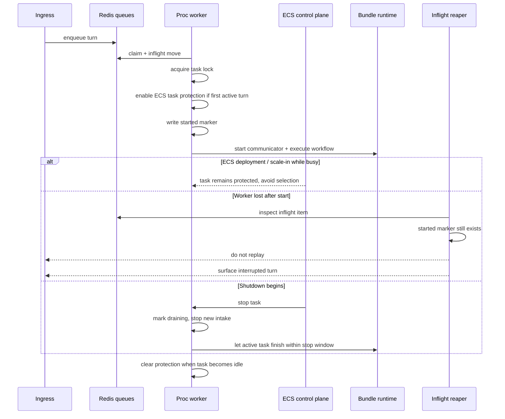

# Proc Long-Run Protection

This document explains the platform approach for protecting long-running bundle requests in the processor service.

The goal is not "never interrupt anything under any circumstance".
The goal is:

- avoid stopping busy proc tasks unnecessarily
- keep a running turn alive through normal drain whenever possible
- never auto-replay a turn after it crossed the non-idempotent boundary

---

## 1. Protection Layers

The processor uses several layers at once.

| Layer | Scope | Purpose |
| --- | --- | --- |
| Conversation state / mailboxing | ingress + proc | Prevents a second normal turn from starting on the same conversation while one is already running. |
| Redis claim lock | proc worker | Ensures only one worker owns a claimed task at a time. |
| Started marker | proc worker + reaper | Marks the non-idempotent boundary after which auto-replay is forbidden. |
| ECS task scale-in protection | ECS service task | Tells ECS not to select a busy proc task for deployment/scale-in while work is active. |
| Graceful drain | proc task | Stops new work, waits for active tasks to finish. |
| Inflight reaper | proc worker | Resolves lost claims as either requeueable pre-start work or interrupted started work. |

No single mechanism is sufficient by itself.

---

## 2. The Non-Idempotent Boundary

The most important platform rule is:

- before start: replay may be safe
- after start: replay is not safe by default

In [processor.py](../../../src/kdcube-ai-app/kdcube_ai_app/apps/chat/processor.py), proc writes a started marker before communicator start and before bundle execution proceeds.

That marker means:

- the turn may already emit user-visible events
- the workflow may already have created side effects
- recovery must prefer interruption over replay

This is why proc distinguishes:

- stale pre-start claim -> requeue
- stale started task -> mark interrupted

---

## 3. ECS Task Protection Layer

When proc runs on ECS and `ECS_AGENT_URI` is available, [task_protection.py](../../../src/kdcube-ai-app/kdcube_ai_app/infra/aws/task_protection.py) activates ECS task scale-in protection.

High-level flow:

1. proc begins executing a claimed turn
2. proc enters `async with self._task_scale_in_protection.hold(...)`
3. if this is the first active claim in the ECS task, proc calls the ECS agent task-protection endpoint and enables protection
4. while any worker process still has active claims, protection remains on
5. when the last active claim finishes, proc disables protection

Important details:

- protection is tracked per ECS task, not per request
- multiple Uvicorn worker processes coordinate through shared files in `/tmp`
- dead PIDs are swept so a crashed worker does not pin protection forever
- if `ECS_AGENT_URI` is absent, this layer is a no-op

What this buys us:

- during normal service deployment and service scale-in, ECS should avoid stopping a busy proc task

What it does not buy us:

- immunity from host loss
- immunity from explicit force-stop
- infinite runtime
- permission to replay a started turn

---

## 4. Graceful Drain Layer

If shutdown still begins, proc switches from "avoid selection" to "finish cleanly if possible".

In [web_app.py](../../../src/kdcube-ai-app/kdcube_ai_app/apps/chat/proc/web_app.py):

- the app marks itself draining
- `/health` returns unhealthy
- `processor.stop_processing()` stops new intake and waits for active tasks

In [processor.py](../../../src/kdcube-ai-app/kdcube_ai_app/apps/chat/processor.py), drain means:

- queue/config/reaper loops stop taking new work
- inflight tasks are not intentionally cancelled by normal drain
- lock renewal continues while running tasks are still alive

But this layer is bounded by the real container stop budget:

- `PROC_CONTAINER_STOP_TIMEOUT_SEC`
- optionally `PROC_UVICORN_GRACEFUL_SHUTDOWN_TIMEOUT_SEC`

So drain is "finish within the allowed stop window", not "run forever until done".

---

## 5. Recovery After Worker Loss

If a worker disappears unexpectedly, the inflight reaper decides what to do next.

### Case A: lock expired, no started marker

Interpretation:

- the task was claimed
- execution never crossed the started boundary

Action:

- remove from inflight
- requeue to the ready lane

### Case B: lock expired, started marker still exists

Interpretation:

- execution already started
- replay is unsafe

Action:

- remove from inflight
- do not requeue
- set conversation state to `error`
- emit `conv_status` completion `interrupted`
- emit `chat_error` with `error_type="turn_interrupted"`

This is the core correctness guarantee of the current platform behavior.

---

## 6. Sequence Diagram

---

## 7. What Users See

When protection works and the turn finishes inside the stop budget:

- the user sees a normal completion

When a started turn cannot finish and the worker is lost:

- the user sees an interrupted turn
- the client should keep any partial output already rendered
- the user may manually retry, but proc does not silently resubmit the same started turn

This behavior is documented in the client/SSE docs as the `completion="interrupted"` + `error_type="turn_interrupted"` path.

---

## 8. Limits And Non-Goals

This design intentionally does not promise:

- automatic replay of all interrupted work
- uninterrupted completion under host failure
- infinite protection duration
- correctness for arbitrary side-effecting workflows under replay

It does promise:

- protect busy proc tasks from ordinary ECS service replacement when possible
- drain in-flight work cleanly when shutdown begins
- prefer explicit interruption over unsafe replay after start

---

## 9. Summary

The processor protects long-running work by combining:

- queue ownership
- a started marker
- ECS task scale-in protection
- graceful drain
- conservative recovery semantics

That is the platform contract for running bundle requests today:

- try hard to let them finish
- never pretend started work is safely replayable when it is not
