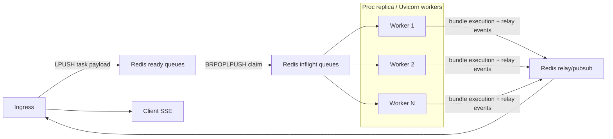
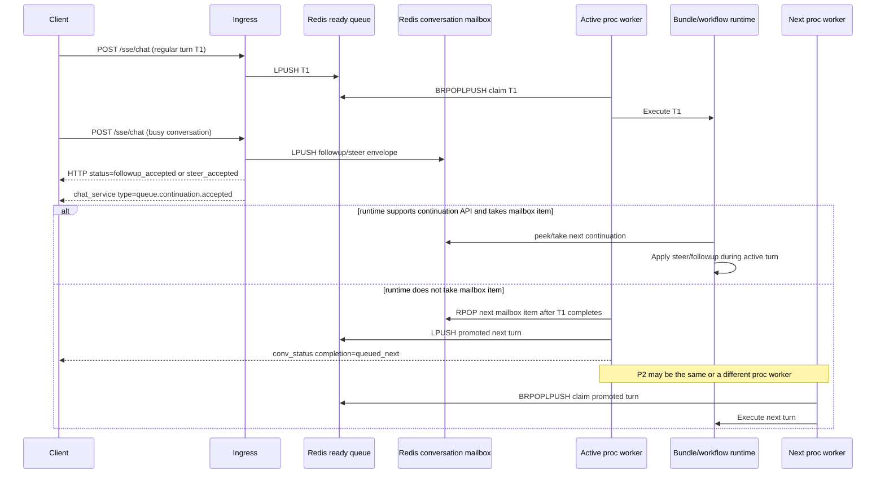

# Chat Processor Architecture

This document describes the current `proc` service architecture, including the currently implemented continuation mailbox behavior for `followup` and `steer`, and the next-step design beyond that slice.

It reflects the current implementation in:
- `apps/chat/proc/web_app.py`
- `apps/chat/processor.py`
- `infra/gateway/backpressure.py`

---

## 1. What The Processor Owns

The `proc` service is the execution side of chat processing. After ingress accepts a request, `proc` is responsible for:

- claiming queued chat tasks from Redis
- executing the target bundle/workflow
- publishing chat events through the relay communicator
- updating conversation state to `idle` or `error`
- listening for bundle-registry updates
- exposing integration/admin endpoints that belong on the processor side
- reporting heartbeat/load/runtime metadata for capacity and health checks

`proc` does not terminate SSE itself. The browser stays connected to ingress. Processor events are forwarded through the relay and then delivered by ingress to the client.

---

## 2. Process Topology

Each Uvicorn worker process in `proc` is an independent queue consumer.

Per worker process:

- one FastAPI process lifecycle
- one steady-state shared async Redis client/pool
- one Postgres pool
- one `EnhancedChatRequestProcessor`
- one bundle config pub/sub listener
- one inflight recovery loop
- one bundle cleanup loop

All proc worker processes compete for the same Redis task queues.



Important consequences:

- scaling proc horizontally means more worker processes competing for the same queues
- there is no sticky worker ownership by conversation across turns
- only one active turn should own a conversation at one moment in time
- ordering is preserved within a ready-queue lane and within a single conversation mailbox, not across all conversations globally

---

## 3. Current Redis Data Model

The current processor uses Redis Lists plus Redis keys for claims and leases.

### Ready queues

Key pattern:

```text
{tenant}:{project}:kdcube:chat:prompt:queue:{user_type}
```

Current user-type lanes:

- `privileged`
- `registered`
- `anonymous`
- `paid`

Ingress enqueues with `LPUSH`.
Processor claims with `BRPOPLPUSH`.

That combination gives FIFO behavior within one lane:

- new items are inserted on the left
- the oldest item is consumed from the right

### Inflight queues

Key pattern:

```text
{tenant}:{project}:kdcube:chat:prompt:queue:inflight:{user_type}
```

Each claimed item is moved atomically from ready to inflight before execution starts.

### Per-task lock

Key pattern:

```text
{LOCK_PREFIX}:{task_id}
```

The lock is acquired with `SET NX EX`.
It prevents two workers from processing the same logical task simultaneously.

### Started marker

Key pattern:

```text
{LOCK_PREFIX}:started:{task_id}
```

This marker means the turn crossed the "do not auto-replay" boundary.
The marker is set before `comm.start(...)` and before bundle execution proceeds.

Why it matters:

- pre-start claims are recoverable
- started turns are treated as non-idempotent and are not replayed automatically

### Per-conversation continuation mailbox

Key patterns:

```text
{tenant}:{project}:kdcube:chat:conversation:mailbox:{conversation_id}
{tenant}:{project}:kdcube:chat:conversation:mailbox:seq:{conversation_id}
{tenant}:{project}:kdcube:chat:conversation:mailbox:count:{user_type}
```

The mailbox stores accepted `followup` / `steer` messages for a busy conversation.

Important:

- mailbox items are ordered per conversation
- mailbox items are not placed onto the main ready queue immediately
- the active workflow may inspect and take them while it is still running
- if the active workflow does not take them, proc promotes the next mailbox item back into the normal ready queue after the active turn finishes

---

## 4. Current Request Lifecycle

### 4.1 Admission on ingress

Ingress now has two admission paths.

Regular path, when the conversation is not currently working:

1. auth, gateway, rate limit, and backpressure checks run
2. conversation state is set to `in_progress`
3. ingress requires `require_not_in_progress=True`
4. the task payload is enqueued into the ready queue for the user type
5. ingress emits `conv_status` so the client sees the conversation move to `in_progress`

Busy-conversation continuation path:

1. ingress attempts the same conversation-state update
2. if the conversation is already `in_progress`, ingress classifies the new message as:
   - `steer` if explicitly marked; blank text is allowed
   - `followup` if explicitly marked
   - `followup` by default for any message that arrives while the conversation is busy
3. ingress writes the message into the per-conversation continuation mailbox
4. ingress emits `chat_service` with `type="queue.continuation.accepted"`
5. the synchronous `/sse/chat` response returns `status="followup_accepted"` or `status="steer_accepted"`
6. no item is added to the main ready queue yet

### 4.2 Claim on proc

Each proc worker runs a fair lane loop.

High-level flow:

1. rotate through user-type lanes in `("privileged", "registered", "anonymous", "paid")`
2. claim one item with `BRPOPLPUSH(ready -> inflight)`
3. parse payload and derive `task_id`
4. acquire the per-task Redis lock
5. if drain started before execution, return the claim to the ready queue
6. spawn the async execution task and track it in the worker's active-task set

### 4.3 Execution

Once claimed:

1. proc materializes `ChatTaskPayload`
2. proc builds `ServiceCtx`, `ConversationCtx`, and `ChatCommunicator`
3. proc marks the task as started
4. proc emits `chat.start`
5. proc emits an initial workflow step
6. proc runs the bundle handler under:
   - task timeout
   - accounting binding
   - lock renewal
   - started-marker renewal

### 4.4 Completion

On terminal completion:

- success:
  - emit `chat.complete`
  - ack the inflight claim
  - if there is no queued continuation to promote:
    - set conversation state to `idle`
    - emit `conv_status` with `completion="success"`
  - if there is a queued continuation to promote:
    - take exactly one oldest mailbox item
    - push it into the normal ready queue for its user type
    - set conversation state back to `in_progress` for the promoted turn
    - emit `conv_status` with `completion="queued_next"`
- failure:
  - emit `chat.error`
  - ack the inflight claim
  - set conversation state to `error`
  - emit `conv_status` with `completion="error"`

### 4.5 Continuation processing diagram



---

## 5. Ordering, Fairness, And Concurrency

Current guarantees:

- FIFO within each user-type lane
- FIFO within each per-conversation mailbox
- fair rotation across lanes
- bounded parallelism per worker via `max_concurrent`
- at most one actively executing turn per conversation because ingress currently blocks a second normal enqueue while the conversation is `in_progress`
- busy-conversation continuation messages are preserved in ordered shared storage instead of being dropped
- if the active workflow does not consume continuation input, proc promotes exactly one next mailbox item back to the normal ready queue after the current turn ends

Current non-guarantees:

- no sticky worker per conversation across turns
- no full conversation-shard scheduler yet
- no guarantee that a running workflow will inspect mailbox items unless that bundle uses the continuation API
- no strict cross-conversation ordering
- no hard lease protocol yet that makes mailbox ownership explicit independently from conversation state

The current continuation slice is useful, but it is still layered on top of the existing lane queues rather than replacing them with a full conversation scheduler.

---

## 6. Recovery Model

The current processor has three distinct recovery cases.

### 6.1 Redis connection degradation

Long-lived Redis operations use client-side timeouts:

- queue claim timeout
- config pub/sub timeout

If one of those paths exceeds the client-side timeout, proc disconnects the shared async Redis pool sockets.
The next Redis command reconnects through the same client object when Redis is reachable again.

### 6.2 Stale pre-start claim

If the inflight reaper finds a claimed item whose lock has expired and there is no started marker:

- the item is removed from inflight
- the item is requeued back to the ready lane
- this is treated as safe replay because execution never crossed the started boundary

### 6.3 Stale started task

If the inflight reaper finds a claimed item whose lock has expired and the started marker still exists:

- the item is removed from inflight
- it is **not** requeued
- conversation state is set to `error`
- proc emits:
  - `conv_status` with `state="error"` and `completion="interrupted"`
  - `chat_error` with `error_type="turn_interrupted"`

This matches the actual product semantics:

- once bundle execution has started, the client may already have received partial SSE output
- many bundles persist timeline/turn data near the end of the turn, not at the start
- replaying the same task automatically could duplicate side effects or produce a second conflicting answer

So the current rule is:

- safe to retry: claimed but not started
- unsafe to retry: started

### 6.4 Cancellation during drain

If a running task gets cancelled during shutdown:

- proc does not ack the inflight claim
- proc leaves the started marker in place
- external child runtimes are explicitly terminated
- recovery later resolves the task as interrupted rather than replaying it

---

## 7. Graceful Shutdown And Drain

The current shutdown sequence is drain-first.

On shutdown:

1. proc marks the service as draining
2. `/health` returns `503`
3. non-health HTTP requests are rejected with `503 {status:"draining"}`
4. processor stop flag is set
5. queue/config/reaper loops stop taking new work
6. inflight tasks are allowed to finish
7. only after that are heartbeat, monitors, and pools closed

Important details:

- proc no longer intentionally cancels its own inflight task set during normal drain
- lock renewal continues while inflight work is still running
- Uvicorn graceful shutdown for proc is aligned to the current ECS stop budget (`120s`)

Operational caveat:

- if the platform force-kills the worker after that budget, already-started tasks can still end up interrupted
- those turns are surfaced to the client as interrupted rather than replayed

---

## 8. Backpressure And Monitoring

Backpressure now counts:

```text
ready depth + inflight depth + continuation mailbox backlog
```

not only the ready queues.

That matters because a busy proc fleet may have:

- low ready depth
- high inflight depth
- a growing continuation backlog for conversations that are already working

The processor heartbeat metadata currently includes:

- `current_load`
- `active_tasks`
- `draining`
- `queue_loop_lag_sec`
- `config_loop_lag_sec`
- `reaper_loop_lag_sec`
- `last_queue_error`
- `last_config_error`
- `last_reaper_error`
- `stale_requeue_count`
- `stale_interrupted_count`

This metadata is intended to answer two different operational questions:

- "Is the worker alive and still polling Redis?"
- "Is the worker draining work or is it stuck?"

---

## 9. Current Continuation Behavior

The current implementation is now mailbox-oriented for busy conversations.

What happens today:

- a second message for a busy conversation is no longer forced through the main ready queue immediately
- ingress stores it in the ordered per-conversation mailbox
- the active workflow receives a `ConversationContinuationSource` through the workflow/runtime layer
- a bundle that supports continuation can call:
  - `pending_continuation_count()`
  - `peek_next_continuation()`
  - `take_next_continuation()`
- if the bundle takes a mailbox item while it is running, that item is handled inside that active turn according to bundle logic
- if the bundle does not take it, proc promotes exactly one next mailbox item into the normal ready queue after the current turn finishes

This is the answer to the main operational question:

- no, unhandled mailbox messages are not lost
- no, they do not stay pinned to the same proc instance
- yes, once promoted, they are available on the normal ready queue and any proc worker can claim them
- the only invariant is one active conversation owner at a time, not sticky worker affinity

Current message-kind rule:

- `regular`: normal turn when the conversation is idle
- `followup`: any message received while the conversation is busy unless explicitly marked otherwise
- `steer`: explicit control message, may be blank, intended for runtimes that can react mid-turn

---

## 10. Remaining Gap To Full Steer/Followup

The current mailbox slice is intentionally conservative.

What it solves:

- safe acceptance of busy-conversation messages
- ordered storage per conversation
- workflow-level inspection API
- fallback processing for non-reactive bundles through post-turn promotion

What it does not solve yet:

- full conversation sharding
- explicit conversation lease ownership independent from current conversation-state rows
- shard-local ordered scheduling across multiple queued turns for the same conversation
- instant mid-turn control semantics for all bundles
- stream-native pending ownership / recovery

So steer/followup is now partially implemented, but the system is not yet a full conversation-scheduler architecture.

## 11. Steer/Followup: Desired Product Semantics

The target behavior should be:

- preserve strict order per conversation
- never let two processors execute the same conversation at the same time
- allow a client to send a new message while a turn is still active
- distinguish message intent:
  - `regular`: normal user turn when the conversation is not currently working
  - `followup`: any message that arrives while the conversation is already working, unless it is explicitly marked otherwise
  - `steer`: an explicitly marked control message for the currently running turn; it may contain blank text
- let reactive bundles check for steer/followup while the turn is still running and decide whether to pick them
- let non-reactive bundles leave those messages queued so they are processed later in normal order
- never auto-replay an already-started turn just because a worker died

The last point remains non-negotiable. Steer/followup does not change the non-idempotent nature of an already-started turn.

---

## 12. Recommended Architecture For Full Conversation Ownership

### 12.1 Move from user-type queues to conversation sharding

For steer/followup, the main scheduling unit should become the conversation, not the global lane item.

Recommended model:

- compute `conversation_shard = hash(conversation_id) % N`
- route all messages for one conversation to the same shard
- ensure one active consumer/owner per conversation at a time via a shared lease
- keep per-conversation order inside that shard

Important:

- this is **not** sticky-processor routing
- the same conversation does not need to stay on the same proc instance across turns
- ownership is lease-based and can move between workers
- the only invariant is that at one moment in time there is at most one active owner for that conversation

This is the key property the current architecture does not yet have as an explicit shard-native lease model.

### 12.2 Keep the per-conversation mailbox, but make it shard-native

Each conversation needs an ordered mailbox that stores:

- the accepted head turn
- queued followup messages behind it
- steer messages that target the currently active turn

Conceptually:

```text
conversation C
  active turn: T1
  mailbox:
    1. steer S1 -> targets T1 while T1 is running
    2. followup F1 -> next turn after T1
    3. followup F2 -> next turn after F1
```

The runtime contract should become:

- the active turn owns the conversation lease
- steer/followup messages are written to shared ordered storage, not to process memory
- the active owner can inspect that storage at any moment while it runs
- steer messages are visible to that active owner immediately
- followups remain ordered behind the active turn unless the active workflow explicitly decides to consume them as live continuation input
- if the active workflow does not pick them, they stay available for normal later processing

### 12.3 Keep explicit continuation metadata in the request contract

The task payload should grow explicit continuation metadata.

At minimum:

- message kind: `regular | followup | steer`
- target conversation id
- optional target turn id for steer
- monotonic sequence information inside the conversation

Classification rule:

- if a message arrives while the conversation is not working, it is a normal `regular` turn unless explicitly marked otherwise
- if a message arrives while the conversation is working, it should default to `followup`
- if the client explicitly marks it as `steer`, it is treated as `steer`
- the client may also explicitly mark a message as `followup` even if the server could infer it

This distinction now exists in the payload and should remain explicit. The processor behavior should not infer it implicitly from prompt text or route shape.

### 12.4 Keep continuation access at the workflow layer

The continuation API should be injected at workflow/entrypoint level, not embedded directly into individual agents.

Recommended shape:

- entrypoint/workflow receives a `ConversationContinuationSource`
- reactive runtimes can call it between rounds or tool steps
- the workflow decides how a continuation changes the active plan
- individual agents stay focused on reasoning, not Redis mechanics

That continuation source should support at least:

- peek whether any next message exists for this conversation
- read the next available steer/followup message in order
- optionally leave the message untouched if the workflow decides not to consume it yet
- ack/claim the message only when the workflow has decided to pick it

This matters for reuse:

- reactive bundles can actively consume steer/followup
- non-reactive bundles can remain unchanged
- a generic workflow wrapper can decide whether a mailbox item is actionable now or should stay queued

### 12.5 Reactive vs non-reactive behavior

Reactive bundle:

- while the turn is running, the runtime can poll or await continuation input from the shared conversation mailbox
- steer can change objective, constraints, stop conditions, or request interruption/reorientation
- steer may even contain no user text and still be meaningful as a control signal
- followup can either stay queued for the next turn or, if the workflow supports it, be converted into a live continuation step
- the runtime chooses whether to pick the next available continuation message or leave it queued

Non-reactive bundle:

- current turn runs unchanged
- queued steer/followup stays in mailbox order
- after the active turn ends, the next queued message becomes the next regular turn
- that next regular turn may be picked by the same proc worker or by another one

This lets the platform support advanced runtimes without forcing every bundle to understand live continuation semantics.

---

## 13. Why Redis Streams Are The Better Next Step

The current processor uses Redis Lists.
That is still acceptable for the current coarse proc queue, but it is a weak fit for steer/followup mailboxes.

### Lists: what they are good at

- simple enqueue/dequeue
- low implementation overhead
- acceptable for "take one task and run it"

### Lists: where they become awkward

- no native pending ledger
- reclaim logic is manual
- hard to inspect ownership cleanly
- poor fit for ordered per-conversation mailboxes with consumer failover

### Streams: what they add

- append-only ordered log
- consumer groups
- native pending list
- `XACK`
- `XPENDING`
- `XCLAIM` / `XAUTOCLAIM`

For steer/followup, streams are the recommended direction because they naturally model:

- shard streams
- consumer ownership
- pending conversation work
- ordered continuation delivery

Important:

- Streams do **not** solve non-idempotent started turns automatically.
- The replay policy still has to remain:
  - pre-start pending item: recoverable
  - started turn: interrupted, not auto-replayed

---

## 14. Smooth Migration Path

The recommended migration is incremental.

### Phase A: formalize the abstraction

- introduce a queue/mailbox abstraction
- keep current list-backed implementation for normal turns
- add explicit continuation metadata to payloads

### Phase B: add conversation shard routing

- hash by `conversation_id`
- introduce shard ownership
- continue running only normal turns first

### Phase C: add continuation mailbox API

- expose a workflow-level continuation source
- let reactive bundles consume steer/followup
- keep non-reactive bundles on deferred-next-turn behavior

### Phase D: move the conversation layer to Redis Streams

- use shard streams with consumer groups
- cut over by tenant/project or explicit feature flag
- avoid dual-consuming the same logical traffic from both backends

### Phase E: relax ingress gating

Only after mailbox + ownership exist should ingress stop relying on `require_not_in_progress=True` for all messages.

At that point:

- normal message may still be denied if the product wants strict UX
- followup/steer can be admitted safely because the conversation already has an ordered mailbox

---

## 15. Architecture Rules To Keep

These rules should survive the steer/followup redesign:

- one conversation can have only one active processor owner at a time
- conversation ownership is lease-based, not sticky to one proc instance across turns
- already-started turns are not auto-replayed
- partial output already seen by the client must remain valid UI state
- backpressure must count accepted but unfinished work, not only ready depth
- shutdown must stop new admissions before it starts waiting on inflight work
- continuation transport should be hidden behind a workflow-level API, not exposed as raw Redis operations to bundles

---

## 16. Bottom Line

Today the processor is still primarily a lane-based, turn-at-a-time worker, but with an implemented continuation mailbox layer for busy conversations.

That architecture is now much safer for long-running workers:

- it drains correctly
- it recovers stale pre-start claims
- it does not replay started turns
- it tells the client when a started turn was interrupted
- it accepts busy-conversation followup/steer into an ordered mailbox
- it lets continuation-aware bundles inspect that mailbox during execution
- it falls back to promoting the next mailbox item into the normal queue for non-reactive bundles

The current model already supports a first steer/followup slice.
The next major step is to evolve from:

```text
global lane queue -> task execution
```

to:

```text
conversation shard -> conversation mailbox -> active turn owner -> optional reactive continuation consumption
```

That is the right boundary for the next design step.
