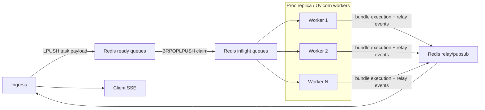
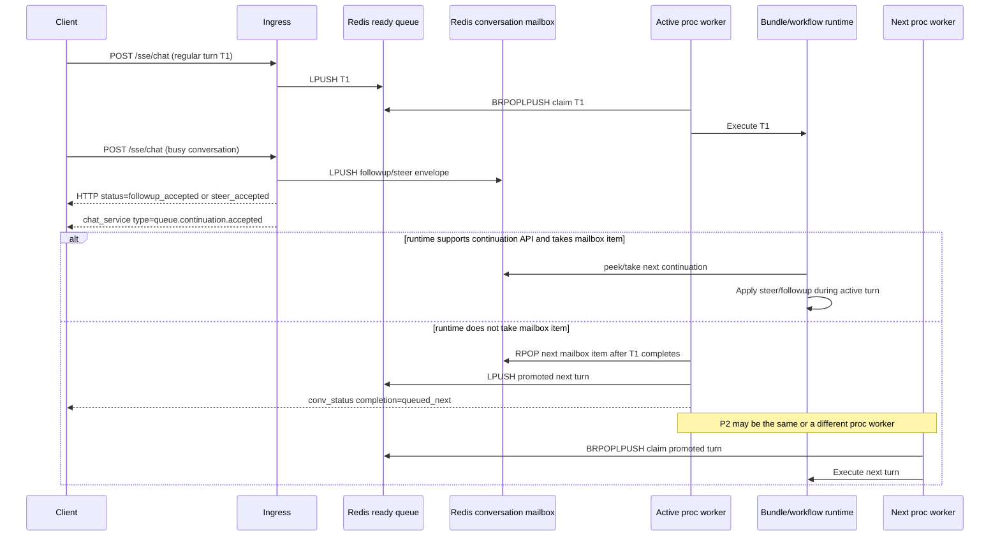
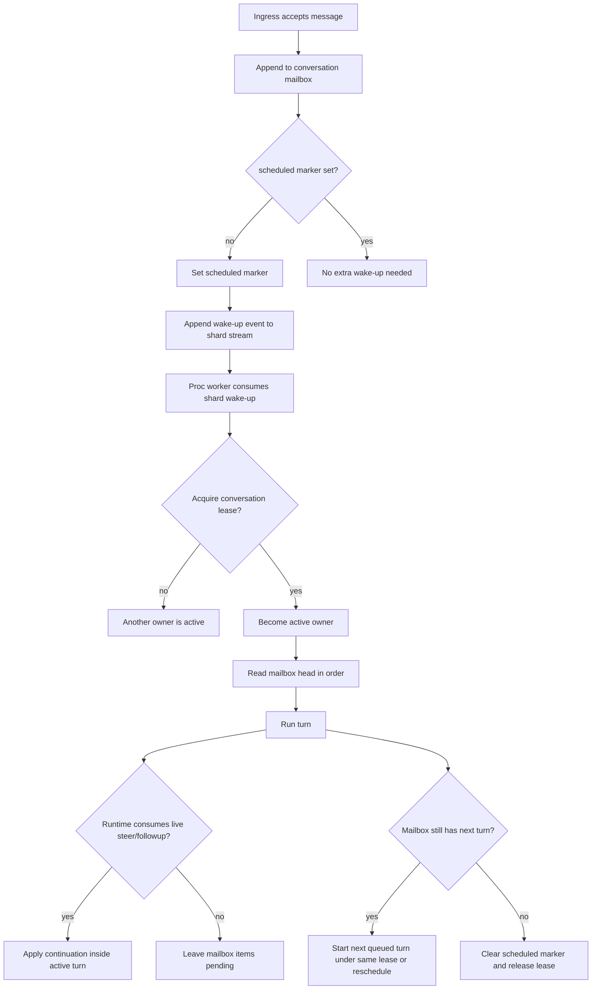

# Chat Processor Architecture

This document describes the current `proc` service architecture, including the currently implemented continuation mailbox behavior for `followup` and `steer`, and the next-step design beyond that slice.

It reflects the current implementation in:
- `apps/chat/proc/web_app.py`
- `apps/chat/processor.py`
- `infra/gateway/backpressure.py`

---

## 1. What The Processor Owns

The `proc` service is the execution side of chat processing. After ingress accepts a request, `proc` is responsible for:

- claiming queued chat tasks from Redis
- executing the target bundle/workflow
- publishing chat events through the relay communicator
- updating conversation state to `idle` or `error`
- listening for bundle-registry updates
- exposing integration/admin endpoints that belong on the processor side
- reporting heartbeat/load/runtime metadata for capacity and health checks

`proc` does not terminate SSE itself. The browser stays connected to ingress. Processor events are forwarded through the relay and then delivered by ingress to the client.

---

## 2. Process Topology

Each Uvicorn worker process in `proc` is an independent queue consumer.

Per worker process:

- one FastAPI process lifecycle
- one steady-state shared async Redis client/pool
- one Postgres pool
- one `EnhancedChatRequestProcessor`
- one bundle config pub/sub listener
- one inflight recovery loop
- one bundle cleanup loop

All proc worker processes compete for the same Redis task queues.



Important consequences:

- scaling proc horizontally means more worker processes competing for the same queues
- there is no sticky worker ownership by conversation across turns
- only one active turn should own a conversation at one moment in time
- ordering is preserved within a ready-queue lane and within a single conversation mailbox, not across all conversations globally

---

## 3. Current Redis Data Model

The current processor uses Redis Lists plus Redis keys for claims and leases.

Current implementation note:

- the currently implemented keys are primarily scoped by `tenant` and `project`
- the fuller target scheduler design below adds `bundle_id` and `user_id` segments for conversation-scoped resources

### Ready queues

Key pattern:

```text
{tenant}:{project}:kdcube:chat:prompt:queue:{user_type}
```

Current user-type lanes:

- `privileged`
- `registered`
- `anonymous`
- `paid`

Ingress enqueues with `LPUSH`.
Processor claims with `BRPOPLPUSH`.

That combination gives FIFO behavior within one lane:

- new items are inserted on the left
- the oldest item is consumed from the right

### Inflight queues

Key pattern:

```text
{tenant}:{project}:kdcube:chat:prompt:queue:inflight:{user_type}
```

Each claimed item is moved atomically from ready to inflight before execution starts.

### Per-task lock

Key pattern:

```text
{LOCK_PREFIX}:{task_id}
```

The lock is acquired with `SET NX EX`.
It prevents two workers from processing the same logical task simultaneously.

### Started marker

Key pattern:

```text
{LOCK_PREFIX}:started:{task_id}
```

This marker means the turn crossed the "do not auto-replay" boundary.
The marker is set before `comm.start(...)` and before bundle execution proceeds.

Why it matters:

- pre-start claims are recoverable
- started turns are treated as non-idempotent and are not replayed automatically
- the started marker lease is intentionally longer than the worker claim-lock lease
- that lease is renewed separately so a hard proc restart does not accidentally let an already-started turn fall back into the "pre-start reclaim" path
- current product policy is simple: normal inbound chat messages do not opt into idempotent replay; once started, they are treated as non-idempotent

### Per-conversation continuation mailbox

Key patterns:

```text
{tenant}:{project}:kdcube:chat:conversation:mailbox:{conversation_id}
{tenant}:{project}:kdcube:chat:conversation:mailbox:seq:{conversation_id}
{tenant}:{project}:kdcube:chat:conversation:mailbox:count:{user_type}
```

The mailbox stores accepted `followup` / `steer` messages for a busy conversation.

Important:

- mailbox items are ordered per conversation
- mailbox items are not placed onto the main ready queue immediately
- the active workflow may inspect and take them while it is still running
- if the active workflow does not take them, proc promotes the next mailbox item back into the normal ready queue after the active turn finishes

---

## 4. Current Request Lifecycle

### 4.1 Admission on ingress

Ingress now has two admission paths.

Regular path, when the conversation is not currently working:

1. auth, gateway, rate limit, and backpressure checks run
2. conversation state is set to `in_progress`
3. ingress requires `require_not_in_progress=True`
4. the task payload is enqueued into the ready queue for the user type
5. ingress emits `conv_status` so the client sees the conversation move to `in_progress`

Busy-conversation continuation path:

1. ingress attempts the same conversation-state update
2. if the conversation is already `in_progress`, ingress classifies the new message as:
   - `steer` if explicitly marked; blank text is allowed
   - `followup` if explicitly marked
   - `followup` by default for any message that arrives while the conversation is busy
3. ingress writes the message into the per-conversation continuation mailbox
4. ingress emits `chat_service` with `type="queue.continuation.accepted"`
5. the synchronous `/sse/chat` response returns `status="followup_accepted"` or `status="steer_accepted"`
6. no item is added to the main ready queue yet

### 4.2 Claim on proc

Each proc worker runs a fair lane loop.

High-level flow:

1. rotate through user-type lanes in `("privileged", "registered", "anonymous", "paid")`
2. claim one item with `BRPOPLPUSH(ready -> inflight)`
3. parse payload and derive `task_id`
4. acquire the per-task Redis lock
5. if drain started before execution, return the claim to the ready queue
6. spawn the async execution task and track it in the worker's active-task set

### 4.3 Execution

Once claimed:

1. proc materializes `ChatTaskPayload`
2. proc builds `ServiceCtx`, `ConversationCtx`, and `ChatCommunicator`
3. if running on ECS with `ECS_AGENT_URI`, proc enables task-wide ECS scale-in protection for the busy proc task
4. proc marks the task as started
5. proc emits `chat.start`
6. proc emits an initial workflow step
7. proc runs the bundle handler under:
   - task timeout
   - accounting binding
   - lock renewal
   - started-marker renewal
   - ECS task-protection hold

### 4.4 Completion

On terminal completion:

- success:
  - emit `chat.complete`
  - ack the inflight claim
  - if there is no queued continuation to promote:
    - set conversation state to `idle`
    - emit `conv_status` with `completion="success"`
  - if there is a queued continuation to promote:
    - take exactly one oldest mailbox item
    - push it into the normal ready queue for its user type
    - set conversation state back to `in_progress` for the promoted turn
    - emit `conv_status` with `completion="queued_next"`
- failure:
  - emit `chat.error`
  - ack the inflight claim
  - set conversation state to `error`
  - emit `conv_status` with `completion="error"`

### 4.5 Continuation processing diagram



---

## 5. Ordering, Fairness, And Concurrency

Current guarantees:

- FIFO within each user-type lane
- FIFO within each per-conversation mailbox
- fair rotation across lanes
- bounded parallelism per worker via `max_concurrent`
- at most one actively executing turn per conversation because ingress currently blocks a second normal enqueue while the conversation is `in_progress`
- busy-conversation continuation messages are preserved in ordered shared storage instead of being dropped
- if the active workflow does not consume continuation input, proc promotes exactly one next mailbox item back to the normal ready queue after the current turn ends

Current non-guarantees:

- no sticky worker per conversation across turns
- no full conversation-shard scheduler yet
- no guarantee that a running workflow will inspect mailbox items unless that bundle uses the continuation API
- no strict cross-conversation ordering
- no hard lease protocol yet that makes mailbox ownership explicit independently from conversation state

The current continuation slice is useful, but it is still layered on top of the existing lane queues rather than replacing them with a full conversation scheduler.

---

## 6. Recovery Model

The current processor has three distinct recovery cases.

### 6.1 Redis connection degradation

Long-lived Redis operations use client-side timeouts:

- queue claim timeout
- config pub/sub timeout

If one of those paths exceeds the client-side timeout, proc disconnects the shared async Redis pool sockets.
The next Redis command reconnects through the same client object when Redis is reachable again.

### 6.2 Stale pre-start claim

If the inflight reaper finds a claimed item whose lock has expired and there is no started marker:

- the item is removed from inflight
- the item is requeued back to the ready lane
- this is treated as safe replay because execution never crossed the started boundary

### 6.3 Stale started task

If the inflight reaper finds a claimed item whose lock has expired and the started marker still exists:

- the item is removed from inflight
- it is **not** requeued
- conversation state is set to `error`
- proc emits:
  - `conv_status` with `state="error"` and `completion="interrupted"`
  - `chat_error` with `error_type="turn_interrupted"`

This matches the actual product semantics:

- once bundle execution has started, the client may already have received partial SSE output
- many bundles persist timeline/turn data near the end of the turn, not at the start
- replaying the same task automatically could duplicate side effects or produce a second conflicting answer

So the current rule is:

- safe to retry: claimed but not started
- unsafe to retry: started

Important implementation detail:

- the claim lock and the started marker do **not** share the same effective recovery lease anymore
- the started marker intentionally outlives the claim lock
- otherwise a hard worker restart could let both leases expire together and incorrectly requeue a task that had already crossed the non-idempotent boundary

### 6.4 Cancellation during drain

If a running task gets cancelled during shutdown:

- proc does not ack the inflight claim
- proc leaves the started marker in place
- external child runtimes are explicitly terminated
- recovery later resolves the task as interrupted rather than replaying it

---

## 7. Graceful Shutdown And Drain

The current shutdown sequence is drain-first.

On shutdown:

1. proc marks the service as draining
2. `/health` returns `503`
3. non-health HTTP requests are rejected with `503 {status:"draining"}`
4. processor stop flag is set
5. queue/config/reaper loops stop taking new work
6. inflight tasks are allowed to finish
7. only after that are heartbeat, monitors, and pools closed

Important details:

- proc no longer intentionally cancels its own inflight task set during normal drain
- lock renewal continues while inflight work is still running
- when running on ECS, busy proc tasks are additionally protected from ordinary service scale-in/deployment replacement through ECS task scale-in protection while work is active
- Uvicorn graceful shutdown for proc is derived from `PROC_CONTAINER_STOP_TIMEOUT_SEC` so app drain stays below the real container stop window

Operational caveat:

- if the platform force-kills the worker after that budget, already-started tasks can still end up interrupted
- those turns are surfaced to the client as interrupted rather than replayed

See also:

- [longrun-protection-README.md](/Users/elenaviter/src/kdcube/kdcube-ai-app/app/ai-app/docs/arch/proc/longrun-protection-README.md)
- [proc-README.md](/Users/elenaviter/src/kdcube/kdcube-ai-app/app/ai-app/docs/ops/ecs/components/proc-README.md)

---

## 8. Backpressure And Monitoring

Backpressure now counts:

```text
ready depth + inflight depth + continuation mailbox backlog
```

not only the ready queues.

That matters because a busy proc fleet may have:

- low ready depth
- high inflight depth
- a growing continuation backlog for conversations that are already working

The processor heartbeat metadata currently includes:

- `current_load`
- `active_tasks`
- `draining`
- `queue_loop_lag_sec`
- `config_loop_lag_sec`
- `reaper_loop_lag_sec`
- `last_queue_error`
- `last_config_error`
- `last_reaper_error`
- `stale_requeue_count`
- `stale_interrupted_count`

This metadata is intended to answer two different operational questions:

- "Is the worker alive and still polling Redis?"
- "Is the worker draining work or is it stuck?"

---

## 9. Current Continuation Behavior

The current implementation is now mailbox-oriented for busy conversations.

What happens today:

- a second message for a busy conversation is no longer forced through the main ready queue immediately
- ingress stores it in the ordered per-conversation mailbox
- the active workflow receives a `ConversationContinuationSource` through the workflow/runtime layer
- a bundle that supports continuation can call:
  - `pending_continuation_count()`
  - `peek_next_continuation()`
  - `take_next_continuation()`
- if the bundle takes a mailbox item while it is running, that item is handled inside that active turn according to bundle logic
- if the bundle does not take it, proc promotes exactly one next mailbox item into the normal ready queue after the current turn finishes

This is the answer to the main operational question:

- no, unhandled mailbox messages are not lost
- no, they do not stay pinned to the same proc instance
- yes, once promoted, they are available on the normal ready queue and any proc worker can claim them
- the only invariant is one active conversation owner at a time, not sticky worker affinity

Current message-kind rule:

- `regular`: normal turn when the conversation is idle
- `followup`: any message received while the conversation is busy unless explicitly marked otherwise
- `steer`: explicit control message, may be blank, intended for runtimes that can react mid-turn

---

## 10. Bundle Code Loading, Cutover, And Shared Example Bundles

Processor workers do not hardcode built-in bundle directories such as `/bundles/react.doc@...`.
They load bundles through the current registry entry and therefore through the current resolved `BundleSpec.path`.

Current behavior:

- startup and bundle-update paths load or rebuild the effective registry for the worker scope
- built-in example bundles are merged into that registry in [bundle_store.py](/Users/elenaviter/src/kdcube/kdcube-ai-app/app/ai-app/services/kdcube-ai-app/kdcube_ai_app/infra/plugin/bundle_store.py)
- request-time bundle resolution then uses the in-memory registry in [bundle_registry.py](/Users/elenaviter/src/kdcube/kdcube-ai-app/app/ai-app/services/kdcube-ai-app/kdcube_ai_app/infra/plugin/bundle_registry.py)
- module/singleton cache keys are based on the resolved bundle path in [agentic_loader.py](/Users/elenaviter/src/kdcube/kdcube-ai-app/app/ai-app/services/kdcube-ai-app/kdcube_ai_app/infra/plugin/agentic_loader.py)

For built-in example bundles on Docker/ECS proc:

- proc copies the image bundle into shared `/bundles`
- the shared copy is versioned rather than overwritten in place
- current path shape is:

```text
/bundles/{bundle_id}__{platform.ref}__{content_sha12}
```

Why this matters:

- a new proc task can load the new bundle version without mutating the old directory
- already-running turns can continue on the older loaded path safely
- once a worker applies the updated registry and clears loader caches, the next bundle load on that worker uses the new path

Processor-side bundle update flow:

1. proc receives a bundles snapshot/update broadcast
2. proc replaces its in-memory registry
3. proc clears loader caches
4. new requests on that worker resolve through the new bundle path

This applies both to:

- normal processor bundle execution
- proc-side bundle loading in integration/admin APIs

Operationally:

- old shared built-in bundle directories are not rewritten in place
- active bundle paths are tracked through bundle refs
- cleanup removes inactive old shared bundle directories later under the periodic cleanup loop and Redis cleanup lock

So the cutover rule is:

- already-running work stays on its already-loaded bundle path
- new work loads the currently published bundle path for that worker after the registry update is applied

---

## 11. Remaining Gap To Full Steer/Followup

The current mailbox slice is intentionally conservative.

What it solves:

- safe acceptance of busy-conversation messages
- ordered storage per conversation
- workflow-level inspection API
- fallback processing for non-reactive bundles through post-turn promotion

What it still does not provide:

- a real conversation scheduler
- a durable "wake this conversation up" mechanism independent from the current owner
- a first-class lease that is owned and renewed by the active conversation owner
- direct processing of the next mailbox turn without bouncing back through the global user-type queue
- explicit crash recovery for "mailbox non-empty but owner died"
- a clear fairness model once one conversation keeps receiving many followups

This is why the current slice was implementable as an extension, but the full design is not a small patch.
The missing piece is not "another Redis key".
It is a new scheduling model whose primary unit is the **conversation**, not the global lane item.

### 11.1 Why this is more complex than the current queue

The current queue is optimized for:

- one task payload
- one worker claims it
- one turn executes
- task completes or fails

The full steer/followup model needs to handle:

- multiple accepted messages per conversation while a turn is still active
- one active owner at a time without sticky instance affinity
- handoff of ownership after a worker dies
- a runtime that may or may not consume live continuation input
- strict order across future turns for the same conversation
- non-replay semantics once a turn has already started producing side effects

That is why the right next step is a conversation scheduler, not another refinement of the global ready queue.

## 12. Steer/Followup: Desired Product Semantics

The target behavior should be:

- preserve strict order per conversation
- never let two processors execute the same conversation at the same time
- allow a client to send a new message while a turn is still active
- distinguish message intent:
  - `regular`: normal user turn when the conversation is not currently working
  - `followup`: any message that arrives while the conversation is already working, unless it is explicitly marked otherwise
  - `steer`: an explicitly marked control message for the currently running turn; it may contain blank text
- let reactive bundles check for steer/followup while the turn is still running and decide whether to pick them
- let non-reactive bundles leave those messages queued so they are processed later in normal order
- never auto-replay an already-started turn just because a worker died

The last point remains non-negotiable.
Steer/followup does not change the non-idempotent nature of an already-started turn.

---

## 13. Proposed Full Conversation Scheduler

The recommended target model is:

```text
ingress append -> conversation mailbox -> shard wake-up stream -> owner lease ->
active conversation loop -> reactive consume or deferred next turn -> lease handoff
```

### 13.1 Core primitives

The full design should introduce five first-class primitives.

Target naming rule:

- conversation-scoped scheduler resources should be namespaced by the stable routing tuple:
  - `tenant`
  - `project`
  - `bundle_id`
  - `user_id`
- then by the concrete resource kind such as conversation mailbox, lease, scheduled marker, or state
- shared shard resources may omit `user_id` in the key because one shard stream can carry many users; in that case `user_id` must still be present in the wake-up event body

#### A. Per-conversation mailbox

All accepted messages for a conversation go into shared ordered storage:

```text
{tenant}:{project}:kdcube:chat:bundle:{bundle_id}:user:{user_id}:conv:{conversation_id}:mailbox
```

This mailbox holds:

- `regular` head turns
- `followup` messages
- `steer` messages

Every mailbox item should carry at least:

- `conversation_id`
- `turn_id`
- `message_kind`
- `created_at`
- monotonic `sequence`
- optional `target_turn_id`
- payload metadata needed to rebuild `ChatTaskPayload`

#### B. Conversation shard wake-up stream

Workers should no longer poll only global user-type queues.
They should also consume a shard scheduler stream:

```text
{tenant}:{project}:kdcube:chat:bundle:{bundle_id}:shard:{shard_id}:wake
```

Each event means:

- "conversation `{id}` has work and needs an owner"
- the event payload carries at least `conversation_id`, `user_id`, and `bundle_id`

The shard is computed as:

```text
hash(conversation_id) % N
```

Important:

- this is **not** sticky-processor routing
- it is only stable routing of conversation scheduling metadata

#### C. Conversation lease

The active owner of a conversation holds a renewable lease:

```text
{tenant}:{project}:kdcube:chat:bundle:{bundle_id}:user:{user_id}:conv:{conversation_id}:lease
```

The lease means:

- at most one proc worker owns this conversation right now
- that owner may execute the active turn and inspect the mailbox

This is the key invariant the current architecture does not yet have explicitly.

#### D. Scheduled marker

The scheduler needs a dedupe bit such as:

```text
{tenant}:{project}:kdcube:chat:bundle:{bundle_id}:user:{user_id}:conv:{conversation_id}:scheduled
```

This prevents unbounded duplicate wake-up events when many messages arrive while the conversation is already known to the scheduler.

#### E. Started-turn marker

The existing non-replay rule must stay.
Once a turn crosses the started boundary, recovery must mark it interrupted rather than replaying it.

That can stay as today:

- a per-task started marker
- or an equivalent turn state persisted in the conversation execution state

Current policy note:

- all normal inbound chat messages are currently treated as non-idempotent after turn start
- if the platform ever introduces idempotent replay, it must be an explicit task/queue contract rather than inferred from generic processor recovery

### 13.2 Proposed end-to-end flow



### 13.3 Ingress write path

Ingress should become append-oriented, not enqueue-oriented.

Recommended flow:

1. classify the incoming message as `regular`, `followup`, or `steer`
2. append it to the per-conversation mailbox with monotonic sequence
3. if the conversation is not already scheduled or leased:
   - set the scheduled marker
   - emit one wake-up event to the shard stream
4. return acceptance to the client immediately

That means ingress no longer needs to decide:

- which proc worker should get this
- whether to push directly into a global lane queue

Strictly speaking, ingress already does **not** choose a concrete proc worker today.
What changes in the target model is this:

- today ingress chooses the **global queueing path**:
  - user-type ready queue
  - or per-conversation mailbox
- in the target model ingress chooses only the **conversation write path**:
  - append to mailbox
  - optionally emit a shard wake-up

Ingress only decides:

- what the message is
- which conversation mailbox it belongs to
- whether the scheduler must be nudged

### 13.4 Worker acquisition path

Proc workers consume shard wake-up events through a consumer group.

Recommended flow:

1. a worker claims a wake-up event from `chat:conv:shard:{shard}:wake`
2. it tries to acquire `chat:conv:lease:{conversation_id}`
3. if lease acquisition fails:
   - another owner is already active
   - the wake-up may be acked or collapsed depending on scheduler policy
4. if lease acquisition succeeds:
   - this worker becomes the active conversation owner
   - it renews the lease while active
   - it enters the conversation execution loop

The worker is now responsible for the conversation, not just one popped queue item.

### 13.5 Active owner conversation loop

This is the core behavior that the current implementation still lacks.

Once a worker owns the conversation lease:

1. read the oldest mailbox item in order
2. if it is a next-turn item, start that turn
3. while the turn runs:
   - expose mailbox access through `ConversationContinuationSource`
   - let the runtime decide whether to consume steer/followup live
4. after the turn ends:
   - if the mailbox still has next-turn work, continue with the next turn
   - otherwise clear scheduler state and release the lease

The important difference from today:

- non-reactive bundles do **not** need promotion back to the global ready queue in the target design
- the owner loop itself can continue with the next mailbox turn in order
- lease handoff happens only when the conversation becomes idle, the owner reaches a fairness boundary, or the owner dies

### 13.6 Fairness policy

One risk of the full owner-loop model is starvation:

- if one conversation keeps receiving more followups, one worker could sit on it for too long

So the design should include an explicit fairness boundary such as:

- max sequential turns per conversation before reschedule
- or max owner timeslice per conversation before reschedule

Example:

- process up to `K` sequential mailbox turns under one lease
- if mailbox is still non-empty after that:
  - keep the mailbox state
  - emit another shard wake-up
  - release the lease

This preserves order while preventing one conversation from monopolizing a worker forever.

### 13.7 Reactive vs non-reactive bundles in the target model

Reactive bundle:

- while the turn is running, the runtime can poll or await continuation input from the mailbox
- `steer` can modify objective, constraints, or stop/reorient behavior
- `followup` can either remain queued for the next turn or be consumed as live continuation input
- the runtime decides whether to pick the next continuation now or leave it pending

Non-reactive bundle:

- current turn runs unchanged
- mailbox items remain ordered and durable
- when the current turn finishes, the owner loop starts the next queued turn in order
- if the owner releases the lease first, another proc worker may become the next owner and continue from the same mailbox state

This is how the design avoids sticky processors while still preserving order.

### 13.8 Does this still apply to one-shot or non-conversational bundles?

Yes.

The scheduler unit is still the conversation envelope, even if the bundle itself is semantically "one-shot".

That means:

- a one-shot bundle can still run under the same model
- it simply ignores live continuation input
- in the common case its mailbox contains only one item, so the conversation loop is trivial
- if followup arrives while a one-shot turn is active, the scheduler still preserves order correctly

So the model does **not** require every bundle to be deeply conversational.
It only requires that every accepted request belong to some schedulable conversation/session identity.

In practice:

- conversational bundle:
  - may use mailbox state actively
- one-shot bundle:
  - usually just processes the current item and finishes

The same scheduler can support both.

### 13.9 Message-kind propagation and pass-through policy

The bundle entrypoint or workflow context must be able to see the message kind it is receiving.

At minimum, the runtime contract should expose:

- `message_kind`
- `target_turn_id` if present
- whether the message was explicitly marked

The framework/scheduler should preserve the accepted ordered message as-is.
It should not reinterpret the message into another kind before calling the bundle.

That means:

- `regular` stays `regular`
- `followup` stays `followup`
- `steer` stays `steer`

The bundle/runtime is responsible for deciding whether that message kind is actionable.

#### Regular

- always valid as a normal turn input
- bundle `run()` handles it as ordinary user input

#### Followup

- if consumed mid-turn by a reactive runtime, it is treated as live continuation input
- if not consumed mid-turn, and later promoted into the next scheduled turn, it is still delivered as `followup`
- a non-reactive bundle may then choose to handle it exactly like ordinary user input, or ignore any followup-specific semantics

#### Steer

`steer` is a control message, not just "another user prompt".

Examples:

- "stop"
- "change direction"
- blank control message that means "interrupt"

If a `steer` message is later delivered into a normal scheduled turn because no active runtime consumed it live, the framework still passes it through as `steer`.
If that bundle does not support `steer`, it may ignore it or apply bundle-specific fallback behavior.

So the rule is:

- yes, bundle `run()` or workflow context must be able to distinguish the message type
- yes, the framework should pass the ordered accepted message through unchanged
- no, the framework should not silently degrade one message kind into another on behalf of the bundle

### 13.10 Can there be more message kinds later?

Yes, but the scheduler-facing taxonomy should stay small and stable.

Recommended separation:

- scheduler/control kinds:
  - `regular`
  - `followup`
  - `steer`
  - future control kinds like `cancel` if needed
- domain/UI payload subtypes:
  - attachment-only message
  - form action
  - tool result
  - system advisory

In other words:

- not every new UI or payload subtype should become a new scheduler kind
- only kinds that change execution ownership or continuation semantics should live at the scheduler layer

### 13.11 Failure and recovery model

Recovery should become conversation-oriented, not just task-oriented.

#### Owner dies before turn start

- lease expires
- mailbox still contains pending work
- a reaper or scheduler repair loop observes:
  - mailbox non-empty
  - no active lease
  - scheduled marker stale or missing
- the conversation is re-woken on its shard stream

Safe to replay:

- yes, if the specific turn never crossed the started boundary

#### Owner dies after turn start

- the active turn is marked interrupted
- that started turn is **not** replayed automatically
- later mailbox items remain pending
- the conversation is re-woken after interruption handling

This preserves the current product rule:

- pre-start work is recoverable
- started turns are interrupted, not replayed

### 13.12 Data model sketch

One workable Redis-Streams-oriented shape is:

```text
{tenant}:{project}:kdcube:chat:bundle:{bundle_id}:user:{user_id}:conv:{conversation_id}:mailbox      # stream of accepted messages
{tenant}:{project}:kdcube:chat:bundle:{bundle_id}:shard:{shard_id}:wake                               # stream of conversations needing an owner
{tenant}:{project}:kdcube:chat:bundle:{bundle_id}:user:{user_id}:conv:{conversation_id}:lease        # renewable key
{tenant}:{project}:kdcube:chat:bundle:{bundle_id}:user:{user_id}:conv:{conversation_id}:scheduled    # dedupe / scheduler bit
{tenant}:{project}:kdcube:chat:bundle:{bundle_id}:user:{user_id}:conv:{conversation_id}:state        # optional execution metadata
```

Mailbox events should be append-only and carry:

- sequence
- message kind
- turn id
- task id
- payload pointer or payload body
- live-consumed flag / terminal status if needed

Wake-up events should be tiny and cheap:

- conversation id
- user id
- bundle id
- shard id
- latest known mailbox sequence
- cause such as `new_message`, `lease_repair`, `next_turn`

---

## 14. Why Redis Streams Are The Better Next Step

The current processor uses Redis Lists.
That is still acceptable for the current coarse proc queue, but it is a weak fit for a full conversation scheduler.

### Lists: what they are good at

- simple enqueue/dequeue
- low implementation overhead
- acceptable for "take one task and run it"

### Lists: where they become awkward

- no native pending ledger
- reclaim logic is manual
- hard to inspect owner handoff cleanly
- awkward for wake-up streams plus per-conversation mailboxes
- poor fit for lease repair and consumer failover

### Streams: what they add

- append-only ordered log
- consumer groups
- native pending list
- `XACK`
- `XPENDING`
- `XCLAIM` / `XAUTOCLAIM`

For the target design, streams are recommended because they naturally model:

- shard wake-up streams
- consumer-group ownership
- pending wake-up repair
- ordered per-conversation mailbox delivery
- observable failover behavior

Important:

- streams do **not** solve non-idempotent started turns automatically
- the replay policy still has to remain:
  - pre-start pending item: recoverable
  - started turn: interrupted, not auto-replayed

---

## 15. Smooth Migration Path

The recommended migration is incremental.

### Phase A: keep the current workflow abstraction

- keep `ConversationContinuationSource` as the public workflow API
- keep explicit continuation metadata in payloads
- keep current mailbox slice working

This protects bundle code from the backend change.

### Phase B: add a scheduler backend abstraction

- introduce a `ConversationScheduler` backend interface
- current backend:
  - global ready queue + mailbox promotion
- target backend:
  - shard stream + lease + mailbox stream

### Phase C: introduce wake-up streams and leases

- add shard wake-up streams
- add conversation leases
- initially use them only for next-turn scheduling, not live continuation

### Phase D: move non-reactive continuation processing into the owner loop

- stop promoting next mailbox items back into the global queue
- let the conversation owner start the next mailbox turn directly
- add fairness boundaries so one conversation cannot monopolize a worker forever

### Phase E: enable live continuation on the new scheduler

- reactive bundles consume mailbox input from the same owner loop
- non-reactive bundles continue to ignore live continuation
- both classes still share the same mailbox and lease model

### Phase F: retire the old global-lane queue for chat turns

- keep global capacity and rate-limit accounting
- move actual execution scheduling to the conversation scheduler
- leave lane-style queues only if they still serve a separate system concern

---

## 16. Architecture Rules To Keep

These rules should survive the redesign:

- one conversation can have only one active processor owner at a time
- conversation ownership is lease-based, not sticky to one proc instance across turns
- already-started turns are not auto-replayed
- partial output already seen by the client must remain valid UI state
- backpressure must count accepted but unfinished work, not only ready depth
- shutdown must stop new admissions before it starts waiting on inflight work
- continuation transport should stay behind a workflow-level API, not raw Redis operations inside bundles
- a worker crash must not lose queued followup/steer messages for the conversation

---

## 17. Bottom Line

Today the processor is still primarily a lane-based, turn-at-a-time worker, but with an implemented continuation mailbox layer for busy conversations.

That architecture is now much safer for long-running workers:

- it drains correctly
- it recovers stale pre-start claims
- it does not replay started turns
- it tells the client when a started turn was interrupted
- it accepts busy-conversation followup/steer into an ordered mailbox
- it lets continuation-aware bundles inspect that mailbox during execution
- it falls back to promoting the next mailbox item into the normal queue for non-reactive bundles

The next major step is no longer "improve mailbox promotion".
It is to replace the current queue-centric execution model with a real conversation scheduler:

```text
global lane queue -> one task -> one turn
```

becomes:

```text
conversation mailbox -> shard wake-up stream -> lease owner ->
one active conversation loop -> reactive consume or ordered next turn
```

That is the right boundary for the next implementation step.
