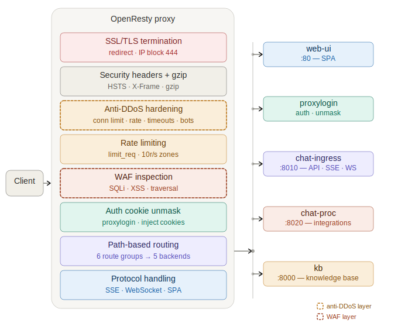
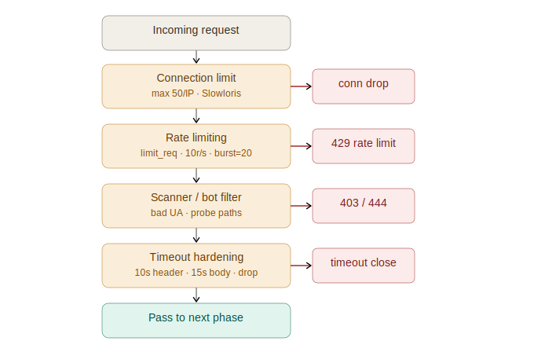
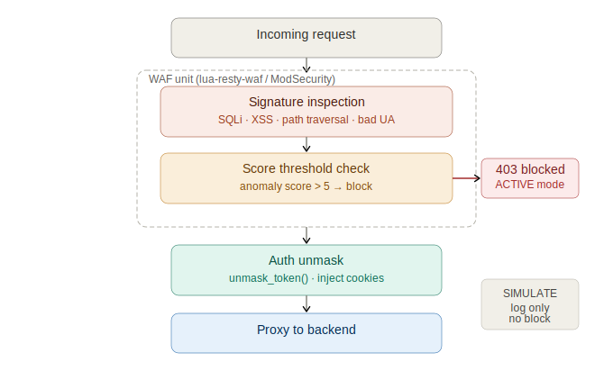

# Proxy Ops Guide (OpenResty)

This guide is for **ops/deployment** owners who configure, harden, and operate the OpenResty reverse proxy.

---

## Responsibilities overview

The proxy runs every inbound request through six phases in sequence:

1. **SSL/TLS termination** — unwraps HTTPS, redirects HTTP → HTTPS, blocks direct IP access (returns `444`).
2. **Security headers + compression** — injects `HSTS`, `X-Frame-Options`, `X-XSS-Protection`, `Referrer-Policy`; gzip on all text responses.
3. **Rate limiting** — `limit_req` zones for chat, KB, upload, and auth routes.
4. **Auth cookie unmask** — for every protected route, internally calls `proxylogin /v1/unmask`, extracts real session cookies, and injects them into the upstream request.
5. **Path-based routing** — dispatches to five upstream backends by URL prefix.
6. **Protocol handling** — SSE (buffering off, 600 s timeout), WebSocket upgrade, SPA 404 fallback.



Phase ordering matters: rate limiting (phase 3) runs *before* auth unmask (phase 4), so a DDoS burst is dropped before burning a `proxylogin` round-trip.

---

## Upstream backends

| Backend | Address | Routes |
|---|---|---|
| `web-ui` | `web-ui:80` | `/chatbot/*`, SPA fallback |
| `proxylogin` | `proxylogin` | `/auth/*`, internal `/auth/unmask` |
| `chat-ingress` | `chat-ingress:8010` | `/sse/`, `/api/chat/`, `/api/cb/*`, `/admin/*`, `/monitoring`, `/cb/socket.io/` |
| `chat-proc` | `chat-proc:8020` | `/api/integrations/`, `/admin/integrations/` |
| `kb` | `kb:8000` | `/api/kb/` |

---

## Auth unmask flow

For every protected location, OpenResty calls an internal subrequest before forwarding to the backend:

```
client request
  → access_by_lua: unmask_token()
      → internal GET /auth/unmask  →  proxylogin /v1/unmask
      ← Set-Cookie: <real session cookies>
  → inject cookies into upstream request
  → proxy_pass to backend
```

The `unmask_token()` Lua function is defined once in `init_by_lua_block` and called in every protected `access_by_lua_block`. Unprotected routes (e.g. `/api/kb/`) skip this step — align them if KB routes should also be auth-gated.

---

## Rate limiting

Rate limiting zones are defined in the `http {}` block. All zones use `$binary_remote_addr` as the key (per client IP).

| Zone | Rate | Used on |
|---|---|---|
| `chat_api_zone` | 10 r/s | `/api/chat/`, `/sse/` |
| `kb_api_zone` | 10 r/s | `/api/kb/` |
| `monitoring_api` | 10 r/s | `/monitoring` |
| `upload` | 2 r/s | upload endpoints |

The `limit_req` directives are present in the config but currently commented out on most locations. Enable them per location:

```nginx
limit_req zone=chat_api_zone burst=20 nodelay;
limit_req_status 429;
```

---

## Anti-DDoS hardening


The following changes extend the base rate limiting into a layered anti-DDoS posture.

### Connection limits (Slowloris + resource exhaustion)

Add a connection zone to the `http {}` block:

```nginx
limit_conn_zone $binary_remote_addr zone=per_ip_conn:10m;
```

Apply globally in the server block:

```nginx
server {
    limit_conn per_ip_conn 50;   # max concurrent connections per IP
}
```

For SSE, which holds connections open, apply a tighter per-location cap:

```nginx
location /sse/ {
    limit_req  zone=chat_api_zone burst=5 nodelay;
    limit_conn per_ip_conn 10;
    # ... rest unchanged
}
```

### Timeout hardening (slow clients)

Add to the `http {}` block to close connections that stall at the header or body stage:

```nginx
client_header_timeout  10s;
client_body_timeout    15s;
send_timeout           30s;
keepalive_timeout      65s;
keepalive_requests     1000;
large_client_header_buffers 4 8k;   # reject oversized headers
```

### Auth zone (credential stuffing protection)

`/auth/` endpoints are high-value DDoS targets. Add a dedicated zone:

```nginx
# In http {}
limit_req_zone $binary_remote_addr zone=auth_zone:10m rate=5r/s;

# In location ^~ /auth/
limit_req zone=auth_zone burst=10 nodelay;
limit_req_status 429;
```

### Scanner / bad bot blocking

Add to the server block to reject common scanner agents and sensitive path probes:

```nginx
# Block known scanner user agents
if ($http_user_agent ~* (sqlmap|nikto|nmap|masscan|zgrab|dirbuster|libwww-perl)) {
    return 403;
}

# Block probes for sensitive file extensions
location ~* \.(env|git|htaccess|DS_Store|bak|sql|zip|tar|gz)$ {
    return 404;
}

# Block requests without a Host header (common in L7 flood tools)
if ($host = "") {
    return 444;
}
```

### Generic error responses

Avoid leaking backend error detail:

```nginx
proxy_intercept_errors on;
error_page 400 401 403 404 405 429 500 502 503 504 = @generic_error;

location @generic_error {
    default_type application/json;
    return 400 '{"error":"bad_request"}';
}
```

---

## WAF protection


OpenResty runs LuaJIT natively, so WAF inspection runs inline in the request pipeline — no recompile, no nginx Plus license required.

> **Note on nginx Plus JWT module:** the paid `ngx_http_auth_jwt_module` is irrelevant to this stack. OpenResty uses `lua-resty-jwt` (free, OPM) for any JWT validation, and our auth flow delegates token validation to `proxylogin` rather than the proxy layer.

### Option A — lua-resty-waf (recommended for this stack)

Pure-Lua WAF. No recompile. Runs in the existing OpenResty container.

**Install:**

```bash
opm get p0pr0ck5/lua-resty-waf
```

**Add shared dict to `http {}`:**

```nginx
lua_shared_dict waf_storage 64m;
```

**Initialise in `init_by_lua_block`** (alongside the existing `unmask_token` function):

```nginx
init_by_lua_block {
    local waf = require "resty.waf"
    waf.init()

    function unmask_token()
        -- existing implementation unchanged
    end
}
```

**Apply per protected location** (WAF runs before auth unmask):

```nginx
location /api/chat/ {
    access_by_lua_block {
        local waf = require "resty.waf"
        local _waf = waf:new()

        _waf:set_option("mode", "ACTIVE")        -- use "SIMULATE" first (log-only)
        _waf:set_option("score_threshold", 5)    -- OWASP anomaly scoring
        _waf:set_option("allowed_content_types", {
            "application/json",
            "multipart/form-data",
            "application/x-www-form-urlencoded",
        })
        _waf:set_option("storage_zone", "waf_storage")
        _waf:exec()

        unmask_token()   -- auth runs only if WAF passes
    }

    proxy_pass http://chat_api/api/chat/;
    -- ... rest unchanged
}
```

### Option B — ModSecurity v3 + OWASP CRS (compliance-grade)

Use the pre-built image instead of the base OpenResty image:

```dockerfile
FROM owasp/modsecurity-crs:nginx-alpine
COPY nginx.conf /etc/nginx/nginx.conf
```

Enable in `http {}`:

```nginx
modsecurity on;
modsecurity_rules_file /etc/modsecurity.d/include.conf;
```

ModSecurity runs automatically before `access_by_lua`, so no location-level changes are needed. Key tuning in `crs-setup.conf`:

```
SecRuleEngine On
SecRequestBodyLimit 20971520     # match client_max_body_size 20M
SecDefaultAction "phase:1,log,auditlog,deny,status:403"

# Our API sends JSON — skip form-body inspection
SecRule REQUEST_HEADERS:Content-Type "application/json" \
    "id:9000,phase:1,pass,nolog,ctl:requestBodyProcessor=JSON"
```

### Rollout order

1. **Enable `limit_req`** on all locations (already defined, just uncomment). Zero risk.
2. **Add `limit_conn`** and timeout hardening.
3. **Deploy lua-resty-waf in `SIMULATE` mode** — review logs for false positives for one week before activating.
4. **Switch WAF to `ACTIVE` mode** once the allowlist is tuned.
5. **ModSecurity** only if PCI-DSS or SOC 2 compliance scope requires CRS depth.

---

## References (code)

- Proxy config: `deployment/proxy/nginx.conf`
- Auth unmask service: `proxylogin` (internal service, `/v1/unmask`)
- Chat ingress: `services/kdcube-ai-app/kdcube_ai_app/apps/chat/ingress/`
- Chat processor: `services/kdcube-ai-app/kdcube_ai_app/apps/chat/processor.py`