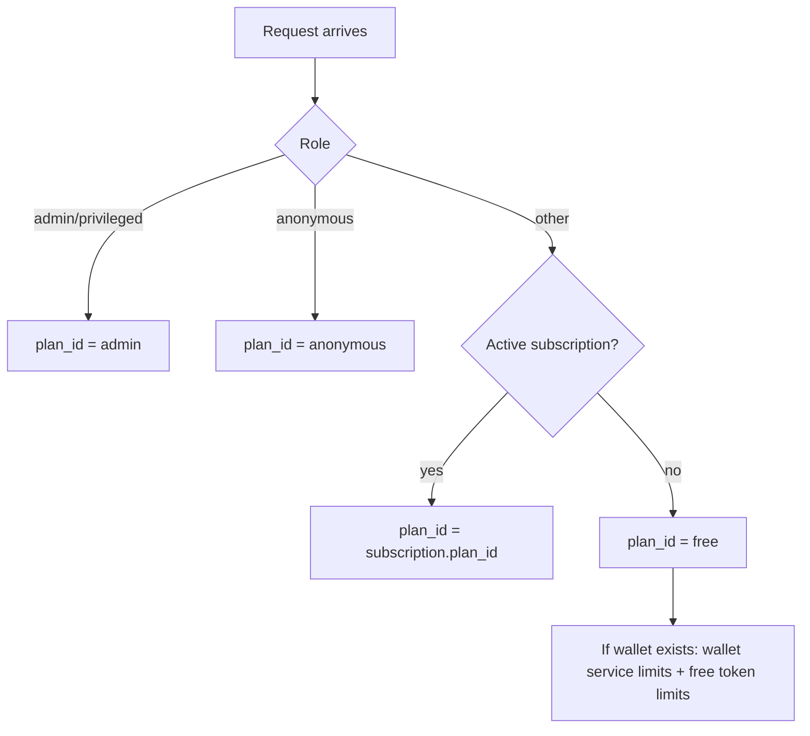
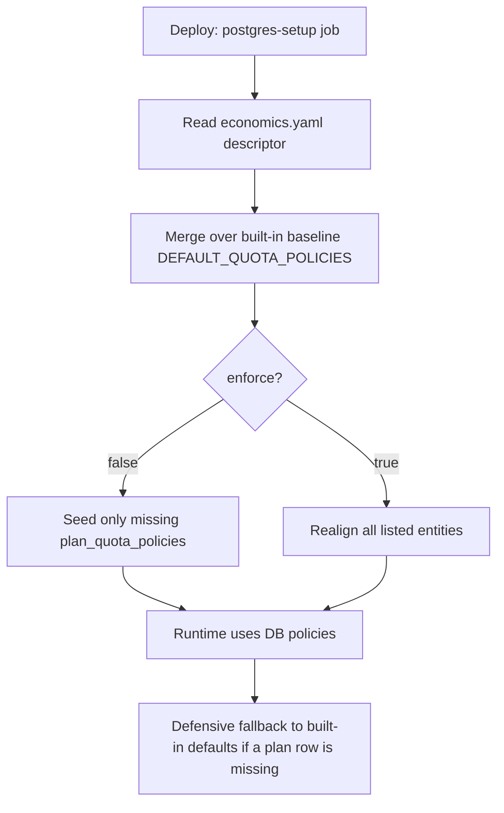
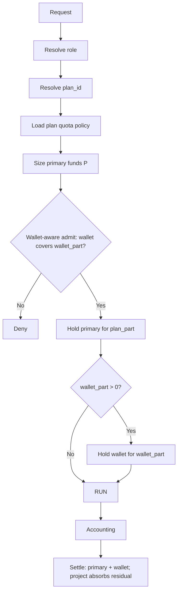

# Economics Model (Control Plane)

This document is the authoritative description of the current economics model and how it is enforced at runtime.
It replaces the older usage notes and reflects the production bundle flow and control‑plane schema.

Runtime entrypoint:
- [entrypoint_with_economic.py](../../src/kdcube-ai-app/kdcube_ai_app/apps/chat/sdk/solutions/chatbot/entrypoint_with_economic.py)

## Scope

The economics subsystem covers:

- Rate limits and quotas (requests, tokens, concurrency)
- Funding sources (subscription budget, project budget, wallet credits)
- Reservation semantics for correctness under concurrency
- Accounting and cost attribution
- Subscription period management and rollovers

## Core Concepts

### Terminology

- **Plan** = quota policy identity (limits for requests/tokens/concurrency).
- **Plan override** = temporary per‑user override of plan limits.
- **Funding source** = the plan's primary budget: `subscription` (active subscription) or `project` (everyone else). The **wallet** is never a primary source — it covers the over‑quota/over‑funds remainder.

Unified funding split (important):
- Every request is **one split**: `plan_part = min(R, Q, P)` is funded by the primary source (bounded by the remaining quota `Q` **and** the primary funds `P`); `wallet_part = R − plan_part` is covered by the wallet.
- When the plan quota/funds run out, `plan_part` simply shrinks (to 0) and the wallet covers the rest within the same pass.
- A **subscription plan** uses **subscription funding** as its primary; a registered/free user uses **project funding**.

Tracing a single request:
- Chat requests use the chat **turn_id** as `request_id`.
- Non-chat top-level flows use their own stable accountable request id.
- Use `GET /economics/request-lineage?request_id=<request_id>` to fetch ledger + reservation rows.

### Role (economics role)

Role is the funding access decision, not the quota policy. The gateway can override the authenticated role based on economics state.

Role resolution is applied in the gateway and stored in the session:

- If `privileged` or `admin`, role stays privileged.
- Else if active subscription or wallet credits exist, role becomes `paid`.
- Else role remains `registered`.

This overrides the session `user_type` (the role used by the runtime entrypoint). The session key uses the resolved role:

- `...:paid:<user_id>`
- `...:registered:<user_id>`

Admin UI role resolution:
- The admin endpoints auto‑resolve role from the user’s cached session in Redis.
- If the user has never logged in (no session), role falls back to subscription/wallet detection (paid) or `registered`.

### Plan (quota policy identity)

Plan (`plan_id`) is the quota policy identity used by the rate limiter. It is distinct from role.

Plan is resolved in the entrypoint at request time. The active plan determines base quotas via `plan_quota_policies`.

### Funding Sources

Funding sources are money or tokens used to pay for requests:

- Subscription period budget (per‑month balance, USD)
- Wallet or lifetime credits (token bucket, USD‑quoted)
- Project budget (tenant/project balance, USD)

Role determines which funding sources are allowed, while plan determines rate limits.

## Plan Resolution (Runtime)

Plan resolution is performed in the entrypoint using the following priority:

1. `privileged/admin` → `admin`
2. `anonymous` → `anonymous`
3. active subscription → `subscription.plan_id`
4. default → `free`

Special handling for wallet users with no subscription:

- The **plan stays `free`**, but **service limits** (requests/concurrency) are taken from the `wallet` plan.
- **Token limits** still come from the `free` plan.
- When the free token quota is insufficient and a wallet exists, the over‑quota remainder is covered by the **wallet** via the unified split.

**What "active subscription" means** (`subscription_is_active`): a **chargeable**
(`monthly_price_cents > 0`), `status='active'`, **not `past_due`** row within its
billing period. Zero‑cost baseline rows (`free`/`admin`) are intentionally *not*
"active" here — only a chargeable plan flips a user onto a subscription plan.

**Baseline rows.** Every authenticated user gets a `user_subscriptions` row on
first session (zero‑cost `free`, or `admin` for privileged) via a
post‑session‑create hook. Resolution always reads the current row; anonymous users
get no row.

**No downgrade sweep.** The plan is computed **live** from the row on every
request. A `canceled` or `past_due` subscription therefore resolves to `free`
everywhere (widget, enforcement, profile) immediately — the row stays for history,
but no background job is needed to "downgrade" users.

Visual summary:

## Where Limits Come From (Plan Quotas)

Plan quotas are stored in the control plane table `plan_quota_policies`.

**Scope and window semantics (important):**
- Quotas are enforced **per tenant/project** (global across bundles).
- Hourly token limits use a **rolling 60‑minute** window (minute buckets).
- Daily limits use the **current 24‑hour quota period since the last daily reset**.
- Monthly limits use the **current 30‑day quota period since the last monthly reset**.
- Total requests do not reset.
Reservation amount configuration:
- Per‑bundle fixed reservation can be set via bundle props: `economics.reservation_amount_dollars`.
- If set, the reservation estimate uses that fixed USD amount (regardless of funding source).
  Configure via Integrations bundle props API (see `eco-admin-README.md`).

Accounting and spend are still recorded **per bundle** for reporting, but quota enforcement is global per tenant/project.
Global quota counters use bundle id `__project__` in Redis keys (subject_id already encodes tenant/project).

Seeding flow:

- Plan quotas are **seeded at deploy time** from the economics descriptor
  (`deployment/economics.yaml`) by the postgres-setup job (see
  [economics-descriptor-README.md](./economics-descriptor-README.md)).
- The mandatory plans (`anonymous`/`free`/`wallet`/`admin`) have a built-in baseline
  (`DEFAULT_QUOTA_POLICIES`, the single source shared with the seeder); descriptor entries
  override that baseline per field. `enforce: false` (default) seeds only missing entries and
  preserves operator/admin edits; `enforce: true` realigns every listed entity to the descriptor.
- After seeding, adjust limits in the admin UI (or re-run the seeder with an updated descriptor).
- Runtime prefers the DB policy, with a defensive fallback to the built-in defaults if a plan
  row is missing. The legacy bundle-runtime seeder `ensure_policies_initialized()` is a
  deprecated no-op shim.

## Funding Sources and Reservation Semantics

Every request runs as **one split**. The primary funding source covers the plan
part; the wallet covers the over‑quota/over‑funds remainder.

### Reserve (pre‑run)

- `plan_part = min(R, Q, P)` — R is the estimated turn cost (tokens), Q the remaining plan
  token quota, P the primary funds (subscription period budget for subscribers, project
  budget for everyone else). The primary money hold is placed for `plan_part`.
- `wallet_part = R − plan_part` — reserved against the wallet (lifetime tokens) when a wallet
  is present and allowed for the surface.
- Admit succeeds if, and only if the wallet can cover `wallet_part` and any indivisible
  requests/concurrency gate is satisfied (a wallet lifts that gate). Otherwise the request is
  denied and **no money hold is left behind**.
- Privileged bypass → no pre‑check; project budget is charged after run.
- Wallet‑backed free users keep `plan_id=free` but use **wallet service limits**
  (requests/concurrency) while **token limits** remain from `free`.

### Settle (post‑run)

Settlement reads current available capacity net of active reservations, then adds back this
request's own still‑live reservation per source. It charges the **maximum possible share to
plan quota + primary funds first**; the wallet pays only the over‑quota remainder, and
wallet‑paid tokens do **not** consume plan quota.

If the **actual** spend exceeds what the primary funds and the wallet covered, the residual
cascades: for a **subscription** primary it first draws the subscription budget's remaining
headroom (`shortfall:subscription_overage`), and only then the **project budget absorbs** the
rest as a last resort; for a **project** primary the project absorbs directly
(`shortfall:wallet_plan` / `shortfall:free_plan`). If plan quota remains, a project‑absorbed
fallback also consumes quota. **Subscriptions and wallets never go negative.**

Shortfall notes are tagged `shortfall:wallet_subscription`, `shortfall:wallet_plan`,
`shortfall:subscription_overage`, or `shortfall:free_plan` for reporting.

### Reservation types

- Rate limiter token reservation (Redis) for the plan part
- Subscription reservations in `user_subscription_period_reservations`
- Project budget reservations in `tenant_project_budget_reservations`
- Wallet reservations in `user_token_reservations`

Reservations are committed or released after execution and accounting. Expired reservations are reaped automatically.

## Decision Tree (Role → Plan → Funding)

## Subscription Periods and Rollovers

Subscription budgets are per billing period.

- Each period is keyed by `(tenant, project, user_id, period_key)`.
- Top‑up is once per period by default (idempotent).
- Periods are closed at the end date.
- Unused balance is rolled into project budget.

Maintenance entry points:

- `SubscriptionManager.sweep_due_subscription_rollovers(...)`
- Control plane endpoint: `POST /subscriptions/rollover/sweep`
- Reservation reaper: `POST /subscriptions/reservations/reap-all`

## Data Model (Tables)

Authoritative schema:

- [deploy-kdcube-control-plane.sql](../../src/kdcube-ai-app/kdcube_ai_app/ops/deployment/sql/control_plane/deploy-kdcube-control-plane.sql)

Key tables:

- `plan_quota_policies` — base policy per plan_id
- `user_plan_overrides` — temporary plan overrides
- `user_lifetime_credits` — wallet credits
- `user_token_reservations` — wallet reservations
- `tenant_project_budget` — project money balance
- `tenant_project_budget_reservations` — project budget holds
- `tenant_project_budget_ledger` — project budget ledger
- `tenant_project_budget_absorption` — view for shortfall absorption reporting
- `tenant_project_budget_absorption_detail` — view for shortfall reporting by user/bundle
- `subscription_plans` — plan catalog and Stripe price mapping (free/admin baseline + chargeable plans)
- `user_subscriptions` — per‑user plan row (one per tenant/project/user). Carries a baseline `free`/`admin` row for every authenticated user (see Plan Resolution), `provider` (`internal`|`stripe`), Stripe linkage ids, and `rl_month_anchor_at` — a durable mirror of the Redis monthly‑quota window anchor so the window survives a Redis flush.
- `user_subscription_period_budget` — per period subscription balance
- `user_subscription_period_reservations` — subscription holds
- `user_subscription_period_ledger` — subscription ledger
- `external_economics_events` — idempotency and audit for external/internal economic operations

## Accounting and Costing

Accounting events are emitted by service wrappers (LLM calls, web search, etc.).
Events are aggregated per turn and converted to USD using the reference model.

Reference model conversion is used for:

- Wallet credit conversion (USD → tokens)
- Token balance display (tokens → USD)
- Estimation of request cost for reservations
