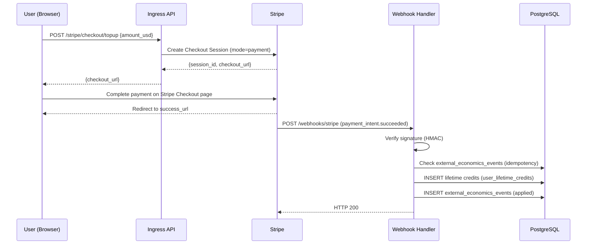
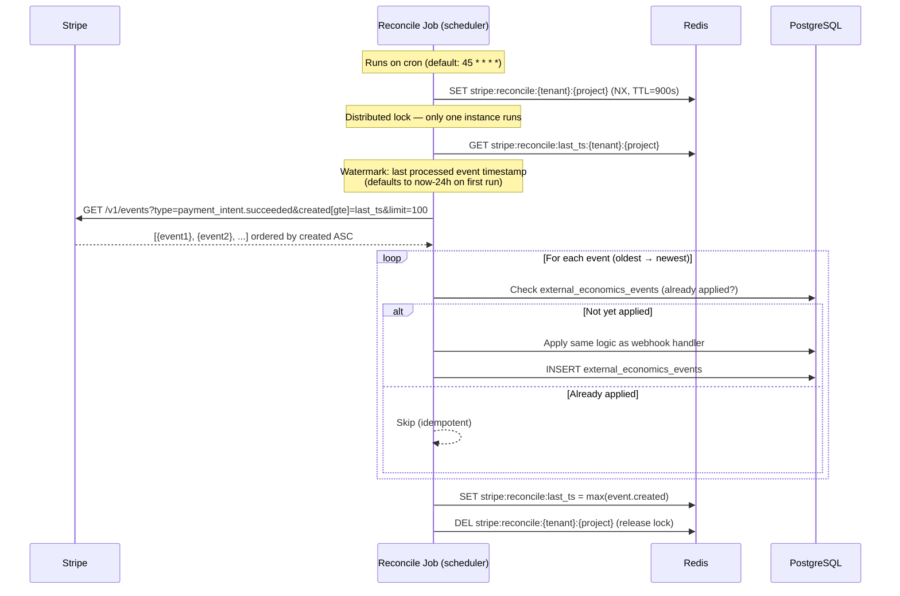
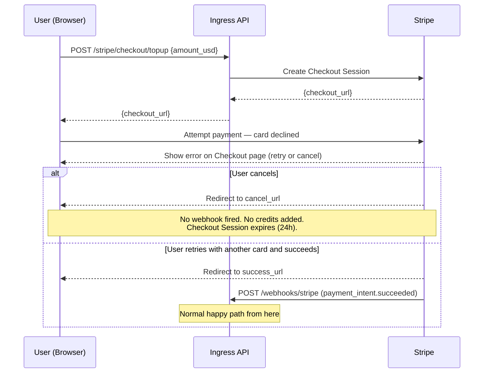
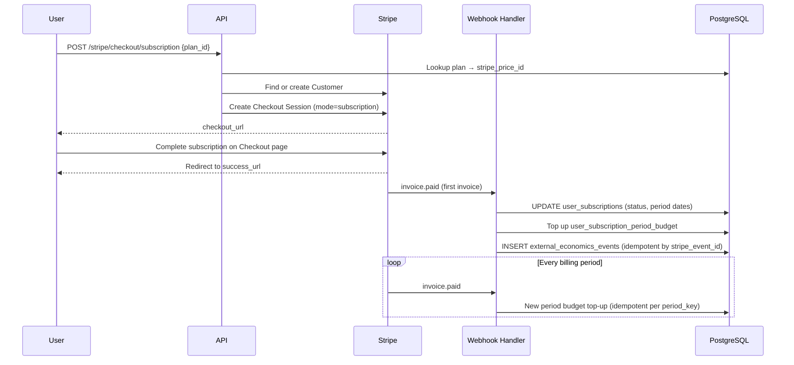
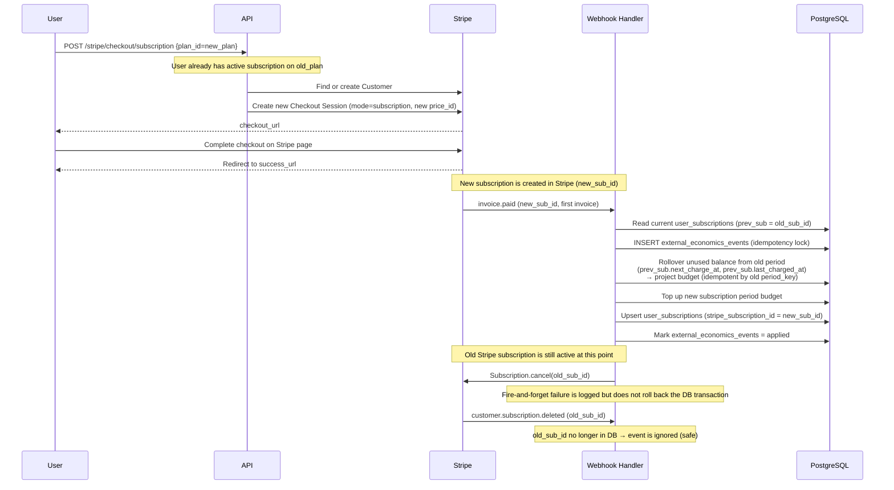
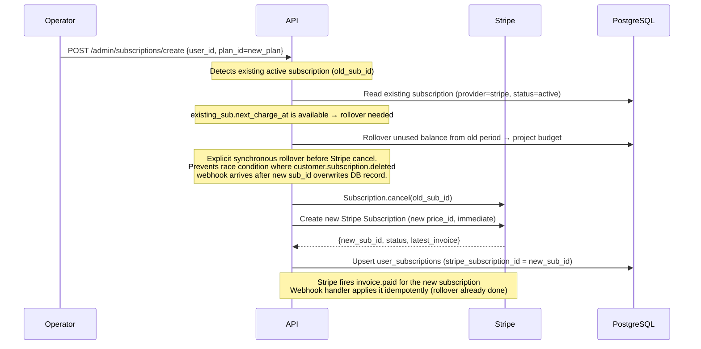
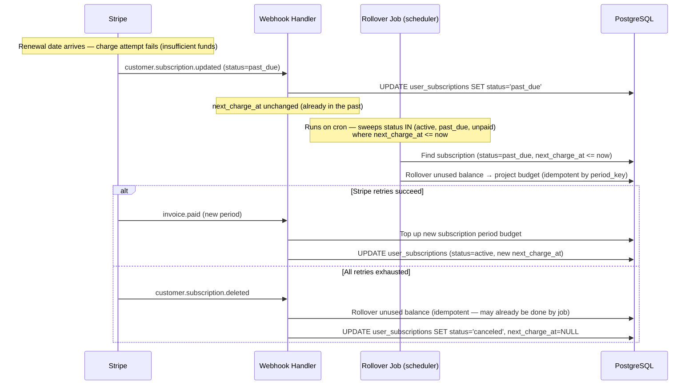

# Stripe Integration Guide

This document covers the full Stripe integration in the economics subsystem:
routes, payment flows, webhook handling, the reconcile job, local development setup,
and configuration prerequisites.

## What Stripe Is Used For

1. **Wallet top-ups** — one-time lifetime credit purchases via Checkout.
2. **Subscriptions** — monthly recurring charges via Checkout.
3. **Wallet refunds** — refund a lifetime credit purchase back to the user's card.
4. **Subscription cancellation** — cancel at period end via Stripe.

Project budget is **never** topped up directly from Stripe events.
It is increased only by admin actions or by the subscription rollover job.

---

## API Routes

All Stripe and economics routes live in `apps/chat/api/economics/` and are mounted
under `/api/economics` prefix.

| Method | Path | Module | Purpose |
|--------|------|--------|---------|
| `POST` | `/api/economics/stripe/checkout/topup` | `checkout.py` | Create Checkout Session for wallet top-up (user) |
| `POST` | `/api/economics/stripe/checkout/subscription` | `checkout.py` | Create Checkout Session for subscription (user) |
| `POST` | `/api/economics/webhooks/stripe` | `webhooks.py` | Stripe webhook receiver |
| `POST` | `/api/economics/admin/subscriptions/create` | `admin.py` | Admin: create subscription (stripe or internal) |
| `POST` | `/api/economics/admin/wallet/refund` | `admin.py` | Admin: refund wallet credits via Stripe |
| `POST` | `/api/economics/admin/subscriptions/cancel` | `admin.py` | Admin: cancel subscription at period end |
| `POST` | `/api/economics/admin/stripe/reconcile` | `admin.py` | Admin: trigger reconcile manually |
| `GET`  | `/api/economics/admin/stripe/pending` | `admin.py` | Admin: list pending Stripe events |
| `GET`  | `/api/economics/me/budget-breakdown` | `me.py` | User: budget breakdown |
| `GET`  | `/api/economics/me/subscription` | `me.py` | User: current subscription |
| `GET`  | `/api/economics/me/subscription-plans` | `me.py` | User: available subscription plans |
| `POST` | `/api/economics/me/subscription/cancel` | `me.py` | User: self-service cancel |
| `POST` | `/api/economics/me/stripe/customer-portal` | `me.py` | User: Stripe Customer Portal session |

Background scheduler tasks (started at app lifespan via `stripe_router.py`):
- `stripe_reconcile_scheduler_loop()` — periodic Stripe event reconciliation
- `subscription_rollover_scheduler_loop()` — periodic subscription period rollover

---

## Prerequisites

### 1) Secrets (sidecar)

Stripe secrets are **not** set in `.env` files. They are injected via the secrets
sidecar using dot‑path keys. Set them in `secrets.yaml`:

```yaml
services:
  stripe:
    secret_key: sk_live_...        # or sk_test_... for dev
    webhook_secret: whsec_...      # from Stripe Dashboard → Webhooks
```

In code these are read as:
```python
get_secret("services.stripe.secret_key")
get_secret("services.stripe.webhook_secret")
```

See: [code-config-secrets-README.md](../service/configuration/code-config-secrets-README.md)

### 2) Config variables (`.env`)

Scheduler jobs are configured via standard env vars (read through `get_settings()`):

```env
# Stripe reconcile job
STRIPE_RECONCILE_ENABLED=true
STRIPE_RECONCILE_CRON="45 * * * *"
STRIPE_RECONCILE_LOCK_TTL_SECONDS=900

# Subscription rollover job
SUBSCRIPTION_ROLLOVER_ENABLED=true
SUBSCRIPTION_ROLLOVER_CRON="15 * * * *"
SUBSCRIPTION_ROLLOVER_LOCK_TTL_SECONDS=900
SUBSCRIPTION_ROLLOVER_SWEEP_LIMIT=500
```

### 3) Gateway config — bypass throttling for webhook

The Stripe webhook endpoint **must** be excluded from rate limiting and backpressure.
Add this to `GATEWAY_CONFIG_JSON`:

```json
{
  "bypass_throttling_patterns": {
    "ingress": [
      "^.*/webhooks/stripe$"
    ]
  }
}
```

Without this, high-volume webhook bursts (e.g. during reconcile catch-up) may be
throttled and Stripe will retry — causing duplicate processing attempts.

### 4) Stripe Dashboard setup

- Create products and prices in Stripe Dashboard.
- Store `stripe_price_id` in `subscription_plans` table for each plan.
- Configure webhook endpoint: `POST https://<your-domain>/api/economics/webhooks/stripe`
- Select events to listen for (see "Webhook Events Handled" below).
- Copy signing secret → `services.stripe.webhook_secret` in `secrets.yaml`.

---

## Stripe Objects — Required Metadata

All Stripe objects created by KDCube carry metadata for routing webhook events:

| Key | Example | Purpose |
|-----|---------|---------|
| `tenant` | `my-tenant` | Tenant scope |
| `project` | `my-project` | Project scope |
| `user_id` | `user-123` | Identifies the user |
| `plan_id` | `pro-monthly` | Internal plan identifier |
| `kdcube_invoice_kind` | `subscription` / `wallet_topup` | Distinguishes event type |

If metadata is missing, the webhook handler attempts fallback lookups via the DB.

---

## Webhook Events Handled

| Event | Action |
|-------|--------|
| `payment_intent.succeeded` | Top up wallet (lifetime credits) for `wallet_topup` kind |
| `invoice.paid` | Top up subscription period budget; update subscription record |
| `refund.created` / `refund.updated` | Finalize wallet refund pending event |
| `customer.subscription.updated` | Sync subscription status, `next_charge_at` |
| `customer.subscription.deleted` | Mark subscription as canceled |

All events are idempotent via `external_economics_events` table (keyed by Stripe event ID).

**Event ordering matters in the reconcile job.** Events are replayed in ascending
`created` timestamp order to guarantee causal consistency:
- `invoice.paid` must be applied before `customer.subscription.updated` for the same period.
- `payment_intent.succeeded` must be applied before any `refund.*` for the same PI.

The reconcile job fetches Stripe events sorted ascending by `created` and processes
them in that order.

---

## Payment Flows

### Wallet Top-up — Happy Path



### Wallet Top-up — No Webhook (Service Down or 429)

If the service was not running when Stripe fired the webhook, or Stripe received
a non-2xx response and exhausted retries, the payment is complete on Stripe's side
but credits are not yet applied.

The **Stripe reconcile job** detects this and recovers:



### Wallet Top-up — Insufficient Funds (Stripe Decline)



---

## Subscription Flow (Stripe)



---

## Subscription Plan Change Flow

When a user already has an **active** subscription and switches to a different plan,
the system must:

1. Roll over unused balance from the old subscription period to the project budget.
2. Cancel the old Stripe subscription.
3. Create a new Stripe subscription for the new plan.

Two paths trigger this: **Checkout** (user self-service) and **Admin API**.

### Plan Change via Checkout (user-initiated)



> **Important:** The rollover and DB upsert happen inside a single transaction.
> The old Stripe subscription is cancelled **after** the transaction commits.
> If the cancel call fails, an operator can cancel it manually — double billing
> does not occur because `invoice.paid` is idempotent by `period_key`.

### Plan Change via Admin API



> **Race condition prevented:** Without the explicit rollover before cancel,
> `customer.subscription.deleted` for `old_sub_id` could arrive after
> `user_subscriptions` already holds `new_sub_id`. At that point
> `get_subscription_by_stripe_id(old_sub_id)` returns `None` and the rollover
> would be silently skipped.


---

## Subscription Renewal Failure Flow

When Stripe attempts to charge for a subscription renewal but the card is declined:

1. Stripe fires `customer.subscription.updated` with `status=past_due`.
2. The webhook handler syncs the status to `past_due` in `user_subscriptions`;
   `next_charge_at` stays unchanged.
3. Stripe retries the charge according to its retry schedule (typically 3–4 attempts
   over several days). If all retries fail, Stripe fires `customer.subscription.deleted`.
4. On `customer.subscription.deleted` — the webhook handler **rolls over** the unused
   balance to project budget and marks the subscription as `canceled`.

**Rollover during the `past_due` window:**
While the subscription is `past_due`, `next_charge_at` is already in the past.
The subscription rollover job picks up `past_due` (and `unpaid`) subscriptions
alongside `active` ones — so unused balance is moved to project budget even if
Stripe's retries are still in progress.



> **Note:** If Stripe retries succeed and `invoice.paid` arrives, the rollover for
> the old period is already idempotent — running it again is a no-op.
> The new period budget is topped up normally as in the happy path.


---

## Subscription Cancel Flow

Admin calls `POST /admin/subscriptions/cancel` or user calls `POST /me/subscription/cancel`.

1. Request `cancel_at_period_end` in Stripe.
2. Record pending internal event in `external_economics_events` (`source='internal'`, `kind='subscription_cancel'`).
3. Current period balance remains usable until period end.
4. Stripe sends `customer.subscription.updated` → webhook marks as `cancel_at_period_end`.
5. On period end, Stripe sends `customer.subscription.deleted` → webhook marks as `canceled`.

If webhooks are missed, the reconcile job resolves pending subscription cancels by
querying Stripe's subscription status directly.

---

## Wallet Refund Flow

Admin calls `POST /admin/wallet/refund` with a `payment_intent_id`.

1. Immediate local debit of lifetime credits from `user_lifetime_credits`.
2. Record pending event (`source='internal'`, `kind='wallet_refund'`).
3. Issue Stripe refund via API.
4. Stripe fires `refund.updated` → webhook marks the event as `applied`.
5. If refund fails, credits are restored and the event is marked `failed`.

Admin email notifications are sent at each step.

---

## Reconcile Job — Details

**Purpose:** recover from missed webhooks. Events that Stripe fired but the service
could not process (downtime, restarts, 429 from rate limiting) are replayed.

**Location:** `apps/chat/api/economics/routines.py` → `run_stripe_reconcile_sweep_once()`

**Trigger:** cron scheduler (`stripe_reconcile_scheduler_loop`) or manually via
`POST /admin/stripe/reconcile`.

**Redis keys used:**

| Key | Type | Purpose |
|-----|------|---------|
| `stripe:reconcile:{tenant}:{project}` | String (NX+TTL) | Distributed lock — prevents concurrent runs across instances |
| `stripe:reconcile:last_ts:{tenant}:{project}` | String (int) | Watermark: Unix timestamp of the last processed Stripe event |

**Watermark behaviour:**
- On first run: defaults to `now - 24h`.
- After each successful sweep: updated to `max(event.created)` from the batch.
- Next sweep fetches only events newer than the watermark.

**Event ordering:** events are fetched from Stripe sorted ascending by `created`
(oldest first) and processed in that order. This is critical for correct causal
replay — e.g. `invoice.paid` before `customer.subscription.updated` for the same period.

**Idempotency:** all event processing checks `external_economics_events` by Stripe
event ID before applying. Safe to run multiple times.


---

## Subscription Rollover Job — Details

**Purpose:** close subscription periods that have ended; move unused balance to
project budget.

**Location:** `apps/chat/api/economics/routines.py` → `run_subscription_rollover_sweep_once()`

**Redis keys used:**

| Key | Type | Purpose |
|-----|------|---------|
| `subscription:rollover:{tenant}:{project}` | String (NX+TTL) | Distributed lock |

**Behaviour:**
- Queries `user_subscriptions` for periods with `next_charge_at < now`.
- Sweeps up to `SUBSCRIPTION_ROLLOVER_SWEEP_LIMIT` records per invocation.
- Loops until the batch is smaller than the limit (drains the backlog).
- Moves remaining `user_subscription_period_budget` balance → `tenant_project_budget`.
- Records idempotent event in `external_economics_events` per period key.

---

## Local Development — Stripe CLI

For local development you need the Stripe CLI to forward webhook events to your
local service. Without it, no payment events reach the webhook handler.

### Install

https://docs.stripe.com/stripe-cli/install

### Login

```bash
stripe login
```

### Forward webhooks to local ingress

When running the service locally (e.g. on port 8010):

```bash
stripe listen --forward-to http://localhost:8010/api/economics/webhooks/stripe
```

The CLI prints a **webhook signing secret** (`whsec_...`). Use this as
`services.stripe.webhook_secret` in your local `secrets.yaml` (or as
`STRIPE_WEBHOOK_SECRET` env var for quick dev runs).


### Docker Compose

If running via docker-compose, forward to the ingress container's internal port:

```bash
stripe listen --forward-to http://localhost:8010/api/economics/webhooks/stripe
```

Or if the ingress is exposed on a different port, adjust accordingly.

> **Note:** The `bypass_throttling_patterns` for `/webhooks/stripe` in `GATEWAY_CONFIG_JSON`
> is required even locally — otherwise the gateway may throttle the Stripe CLI's
> burst of test events.

---

## Email Notifications

Admin alerts are sent for:

- Wallet refund requested / completed / failed
- Subscription cancel requested / completed / failed
- Reconcile results summary

Configuration (via `get_settings()`):

| Variable | Default | Purpose |
|----------|---------|---------|
| `EMAIL_ENABLED` | `true` | Enable/disable email sending |
| `EMAIL_HOST` | _(unset)_ | SMTP host |
| `EMAIL_PORT` | `587` | SMTP port |
| `EMAIL_USER` | _(unset)_ | SMTP username |
| `EMAIL_PASSWORD` | _(unset)_ | SMTP password |
| `EMAIL_FROM` | _(EMAIL_USER)_ | From address |
| `EMAIL_TO` | `ops@example.com` | Default recipient |
| `EMAIL_USE_TLS` | `true` | Enable TLS |

---

## Operational Checklist

- [ ] Create Stripe products/prices; store `stripe_price_id` in `subscription_plans`
- [ ] Set `services.stripe.secret_key` and `services.stripe.webhook_secret` in `secrets.yaml`
- [ ] Configure webhook URL in Stripe Dashboard: `POST /api/economics/webhooks/stripe`
- [ ] Add `bypass_throttling_patterns` for `^.*/webhooks/stripe$` to `GATEWAY_CONFIG_JSON`
- [ ] Enable and configure `STRIPE_RECONCILE_ENABLED` / `STRIPE_RECONCILE_CRON`
- [ ] Verify email settings for admin notifications
- [ ] For local dev: install Stripe CLI and run `stripe listen --forward-to ...`

---

## Notes for Integrators

- Subscriptions are mapped to per-period budgets; unused balance **does not** carry over automatically — the rollover job moves it to project budget.
- Project budget is never topped up by Stripe events directly.
- Idempotency is enforced via `external_economics_events` keyed by Stripe event ID.
- The reconcile job uses an ascending-timestamp watermark — it will not reprocess already-seen events unless the watermark Redis key is deleted.
- If `services.stripe.webhook_secret` is not set, webhooks are accepted without signature verification (not recommended for production).
