# Distributed Execution — Fargate

This document covers the end-to-end design for running isolated Python code execution
on a dedicated ECS Fargate **exec task** instead of a local Docker sidecar.

---

## Why Fargate exec

Docker-on-node (`isolation="docker"`) is the local production mode — the proc container
spawns a Docker child container on the same host, sharing workdir/outdir via bind mounts.
This is not available in Fargate because:

- Fargate containers cannot access Docker daemon
- Fargate does not support `--cap-add=SYS_ADMIN` (needed for `unshare(CLONE_NEWNET)`)
- There is no host filesystem to bind-mount

The Fargate exec task is the replacement:

| Feature | Docker mode | Fargate exec mode |
|---|---|---|
| Workdir sharing | Host bind mount | S3 snapshot + restore |
| Bundle access | Host bind mount | S3 snapshot + restore |
| Network isolation | `unshare(CLONE_NEWNET)` | Task-level VPC SG |
| Task lifetime | Container exits → docker rm | Task STOPPED |
| Caller waits | `asyncio.wait_for(proc.communicate())` | Poll `describe_tasks` until STOPPED |
| Parallel executions | One Docker child per call | One ECS run-task per call |

Important:

- distributed exec changes how code is transported and run
- it does **not** change the logical result contract seen by the agent
- the final agent-visible result is still assembled by `exec_tools.py` after the runtime backend returns

Important distinction:
- `BUNDLE_STORAGE_DIR` is runtime plumbing for the isolated child
- it is not the agent-facing browsing contract
- if a bundle wants generated code to browse bundle readonly data safely, the agent-facing contract should be a bundle-defined exec-only namespace resolver tool
- that tool can return:
  - `physical_path: str | null`
  - `access: 'r' | 'rw'`
  - `browseable: bool`
- generated code should use the resolver input logical_ref itself as the logical base for any later `react.read(...)` follow-up refs
- that `physical_path` is valid only inside the current isolated execution runtime
- generated code may use it only with the permission stated by `access`
- it is not a stable artifact path and must not be fed back into normal react tool calls

---

## Architecture diagrams

### 1. Deployment time (task definition)

```
┌──────────────────────────────────────────────────────────────────────────────┐
│ AWS ECS — FARGATE EXEC TASK DEFINITION (kdcube-{env}-exec)                  │
│                                                                              │
│  Image: {registry}/kdcube-exec:{tag}                                         │
│  Entrypoint: py_code_exec_entry.py   (PID 1)                                 │
│                                                                              │
│  IAM task role = proc_task_role  (same permissions as chat-proc)             │
│    • S3: GetObject / PutObject / DeleteObject on kdcube-storage bucket       │
│    • Secrets Manager: GetSecretValue on kdcube/services/*                    │
│    • SSM: GetParameter on kdcube/config/*                                    │
│    • CloudWatch Logs: CreateLogStream / PutLogEvents                         │
│    • ECS: NOT required (no self-management)                                  │
│                                                                              │
│  Volumes:                                                                    │
│    EFS ap_git_ssh_id → /run/secrets  (ro, IAM-auth transit-enc)             │
│    (workdir, outdir, bundles are ephemeral local FS restored from S3)       │
│                                                                              │
│  Environment (injected at run-task time via containerOverrides):            │
│    RUNTIME_GLOBALS_JSON   — full runtime_globals from caller                 │
│    RUNTIME_TOOL_MODULES   — JSON list of tool module names                   │
│    EXECUTION_ID           — unique per call                                  │
│    WORKDIR=/workspace/work                                                   │
│    OUTPUT_DIR=/workspace/out                                                 │
│    LOG_DIR=/workspace/out/logs                                               │
│    LOG_FILE_PREFIX=executor                                                  │
│    EXECUTION_SANDBOX=fargate                                                 │
│    EXEC_BUNDLE_ROOT=/workspace/bundles/{bundle_dir}                          │
│    REDIS_URL, POSTGRES_HOST, POSTGRES_PASSWORD, ...  (same as proc)         │
│                                                                              │
│  Networking: private subnets, ecs-tasks SG (same SG as proc)                │
│  No load balancer — ephemeral run-task only, never a service                │
│                                                                              │
│  CloudWatch log group: /kdcube/exec                                          │
└──────────────────────────────────────────────────────────────────────────────┘
```

### 2. Runtime — caller side (inside `chat-proc`)

```
chat-proc (FargateRuntime.run)
│
│  1. build_exec_snapshot_workspace()
│     → lightweight copy of workdir/outdir (strips large blobs)
│
│  2. snapshot_exec_input()
│     → zip work/ + zip out/ (exclude logs/, executed_programs/,
│       sources_pool.json, tool_calls_index.json)
│     → upload to S3:
│         cb/tenants/{t}/projects/{p}/executions/
│           {user_type}/{user}/{conv}/{turn}/{codegen_run_id}/{exec_id}/
│             input/work.zip
│             input/out.zip
│     → returns ExecSnapshotInfo with URIs
│
│  3. ensure_bundle_snapshot()  (if bundle tools requested)
│     → zip bundle dir from EFS
│     → upload to S3:
│         cb/tenants/{t}/projects/{p}/ai-bundle-snapshots/{bundle_id}.{version}.zip
│     → returns BundleSnapshotInfo with bundle_uri
│
│  4. ensure_bundle_storage_snapshot()  (if bundle readonly storage requested)
│     → zip the per-bundle storage dir from proc
│     → upload to S3:
│         cb/tenants/{t}/projects/{p}/ai-bundle-storage-snapshots/{bundle_id}.{sha}.zip
│     → returns snapshot URI
│     → this is transport of readonly bundle data, not direct agent-facing path semantics
│
│  5. Rewrite TOOL_MODULE_FILES host paths → container paths
│       /efs/bundles/{bundle_dir}/tool.py  →  /workspace/bundles/{bundle_dir}/tool.py
│     Also sets:  BUNDLE_ID, BUNDLE_DIR, BUNDLE_ROOT_CONTAINER in runtime_globals
│     SKILLS_DESCRIPTOR.custom_skills_root rewritten if within bundle_root
│
│  6. Embed into runtime_globals:
│       EXEC_SNAPSHOT.input_work_uri  = s3://bucket/.../input/work.zip
│       EXEC_SNAPSHOT.input_out_uri   = s3://bucket/.../input/out.zip
│       EXEC_SNAPSHOT.output_work_uri = s3://bucket/.../output/work.zip
│       EXEC_SNAPSHOT.output_out_uri  = s3://bucket/.../output/out.zip
│       BUNDLE_SNAPSHOT_URI           = s3://bucket/.../bundle.zip
│       BUNDLE_STORAGE_SNAPSHOT_URI   = s3://bucket/.../bundle-storage.zip
│       BUNDLE_DIR / BUNDLE_ID / BUNDLE_ROOT_CONTAINER
│
│  7. ecs.run_task(  [asyncio.to_thread]
│       cluster=FARGATE_CLUSTER,
│       taskDefinition=FARGATE_TASK_DEFINITION,
│       launchType=FARGATE,
│       networkConfiguration={subnets, securityGroups},
│       overrides={containerOverrides: [{name, environment: [...]}]}
│     )
│     → returns task_arn
│
│  8. Poll ecs.describe_tasks every 2s until lastStatus == "STOPPED"  [asyncio.to_thread]
│     or deadline exceeded → ecs.stop_task(reason="exec-timeout")
│
│  9. restore_zip_to_dir(output_work_uri, local_workdir)
│     restore_zip_to_dir(output_out_uri, tmp_dir)
│     → selective merge into local outdir:
│         logs/    → append
│         turn_*/  → overwrite
│
│  9. Return ExternalExecResult(ok, returncode, error, seconds=elapsed)
```

### Agent-visible result after distributed execution

The Fargate runtime returns backend status fields to `exec_tools.py`, not a final user-facing message.

The caller then still performs:

- contracted-file validation
- artifact checks
- infra log merge
- `user.log` tail extraction
- final `report_text` assembly

So from the agent point of view, distributed exec still resolves to the same kind of envelope as local/Docker execution:

- `ok`
- `artifacts`
- `error`
- `report_text`
- `user_out_tail`
- `runtime_err_tail`

This is why runtime-specific failures such as:

- ECS startup failure
- Fargate timeout
- secret/bundle/snapshot restore failure

still appear to the agent through the same final `report_text` / `error` path documented in [exec-logging-error-propagation-README.md](/Users/elenaviter/src/kdcube/kdcube-ai-app/app/ai-app/docs/exec/exec-logging-error-propagation-README.md).

### 3. Runtime — exec task side (`py_code_exec_entry.py`)

```
ECS FARGATE EXEC TASK
│
│  ENV: RUNTIME_GLOBALS_JSON, RUNTIME_TOOL_MODULES, WORKDIR, OUTPUT_DIR, ...
│
│  startup
│  ├── _load_runtime_globals()           parse RUNTIME_GLOBALS_JSON
│  ├── _restore_snapshot_if_present()
│  │     EXEC_SNAPSHOT.input_work_uri → restore_zip_to_dir → /workspace/work
│  │     EXEC_SNAPSHOT.input_out_uri  → restore_zip_to_dir → /workspace/out
│  │
│  ├── _restore_bundle_if_present()
│  │     BUNDLE_SNAPSHOT_URI present?
│  │       yes → restore_zip_to_dir → /workspace/bundles/{bundle_id}
│  │             rewrite_runtime_globals_for_bundle()
│  │               (rewrites TOOL_MODULE_FILES paths to /workspace/bundles/…)
│  │       no  → _maybe_restore_bundle_from_git()  (BUNDLE_REPO fallback)
│  │
│  ├── _restore_bundle_storage_if_present()
│  │     BUNDLE_STORAGE_SNAPSHOT_URI present?
│  │       yes → restore_zip_to_dir → BUNDLE_STORAGE_DIR
│  │       no  → continue
│  │
│  │     Bundle-local exec-only tools may then resolve logical namespace refs
│  │     (for example ks:docs or ks:src) to exec-visible physical paths under
│  │     that restored readonly subtree.
│  │
│  │     Those returned physical paths are runtime-local only:
│  │       • valid only inside this exec task
│  │       • subject to the returned access mode ('r' or 'rw')
│  │       • not valid as normal react logical or physical artifact paths
│  │
│  │     If code wants the agent to follow up later with react.read(...), it must
│  │     emit logical refs derived from the resolver input logical_ref, for example:
│  │       logical_ref = "ks:src"
│  │       discovered relative file = "foo/bar.py"
│  │       emitted follow-up ref = "ks:src/foo/bar.py"
│  │
│  ├── baseline_work = build_manifest(workdir)   (for delta upload)
│  ├── baseline_out  = build_manifest(outdir)
│  │
│  ├── _bootstrap_supervisor_runtime()
│  │     load dynamic tool modules from TOOL_MODULE_FILES
│  │     bootstrap_bind_all(bootstrap_env=False)
│  │       → ModelService, KB client, Redis comm, tool bindings
│  │     start PrivilegedSupervisor on /tmp/supervisor.sock
│  │
│  ├── run_py_code()     ← main.py in executor subprocess
│  │     executor subprocess:
│  │       setuid(1001)                  (unprivileged)
│  │       unshare(CLONE_NEWNET)         (network-isolated — best-effort)
│  │       executes main.py
│  │       tool calls → Unix socket → supervisor
│  │     supervisor:
│  │       handles tool calls (web_search, write_file, llm, kb, ...)
│  │       writes tool call audit files to /workspace/out/
│  │
│  ├── _upload_snapshot_outputs()
│  │     delta zip(workdir, baseline=baseline_work) → output_work_uri (S3)
│  │     delta zip(outdir,  baseline=baseline_out)  → output_out_uri  (S3)
│  │
│  └── exit(returncode)   ← ECS task STOPPED, caller sees exit code
```

---

## S3 storage layout

```
cb/tenants/{tenant}/projects/{project}/
  executions/
    {user_type}/{user_or_fp}/{conversation_id}/{turn_id}/{codegen_run_id}/{exec_id}/
      input/
        work.zip      ← workdir snapshot before execution
        out.zip       ← outdir snapshot before execution
      output/
        work.zip      ← workdir delta after execution
        out.zip       ← outdir delta after execution (turn_*, logs/)

  ai-bundle-snapshots/
    {bundle_id}.{version}.zip
    {bundle_id}.{version}.sha256
      ← bundle code snapshot

  ai-bundle-storage-snapshots/
    {bundle_id}.{sha}.zip
    {bundle_id}.{sha}.sha256
      ← per-bundle readonly data snapshot (content-addressed)

---

## Namespace resolution on top of readonly bundle data

Distributed exec transports three physical classes of data into the child runtime:
- `WORKDIR=/workspace/work`
- `OUTPUT_DIR=/workspace/out`
- readonly per-bundle data restored to `BUNDLE_STORAGE_DIR`

But the agent should not be taught to browse `BUNDLE_STORAGE_DIR` directly.

Preferred model:
1. a bundle exposes an exec-only resolver tool for its own namespace semantics
2. generated code calls that tool inside exec
3. the tool returns:
   - `physical_path: str | null`
   - `access: 'r' | 'rw'`
   - `browseable: bool`
4. generated code reads that path if appropriate
5. if code wants later `react.read(...)` follow-up, it emits logical refs derived from the original resolver input logical_ref
   - example: `logical_ref="ks:src"` plus discovered relative file `foo/bar.py` becomes `ks:src/foo/bar.py`
6. generated code propagates useful results back through:
   - files under `OUTPUT_DIR`
   - and/or short `user.log` output

This keeps:
- transport concerns in the distributed exec runtime
- namespace semantics in the bundle
- agent-visible outcome in the normal exec reporting path
```

**Snapshot filter** — excluded from both input and output zips:
- `logs/` directory
- `executed_programs/` directory
- `sources_pool.json`, `sources_used.json`
- `tool_calls_index.json`
- `__pycache__/`, `.git/`

---

## How the caller (proc) selects docker vs fargate

Routing is no longer env-only.

Current selection order for exec tools:
1. explicit runtime config passed in `EXEC_RUNTIME_CONFIG`
   - normally sourced from bundle props `execution.runtime`
2. proc env fallback `EXEC_RUNTIME_MODE`
3. explicit isolation override on the call site
4. otherwise the default local/docker path

Important:
- `EXECUTION_SANDBOX` is a marker passed into the chosen child runtime after routing.
  It is **not** the primary selector on the proc side.
- For bundle-scoped distributed exec, the canonical config path is
  `execution.runtime`.

Example bundle props:

```yaml
config:
  execution:
    runtime:
      mode: fargate
      enabled: true
      region: eu-west-1
      cluster: arn:aws:ecs:eu-west-1:100258542545:cluster/kdcube-staging-cluster
      task_definition: kdcube-staging-exec
      container_name: exec
      subnets:
        - subnet-xxxx
        - subnet-yyyy
      security_groups:
        - sg-xxxx
      assign_public_ip: DISABLED
```

Example with multiple bundle-scoped profiles:

```yaml
config:
  execution:
    runtime:
      default_profile: fargate
      profiles:
        docker:
          mode: docker
          image: py-code-exec:latest
          network_mode: host
          cpus: "1.5"
          memory: "2g"
          extra_args:
            - --pids-limit
            - "256"
        fargate:
          mode: fargate
          enabled: true
          cluster: arn:aws:ecs:eu-west-1:100258542545:cluster/kdcube-staging-cluster
          task_definition: kdcube-staging-exec
          container_name: exec
          subnets:
            - subnet-xxxx
            - subnet-yyyy
          security_groups:
            - sg-xxxx
          assign_public_ip: DISABLED
```

In that model:
- `default_profile` provides the default resolved runtime for generic exec calls
- bundle code may explicitly choose another supported profile when needed
- missing keys inside the selected profile still fall back to proc env vars
- Docker profiles can override local Docker execution settings such as `image`,
  `network_mode`, `cpus`, `memory`, and raw `extra_args`

Global proc env vars are still useful as defaults/fallbacks:

| Variable | Value | Source |
|---|---|---|
| `EXEC_RUNTIME_MODE` | `fargate` | proc env fallback |
| `FARGATE_EXEC_ENABLED` | `1` | task def environment |
| `FARGATE_CLUSTER` | `{name_prefix}-cluster` | task def environment |
| `FARGATE_TASK_DEFINITION` | `{name_prefix}-exec` | task def environment |
| `FARGATE_CONTAINER_NAME` | `exec` | task def environment |
| `FARGATE_SUBNETS` | `subnet-xxx,subnet-yyy` | task def environment |
| `FARGATE_SECURITY_GROUPS` | `sg-xxx` | task def environment |
| `FARGATE_ASSIGN_PUBLIC_IP` | `DISABLED` | task def environment |
| `FARGATE_PLATFORM_VERSION` | _(optional)_ | task def environment |

Bundle props win over these env vars for keys they provide; missing keys still
fall back to env.

---

## Implementation status

All gaps are closed. Summary of changes made:

| # | Description | Where |
|---|---|---|
| 1 | ECS exec task definition (Terraform) | `task_exec.tf` — task def, IAM policy, log group |
| 2 | `TOOL_MODULE_FILES` path rewrite | `fargate.py` — rewrites host paths → `/workspace/bundles/{bundle_dir}/…` before serialising |
| 3 | `BUNDLE_ID` / `BUNDLE_ROOT_CONTAINER` in runtime_globals | `fargate.py` — set alongside `BUNDLE_DIR` |
| 4 | boto3 calls blocking event loop | `fargate.py` — `run_task`, `describe_tasks`, `stop_task` wrapped in `asyncio.to_thread()` |
| 5 | Execution timing not tracked | `fargate.py` — `seconds=elapsed` set in all `ExternalExecResult` returns |
| 6 | Proc task `FARGATE_*` env vars not wired in Terraform | `task_chat_proc.tf` — auto-injected from Terraform locals (cluster id, task def name, subnets, SG) |
| 7 | Regex double-escape bug in error pattern | `fargate.py` — `r"\\b\\w+Error\\b"` → `r"\b\w+Error\b"` |
| 8 | `_MERGE_LOCKS` dict grows unbounded | `fargate.py` — replaced `Dict` with `weakref.WeakValueDictionary`; GC handles cleanup |

---

## Env vars the exec task receives (full list)

Injected via `containerOverrides.environment` at `run_task` call time:

| Variable | Set by | Purpose |
|---|---|---|
| `WORKDIR` | fargate.py | `/workspace/work` — where main.py runs |
| `OUTPUT_DIR` | fargate.py | `/workspace/out` — artifacts, result.json |
| `LOG_DIR` | fargate.py | `/workspace/out/logs` |
| `LOG_FILE_PREFIX` | fargate.py | `executor` |
| `EXECUTION_ID` | fargate.py | Unique run ID |
| `EXECUTION_SANDBOX` | fargate.py | `fargate` |
| `RUNTIME_GLOBALS_JSON` | fargate.py | All runtime context (see below) |
| `RUNTIME_TOOL_MODULES` | fargate.py | JSON list of tool module names |
| `EXEC_BUNDLE_ROOT` | fargate.py | `/workspace/bundles/{bundle_dir}` |
| `REDIS_URL` | fargate.py (from base_env) | Redis connection string |
| `REDIS_CLIENT_NAME` | fargate.py | `exec` |
| `AWS_REGION` etc. | task def + fargate.py | AWS SDK config |
| All proc secrets | task definition | Postgres, API keys, SM, etc. |

**`RUNTIME_GLOBALS_JSON` keys** (passed from proc caller):

| Key | Purpose |
|---|---|
| `PORTABLE_SPEC_JSON` | ModelService config, KB config |
| `TOOL_ALIAS_MAP` | `{alias: dynamic_module_name}` |
| `TOOL_MODULE_FILES` | `{alias: /path/to/tool.py}` — rewritten for container |
| `BUNDLE_SPEC` | `{id, module, version, ...}` |
| `BUNDLE_ID` | bundle id string |
| `BUNDLE_DIR` | directory name under `/workspace/bundles/` |
| `BUNDLE_ROOT_CONTAINER` | full container path `/workspace/bundles/{bundle_dir}` |
| `BUNDLE_SNAPSHOT_URI` | S3 URI of bundle.zip |
| `EXEC_SNAPSHOT` | `{input_work_uri, input_out_uri, output_work_uri, output_out_uri}` |
| `EXEC_CONTEXT` | `{tenant, project, user_id, conversation_id, turn_id, ...}` |
| `EXEC_RUNTIME_CONFIG` | bundle/runtime exec routing config (for example `mode=fargate`) |
| `CONTRACT` | output contract spec |
| `COMM_SPEC` | communicator/SSE spec |
| `SANDBOX_FS` | filesystem sandbox settings |
| `SKILLS_DESCRIPTOR` | custom skills config |

---

## What the proc IAM role needs (additions)

```hcl
# Allow proc to spawn exec tasks
statement {
  sid    = "FargateExecRun"
  effect = "Allow"
  actions = [
    "ecs:RunTask",
    "ecs:DescribeTasks",
    "ecs:StopTask",
  ]
  resources = [
    "arn:aws:ecs:${region}:${account}:task-definition/${name_prefix}-exec:*",
    "arn:aws:ecs:${region}:${account}:task/${cluster_name}/*",
  ]
}

# PassRole so ECS can apply execution + task roles to the spawned task
statement {
  sid     = "FargateExecPassRole"
  effect  = "Allow"
  actions = ["iam:PassRole"]
  resources = [
    var.execution_role_arn,
    var.proc_task_role_arn,   # exec task role = reuse proc task role
  ]
}
```

---

## Bundle availability strategy (chosen)

**Option 2 — S3 snapshot** is the active strategy:

1. Caller (`FargateRuntime.run`) calls `ensure_bundle_snapshot()` which zips the bundle
   from EFS and uploads to `ai-bundle-storage/{bundle_id}/bundle.zip` (written once,
   reused on repeat calls if `bundle_version` matches).
2. `BUNDLE_SNAPSHOT_URI` is embedded in `runtime_globals`.
3. Exec task (`py_code_exec_entry.py`) calls `_restore_bundle_if_present()` which
   downloads and unzips to `/workspace/bundles/{bundle_id}`.
4. `rewrite_runtime_globals_for_bundle()` rewrites `TOOL_MODULE_FILES` paths.

**Git fallback** (`_maybe_restore_bundle_from_git`): used if `BUNDLE_SNAPSHOT_URI` is
absent but `BUNDLE_REPO` is set in `runtime_globals`. Good for dev/test.

---

## io_tools.tool_call in Fargate exec

The exec task runs the same supervisor/executor architecture as Docker mode.
`io_tools.tool_call()` inside the executor subprocess detects `AGENT_IO_CONTEXT=limited`
(set by `run_py_code`) and proxies all calls over the Unix socket to the supervisor.
The supervisor has full access to Redis, Postgres, ModelService, S3, etc.

This means **all modular bundle tools keep working unchanged** — the tool call path
is identical to Docker mode. The only difference is that the supervisor connects to
Redis/Postgres via VPC DNS (Cloud Map private DNS) instead of `localhost`.

Key implication: **`REDIS_URL` must resolve to the ElastiCache endpoint inside the
VPC, not `localhost`**. The exec task is in the same VPC/SG as proc, so Cloud Map
DNS (`redis.kdcube.local`) or the direct ElastiCache endpoint both work.

---

## Testing the integration

### Recommended smoke test bundle

The bundle `apps/chat/sdk/examples/bundles/with-isoruntime@2026-02-16-14-00`
includes scenario:

- `13. Fargate happy path`

It is a **built-in example bundle** — it registers automatically when proc runs with
`BUNDLES_INCLUDE_EXAMPLES=1`. No `repo`, `ref`, or `module` entry is needed in
`bundles.yaml`; only a `config` block is required to supply the runtime profiles.

Use it together with bundle props `execution.runtime` to validate the Fargate
path without needing a ReAct tool-selection flow.

#### Getting infrastructure values for your deployment

All values come from Terraform state. Run these from the Terraform directory of your
ECS deployment (the directory that contains `main.tf` and your `.tfvars` files —
wherever you ran `terraform apply`):

```bash
# Cluster name (compose into ARN below)
terraform output -raw ecs_cluster_name
# → kdcube-staging-cluster

# AWS account ID
aws sts get-caller-identity --query Account --output text
# → <account_id>

# Task definition family name (no revision — ECS resolves latest active)
# Always: <name_prefix>-exec

# Private subnet IDs
terraform output -json private_subnet_ids
# → ["subnet-<id1>","subnet-<id2>"]

# ECS tasks security group (shared by all ECS tasks including exec)
terraform output -raw ecs_tasks_sg_id
# → sg-<group_id>
```

| Field | How to get | Staging example |
|---|---|---|
| `region` | `aws.deployment.yaml → aws_region` | `eu-west-1` |
| `cluster` | `arn:aws:ecs:<region>:<account_id>:cluster/<ecs_cluster_name>` | `arn:aws:ecs:eu-west-1:<account_id>:cluster/kdcube-staging-cluster` |
| `task_definition` | `<name_prefix>-exec` (no revision) | `kdcube-staging-exec` |
| `container_name` | always `exec` | `exec` |
| `subnets` | `terraform output -json private_subnet_ids` | `subnet-<id1>`, `subnet-<id2>` |
| `security_groups` | `terraform output -raw ecs_tasks_sg_id` | `sg-<group_id>` |
| `assign_public_ip` | always `DISABLED` (private subnets + NAT) | `DISABLED` |

Proc-level env var fallback (still supported — bundle props override, missing keys fall back to these):

```bash
# On a machine with AWS credentials + ECS access
export FARGATE_EXEC_ENABLED=1
export EXEC_RUNTIME_MODE=fargate
export FARGATE_CLUSTER=kdcube-staging-cluster
export FARGATE_TASK_DEFINITION=kdcube-staging-exec
export FARGATE_CONTAINER_NAME=exec
export FARGATE_SUBNETS=subnet-<id1>,subnet-<id2>
export FARGATE_SECURITY_GROUPS=sg-<group_id>
export FARGATE_ASSIGN_PUBLIC_IP=DISABLED

# then trigger a bundle execution through the proc API
```

#### bundles.yaml entry for the smoke test bundle (staging)

`default_profile` is set to `docker_builtin` — all regular scenarios run Docker.
Scenario 13 (Fargate happy path) directly selects the configured profile named
`fargate_default` from `config.execution.runtime.profiles`.

```yaml
    - id: "with-isoruntime@2026-02-16-14-00"
      config:
        execution:
          runtime:
            default_profile: docker_builtin
            profiles:
              docker_builtin:
                mode: docker
                image: py-code-exec:latest
                network_mode: host
              fargate_default:
                mode: fargate
                enabled: true
                region: eu-west-1
                cluster: arn:aws:ecs:eu-west-1:<account_id>:cluster/kdcube-staging-cluster
                task_definition: kdcube-staging-exec
                container_name: exec
                subnets:
                  - subnet-<id1>   # terraform output -json private_subnet_ids
                  - subnet-<id2>
                security_groups:
                  - sg-<group_id>  # terraform output -raw ecs_tasks_sg_id
                assign_public_ip: DISABLED
```

```python
# with-isoruntime workflow.py
if str(scenario_id) == "13":
    return self.resolve_exec_runtime(profile="fargate_default")
return self.resolve_exec_runtime()
```

Selection semantics:
- `self.resolve_exec_runtime(profile=...)` resolves only from the canonical
  bundle runtime config already loaded into `RuntimeCtx.exec_runtime`
- it does not consult proc env vars directly
- env vars remain backend-level fallback for missing keys after profile selection

```mermaid
flowchart LR
    A["bundles.yaml\nexecution.runtime.profiles.fargate_default"] --> B["bundle props loaded"]
    B --> C["RuntimeCtx.exec_runtime"]
    C --> D["workflow\nresolve_exec_runtime(profile='fargate_default')"]
    D --> E["resolved runtime config"]
    E --> F["exec_tools.run_exec_tool(...)"]
    F --> G["_InProcessRuntime.execute_py_code(...)"]
    G --> H["Fargate runtime backend"]
    H --> I["ECS exec task"]
```



### Failure diagnostics

The Fargate runtime now logs:
- the effective ECS config it resolved
- `ecs.run_task(...)` exceptions
- `run_task` response failures
- `describe_tasks(...)` failures

This is the first place to check when a proc log shows
`[fargate] launching task ...` but no exec task appears in ECS.

To validate the snapshot round-trip without launching ECS:
```python
from kdcube_ai_app.apps.chat.sdk.runtime.external.distributed_snapshot import (
    snapshot_exec_input, restore_zip_to_dir
)
# snapshot input, restore to a temp dir, check contents
```
