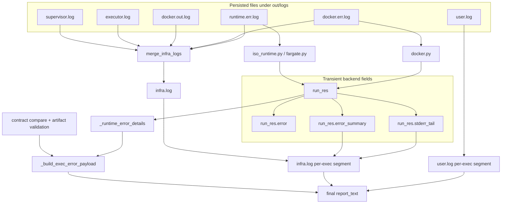

## Executor log streams

The isolated executor produces **two distinct log streams**:

1) **Program/user logs**  
   - `out/logs/user.log`  
   - Contains **all program output in order** (stdout, stderr, and optionally `logging.*`
     calls from user code).
   - Each execution is prefixed with:
     ```
     ===== EXECUTION <exec_id> START <timestamp> =====
     ```

2) **Runtime/infra logs**  
   - `out/logs/infra.log` (merged)
   - Component logs (source inputs) that get merged:
     - `runtime.err.log`, `docker.err.log`, `py_code_exec_entry.log`, etc.
   - `infra.log` is appended per execution by merging the component logs that
     contain the matching execution banner.

### Separation rules
- In the executor header, `sys.stdout` is redirected to `user.log`.
- `sys.stderr` is redirected to `user.log`.
- The **root logger** is rewired to stream to stdout (→ `user.log`) when
  `EXEC_USER_LOG_MODE=include_logging`, so `logging.getLogger(__name__)`
  in user code lands in `user.log`.
- Runtime loggers are bound to their own handlers, so infra noise does not
  leak into `user.log`.

### Config: program log mode
`EXEC_USER_LOG_MODE` controls whether logging is included in the program log:
- `include_logging` (default):  
  - `user.log` includes stdout, stderr, and `logging.*` output.
- `print_only`:  
  - `user.log` includes stdout/stderr only.  
  - `logging.*` stays in infra logs (via file handler), so it does not
    pollute `user.log`.

### Dedicated program logger
The executor also configures `logging.getLogger("user")` with a handler that
always writes to `user.log` (even when `EXEC_USER_LOG_MODE=print_only`), so
user code can explicitly log to the program stream when desired.

Example:
```python
import logging

log = logging.getLogger("user")
log.info("starting batch job")
log.warning("row 42 skipped")
```

### Traceback line remap
By default, traceback lines referencing `main.py` are **remapped** to point to the
original user snippet (before the injected runtime header). To disable this:
- `EXEC_TRACEBACK_REMAP=0`

This only affects loader `main.py` line numbers; other files are untouched.

Current source split:
- `main.py` is the platform loader executed by the isolated runtime
- `user_code.py` is the verbatim user program body
- tracebacks that already reference `user_code.py` are not remapped and should already match the real user code line numbers

### Error detection
- **Program errors** are detected by scanning `user.log` for:
  - `ERROR` lines (case-insensitive)
  - `Traceback`
- **Infra errors** are detected by scanning `infra.log` for:
  - `ERROR` lines (case-insensitive)
  - `Traceback`

Diagnostics always slice logs by the most recent execution banner:
`===== EXECUTION <exec_id> START ... =====`, so per-run log extraction is reliable.

### Execution banner
The banner is written only when `EXECUTION_SANDBOX` is set (e.g., `docker` or
`fargate`) and `EXECUTION_ID` is present.

### Infra log merging
Infra logs are merged into `infra.log` by the library helper:
```
from kdcube_ai_app.apps.chat.sdk.runtime.diagnose import merge_infra_logs

merge_infra_logs(log_dir=Path(outdir) / "logs", exec_id=exec_id)
```
This is invoked by `exec_tools.run_exec_tool(...)` and `collect_exec_diagnostics(...)`.
Ordering between different component logs is preserved *within* each component,
but interleaving across components is best-effort (by per-exec segment).

### Log filtering helper
Library utility (for programmatic use):
```
from kdcube_ai_app.apps.chat.sdk.runtime.diagnose import filter_log_by_level

errors_only = filter_log_by_level(text, level="ERROR", min_level=True)
```

---

## Agent-facing execution error report

The final text returned to the agent by `exec_tools.execute_code_python(...)` is not read from one file.

It is assembled in memory in `exec_tools.py` from two input families:

1. persisted log files under `out/logs`
2. transient backend fields in `run_res`

For debugging the executed source itself, the platform also preserves program sources under:
- `out/executed_programs/<execution_id>/main.py` — platform loader as actually executed
- `out/executed_programs/<execution_id>/user_code.py` — verbatim user program body

The important distinction is:

- `user.log`, `docker.err.log`, `runtime.err.log`, `supervisor.log`, `executor.log`, and `infra.log` are persisted files on disk
- `run_res.error`, `run_res.error_summary`, and `run_res.stderr_tail` are not files; they are transient fields returned by the selected runtime backend

The report is built to answer three questions:

1. did the runtime itself fail?
2. did the user program fail?
3. did the execution fail to produce the contracted outputs?

### Public tool contract vs internal helpers

Current public React-facing tool:

- `exec_tools.execute_code_python(...)`
- requires a non-empty file contract
- validates produced files against that contract

Current internal helpers:

- `run_exec_tool_no_contract(...)`
- `run_exec_tool_side_effects(...)`

Those internal helpers allow execution without a declared file contract and can still return logs/summary. They are useful for platform internals and future tool-surface evolution, but they are not the current public agent API.

So today the public tool is:

- file-contract-required
- but still log-aware

This means the agent already receives a hybrid result:

- artifacts/files
- plus runtime/program diagnostics

### Exact current platform-generated log files under `out/logs`

These are the current log files produced by the platform execution stack itself.

| File | Producer | Runtime mode(s) | Used for |
| --- | --- | --- | --- |
| `user.log` | executor header in `iso_runtime.py`; redirected stdout/stderr in the untrusted executor | local, Docker, Fargate | program output shown later as `Program log (tail)` |
| `runtime.err.log` | `_run_subprocess(...)` in `iso_runtime.py`; inner executor process inside the exec container | local, Docker, Fargate | raw stderr source for local/Fargate runtime summaries; also merged into `infra.log` |
| `docker.out.log` | outer Docker launcher in `runtime/external/docker.py` | Docker only | merged into `infra.log` |
| `docker.err.log` | outer Docker launcher in `runtime/external/docker.py` | Docker only | raw stderr source for Docker runtime summaries; also merged into `infra.log` |
| `supervisor.log` | `py_code_exec_entry.py` via `logging_config.configure_logging()` with `LOG_FILE_PREFIX=supervisor` | Docker, Fargate | merged into `infra.log` |
| `executor.log` | untrusted executor subprocess via `LOG_FILE_PREFIX=executor` | local, Docker, Fargate | merged into `infra.log` |
| `infra.log` | `merge_infra_logs(...)` in `diagnose.py` | created during diagnostics/report assembly | synthesized merged infra view later shown as `Infra errors (infra.log)` |

Important notes:

- `runtime.out.log` is mentioned in a few older comments/docs, but the current code path does not create it.
- `errors.log` exists only as a legacy/helper reader in `logging_utils.py`; it is not part of the current mainline exec report assembly.
- `merge_infra_logs(...)` merges every `*.log` file under `out/logs` except `user.log` and `infra.log`, so extra `.log` files created by future platform code or custom code can also appear inside `infra.log`. The table above lists the current platform-generated set.

### Transient backend fields in `run_res`

`run_res` is the structured dict returned by the runtime backend and then consumed by `exec_tools`.

Typical shape:

```python
{
  "ok": bool,
  "returncode": int | None,
  "error": str | None,
  "error_summary": str | None,
  "stderr_tail": str | None,
  "seconds": int | float | None,
}
```

`run_res` is not persisted as a log file. It is created by:

- local/in-process runtime: `_InProcessRuntime.run_py_code(...)`
- Docker runtime: `apps/chat/sdk/runtime/external/docker.py`
- Fargate runtime: `apps/chat/sdk/runtime/external/fargate.py`

### Where `error`, `error_summary`, and `stderr_tail` come from

| Field | What it is | Where it is produced |
| --- | --- | --- |
| `run_res.error` | explicit backend error string, if the backend sets one | local and Docker timeout paths set `error=\"timeout\"`; Fargate copies `ExternalExecResult.error` |
| `run_res.error_summary` | one-line backend summary extracted from raw stderr text | Docker extracts it from `docker.err.log`; local and Fargate extract it from `runtime.err.log` by scanning for the first line matching `\\b\\w+Error\\b` or containing `Exception` |
| `run_res.stderr_tail` | last tail slice of backend stderr text | Docker takes it from `docker.err.log`; local and Fargate take it from `runtime.err.log` |

Mode-by-mode source map:

| Runtime mode | `run_res.error` | `run_res.error_summary` | `run_res.stderr_tail` |
| --- | --- | --- | --- |
| local / in-process isolated executor | explicit timeout/error string only when backend sets one | derived from `out/logs/runtime.err.log` | tail of `out/logs/runtime.err.log` |
| Docker | explicit timeout/error string only when backend sets one | derived from `out/logs/docker.err.log` | tail of `out/logs/docker.err.log` |
| Fargate | copied from `ExternalExecResult.error` | derived from `out/logs/runtime.err.log`, with fallback to `run_res.error` | tail of `out/logs/runtime.err.log` |

### How the final report is assembled

The final human-readable report is built in this order inside `exec_tools.py`:

1. `run_res` is received from the selected runtime backend
2. produced files are validated against the declared output contract
3. `merge_infra_logs(...)` builds `infra.log` from raw infra logs
4. `user.log` is sliced to the current execution banner
5. `infra.log` is sliced to the current execution banner
6. `run_res.stderr_tail` and `run_res.error_summary` are appended into the in-memory infra text if they are not already present there
7. `_runtime_error_details(run_res)` resolves the runtime classification:
   - `runtime_ok`
   - runtime `code`
   - runtime `message`
8. `_build_exec_error_payload(...)` decides the primary error payload:
   - runtime failure first
   - otherwise missing contracted outputs
   - otherwise artifact validation failure
9. `report_text` is assembled from that payload plus the log tails

Typical final report shape:

```text
Status: error — <code>: <message>
Runtime failure: <runtime message>           # only when runtime itself failed
File errors: ...                             # artifact validation failures
Missing contracted outputs: ...              # contract files not produced
Infra errors (infra.log): ...                # merged infra errors / tracebacks
Program log (tail): ...                      # per-exec tail from user.log
```

`report_text` is the final human-readable execution summary assembled by `exec_tools.py`.
It is not a raw file.

It can include:

- `Status: ...`
- `Runtime failure: ...`
- `Missing contracted outputs: ...`
- `File errors: ...`
- `Infra errors (infra.log): ...`
- `Program log (tail): ...`

So it is the main text the agent sees back from `execute_code_python(...)`.

The full returned envelope also carries structured fields such as:

- `ok`
- `artifacts`
- `items`
- `error`
- `user_out_tail`
- `runtime_err_tail`
- `user_error_lines`
- `runtime_error_lines`

### Source of each visible report piece

| Visible report piece | Immediate source | Underlying raw source |
| --- | --- | --- |
| `Status: error — <code>: <message>` | `_build_exec_error_payload(...)` | runtime classification from `run_res` plus contract/artifact reconciliation |
| `code` inside `Status:` when runtime failed | `_runtime_error_details(run_res)` | parsed from `run_res.error` if present; otherwise defaults to `execution_failed` |
| `message` inside `Status:` when runtime failed | `_runtime_error_details(run_res)` | chosen in this order: `run_res.error_summary`, meaningful line from `run_res.stderr_tail`, parsed message from `run_res.error`, final fallback `Execution failed (non-zero exit)` |
| `message` inside `Status:` when runtime did not fail | `_build_exec_error_payload(...)` | missing-output comparison result or artifact-validation result |
| `Runtime failure: ...` | `_runtime_error_details(run_res)` | same runtime message as above; shown only when runtime failed and the line adds information beyond `Status:` |
| `File errors:` | artifact validation list | no log file; produced by output validation after execution |
| `Missing contracted outputs:` | contract reconciliation | no log file; produced by comparing declared outputs with actual files |
| `Infra errors (infra.log):` | `extract_error_lines(infra_text)` and `extract_traceback_blocks(infra_text)` | `infra_text` starts from the per-exec `infra.log` segment and then may have `run_res.stderr_tail` / `run_res.error_summary` appended in memory |
| `Program log (tail):` | per-exec segment from `user.log` | raw `out/logs/user.log` |

### Contracted files, logs-only, and hybrid outputs

Current public behavior:

- contracted files: supported
- contracted files + logs in result text: supported
- logs-only with empty contract: not exposed publicly yet

Important nuance:

- even when the contract is file-oriented, the agent may still reason over `Program log (tail)` and runtime diagnostics in `report_text`
- so the practical execution result is already hybrid: file artifacts plus log-derived text

Internal platform capability:

- `run_exec_tool_no_contract(...)` can execute code without a file contract
- `run_exec_tool_side_effects(...)` can also diff `out/` and report side-effects

That means the platform can support logs-only or side-effects-first execution paths, but the current public `execute_code_python(...)` surface has not been widened to that mode yet

### What should the executed code do so output appears in `user.log`

For `user.log`:

- normal `print(...)` goes there
- uncaught exceptions / tracebacks go there
- depending on config, Python `logging` may also go there

The most reliable pattern for agent-written code is simply:

```python
print("starting step 1")
print(f"rows loaded: {len(rows)}")
print("done")
```

If it wants explicit logging, the safest form is:

```python
import logging

log = logging.getLogger("user")
log.info("starting batch job")
log.warning("row 42 skipped")
```

That `user` logger is explicitly wired to `user.log`.

Important nuance:

- generic `logging.getLogger(__name__)` may also land in `user.log` when `EXEC_USER_LOG_MODE=include_logging`
- but if config changes to `print_only`, generic logging may stay out of `user.log`
- `print(...)` and `logging.getLogger("user")` are the stable choices

So if you want guidance for the agent, it should write code like:

- use `print(...)` for progress it wants surfaced
- use `logging.getLogger("user")` if it wants structured log lines in the program log
- still write contracted files when files are required by the tool call

### How an agent should get the result back fully

If an agent wants exec to behave like a copilot helper for tasks such as:

- filesystem listing
- content search
- patch generation
- repository inspection

then it should not rely on `Program log (tail)` as the authoritative result channel.

Current immediate-result limits in `exec_tools.py`:

- `USER_LOG_TAIL_CHARS = 4000`
- `EXEC_TEXT_PREVIEW_MAX_BYTES = 20000`

That means:

- the immediate `Program log (tail)` is tail-only
- large text artifacts are only previewed inline

So the concrete recommendation is:

1. Put the authoritative result into contracted files.
2. Use `print(...)` or `logging.getLogger("user")` only for short progress lines, counts, and file pointers.
3. Prefer structured files such as JSON, text summaries, or unified diffs.
4. If the result may be large, split it into multiple contracted files instead of one giant file or one giant stdout dump.

Recommended patterns:

- filesystem inventory:
  - `listing.json`
  - `summary.txt`
- search results:
  - `matches.json`
  - `matches.txt`
- patch/edit output:
  - `changes.diff` or `changes.patch`
  - `changes_summary.json`

The current public agent-facing surface is therefore:

- good for file-oriented execution with short logs
- not ideal yet for pure logs-only copilot workflows

### Public-surface ergonomics still missing

The platform already has internal helpers for no-contract and side-effects-first execution, but the public React tool still lacks:

1. a public logs-only / empty-contract mode
2. a public "primary text result" mode for one inline text artifact

So today the safest rule is:

- authoritative result in files
- brief logs in `user.log`

### Visual composition



### Interpretation rules

Runtime failure has precedence.

That means:

- if runtime failed and outputs are also missing, the missing outputs are usually a consequence of the runtime failure
- if runtime did not fail, then missing outputs or artifact validation become the primary explanation

Example:

```text
Status: error — execution_failed: docker: Error response from daemon: permission denied ...
Runtime failure: docker: Error response from daemon: permission denied ...
Missing contracted outputs:
- hello.txt
```

Interpretation:

- root cause: Docker/runtime failure
- consequence: the contract file was never produced

By contrast:

```text
Status: error — missing_output_files: Missing output files: hello.txt
Program log (tail):
Traceback ...
```

Interpretation:

- runtime wrapper itself did not report failure
- the user program or contract handling failed to produce the expected file

### How the agent should read the report

Recommended reading order:

1. read the first `Status:` line
2. if present, read `Runtime failure: ...`
3. if present, read `Infra errors (infra.log):`
4. then read `Program log (tail):`
5. treat `Missing contracted outputs` as secondary unless runtime failure is absent

`Program log (tail)` and `Infra errors (infra.log)` are not interchangeable:

- `Program log (tail)` is about the user snippet
- `Infra errors (infra.log)` is about the runtime wrapper, bootstrap, tool transport, container launch, or other execution substrate issues
