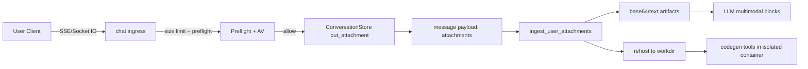
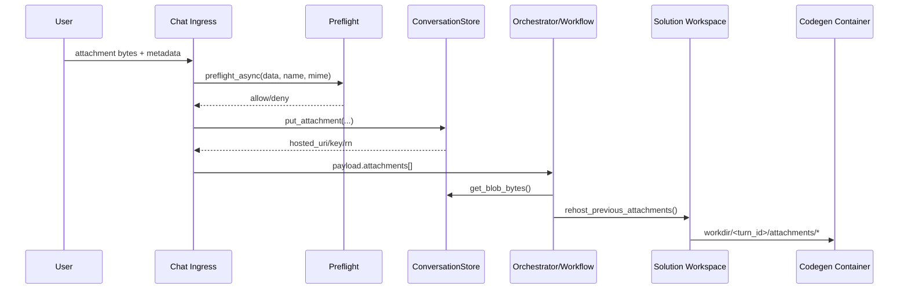

# Attachments System

## 1) Architecture overview

Attachments enter the system via the chat API (SSE or Socket.IO), are stored
in the ConversationStore, and then used in two downstream paths: multimodal
LLM inference (base64 blocks) and code-generated execution (rehosted files).

Key components:
- Ingress: `kdcube_ai_app/apps/chat/ingress/sse/chat.py`, `kdcube_ai_app/apps/chat/ingress/socketio/chat.py`
- Storage: `kdcube_ai_app/apps/chat/sdk/storage/conversation_store.py`
- Preflight/AV: `kdcube_ai_app/infra/gateway/safe_preflight.py`
- Attachment ingestion and conversion: `kdcube_ai_app/apps/chat/sdk/runtime/user_inputs.py`
- Multimodal message composition: `kdcube_ai_app/apps/chat/sdk/runtime/files_and_attachments.py`
- Rehosting to execution workspace: `kdcube_ai_app/apps/chat/sdk/solutions/react/solution_workspace.py`
- Codegen runtime usage: `kdcube_ai_app/apps/chat/sdk/solutions/react/v2/runtime.py`, `kdcube_ai_app/apps/chat/sdk/solutions/react/v3/runtime.py`



## 2) Attachment handling in our system

### 2.1 Ingress and hosting

When a user submits attachments:
- SSE: `kdcube_ai_app/apps/chat/ingress/sse/chat.py`
- Socket.IO: `kdcube_ai_app/apps/chat/ingress/socketio/chat.py`

Both flows:
1) Collect raw bytes + metadata (filename, mime).
2) Enforce total message cap and per-file caps (see 2.4).
3) Run `safe_preflight.preflight_async(...)` when `APP_AV_SCAN=1`.
4) If allowed, store via `ConversationStore.put_attachment(...)`.
5) Emit attachment metadata into the message payload.

### 2.2 Multimodal LLM usage (base64 artifacts)

In the workflow (example: `kdcube_ai_app/apps/chat/sdk/examples/bundles/eco@2026-02-18-15-06/entrypoint.py`):
- Attachments are retrieved from storage and converted by
  `ingest_user_attachments(...)` in `kdcube_ai_app/apps/chat/sdk/runtime/user_inputs.py`.
- The function resolves mime, optionally extracts text, and adds base64 only for
  supported mimes:
  - Images: `image/jpeg`, `image/png`, `image/gif`, `image/webp`
  - Docs: `application/pdf`
- Base64 payloads are size-limited (`MODALITY_MAX_IMAGE_BYTES`, `_SUMMARY_MAX_DOC_BYTES`).

### 2.4 Attachment size caps (ingress)

Ingress enforces both per-file and total-message caps, sourced from
`kdcube_ai_app/infra/service_hub/multimodality.py`.

- Per-image cap: `MODALITY_MAX_IMAGE_BYTES` (5 MB)
- Per-PDF cap: `MODALITY_MAX_DOC_BYTES` (10 MB)
- Total message cap (text + attachments): `MESSAGE_MAX_BYTES` (25 MB)

When composing messages, `build_attachment_message_blocks(...)` in
`kdcube_ai_app/apps/chat/sdk/runtime/files_and_attachments.py` produces
multimodal content blocks for LLMs. These appear in the React toolchain.

### 2.3 Rehosting for code-generated execution

For code-generated programs, attachments are rehosted into the execution
workspace so generated code can read them as files:
- `kdcube_ai_app/apps/chat/sdk/solutions/react/v2/runtime.py`
- `kdcube_ai_app/apps/chat/sdk/solutions/react/v3/runtime.py`
- `kdcube_ai_app/apps/chat/sdk/solutions/react/solution_workspace.py`

Rehosted structure:
```
workdir/
  <turn_id>/attachments/<filename>
```

Execution runs in a containerized environment (no network, workdir-only access),
so attachments are accessible as local files for program logic.

### 2.5 Tool-materialized attachments

Some bundle tools can materialize attachments that did not arrive through chat
ingress. Example: an email tool fetches an invoice PDF from a connected mailbox.

Those tools should return the standard tool envelope and explicitly mark the
payload as a declared file result:

```json
{
  "ok": true,
  "error": null,
  "ret": {
    "artifact_type": "files",
    "files": [
      {
        "type": "file",
        "source_type": "file",
        "visibility": "external",
        "filename": "invoice.pdf",
        "mime_type": "application/pdf",
        "physical_path": "turn_123/outputs/email-attachments/invoice.pdf",
        "logical_path": "fi:turn_123.outputs/email-attachments/invoice.pdf"
      }
    ]
  }
}
```

The marker tells React that the files are intentional file artifacts. React
hosts produced files into conversation storage with their full
artifact-root-relative path preserved. `external` files are emitted for
transport delivery; `internal` files are hosted for later agent/runtime use but
are not emitted to the user.

The same bundle tool can host immediately with
`bundle_tool_context.host_files(...)` and return the hosted rows. This works in
normal tool execution and in isolated execution on the trusted supervisor/runtime
side. Generated executor code should reach this capability by calling a visible
catalog tool through `agent_io_tools.tool_call(...)`; that catalog tool performs
the mailbox fetch, writes the attachment bytes, and hosts the resulting files.

Immediate hosting requires the tool runtime to be prepared with tenant, project,
user id, conversation id, turn id, conversation storage, and a hosting-capable
`ToolSubsystem`. Normal React workflows prepare this through
`BaseWorkflow.build_react(...)`; isolated execution prepares it through
`bootstrap_bind_all(...)`. If that context is missing, `host_files(...)` raises a
runtime error and the attachment is not hosted.

The only currently recognized `artifact_type` family is declared files.
See `docs/hosting/files-storage-system-README.md` for the row fields.



## 3) Security implications and defense level

### 3.1 Current defenses (ingress)

When `APP_AV_SCAN=1` (default, and always enabled in prod):
- **AV scan (ClamAV)** is run before storage.
- **Preflight validation** enforces:
  - **Type allowlist** via mime sniffing and filename fallback. Unknown types are denied.
  - **PDF heuristics** (max updates, object counts, pages, stream length hints).
  - **ZIP/OOXML checks** (max files, max expansion, compression ratio, no nested archives).
  - **Macro blocking** for OOXML (`.docm`, `.pptm`, VBA projects disallowed).
  - **Macro-free policy:** any macro-enabled OOXML is rejected at ingress.
  - **Generic ZIP archives** are disallowed by policy (`allow_zip=False`).
  - **Text size** limits for `text/*`.
  - **Allowed attachment types (stored if they pass checks):**
    - `application/pdf`
    - `application/vnd.openxmlformats-officedocument.wordprocessingml.document` (docx)
    - `application/vnd.openxmlformats-officedocument.presentationml.presentation` (pptx)
    - `application/vnd.openxmlformats-officedocument.spreadsheetml.sheet` (xlsx)
    - `image/jpeg`, `image/png`, `image/gif`, `image/webp`
    - `text/*` (subject to size limit)

Additional safeguards:
- Message and per-file size caps (see 2.4).
- Base64 only for whitelisted mime types and size caps.

### 3.2 Gaps and implications (even with preflight ON)

With `APP_AV_SCAN=1`, the following risks remain:
- **Zero-day or obfuscated malware** can bypass AV and heuristic checks.
- **Parser/renderer vulnerabilities** in supported formats (e.g., PDFs/images)
  remain possible if any downstream consumer is vulnerable.
- **MIME spoofing** is mitigated but not eliminated; we rely on magic sniffing
  and filename as a fallback.
- **Rehosting does not re-scan**; attachments are trusted once stored in the bucket.

### 3.3 Net effect (defense level)

- With `APP_AV_SCAN=1`: moderate defense (AV + structural checks + type allowlist).
- With `APP_AV_SCAN=0`: minimal defense (size limit only).
