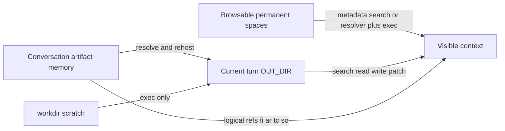
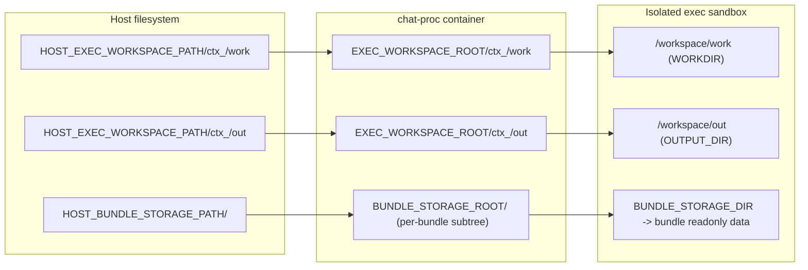
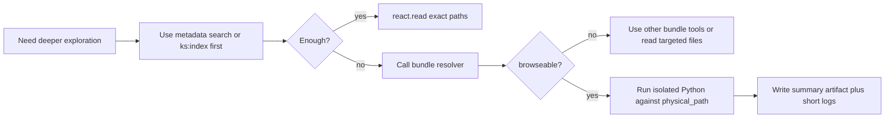

# React Agent Tools Completeness & Workspace Awareness

## Why this note exists

The React agent already has the right safety posture:
- no unrestricted shell access
- no arbitrary host filesystem access
- code execution only in isolated runtime

But the mental model around "workspace" is easy to flatten incorrectly.

The main correction is:
- the **current turn workspace** is not the same thing as the **conversation-wide artifact memory**
- and neither of those is the same thing as a **browsable permanent space** such as `ks:`

If we do not separate those ideas, the tool surface becomes confusing:
- we start asking `fi:` to behave like a directory tree
- we mix timeline/index semantics with filesystem browsing semantics
- we over-design generic namespace browsing too early
- we push the agent toward path guessing or toward asking for bash

This document records the current state and the recommended near-term boundary.

## Executive summary

| Question | Current answer | Gap | Recommended direction |
| --- | --- | --- | --- |
| What is the current turn workspace? | Temporary `out/` working set for this turn | Easy to confuse with the whole conversation artifact memory | State explicitly that turn OUT_DIR is ephemeral and hydrated on demand |
| What is `fi:`? | Logical addressing into conversation artifact memory, plus current-turn materializations | Looks filesystem-like but is not a browsable tree | Keep `fi:` as artifact addressing and retrieval, not browsing |
| Where is browsing actually needed? | In `ks:` today and future named workspaces later | We do not yet have a fluent, safe way to inspect browseable roots from code | Use isolated exec plus an explicit namespace resolver, not a generic `list_space` tool |
| How does `react.doc` look to the agent today? | Docs and deployment are searchable; `src` is readable only by exact path; test fixtures are exposed as exact `ks:src/kdcube-ai-app/.../examples/tests/...` reads plus `sk:tests.bundles` guidance | Source-first and test-first browsing still require resolver + exec, and `src` still has no search surface | Keep test fixtures as exact-read only; improve source discovery separately |
| Is public exec enough for scripted inspection? | Partially; it still requires a non-empty file contract | Probe tasks are awkward but still possible | Short-term: use a tiny summary artifact plus program log; later maybe expose a separate probe tool |
| Where should semantics live? | Repeated across docs, tool docs, shared instructions, decision prompt, skill | Drift risk | Keep tool args in tool modules, keep mental model in shared instructions, keep bundle-specific entry points in skills |

## The four-layer model



### Current semantics by layer

| Layer | Nature | How it is addressed | Typical operations | Comment |
| --- | --- | --- | --- | --- |
| Current turn workspace | physical, ephemeral, per-turn | physical OUT_DIR paths and some `fi:<outdir-relative-path>` reads | read, write, patch, turn-local search | starts almost empty |
| Conversation artifact memory | logical, cross-turn, index-backed | `fi:`, `ar:`, `tc:`, `so:` | resolve, read, cite, rehost | not a browsable directory tree |
| Browsable permanent spaces | provider-backed, filesystem-like | `ks:` today; future named namespace later | search, read, and sometimes isolated browse via resolver | may be local or remote |
| workdir scratch | runtime-local scratch | physical workdir paths inside exec only | exec-only | not collaboration state |

## Current turn workspace in practice

### What is usually there at turn start

| Area | Expected presence |
| --- | --- |
| `out/timeline.json` and related timeline state | yes |
| sources pool state | yes |
| current-turn attachments | maybe |
| previous-turn files | no, unless explicitly rehosted |
| runtime logs | only after execution happens |

### What can appear during the turn

| Area | How it gets there |
| --- | --- |
| `turn_<id>/files/...` | assistant writes, rendering, exec outputs, or rehost |
| `turn_<id>/attachments/...` | attachment ingest or rehost |
| `logs/...` | runtime |
| referenced historical artifacts | `react.read` / rehost from conversation memory |

### Key rule

The agent should think:
- "OUT_DIR is this turn's local working set"
- not
- "OUT_DIR is the whole conversation workspace"

## Physical path picture for isolated exec

The logical model above is intentionally abstract.
When React uses isolated exec, there is also a concrete physical layout that matters.

The three important physical areas are:
- `workdir` — scratch input code and temporary runtime working files
- `outdir` — writable outputs and runtime logs
- bundle storage — bundle-managed data such as knowledge spaces

### Path matrix

| Area | Host-side root in Docker-on-EC2 mode | `chat-proc` visible path | Isolated exec visible path | Notes |
| --- | --- | --- | --- | --- |
| workdir | `HOST_EXEC_WORKSPACE_PATH/ctx_<id>/work` | `EXEC_WORKSPACE_ROOT/ctx_<id>/work` | `WORKDIR=/workspace/work` | scratch only |
| outdir | `HOST_EXEC_WORKSPACE_PATH/ctx_<id>/out` | `EXEC_WORKSPACE_ROOT/ctx_<id>/out` | `OUTPUT_DIR=/workspace/out` | writable outputs, logs, contract files |
| bundle storage | `HOST_BUNDLE_STORAGE_PATH/<bundle-subdir>` | `BUNDLE_STORAGE_ROOT/<bundle-subdir>` | `BUNDLE_STORAGE_DIR=<same bundle subdir path>` | readonly per-bundle data in external exec |

Notes:
- In ECS/EC2 Docker mode, typical host roots are under `/opt/kdcube/efs/...`, but the contract is the env-backed root mapping, not the literal `/opt/...` prefix.
- `BUNDLE_STORAGE_ROOT` is the shared root, not the per-bundle subtree itself.
- The exact `<bundle-subdir>` is bundle-storage implementation detail. The agent should not guess it.
- The agent should only use the resolver-returned `physical_path` inside isolated exec.

### Docker external exec on ECS/EC2



Interpretation:
- `workdir` and `outdir` are rebased inside the sandbox to `/workspace/work` and `/workspace/out`.
- Bundle storage is not rebased into `OUTPUT_DIR`.
- The mounted/restored path is the per-bundle subtree, not the whole shared `BUNDLE_STORAGE_ROOT`.
- Resolver output should point into that exec-visible per-bundle subtree.

### Fargate external exec

In Fargate mode there is no shared host bind mount for the child runtime.
Instead:
- proc-visible `workdir` is snapshotted and restored into `/workspace/work`
- proc-visible `outdir` is snapshotted and restored into `/workspace/out`
- proc-visible bundle storage subtree is snapshotted and restored to the exec-visible `BUNDLE_STORAGE_DIR`

So the agent-visible rule is the same in both modes:
- write only to `OUTPUT_DIR`
- browse permanent readonly data only through resolver-returned physical paths

## Conversation artifact memory is already indexed

For historical artifacts, listing is not the main problem.
The index is already provided by:
- timeline blocks
- tool result blocks
- sources pool
- turn logs

That means discovery of historical artifacts should primarily happen through:
- what is visible in timeline
- tool result metadata
- explicit logical paths
- `react.memsearch` when needed

Then, once the agent identifies the needed artifact, it can:
- read it by logical path
- pull it into the current turn workspace if necessary
- use it from isolated code after rehost

So for `fi:` the main value is:
- stable reference
- on-demand retrieval
- reuse in code and tools

not:
- generic directory browsing

## What `react.doc` looks like to the agent today

### Current entry points

The `react.doc` bundle currently tells the agent to:
- read `ks:index.md`
- use `react.search_knowledge(query=..., root="ks:docs")`
- open docs with `react.read(["ks:docs/<path>"])`
- open referenced code with `react.read(["ks:src/<path>"])`
- search deployment docs with `react.search_knowledge(query=..., root="ks:deployment")`
- open deployment files with `react.read(["ks:deployment/<path>"])`
- read reusable test fixtures with exact `react.read(["ks:src/kdcube-ai-app/kdcube_ai_app/apps/chat/sdk/examples/tests/<path>"])`
- load bundle-test execution guidance from `react.read(["sk:tests.bundles"])`

The knowledge index currently builds entries from:
- docs under `docs/`
- deploy docs under `deploy/`

It does not currently index:
- `src/` as searchable entries
- tests for `react.search_knowledge`

This means the agent currently sees this shape:

| Surface in `react.doc` | Listed in `ks:index.md` | Searchable via `react.search_knowledge` | Readable via `react.read` if exact path is known | Comment |
| --- | --- | --- | --- | --- |
| `ks:docs/...` | yes | yes | yes | good |
| `ks:deployment/...` | yes | yes | yes | good |
| `ks:src/...` | no | no | yes | path must be guessed or learned from a doc |
| `ks:src/kdcube-ai-app/.../examples/tests/...` | mentioned as exact-read guidance | no | yes | exact paths only; browse in exec if needed |
| `sk:tests.bundles` | yes | n/a | yes | instruction entrypoint for how to run the reusable smoke tests |

### What this is good for

- product questions
- architecture questions
- deployment questions
- doc-led verification of code references

### What this is not yet good for

- source-first exploration
- test-first exploration
- bundle-builder/copilot behavior where the agent needs to inspect repo structure before it knows exact filenames

## Where repetition exists today

| Layer | What it should own | Current state | Risk |
| --- | --- | --- | --- |
| Tool module docs | exact args, returns, examples | mostly good | should remain authoritative |
| Shared instructions | path classes, workspace model, hard safety rules | present | should be shorter and more conceptual |
| Decision prompt | routing and protocol rules | present | should not repeat tool arg docs |
| Bundle skill | bundle-specific entry points, such as `ks:index.md` | present | correct place |
| Human docs | rationale, roadmap, deep explanation | present | not automatically visible unless surfaced through tools |

Recommended split:
- tool modules own parameter-level behavior
- shared instructions own the mental model
- decision prompt owns short routing advice
- skills own bundle-specific navigation guidance

## What is missing

### 1. Better source and test discovery in `react.doc`

Today the doc bundle is:
- doc-searchable
- deploy-searchable
- source-readable-by-exact-path

That is enough for doc reader behavior, but not enough for copilot behavior.

### 2. A controlled way to browse a permanent space from isolated code

The real missing primitive is not "browse `fi:`".
It is:
- inspect `ks:` safely when metadata search is not enough
- inspect future named workspaces safely
- do so from isolated code, not host shell
- avoid assuming every logical namespace is a local directory

### 3. A simpler way to do inspection with exec

The isolated exec layer already supports no-contract execution internally.
The public React-facing surface still exposes only contract-required execution.

That means inspection tasks are forced into awkward patterns such as:
- dummy contract files
- using authoritative artifact production for what is really just probing

### 4. A compact prompt block that explains the real model

The prompt already has path grammar.
What it still lacks is one short block that says:
- turn OUT_DIR starts small
- historical artifacts live in conversation memory
- `fi:` is logical retrieval, not provider browsing
- `ks:` is a read-only permanent space, not part of turn OUT_DIR
- workdir is scratch only
- directory-style exploration outside current OUT_DIR should happen through isolated code plus a namespace resolver or bundle-specific search tool

## Why not add `list_space` now

A generic `list_space` command sounds attractive, but it pushes us into decisions we do not want to lock in yet:
- dynamic namespace registration
- generic provider resolution in the core agent runtime
- unclear behavior for spaces that are not actually directory-backed
- another high-level tool with multiple modes that the agent can misuse

That is too much abstraction pressure for the current phase.

So the near-term answer should be:
- do not add `react.list_space(...)`
- do not add a generic dynamic namespace registry yet
- use isolated Python execution for complex browse/search/read work
- expose bundle-specific resolver/search helpers only where they are actually needed

## Why not host bash

Unrestricted bash in the non-isolated environment is still unacceptable because it can:
- read secrets from env
- read unrelated tenant data
- make uncontrolled network calls
- perform writes outside the intended surface

So when the agent needs flexible filesystem logic, the escape hatch must remain:
- isolated Python execution
- with tightly controlled mounts and tool calls
- not host shell

## Update from Mar 20 2026 15:51

The earlier draft in this document said the resolver should return an
`OUTPUT_DIR`-relative browse root.

That is the wrong general model.

Why it is wrong:
- it assumes every browseable permanent namespace is re-expressed under `OUTPUT_DIR`
- it encourages the agent to think in terms of path rebasing instead of namespace resolution
- it hides the more important question: what logical namespace maps to what physical subtree, and is that subtree read-only or writable

The better model is:
- isolated exec may expose bundle-local readonly data through internal runtime wiring
- but the agent must not assume that a logical namespace such as `ks:` maps to one well-known env var or one whole physical root
- namespace-to-physical-path mapping must be resolved explicitly

So the near-term abstraction should be:
- isolated exec plus an explicit namespace resolver
- not isolated exec plus an `OUTPUT_DIR`-relative browse root

The physical bundle-local data root remains an important implementation detail,
but it should stay behind the resolver boundary.

For example, in `react.doc` today, `knowledge/resolver.py` knows how `ks:` is
implemented for that bundle. That does **not** mean the platform should teach the
agent that `ks:` always means one fixed physical root.

## Near-term abstraction: namespace resolver plus isolated exec

### Principle

For now, if a logical space is truly browseable, the system should expose that fact to isolated code.
If it is not browseable as a directory-like tree, the resolver should say so and stop there.

This does not require a new generic browsing tool in the main React toolbox.
It can start as a bundle-defined helper where needed.

### What the resolver should return

The resolver should return an exec-visible physical path plus access mode.
It should not return a host path, and it should not force everything through `OUTPUT_DIR`.

Recommended minimal shape:

| Field | Meaning |
| --- | --- |
| `physical_path` | `str | null` — absolute path visible inside isolated exec; code can use `Path(physical_path)` directly when present |
| `access` | `'r' | 'rw'` — whether the resolved target is readonly or writable |
| `browseable` | `bool` — `true` if isolated code can walk this target as a directory tree |

If the logical space cannot be represented as a directory-like browse root, return:
- `physical_path: null`
- `access: "r"`
- `browseable: false`

### Important rule about the returned path

The returned browse root must be:
- valid only inside isolated execution
- never a host path
- stable enough for agent-generated Python code to use as `Path(physical_path)`

The agent should know only:
- it may be given a bundle-defined namespace resolver
- the resolver returns an exec-visible `physical_path` plus `access`
- the returned `physical_path` is usable only from isolated exec code
- if it wants later `react.read(...)` follow-up, it must keep the original resolver input logical_ref as the logical base

The agent should **not** guess namespace mappings from env vars or storage layout.

In practice, the safest pattern is:
- use a resolver tool to translate logical namespace to exec-visible physical path
- then browse that returned physical path from isolated code

For `ks:` the system can either:
- expose a bundle-defined resolver that maps `ks:` selectors to exec-visible physical paths
- or return `browseable: false` if that bundle does not support directory-style browsing for the requested selector

### Why the physical bundle data root still matters

The underlying physical bundle data root still matters for runtime implementation
when bundle-local readonly data is involved.

But its role is:
- tell exec code where bundle-local readonly data lives physically
- let bundle code compute subpaths safely

Its role is **not**:
- define the logical namespace contract seen by the agent
- imply that `ks:` or any future namespace maps to the entire bundle storage root

So the intended flow is:
1. agent asks a bundle-defined namespace resolver to resolve a namespace root or namespaced path
2. resolver returns an exec-visible `physical_path` and `access`
3. agent code reads that resolved subtree
4. if code finds useful descendants, it emits logical refs derived from the original resolver input logical_ref
5. agent still writes outputs only under `OUTPUT_DIR`

### Example responses

Browseable space:

```json
{
  "physical_path": "/exec-visible/resolved/src",
  "access": "r",
  "browseable": true
}
```

Follow-up pattern:
- resolver input logical_ref: `ks:src/kdcube-ai-app/kdcube_ai_app/apps/chat/sdk`
- discovered relative path in code: `runtime/execution.py`
- emitted logical ref for later `react.read(...)`: `ks:src/kdcube-ai-app/kdcube_ai_app/apps/chat/sdk/runtime/execution.py`

Not browseable as a directory:

```json
{
  "physical_path": null,
  "access": "r",
  "browseable": false
}
```

### Important bundle-specific example

For `react.doc`, a selector like:
- `ks:docs`
- `ks:src/kdcube-ai-app/kdcube_ai_app/apps/chat/sdk`
- `ks:deployment`

may all resolve to different physical subtrees under that bundle's readonly data root.

That is exactly why the platform should not teach a blanket rule such as:
- `ks:index.md -> <some fixed physical path rule>`

That statement might happen to be true for one bundle layout, but it is not a safe
platform-wide contract.

The bundle should own that mapping.

## How the agent should use that resolver

The expected usage is:
1. Use `ks:index.md`, `react.search_knowledge`, or other bundle search helpers first.
2. If that is not enough, call the bundle-defined resolver.
3. If it returns `browseable: true`, run isolated Python and inspect `Path(physical_path)`.
4. Write a small summary artifact for the agent and keep verbose progress in `user.log`.
5. Remember that the resolver itself runs only inside generated exec code, so any useful result must be propagated out through contracted files or short program logs.



## What `react.doc` should become for copilot use

### Recommended next index shape

| Root | Current state | Planned state |
| --- | --- | --- |
| `ks:docs` | indexed | keep |
| `ks:deployment` | indexed for docs | keep |
| `ks:src` | readable only by exact path | add manifests and searchable index entries |
| test fixtures | exact-read `ks:src/kdcube-ai-app/.../examples/tests/...`, with `sk:tests.bundles` as the instruction entrypoint | keep exact-read only; do not add search indexing |

### Important constraint

We should not dump full source trees into prompt or visible context.
Instead expose:
- manifests
- indexes
- provider listing
- targeted reads

That preserves token economy and keeps navigation deliberate.

## Tooling implications

| Surface | Keep doing | Improve later |
| --- | --- | --- |
| `react.search_files` | turn-local discovery in `outdir` and `workdir` | no change in scope |
| `react.read` | read logical artifacts and exact `ks:` paths | later add more precise guidance for non-text and logs |
| `react.write` / `react.patch` | mutate current-turn `files/` outputs only | no change in safety boundary |
| `react.search_knowledge` | metadata search over indexed docs/deploy | consider `src` discovery improvements later; keep tests out of search index |
| `execute_code_python(...)` | controlled escape hatch for scripted inspection and processing | later optionally expose a public no-contract probe tool |
| bundle-defined namespace resolver | optional helper for browseable permanent spaces | standardize only after usage proves stable |

## Suggested roadmap

### Phase 1: fix the model in prompt and docs

1. Add the compact workspace-model block to shared instructions.
2. Remove repeated param-level tool docs from decision prompt.
3. Keep tool-parameter details inside tool modules.

### Phase 2: make `react.doc` copilot-capable

1. Improve `ks:src` discovery without forcing full source-tree indexing.
2. Keep test fixtures as exact-read content under `ks:src/kdcube-ai-app/.../examples/tests/...`.
3. Use `sk:tests.bundles` to tell the agent where the reusable test fixtures live and how to run them from isolated exec.
4. Update `ks:index.md` to mention docs, deploy, source areas, and exact-read tests.

### Phase 3: formalize the isolated browse path

1. Let bundles expose a narrow namespace resolver for browseable permanent spaces.
2. Standardize the result shape only after one or two real implementations.
3. Keep the returned path exec-visible and never host-visible.
4. Return access mode explicitly so the agent knows whether read/write is allowed.

### Phase 4: improve the escape hatch

1. Continue to support inspection via `execute_code_python(...)` with a tiny summary artifact.
2. Optionally expose a public no-contract probe tool later if usage proves it is worth it.
3. Keep contract exec for authoritative artifact-producing work.

## Recommended prompt block

```text
[WORKSPACE MODEL]
- The current turn workspace is the current OUT_DIR working set, not the whole conversation workspace.
- Historical artifacts live in conversation memory (timeline, turn logs, sources pool, hosting) and are pulled into the current turn only when needed.
- fi: paths are logical artifact references for retrieval and reuse; they are not a general browsable filesystem.
- ks: paths belong to a read-only permanent space. Use search/index/read first.
- If deeper directory-style exploration is needed outside current OUT_DIR, use isolated code plus a namespace resolver or bundle-specific helper, not host shell.
- In isolated exec, use OUTPUT_DIR only for writable outputs. If a bundle exposes a namespace resolver, use that resolver's returned physical_path for browsing.
- work/ is runtime scratch for exec, not stable collaboration state.
- Write only to the current turn files/ namespace.
```

## Practical conclusion

The most important missing capability is:
- **a safe way for isolated code to inspect browseable permanent spaces**

not:
- shell access
- generic browsing of `fi:` conversation history

And the most important mental-model correction is:
- **turn workspace != conversation artifact memory**

Once that is explicit, the tool design becomes much cleaner:
- turn-local tools for the current working set
- logical retrieval for conversation artifacts
- metadata search plus exact-path reads for `ks:`
- isolated exec as the controlled escape hatch
- optional bundle-defined namespace resolvers where a permanent space is truly browseable

## Historical note

The older note `copilot-new-namespaces-knowledge-space-index.md` remains relevant as a precursor:
- it correctly separated `fi:` from `ks:`
- it proposed `ks:index.md` as a stable entry point

What it did not yet cover is:
- the distinction between current turn working set and conversation artifact memory
- rehydration of historical artifacts into the current turn
- the distinction between logical namespaces and exec-visible browse roots
- `react.doc` limits around `src` and tests
- future named collaborative workspaces

## Candidate engineering direction

If we want to make this concrete next, the clean path is:
- let a bundle expose an explicit resolver tool for namespace-to-path mapping
- document that this tool is intended for isolated exec flows
- have the tool return:
  - `physical_path: str | null`
  - `access: 'r' | 'rw'`
  - `browseable: bool`

Meaning:
- `physical_path` is valid only inside the current exec runtime and must never be treated as a normal react tool path
- `access` is the only allowed permission for generated code at that path
- the resolver input logical_ref is the logical base that generated code should use if it wants the agent to continue later with `react.read(...)`

Practical rule for generated code:
- if code resolves `ks:src/kdcube-ai-app/kdcube_ai_app/apps/chat/sdk` and finds a useful file `runtime/execution.py` under the returned `physical_path`, it should emit logical ref `ks:src/kdcube-ai-app/kdcube_ai_app/apps/chat/sdk/runtime/execution.py` in an `OUTPUT_DIR` file or short `user.log` note
- the agent can then use `react.read(["ks:src/kdcube-ai-app/kdcube_ai_app/apps/chat/sdk/runtime/execution.py"])` in a later step

For `react.doc`, this could be a bundle-local tool under:
- `tools/`

and registered in:
- `tools_descriptor.py`

This does not require silent tool overriding.
It can be an explicit bundle tool such as:
- `bundle_data.resolve_namespace(...)`

The tool can also enforce runtime expectations directly.
For example, if called outside isolated exec, it can return an explanatory error instead of pretending the namespace is locally browseable.
