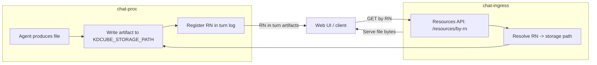
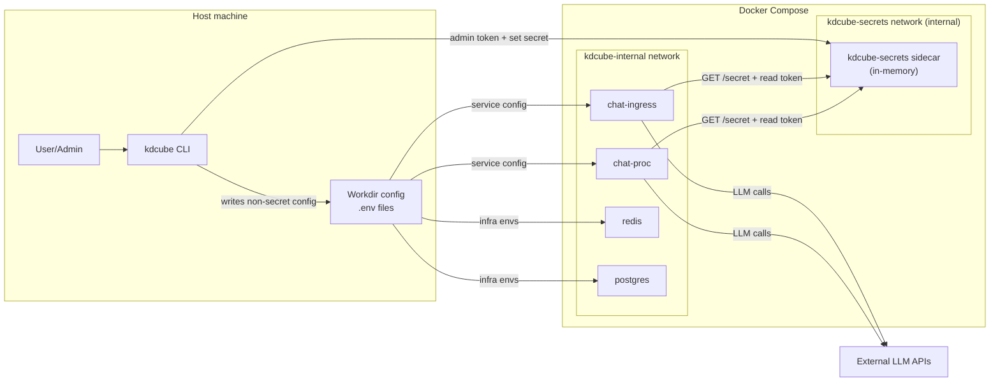

# Local setup (CLI)

This document explains the local setup flow and where data and secrets are stored when you use `kdcube`.

## Typical user flow
1. Run the CLI:
   ```bash
   kdcube
   ```
2. The wizard walks you through:
   - Install source (release or upstream)
   - Basic config (tenant/project, infra passwords)
   - Optional image build
   - Compose start + LLM key injection (runtime, in‑memory)

## What gets installed
- **Repo checkout** (if you choose release/upstream without `--path`):
  - Default: `~/.kdcube/kdcube-ai-app`
- **Docker images**
  - Prebuilt from DockerHub (release)
  - Or built locally (upstream)
- **Workdir** (config/data/logs)

## What the CLI creates
Default workdir: `~/.kdcube/kdcube-runtime`

- `config/`
  - `.env` (compose variables)
  - `.env.ingress` / `.env.proc` / `.env.metrics` / `.env.postgres.setup` / `.env.proxylogin`
  - `nginx_ui.conf`, selected runtime `nginx_proxy*.conf`
  - selected runtime `frontend.config.<mode>.json`
- `data/`
  - `postgres/`, `redis/`, `kdcube-storage/`, `exec-workspace/`, `bundle-storage/`, `bundles/`
- `logs/`
  - `chat-ingress/`, `chat-proc/`

## KDCube storage (KDCUBE_STORAGE_PATH)
The **KDCube storage root** is where conversation artifacts, accounting,
analytics, and execution snapshots are written.

Local (filesystem):
- `KDCUBE_STORAGE_PATH=file:///.../kdcube-storage`
- Default compose mount: `workdir/data/kdcube-storage` → container `/kdcube-storage`

S3 (object storage):
- `KDCUBE_STORAGE_PATH=s3://<bucket>/<prefix>`

Reference:
- Storage layout: https://github.com/kdcube/kdcube-ai-app/blob/main/app/ai-app/docs/sdk/storage/sdk-store-README.md

### What lives under KDCube storage
- **Accounting (raw events)** — per service / bundle / turn  
  See accounting system and layout:
  https://github.com/kdcube/kdcube-ai-app/blob/main/app/ai-app/src/kdcube-ai-app/kdcube_ai_app/infra/accounting/__init__.py
- **Analytics aggregates** — daily/weekly/monthly accounting summaries  
  See: https://github.com/kdcube/kdcube-ai-app/blob/main/app/ai-app/docs/sdk/storage/sdk-store-README.md
- **Conversation artifacts & attachments** — per turn, per user  
  See:
  - https://github.com/kdcube/kdcube-ai-app/blob/main/app/ai-app/docs/sdk/agents/react/conversation-artifacts-README.md
  - https://github.com/kdcube/kdcube-ai-app/blob/main/app/ai-app/docs/sdk/agents/react/artifact-storage-README.md
- **Execution snapshots** (optional) — persisted workdir for debugging  
  Enabled by `REACT_PERSIST_WORKSPACE=1`  
  See:
  - https://github.com/kdcube/kdcube-ai-app/blob/main/app/ai-app/docs/sdk/agents/react/react-turn-workspace-README.md
  - https://github.com/kdcube/kdcube-ai-app/blob/main/app/ai-app/docs/sdk/storage/sdk-store-README.md

Example layout (abbreviated):
```
<KDCUBE_STORAGE_PATH>/
  cb/tenants/<tenant>/projects/<project>/conversation/<user>/<conversation>/<turn>/
  cb/tenants/<tenant>/projects/<project>/executions/<user>/<conversation>/<turn>/<exec_id>/
  accounting/<tenant>/project/<YYYY.MM.DD>/<service>/<bundle_id>/
  analytics/<tenant>/project/accounting/{daily,weekly,monthly}/
```

### Conversation store = Postgres + storage
Conversation data is split across:
- **Postgres** (conversation metadata/indexing)
- **KDCube storage** (artifacts, attachments, execution logs)

The retrieval layer uses `ctx_rag.py` to fetch turn artifacts from storage:
`kdcube_ai_app/apps/chat/sdk/context/retrieval/ctx_rag.py`

## Temporary exec workspace (per turn)
Reactive code execution uses a **temporary workspace** per turn:
- Host: `workdir/data/exec-workspace`
- Container: `/exec-workspace` (from `EXEC_WORKSPACE_ROOT`)

This is **scratch space** for code execution; it is distinct from the
persisted execution snapshots stored under `KDCUBE_STORAGE_PATH`.

## File hosting & retrieval
Files produced during a turn are **hosted immediately** and served by ingress
resources routes (RN-based lookup).

See:
- Hosting / retrieval overview: https://github.com/kdcube/kdcube-ai-app/blob/main/app/ai-app/docs/hosting/files-storage-system-README.md
- Resource routes: `kdcube_ai_app/apps/chat/ingress/resources/resources.py`

### Storage + hosting flow (local)


## What is stored in env files
**Stored in env files (local, non‑sensitive or infra secrets):**
- Redis/Postgres credentials (for local containers)
- Paths and compose settings
- Gateway config, limits, and other service settings

**Not stored in env files (sensitive app secrets):**
- OpenAI / Anthropic / Brave keys
- Git HTTPS token (for private bundles)

## How LLM keys are handled (sidecar)
Local compose runs a `kdcube-secrets` sidecar that keeps secrets **in memory only**.
Services use the `secrets-service` provider against that sidecar; legacy
`SECRETS_PROVIDER=local` remains accepted for older workdirs.
The provider type is sourced from `assembly.yaml` under `secrets.provider`
and rendered into service env files by the CLI.

Flow (order matters):
1. CLI prompts for keys (optional).
2. CLI generates **one‑time tokens** for this run:
   - Admin token (set secrets)
   - Read tokens (ingress/proc)
3. CLI starts **only** `kdcube-secrets` with those tokens.
4. CLI waits until `kdcube-secrets` is healthy.
5. CLI injects keys into `kdcube-secrets`.
6. CLI starts (or restarts) `chat-ingress` and `chat-proc` with their read tokens.
7. Services fetch secrets from the sidecar during startup (and on demand).

In addition to secrets, the CLI-generated compose setup mounts descriptor files
under `/config` so runtime code can read non-secret descriptor values through
`read_plain(...)` / `get_plain(...)`.

Default runtime descriptor paths:

- assembly: `/config/assembly.yaml`
- bundles: `/config/bundles.yaml`

If you run `chat-ingress` or `chat-proc` directly on the host instead of via
docker compose, those `/config/...` mounts usually do not exist. In that case,
point runtime plain-config reads at real files with:

```bash
export ASSEMBLY_YAML_DESCRIPTOR_PATH=/absolute/path/to/assembly.yaml
export BUNDLES_YAML_DESCRIPTOR_PATH=/absolute/path/to/bundles.yaml
```

These env vars are read by `kdcube_ai_app.apps.chat.sdk.config` and are the
host-run equivalent of the compose `/config` mounts. If they are unset, runtime
falls back to `/config/assembly.yaml` and `/config/bundles.yaml`.

See:
- [docs/configuration/service-runtime-configuration-mapping-README.md](../../configuration/service-runtime-configuration-mapping-README.md)

Important:
- Keys are **not written to disk**.
- Keys are **not stored in `.env`**.
- Keys are lost on restart and must be re‑injected.

Re‑inject:
```bash
kdcube --secrets-prompt --workdir ~/.kdcube/kdcube-runtime
```

Note: re‑inject restarts `kdcube-secrets`, `chat-ingress`, and `chat-proc` to refresh tokens.
It also restarts the web proxy so upstreams stay in sync.

You can also inject a git HTTPS token (for private bundles):
```bash
kdcube --secrets-set GIT_HTTP_TOKEN=... --workdir ~/.kdcube/kdcube-runtime
```

If the compose stack is not running, the CLI starts `kdcube-secrets` first, injects keys,
then starts the rest of the stack. This guarantees the sidecar is ready before services
attempt to read secrets.

## Secrets flow diagram (local compose)


## Where tokens live
- Tokens are generated **per CLI run**.
- They are passed via a temporary env file (not stored in `config/`).
- They exist only in container memory after startup.
  - Tokens have TTL and max‑use limits (see `SECRETS_TOKEN_TTL_SECONDS`,
    `SECRETS_TOKEN_MAX_USES` in `.env`).
  - Secrets are stored in a tmpfs mount inside the sidecar (`/run/kdcube-secrets`).

## Managed infra (custom compose)
If you set LLM keys directly in `.env.proc` for a managed‑infra setup, those
values still work and take precedence. The sidecar is used only when env keys are missing.

## Frontend and proxy runtime files
When the CLI is driven by `assembly.yaml`:
- `frontend.frontend_config` is optional
- `frontend.nginx_ui_config` is optional

If `frontend.frontend_config` is provided, the CLI uses it as the template for the
generated runtime `config.json`. If omitted, it falls back to a built-in template:
- `simple` -> `config.hardcoded.json`
- `cognito` -> `config.cognito.json`
- `delegated` -> `config.delegated.json`

The generated runtime config always patches:
- `tenant`
- `project`
- `routesPrefix` from `proxy.route_prefix`

For delegated defaults, if root `company` is set in `assembly.yaml`, the CLI also
fills:
- `auth.totpAppName`
- `auth.totpIssuer`

If `proxy.ssl: true` and `domain` is set, the runtime nginx proxy config is also
patched so `YOUR_DOMAIN_NAME` is replaced in `server_name` and the default
Let’s Encrypt cert paths under `/etc/letsencrypt/live/<domain>/...`.

## Limits (local dev)
- Docker network isolation does **not** protect secrets from a host user with Docker access.
- This is best‑effort local security, not a strong boundary.
- For stronger isolation, consider a dedicated OS user or VM mode.

## Clean / reset
Remove Docker images and cache for local KDCube builds:
```bash
kdcube --clean
```

Reset config prompts without deleting files:
```bash
kdcube --reset
```

Full reset (delete workdir):
```bash
rm -rf ~/.kdcube/kdcube-runtime
```
