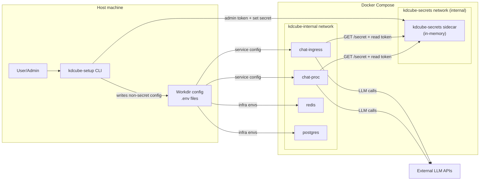

# Local setup (CLI)

This document explains the local setup flow and where data and secrets are stored when you use `kdcube-setup`.

## Typical user flow
1. Run the CLI:
   ```bash
   kdcube-setup
   ```
2. The wizard walks you through:
   - Install source (release or upstream)
   - Basic config (tenant/project, infra passwords)
   - Optional image build
   - Compose start + LLM key injection (runtime, in‑memory)

## What gets installed
- **Repo checkout** (if you choose release/upstream without `--path`):
  - Default: `~/.kdcube/kdcube-ai-app`
- **Docker images**
  - Prebuilt from DockerHub (release)
  - Or built locally (upstream)
- **Workdir** (config/data/logs)

## What the CLI creates
Default workdir: `~/.kdcube/kdcube-runtime`

- `config/`
  - `.env` (compose variables)
  - `.env.ingress` / `.env.proc` / `.env.metrics` / `.env.postgres.setup` / `.env.proxylogin`
  - `nginx_ui.conf`, `nginx_proxy.conf`
  - `frontend.config.hardcoded.json`
- `data/`
  - `postgres/`, `redis/`, `kdcube-storage/`, `exec-workspace/`, `bundle-storage/`, `bundles/`
- `logs/`
  - `chat-ingress/`, `chat-proc/`

## What is stored in env files
**Stored in env files (local, non‑sensitive or infra secrets):**
- Redis/Postgres credentials (for local containers)
- Paths and compose settings
- Gateway config, limits, and other service settings

**Not stored in env files (sensitive app secrets):**
- OpenAI / Anthropic / Brave keys

## How LLM keys are handled (sidecar)
Local compose runs a `kdcube-secrets` sidecar that keeps secrets **in memory only**.

Flow (order matters):
1. CLI prompts for keys (optional).
2. CLI generates **one‑time tokens** for this run:
   - Admin token (set secrets)
   - Read tokens (ingress/proc)
3. CLI starts **only** `kdcube-secrets` with those tokens.
4. CLI waits until `kdcube-secrets` is healthy.
5. CLI injects keys into `kdcube-secrets`.
6. CLI starts (or restarts) `chat-ingress` and `chat-proc` with their read tokens.
7. Services fetch secrets from the sidecar during startup (and on demand).

Important:
- Keys are **not written to disk**.
- Keys are **not stored in `.env`**.
- Keys are lost on restart and must be re‑injected.

Re‑inject:
```bash
kdcube-setup --secrets-prompt --workdir ~/.kdcube/kdcube-runtime
```

Note: re‑inject restarts `kdcube-secrets`, `chat-ingress`, and `chat-proc` to refresh tokens.
It also restarts the web proxy so upstreams stay in sync.

You can also inject a git HTTPS token (for private bundles):
```bash
kdcube-setup --secrets-set GIT_HTTP_TOKEN=... --workdir ~/.kdcube/kdcube-runtime
```

If the compose stack is not running, the CLI starts `kdcube-secrets` first, injects keys,
then starts the rest of the stack. This guarantees the sidecar is ready before services
attempt to read secrets.

## Secrets flow diagram (local compose)


## Where tokens live
- Tokens are generated **per CLI run**.
- They are passed via a temporary env file (not stored in `config/`).
- They exist only in container memory after startup.
  - Tokens have TTL and max‑use limits (see `SECRETS_TOKEN_TTL_SECONDS`,
    `SECRETS_TOKEN_MAX_USES` in `.env`).
  - Secrets are stored in a tmpfs mount inside the sidecar (`/run/kdcube-secrets`).

## Managed infra (custom compose)
If you set LLM keys directly in `.env.proc` for a managed‑infra setup, those
values still work and take precedence. The sidecar is used only when env keys are missing.

## Limits (local dev)
- Docker network isolation does **not** protect secrets from a host user with Docker access.
- This is best‑effort local security, not a strong boundary.
- For stronger isolation, consider a dedicated OS user or VM mode.

## Clean / reset
Remove Docker images and cache for local KDCube builds:
```bash
kdcube-setup --clean
```

Reset config prompts without deleting files:
```bash
kdcube-setup --reset
```

Full reset (delete workdir):
```bash
rm -rf ~/.kdcube/kdcube-runtime
```
