# Quick Start (Local Docker Compose)

This is the shortest current path to run the platform locally with the `kdcube` CLI.

## 1. Start from the shipped descriptor set

Use the descriptor folder already present in this repo:

`app/ai-app/deployment/`

The local install flow is descriptor-driven. The main files are:

- `assembly.yaml`
  - platform release, auth mode, ports, infra, runtime service settings
  - doc: `app/ai-app/docs/configuration/assembly-descriptor-README.md`
- `secrets.yaml`
  - platform secrets such as model keys and infra passwords
  - doc: `app/ai-app/docs/configuration/secrets-descriptor-README.md`
- `gateway.yaml`
  - gateway capacity and throttling
  - doc: `app/ai-app/docs/configuration/gateway-descriptor-README.md`
- `bundles.yaml`
  - bundle registry and non-secret bundle config
  - doc: `app/ai-app/docs/configuration/bundles-descriptor-README.md`
- `bundles.secrets.yaml`
  - bundle-level secrets
  - doc: `app/ai-app/docs/configuration/bundles-secrets-descriptor-README.md`

## 2. Run the CLI

From the repo root:

```bash
kdcube \
  --descriptors-location app/ai-app/deployment \
  --workdir ~/.kdcube/kdcube-runtime
```

That uses `assembly.yaml -> platform.ref`.

Useful variants:

```bash
kdcube \
  --descriptors-location app/ai-app/deployment \
  --latest
```

```bash
kdcube \
  --descriptors-location app/ai-app/deployment \
  --release 2026.4.17.247
```

```bash
kdcube \
  --descriptors-location app/ai-app/deployment \
  --build \
  --upstream
```

Reference:

- `app/ai-app/src/kdcube-ai-app/kdcube_cli/README.md`
- `app/ai-app/docs/service/cicd/cli-README.md`

## 3. What the CLI does

The CLI:

- creates or reuses the workdir, default `~/.kdcube/kdcube-runtime`
- renders service env/config from the descriptor set
- starts the local Docker Compose stack
- injects runtime secrets according to the configured secrets provider

For the shipped local descriptors, `assembly.yaml` currently uses:

- `secrets.provider: "secrets-service"`

Practical rule:

- edit descriptor files when you want durable local configuration
- rerun `kdcube` after changing descriptor-backed secrets or service config

## 4. Open the UI

Open the URL printed by the CLI.

Default local context from the shipped descriptor set:

- tenant: `demo-tenant`
- project: `demo-project`

From the admin UI you can:

- inspect the registered bundles
- change the default bundle
- apply runtime bundle prop overrides
- manage bundle secrets

Descriptor-backed config is still the source of truth for the local install.

## 5. Local bundle development loop

If you are developing a mounted local bundle:

1. set `assembly.yaml -> paths.host_bundles_path`
2. point `bundles.yaml` at the container-visible path under `/bundles/...`
3. install once with the normal CLI command above
4. after bundle code or descriptor changes, reload:

```bash
kdcube --workdir ~/.kdcube/kdcube-runtime --bundle-reload <bundle_id>
```

`--bundle-reload`:

- reapplies the bundle registry from the active descriptor/env state
- rebuilds descriptor-backed bundle props from `bundles.yaml`
- clears proc bundle caches so the next request uses updated code/config

Bundle docs:

- `app/ai-app/docs/sdk/bundle/bundle-index-README.md`
- `app/ai-app/docs/sdk/bundle/bundle-developer-guide-README.md`
- `app/ai-app/docs/sdk/bundle/bundle-delivery-and-update-README.md`

## 6. Stop the local stack

```bash
kdcube --workdir ~/.kdcube/kdcube-runtime --stop
```

Remove local volumes too:

```bash
kdcube --workdir ~/.kdcube/kdcube-runtime --stop --remove-volumes
```

## Quick mental model

```mermaid
flowchart LR
  A[deployment descriptors] -->|kdcube| B[workdir render]
  B --> C[Docker Compose stack]
  C --> D[ingress + proc + metrics + infra]
  D --> E[UI + admin]
  E --> F[bundle registry + runtime config]

  classDef desc fill:#e3f2fd,stroke:#64b5f6,color:#0d47a1;
  classDef cli fill:#fff3e0,stroke:#ffb74d,color:#e65100;
  classDef svc fill:#e8f5e9,stroke:#81c784,color:#1b5e20;
  classDef ui fill:#f3e5f5,stroke:#ba68c8,color:#4a148c;
  classDef reg fill:#fce4ec,stroke:#f06292,color:#880e4f;

  class A desc;
  class B cli;
  class C,D svc;
  class E ui;
  class F reg;
```



That is enough to get a local stack running and to start iterating on bundles.
