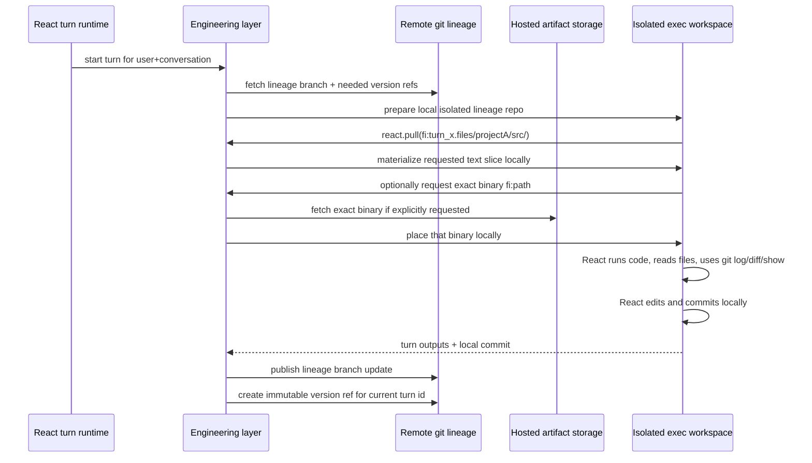

# Draft: Git-Based Isolated Workspace

This doc is a **draft design** for replacing React v2's current
copy-forward/rehost workspace model with a git-backed isolated workspace model.

The main design choices in this draft are:

- **keep `fi:` unchanged**
- **keep `<version>` equal to `turn_...`**
- **keep both workspace implementations supported (`custom` and `git`)**
- **make git the authoritative version-control layer for textual project trees**
- **keep hosted storage as the authoritative layer for binary artifacts**
- **do not eagerly materialize whole projects**
- **introduce explicit workspace hydration via `react.pull(paths=[fi:...])`**

The intent is to give React a natural local git workspace it can inspect,
diff, and commit against, while keeping network, pull, and push out of the
isolated execution runtime.

Current implementation status:
- `REACT_WORKSPACE_IMPLEMENTATION=custom|git` is implemented and wired through `RuntimeCtx`
- `react.pull(paths=[fi:...])` is implemented for both workspace backends
- `git` mode bootstraps the current turn as a sparse local git repo
- successful `git` turns publish the lineage branch and immutable per-turn version ref on host-side turn finish
- git publish failure is treated as turn failure
- exact non-text `.files/...` refs are treated as hosted/custom artifacts, not as git blobs
- folder pulls remain text-only
- hosted artifacts and execution snapshots remain available through ConversationStore/RN flows

---

## 1) JIRA Ticket

### Summary

Introduce a git-based isolated workspace for React so the agent can continue
working on evolving project trees across turns without reconstructing state by
scanning historical `<turn>/files/...` deltas and without guessing deletes from
artifact absence.

### Problem

Today React's writable workspace is effectively:
- `<current_turn>/files/...`

If React wants to continue work on a project that existed in an earlier turn,
it must:
- mention historical files or folders
- rely on engineering/runtime to rehost those files into the current turn
- then rewrite or patch them inside the current turn path

That creates a per-turn delta model rather than a project-snapshot model.

This breaks down because:
- reconstructing the current project state requires scanning many turns
- scanning historical presence does not represent delete semantics correctly
- React is forced into a “copy forward” workflow instead of a project workflow
- the model is good at artifacts, but weak at canonical mutable project trees

At the same time, isolated exec already has a hard constraint:
- **no network in exec**

So the agent must receive a locally prefetched workspace that already contains
the part of history it is allowed to inspect.

Another important constraint:
- conversations and projects can become large
- the agent may only need a slice of a versioned project tree
- eager full-workspace activation would waste time, I/O, and tokens

### Proposed Solution

Use git as the authoritative state manager for textual project trees, while
keeping hosted storage for binaries. Keep the existing custom artifact-backed
workspace path available as an alternative backend.

The model is:
- `REACT_WORKSPACE_IMPLEMENTATION=custom|git` selects the backend
- one workspace lineage branch per user conversation
- one immutable named git ref per turn version
- the public version id remains the existing `turn_...`
- `fi:<version>.files/<scope>/<path>` stays the visible reference syntax
- `REACT_WORKSPACE_GIT_REPO` identifies the remote repo engineering uses for that lineage
- engineering resolves that version id to the correct git ref in the current lineage
- engineering prefetches the isolated lineage repo locally before exec/code runs
- React explicitly asks for the workspace slice it needs with:
  - `react.pull(paths=[fi:...])`
- folder pulls bring git-tracked textual content only
- exact binary refs may also be pulled point-wise when explicitly named
- the agent can inspect history and commit locally, but cannot pull/push
- engineering later publishes branch/ref updates outside exec

There are only two supported workspace paradigms:
- `custom`
- `git`

Both paradigms keep the same user-facing contract:
- `fi:...`
- `react.pull(paths=[...])`

But the agent is instructed differently:
- in `custom`, it does not reason about the activated workspace as git
- in `git`, it is explicitly taught that the activated workspace can be explored with local git commands except pull/push

### Acceptance Criteria

- React can work in a normal local git repo/worktree during a turn.
- React can use `git log`, `git diff`, `git show`, `git status`, and `git commit` locally.
- React cannot pull or push from exec.
- React can explicitly hydrate the needed workspace slice with `react.pull(paths=[fi:...])`.
- `fi:` keeps the same syntax and uses `turn_...` as the version id.
- The system can resolve `fi:<turn_id>.files/...` to the correct snapshot in the current lineage.
- Deletes are represented by git history, not guessed from missing files.
- Folder pulls do not implicitly bring hosted binaries.
- Exact binary refs can still be hydrated locally when explicitly requested.

### Non-Goals

- Replacing hosted storage for binary outputs
- Making raw commit SHA part of the agent-facing contract
- Allowing network access from exec
- Shared multi-user project evolution across conversations
- Automatic eager full-workspace activation for every turn
- Implicit inference of binary membership in a pulled folder
- Removing the custom non-git workspace backend

---

## 2) Current Model and Why It Is Not Enough

Relevant current files:
- [solution_workspace.py](/Users/elenaviter/src/kdcube/kdcube-ai-app/app/ai-app/src/kdcube-ai-app/kdcube_ai_app/apps/chat/sdk/solutions/react/v2/solution_workspace.py)
- [runtime.py](/Users/elenaviter/src/kdcube/kdcube-ai-app/app/ai-app/src/kdcube-ai-app/kdcube_ai_app/apps/chat/sdk/solutions/react/v2/runtime.py)
- [external.py](/Users/elenaviter/src/kdcube/kdcube-ai-app/app/ai-app/src/kdcube-ai-app/kdcube_ai_app/apps/chat/sdk/solutions/react/v2/tools/external.py)
- [read.py](/Users/elenaviter/src/kdcube/kdcube-ai-app/app/ai-app/src/kdcube-ai-app/kdcube_ai_app/apps/chat/sdk/solutions/react/v2/tools/read.py)
- [timeline.py](/Users/elenaviter/src/kdcube/kdcube-ai-app/app/ai-app/src/kdcube-ai-app/kdcube_ai_app/apps/chat/sdk/solutions/react/v2/timeline.py)

Current behavior:
- relative `files/...` paths are rewritten into the current turn
- historical files are rehosted from timeline/storage into the current turn
- exec gets a selected snapshot of referenced artifacts
- patch/write tools operate against current-turn local files
- current `react.pull(...)` folder pulls inspect only the referenced turn's artifact metadata in timeline/turn-log state; they do not scan all hosting

Useful current helpers:
- `extract_code_file_paths(...)`
- `rehost_files_from_timeline(...)`
- `rehost_previous_files(...)`
- `build_exec_snapshot_workspace(...)`

This is effective for artifact-centric continuity, but not for project-state
continuity.

The core semantic failure is:
- historical presence of `file_x` does not imply the file should still exist in the current project tree

So a scan-based reconstruction cannot represent deletion reliably.

---

## 3) Core Design Decisions

### 3.1 Keep `fi:` unchanged

Do not introduce a new ref family for the first iteration.

The existing visible contract stays:

```text
fi:<version>.files/<scope>/<path>
```

Where:
- `<version>` remains the existing `turn_...`
- `<scope>` is the top-level folder directly under `files/`

The meaning changes internally:
- `<version>` resolves to a git-backed snapshot in the current workspace lineage
- React can pass those `fi:` refs directly to `react.pull(...)` to materialize local workspace content

### 3.2 Keep `turn_...` as the public version id

Do not expose commit SHA to the agent.

Reason:
- commit SHA is unknown before commit
- it creates a second identity to track
- `turn_...` already exists in the system and maps naturally to conversation progress

So the public snapshot/version id is:
- `turn_1774995817638_h68d2o`

The git layer should attach that id to an immutable git ref.

### 3.3 Lineage is conversation-scoped, not project-scoped

The branch lineage should be tied to:
- user
- conversation

not to a guessed “project” name.

Reason:
- the next segment under `files/` is only a workspace scope/root
- React can discover available scopes by inspecting the local workspace tree
- engineering can optionally surface top-level scopes in ANNOUNCE, but React can also learn them from the filesystem

So:
- lineage identity = conversation work line
- workspace scopes = top-level directories inside that line

### 3.4 Remote canonical refs should be namespaced

Do not use repo-global tags as the canonical remote identity because tags are
global within a repo and the repo is shared.

Canonical remote model:
- one lineage branch
- one immutable namespaced version ref per turn

Suggested shape:

```text
refs/heads/kdcube/<tenant>/<project>/<user_id>/<conversation_id>
refs/kdcube/<tenant>/<project>/<user_id>/<conversation_id>/versions/<turn_id>
```

The exact prefix can change, but the structure should preserve:
- lineage branch
- immutable turn version ref

### 3.5 Local exec may add convenience refs

Inside the isolated local clone, engineering may create convenience local tags
such as:
- `<turn_id>`

These are local sugar only.

They are not the canonical remote identity.

### 3.6 Isolation is strict

This design is intentionally isolated:
- one lineage per user and conversation
- one local isolated clone/worktree per active turn
- no shared branch between users
- no cross-user merge story in this phase
- only one agent commits on a lineage at a time

If another conversation later needs the same project history, that should be
designed as a separate problem. It is not part of this first workspace model.

### 3.7 `REACT_WORKSPACE_GIT_REPO` is the runtime anchor

The React runtime should carry the authoritative workspace-backup repo in:
- env: `REACT_WORKSPACE_GIT_REPO`
- runtime: `RuntimeCtx.workspace_git_repo`

This repo:
- is used by engineering/runtime outside exec
- uses the same auth contract already supported for git bundle loading
- is not something React fetches from directly inside isolated exec

---

## 4) Remote Git Model

For each conversation lineage:

- branch head holds the latest textual project tree
- every turn that publishes textual workspace state creates a commit on that branch
- immediately after commit, engineering creates the immutable version ref for that turn id

This is already partially implemented:
- on successful turn finish in `git` mode, runtime stages the current-turn text workspace
- host-side code creates or reuses the turn commit
- the lineage branch and immutable version ref for the current `turn_...` are published
- if publication fails, the turn is failed because the canonical text workspace state was not fully saved

That gives two useful lookup modes:

- latest state:
  - lineage branch head
- exact historical state:
  - immutable per-turn ref

### Proposed ref layout

```text
branch: refs/heads/kdcube/<tenant>/<project>/<user_id>/<conversation_id>

immutable version ref:
refs/kdcube/<tenant>/<project>/<user_id>/<conversation_id>/versions/<turn_id>
```

Where `<turn_id>` remains:
- `turn_...`

This is the git entity that later resolves `fi:<turn_id>.files/...`.

---

## 5) Local Isolated Workspace Model

### 5.1 What exec receives

Before exec/code runs, engineering prepares a local isolated git repo/worktree
that contains only the current lineage and the refs needed for the turn.

Exec properties:
- no network
- local git repo available
- branch history available for the current lineage only
- selected historical version refs available locally
- workspace content is hydrated explicitly, not eagerly
- hosted binaries are not pulled automatically with workspace slices

Current implemented behavior:
- the current turn root `out/turn_<current_turn>/` is bootstrapped as a sparse local git repo
- if the lineage branch already exists, its history is available locally there
- the sparse worktree starts empty; runtime does not eagerly materialize project files
- isolated exec preserves `.git` when referenced paths come from a git-backed turn root

The agent can:
- inspect repository structure
- inspect history
- diff snapshots
- commit

The agent cannot:
- pull
- push
- inspect other users' branches/history
- participate in any merge workflow

### 5.2 Explicit workspace hydration via `react.pull`

The primary workspace-hydration tool should be:

```json
{"tool_id":"react.pull","params":{"paths":["fi:<turn_id>.files/<scope>/<path-or-prefix>"]}}
```

This tool explicitly asks engineering/runtime to bring a needed slice of the
versioned workspace into local execution space.

Phase-1 semantics:
- input is one or more `fi:` paths or prefixes
- text/git-tracked content is hydrated from the git snapshot resolved by `<turn_id>`
- exact binary refs may be hydrated point-wise from hosting if explicitly requested
- binaries are not inferred as part of a pulled folder

The important rule is:
- React must pull the workspace slice it needs
- the system should not materialize the whole project tree by default

This keeps large projects and long conversations manageable.

### 5.3 Current-turn writable root stays familiar

To minimize disruption, pulled editable content should still appear under the
familiar turn-local root:

```text
<current_turn>/files/
```

That path represents:
- the current editable local worktree content that has been activated for this turn

Historical versions mentioned by explicit `fi:<older_turn>...` references can be
pulled lazily as compatibility views under:

```text
<older_turn>/files/...
```

Those historical trees are read-only compatibility hydrations, not the primary
editable workspace.

### 5.4 Top-level scopes

The first segment after `files/` is the workspace scope/root:

```text
<current_turn>/files/<scope>/...
```

Examples:
- `app/`
- `docs/`
- `src/`

React should be taught:
- top-level scopes are the current workspace roots
- it can discover them by normal filesystem inspection
- it should pull only the scopes/subtrees it needs for the current task

Engineering may also expose these scope names in ANNOUNCE for convenience.

---

## 6) How `fi:` Resolves and How `react.pull` Uses It

The visible syntax remains:

```text
fi:<turn_id>.files/<scope>/<path>
```

Resolution algorithm:

1. runtime derives the current lineage context from request/session/conversation
2. runtime resolves:

```text
refs/kdcube/<tenant>/<project>/<user_id>/<conversation_id>/versions/<turn_id>
```

3. runtime reads the git tree at that ref
4. if React called `react.pull(...)`, runtime materializes the requested path or subtree locally under:

```text
<turn_id>/files/<scope>/<path>
```

5. tooling and exec can then use the local path naturally

So `fi:` does not change syntax, only resolution semantics.

Important implemented split in `git` mode:
- text-like `.files/...` refs are resolved from git snapshots
- non-text exact `.files/...` refs are routed through the hosted/custom artifact path
- attachments remain hosted/custom artifacts only

### 6.1 `react.pull` contract

Initial contract should stay small:

```json
{
  "paths": [
    "fi:turn_1774995817638_h68d2o.files/projectA/src/",
    "fi:turn_1774995817638_h68d2o.files/projectA/README.md",
    "fi:turn_1774995817638_h68d2o.user.attachments/template.xlsx"
  ]
}
```

The tool should:
- accept exact files or directory prefixes
- resolve each path in the current lineage context
- hydrate only the requested slices locally
- return the local physical paths that were made available

Important split:
- folder pulls in `...files/...` mean git-backed text/project content
- exact file refs can also name binaries
- binaries are only allowed point-wise, not as implicit descendants of a pulled folder

Possible later extension:
- add mode flags such as `editable` / `readonly`

But that is not required for the first phase.

---

## 7) Hosted Binary Model

### 7.1 Rule

Do not store binary artifacts in git.

Examples:
- xlsx
- pdf
- pptx
- images
- archives

These remain in hosted artifact storage.

### 7.2 Phase-1 rule: no implicit binary hydration

If a binary file is not in git, then a normal workspace slice pull does not
know that the binary should also appear inside the local workspace.

So the phase-1 rule is:
- `react.pull(fi:...folder...)` only guarantees git-tracked textual content
- binaries are not brought automatically as part of that folder
- if React needs a binary, it must request it explicitly by exact logical ref

That means the agent instructions must say clearly:
- workspace pull is for versioned text/project content
- binary artifacts are point-wise
- do not assume a pulled folder includes xlsx/pptx/pdf/image descendants from hosting

### 7.3 Point-wise binary hydration

If React needs a hosted binary, it should reference it exactly, for example:

```text
fi:<turn_id>.user.attachments/template.xlsx
fi:<turn_id>.files/rendered/report.pdf
```

Engineering/runtime may then hydrate that exact binary locally when allowed.

Current implemented rule:
- exact non-text `.files/...` refs are routed through the artifact/hosting path
- if no hosted/custom artifact exists for that exact binary ref, the pull remains missing
- runtime does not silently read non-text `.files/...` blobs from git in `git` mode

This keeps the first implementation simple and honest:
- no inference
- no hidden binary-membership protocol
- no manifest yet

### 7.4 Future option: pointer metadata if needed

If later it becomes necessary for workspace snapshots to imply binary presence,
then the minimal next step is a pointer mechanism committed in git.

That is explicitly deferred.

### 7.5 User-facing download path remains hosted

User downloads and previews still remain handled through hosted resources, e.g.:
- [resources.py](/Users/elenaviter/src/kdcube/kdcube-ai-app/app/ai-app/src/kdcube-ai-app/kdcube_ai_app/apps/chat/ingress/resources/resources.py)

Engineering should prefer internal storage resolution for hydration rather than
loopback HTTP, but the same logical artifact model remains relevant.

Important storage split:
- git is the canonical store for non-binary workspace text state in `git` mode
- hosted storage remains the canonical store for:
  - attachments
  - explicit hosted file artifacts
  - execution snapshots when `react.persist_workspace()` / `REACT_PERSIST_WORKSPACE` is enabled

This means the RN-based resource API continues to work for hosted artifacts and
execution snapshots even when the workspace backend is `git`.

Not every git-backed workspace file automatically gets an RN. A text workspace
file is available through RN/download flows only if it is also hosted as an
artifact or included in a persisted execution snapshot.

---

## 8) Workspace Evolution Across Turns

### Diagram 1: Snapshot evolution

```text
Turn 1
  base: empty lineage branch
  react.pull(fi:turn_1.files/projectA/)
  local workspace: <turn_1>/files/projectA/{file1,file2,file3}
  commit on lineage branch -> C1
  immutable version ref:
    refs/kdcube/.../versions/turn_1 -> C1

Turn 2
  react.pull(fi:turn_1.files/projectA/)
  materialize snapshot C1 into <turn_2>/files/projectA/
  agent deletes file1, adds file4
  workspace now: {file2,file3,file4}
  commit on lineage branch -> C2
  immutable version ref:
    refs/kdcube/.../versions/turn_2 -> C2

Turn 3
  react.pull(fi:turn_2.files/projectA/)
  materialize snapshot C2 into <turn_3>/files/projectA/
  agent edits file2 and file3
  commit on lineage branch -> C3
  immutable version ref:
    refs/kdcube/.../versions/turn_3 -> C3

Result:
  branch head = C3
  exact old states recoverable by turn ref
  delete of file1 is explicit in git, not guessed
```

### Diagram 2: Current vs historical materialization

```text
editable current workspace
  <turn_3>/files/projectA/...    <- current editable slice pulled for this turn

historical compatibility hydration
  <turn_1>/files/projectA/...    <- pulled lazily from immutable version ref
  <turn_2>/files/projectA/...    <- pulled lazily from immutable version ref
```

Current workspace is the main editable tree.
Historical `<turn>/files/...` trees exist only when explicitly needed.

### Diagram 3: Text vs binary pull semantics

```text
react.pull(fi:turn_2.files/projectA/src/)
  -> pulls git-tracked text/project tree for src/
  -> does NOT implicitly pull hosted binaries under projectA/

react.pull(fi:turn_2.user.attachments/template.xlsx)
  -> may pull that exact hosted binary point-wise
```

---

## 9) Engineering Flow

### Diagram 4: End-to-end flow

```mermaid
flowchart TD
    A[Conversation lineage] --> B[Remote git branch\nkdcube/.../<user>/<conversation>]
    B --> C[Immutable version ref per turn\nrefs/kdcube/.../versions/<turn_id>]
    C --> D[Engineering prefetch]
    D --> E[Local isolated git clone/worktree]
    E --> F[React pull request\nreact.pull(paths=[fi:...])]
    F --> G[Pulled current writable tree\n<current_turn>/files/...]
    F --> H[Historical hydration on demand\n<older_turn>/files/...]
    I[Hosted storage for binaries] --> F
    F --> J[Point-wise binary hydration\nexact fi: only]
    E --> K[React exec/code tools\nno network]
    K --> L[Local git commit only]
    L --> M[Engineering publish/push outside exec]
```

### Sequence



Current implemented publication seam:
- host-side publish happens from `BaseWorkflow.finish_turn(...)`
- it runs only when turn completion is successful
- it is skipped for `custom` workspace mode
- publish failure now fails the turn instead of being logged and ignored

---

## 10) Integration Points

### 10.1 `solution_workspace.py`

Current role:
- rehosting files from timeline/storage
- building exec-local snapshots

Future role:
- resolve `react.pull(...)` requests into local hydrated workspace slices
- materialize git-backed text slices for current turn
- resolve historical `fi:<turn_id>...` through immutable version refs
- support exact binary hydration by explicit logical ref

Key functions likely to evolve:
- `rehost_files_from_timeline(...)`
- `rehost_previous_files(...)`
- `build_exec_snapshot_workspace(...)`

### 10.1a `workspace.py` and `git_workspace.py`

Current role:
- dispatch workspace hydration by implementation (`custom` vs `git`)
- resolve lineage branch/version ref naming
- hydrate git-backed text slices
- bootstrap sparse current-turn repos
- publish lineage/version refs on successful git-mode turn finish

Important implemented rule:
- non-text `.files/...` exact refs stay on the hosted/custom artifact path
- git hydration is text-first and folder pulls stay text-only

### 10.2 `external.py`

Current role:
- scan generated code for referenced files
- rehost historical files before exec

Future role:
- detect versioned `fi:` references
- request git-based hydration via `react.pull(...)` instead of pure timeline scan
- preserve compatibility for legacy artifact paths where needed

### 10.3 `read.py`

Current role:
- read `fi:` and other logical refs into visible context

Future role:
- keep `fi:` syntax
- resolve `fi:<turn_id>.files/...` using lineage-scoped git snapshot semantics
- continue surfacing metadata-only behavior for unsupported binary reading

### 10.4 `timeline.py`

Current role:
- artifact resolution
- visible/cold-start rendering
- compaction summary boundaries

Future role:
- preserve historical logical resolution across git-backed snapshots
- ensure `fi:` remains meaningful even when underlying storage is git-backed
- no direct need to convert timeline into git storage, but timeline must understand the new artifact semantics

### 10.5 `runtime.py`

Current role:
- orchestrates turn execution
- updates ANNOUNCE
- invokes tool/runtime flow

Future role:
- initialize current lineage repo for the turn
- optionally expose current top-level workspace scopes in ANNOUNCE
- support alternate instructions that explain the new workspace pull model
- finalize commit/publication handoff to engineering after local commit is produced

### 10.5a `base_workflow.py`

Current role:
- owns successful turn finalization
- now performs host-side git workspace publication when `workspace_implementation=git`

Important rule:
- publication is part of successful turn finish, not isolated exec
- publish failure fails the turn because canonical git-backed workspace progress was not fully saved

### 10.6 `resources.py`

Current role:
- preview/download of hosted artifacts for users

Future role:
- largely unchanged as ingress download surface
- relevant as the external representation of hosted binary artifacts

Important rule:
- user-facing download stays hosted
- internal workspace hydration should use storage/logical resolution, not user-facing HTTP whenever possible

### 10.7 Patch / write tooling

Although not the primary design center, patch/write tooling must continue to
work naturally because the current editable tree still lives under:

```text
<current_turn>/files/...
```

That is the compatibility bridge that makes this migration practical.

### 10.8 Agent instructions and rollout config

This workspace paradigm must be introduced behind an explicit runtime/config
switch so production can revert quickly to the current model if needed.

The new instruction surfaces that will need alternate variants are:
- [decision.py](/Users/elenaviter/src/kdcube/kdcube-ai-app/app/ai-app/src/kdcube-ai-app/kdcube_ai_app/apps/chat/sdk/solutions/react/v2/agents/decision.py)
- [shared_instructions.py](/Users/elenaviter/src/kdcube/kdcube-ai-app/app/ai-app/src/kdcube-ai-app/kdcube_ai_app/apps/chat/sdk/skills/instructions/shared_instructions.py)

The alternate instructions should teach:
- the workspace is git-backed
- React must explicitly pull the needed slice with `react.pull(paths=[fi:...])`
- `fi:` stays the reference syntax
- pulled folders contain git-tracked textual content
- binaries are not included automatically in folder pulls
- if a binary is needed, it must be referenced point-wise by exact logical ref
- local git history inspection is available
- local commit is allowed
- no pull/push/network in exec

---

## 11) Agent Contract

React should be taught this model in simple terms:

- the current writable project tree appears under `<current_turn>/files/...` after it is pulled
- the first segment after `files/` is a workspace scope
- use `react.pull(paths=[fi:...])` to bring the needed version/scope locally
- earlier versions can be referenced as:
  - `fi:<older_turn>.files/<scope>/<path>`
- historical versions are immutable
- current workspace is the editable worktree
- local git commands are available for the current lineage only
- no network, no pull, no push
- local commit is allowed
- binary files are not included automatically when a folder is pulled
- if a binary is needed, React must reference the exact logical ref point-wise

This keeps the agent contract simple and close to what React already knows.

---

## 12) Rollout Status and Remaining Work

### Implemented slices

- lineage branch naming and immutable per-turn version refs
- `react.pull(...)` for both `custom` and `git`
- sparse current-turn local git repo bootstrap in `git` mode
- historical snapshot hydration through immutable version refs
- `.git` preservation for isolated exec when git-backed turn roots are referenced
- point-wise hosted-binary hydration with non-text `.files/...` kept off the git path
- alternate instruction set behind runtime config
- host-side publication of lineage branch and per-turn version ref on successful git-mode turn finish

### Remaining hardening / follow-up work

- surface workspace publish metadata more explicitly in turn observability if needed
- define retry/repair policy for remote publish failures
- document operational expectations for the remote workspace repo lifecycle more explicitly
- add optional later pointer metadata only if binary membership must become implicit in workspace snapshots

---

## 13) Open Questions

### 13.1 Should the branch namespace include tenant/project?

Implementation should likely namespace refs with tenant/project for safety,
even if the logical lineage is primarily “user + conversation”.

### 13.2 Should `react.pull` support directory prefixes, exact files, or both?

Recommended answer:
- both

### 13.3 Should every turn create a version ref even when no textual files changed?

Current implemented answer:
- yes, each successful git-mode turn publishes the immutable version ref for its `turn_...`
- if there were no new staged text changes, that version ref may point at the existing lineage HEAD commit

This keeps turn identity stable without forcing a synthetic extra commit every time.

---

## 14) Recommended Next Step

Continue from the already implemented foundation:
1. [git_workspace.py](/Users/elenaviter/src/kdcube/kdcube-ai-app/app/ai-app/src/kdcube-ai-app/kdcube_ai_app/apps/chat/sdk/solutions/react/v2/git_workspace.py)
2. [workspace.py](/Users/elenaviter/src/kdcube/kdcube-ai-app/app/ai-app/src/kdcube-ai-app/kdcube_ai_app/apps/chat/sdk/solutions/react/v2/workspace.py)
3. [solution_workspace.py](/Users/elenaviter/src/kdcube/kdcube-ai-app/app/ai-app/src/kdcube-ai-app/kdcube_ai_app/apps/chat/sdk/solutions/react/v2/solution_workspace.py)
4. [base_workflow.py](/Users/elenaviter/src/kdcube/kdcube-ai-app/app/ai-app/src/kdcube-ai-app/kdcube_ai_app/apps/chat/sdk/solutions/chatbot/base_workflow.py)
5. [shared_instructions.py](/Users/elenaviter/src/kdcube/kdcube-ai-app/app/ai-app/src/kdcube-ai-app/kdcube_ai_app/apps/chat/sdk/skills/instructions/shared_instructions.py)

Priority follow-up items:
- harden publish failure handling and recovery
- decide whether to expose publish metadata into turn logs / timeline
- keep validating parity with `custom` mode while `git` mode stabilizes
- `react.pull(...)` implementation
- current-turn slice materialization
- immutable per-turn ref publication
- point-wise hosted-binary hydration
