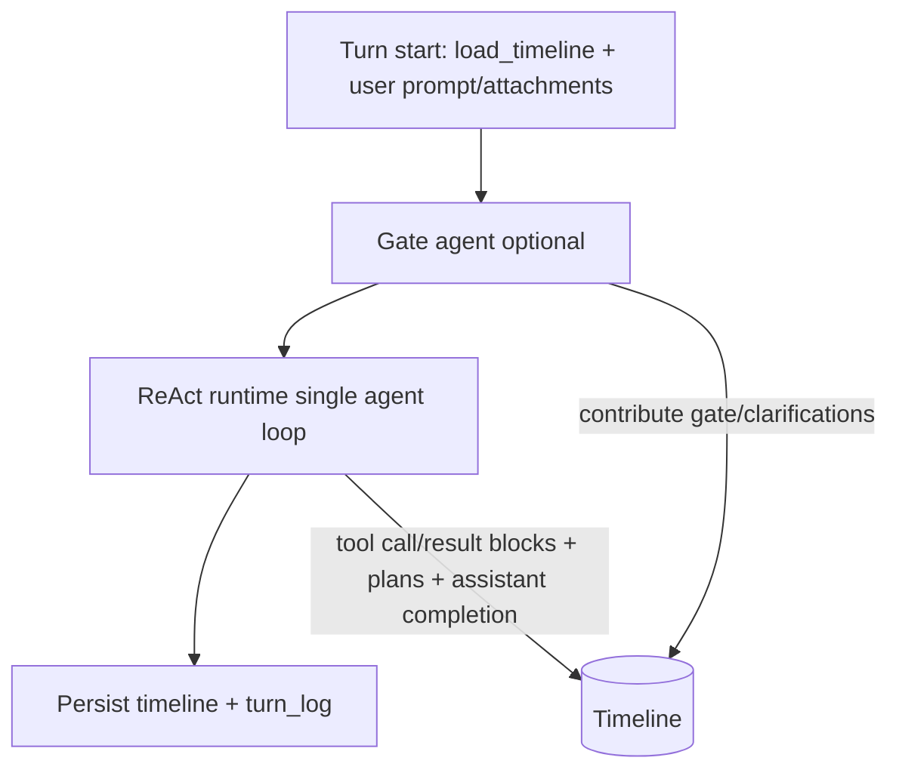

# End‑to‑end flow (react v2)

This document provides a high‑level view of the turn lifecycle and how the React runtime
interacts with the timeline. We currently support a **single agent loop** on the shared
timeline (React). Gate is optional and only runs on new conversations to set the title.

## ASCII diagram

```
┌────────────────────────────────────────────────────────────────────────────┐
│ Turn start                                                                 │
│  - BaseWorkflow.start_turn                                                   │
│  - ctx_browser.load_timeline() -> _ensure_workspace() -> Timeline.load/persist│
│  - contribute user prompt + attachments                                      │
└───────────────┬────────────────────────────────────────────────────────────┘
                │
                ▼
┌────────────────────────────────────────────────────────────────────────────┐
│ Gate agent (optional; new conversation only)                                 │
│  - timeline.render(include_sources=false, include_announce=false)            │
│  - emits gate block (+ clarifications) into timeline                         │
└───────────────┬────────────────────────────────────────────────────────────┘
                │
                ▼
┌────────────────────────────────────────────────────────────────────────────┐
│ ReAct runtime                                                                │
│  - decision loop uses timeline.render(include_sources=true, include_announce=true)
│  - each tool call contributes:                                               │
│      • react.tool.call                                                      │
│      • react.tool.result (+ artifacts blocks)                               │
│      • react.notice on protocol/errors                                      │
│  - plan acknowledgements add:                                                │
│      • react.plan.ack (text)                                                 │
│      • updated react.plan (JSON snapshot)                                    │
│  - final answer produced by React and stored as assistant.completion          │
└───────────────┬────────────────────────────────────────────────────────────┘
                │
                ▼
┌────────────────────────────────────────────────────────────────────────────┐
│ Turn end                                                                     │
│  - persist timeline                                                          │
│  - write turn_log (current‑turn blocks only)                                 │
└────────────────────────────────────────────────────────────────────────────┘
```

## Mermaid diagram



## Referent flow (current)

The reference implementation is:
`kdcube_ai_app/apps/chat/sdk/examples/bundles/react@2026-02-10-02-44/orchestrator/workflow.py`

Key points:
- Gate runs only for new conversations (title extraction).
- React is the sole agent loop.
- No coordinator or separate final‑answer generator.

## Turn Start With `workspace_implementation=git`

When a turn starts in `git` workspace mode, the important sequence is:

1. `BaseWorkflow.start_turn(...)` prepares `RuntimeCtx`
   - includes:
     - `turn_id`
     - `user_id`
     - `conversation_id`
     - `workspace_implementation="git"`
     - `workspace_git_repo`

2. `ContextBrowser.load_timeline()` begins
   - before loading timeline payloads, it calls `_ensure_workspace()`

3. `_ensure_workspace()` bootstraps the current turn workspace
   - if `workspace_implementation != "git"`, nothing special happens here
   - if `workspace_implementation == "git"`, runtime calls:
     - `ensure_current_turn_git_workspace(...)`

4. `ensure_current_turn_git_workspace(...)` prepares the local repo surface
   - resolves the shared workspace cache under:
     - `.react_workspace_git/<tenant>__<project>__<user>__<conversation>/repo`
   - clones the configured workspace repo if the cache repo does not exist yet
   - otherwise updates the cache repo remote URL and fetches from origin
   - tries to fetch the current conversation lineage branch into a local lineage ref
   - creates the current turn root:
     - `out/<turn_id>/`
   - initializes that turn root as a real local git repo
   - configures local git identity
   - enables sparse checkout with an empty sparse spec
   - adds the cache repo as local `origin`
   - if a lineage branch exists:
     - fetches it into local branch `workspace`
     - checks out `workspace`
   - if no lineage branch exists yet:
     - checks out an orphan `workspace` branch

5. Timeline load continues
   - latest timeline artifact is loaded
   - latest sources pool is loaded
   - the in-memory `Timeline` is initialized

6. User prompt and attachments are contributed to the current turn

### Important semantic rule

At this point, in `git` mode:
- the current turn already has a real local git repo
- lineage history may already be available locally
- the worktree is still sparse
- project files are **not** eagerly materialized just because the repo exists

React must still bring content in intentionally:
- via `react.pull(paths=[fi:...])`
- or by using local git commands against the current-turn repo when appropriate

### What React sees operationally

During the decision loop, ANNOUNCE now includes a compact `[WORKSPACE]` section
that summarizes:
- implementation
- current turn root
- materialized turn roots
- current turn scopes
- in `git` mode:
  - `repo_mode`
  - `repo_status`
  - compact publish state

This is the intended orientation surface for sparse-workspace behavior.

### What does **not** happen automatically

When a turn starts in `git` mode, runtime does **not**:
- check out the whole project tree into the current turn
- pull hosted binaries as part of folder activation
- expose other users' or other conversations' history
- allow networked `git pull` / `git fetch` / `git push` from exec

That is deliberate. The repo is prepared at turn start, but content hydration
remains explicit and narrow.
