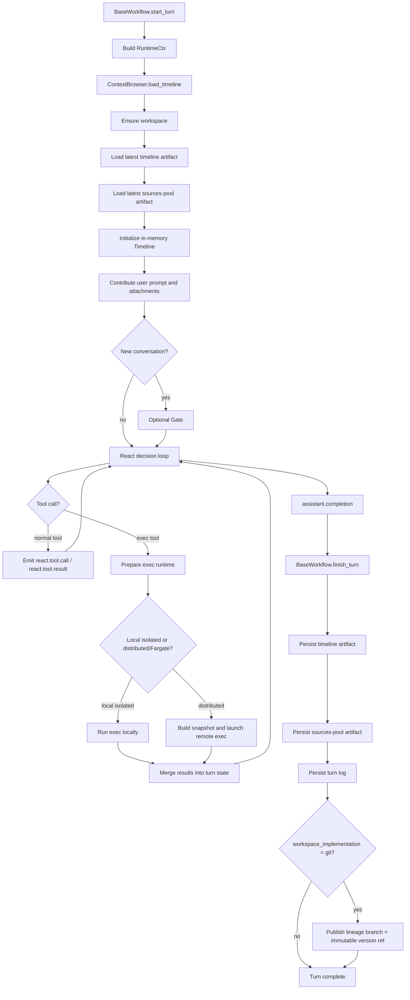
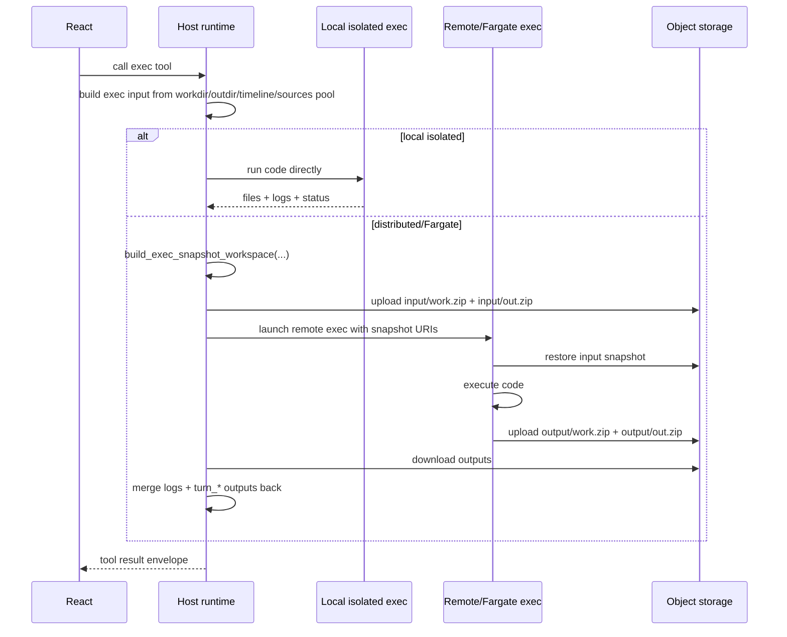

# End-to-end flow (React)

This document shows the shared React turn lifecycle:

- turn start
- workspace bootstrap
- timeline + sources-pool load
- prompt and attachment contribution
- optional gate pass
- React decision/tool loop
- optional isolated/distributed exec packaging
- turn finish, persistence, and optional git workspace publish

The reference implementation is still the single-agent React loop. Gate is optional and runs only for new conversations.

Version selection happens before the loop starts:

- `AI_REACT_AGENT_VERSION=v2|v3`
- `AI_REACT_AGENT_MULTI_ACTION=off|safe_fanout`

Current operational model:

- `v2` is production and keeps one action per response
- `v3` is experimental and may accept multiple requested actions in one response when `multi_action_mode=safe_fanout`
- even in `v3`, accepted multi-action bundles are still executed sequentially, not in parallel

## High-level lifecycle



## Start-of-turn sequence

### 1. Runtime context is built

`BaseWorkflow.start_turn(...)` builds `RuntimeCtx`.

Important fields include:
- `turn_id`
- `tenant`
- `project`
- `user_id`
- `conversation_id`
- `workspace_implementation`
- `workspace_git_repo` when `workspace_implementation="git"`

### 2. Workspace is prepared before timeline load completes

`ContextBrowser.load_timeline()` begins by calling `_ensure_workspace()`.

#### `custom` workspace mode

No special git bootstrap happens here.

The workspace remains the normal turn-local execution tree.
Historical files are materialized explicitly through `react.pull(...)`.
The active current-turn workspace is seeded explicitly through `react.checkout(...)`.

#### `git` workspace mode

`ensure_current_turn_git_workspace(...)` prepares a sparse local repo for the current turn.

Current behavior:
- a lineage-only bare mirror is maintained under:
  - `.react_workspace_git/<tenant>__<project>__<user>__<conversation>/lineage.git`
- that mirror points at `REACT_WORKSPACE_GIT_REPO`
- the mirror fetches only the current lineage branch into local `refs/heads/workspace`
- the current turn root is created under:
  - `out/<turn_id>/`
- that turn root is initialized as a real local git repo
- sparse checkout is enabled with an empty sparse spec
- the turn repo fetches only the mirror's `workspace` branch
- the turn repo keeps no configured remote

Important semantic rule:
- the repo shell/history may exist at turn start
- the worktree is still sparse
- project content is not eagerly materialized
- React must still materialize historical/reference slices explicitly with `react.pull(...)`
- React must explicitly seed the active current-turn workspace with `react.checkout(...)` when it needs a runnable/searchable/testable project tree

### 3. Timeline and sources pool are loaded

After workspace preparation:
- latest `artifact:conv:timeline` is loaded
- latest `artifact:conv:sources_pool` is loaded
- the in-memory `Timeline` is initialized
- the current-turn header is ensured

This is important because the React prompt surface is not only timeline blocks. The sources pool is also reattached at start and remains part of the active context layout.

### 4. User prompt and attachments are contributed

The current turn receives:
- user prompt block
- any attachment/file contributions

At this point the new turn is ready for the agent loop.

## What React sees before acting

By the time the decision loop starts, React can see:
- the current timeline view
- the latest sources pool
- ANNOUNCE

ANNOUNCE now includes a compact `[WORKSPACE]` section. It is the operational workspace orientation surface.

Current `[WORKSPACE]` content is compact and may include:
- `implementation`
- `current_turn_root`
- `materialized_turn_roots`
- `current_turn_scopes`
- in `git` mode, `ls workspace`
- in `git` mode:
  - `repo_mode`
  - `repo_status`
- compact publish status

The intended sparse-workspace behavior is:
1. read `[WORKSPACE]` first
2. if already-local files are enough, work directly there
3. if historical/reference files are needed, call `react.pull(...)`
4. if the active project tree is needed in `turn_<current>/files/...`, call `react.checkout(mode="replace", ...)`
5. if only selected historical files need to be imported or overwritten into the existing workspace, call `react.checkout(mode="overlay", ...)`
6. in `git` mode, use local git commands only after understanding that the worktree may still be sparse
7. when continuing an existing project, keep working inside the established top-level scope unless you are intentionally renaming the project scope
8. if `[WORKSPACE]` shows existing top-level scopes for the project you are continuing, keep editing inside that established scope instead of inventing a sibling folder

## Gate and decision loop

### Optional gate

For new conversations, Gate may run first to establish title or clarifications.

Gate contributes its own blocks to the same timeline.

### React decision loop

React is the main single-agent loop.

It renders with:
- timeline
- sources pool
- ANNOUNCE

Typical loop behavior:
- produce tool call
- runtime emits `react.tool.call`
- tool executes
- runtime emits `react.tool.result`
- React continues until it emits final answer

Plans and notices are also added as timeline blocks when relevant.

## Workspace activation during the loop

Historical/project content is not assumed to be present locally.

The historical-materialization tool is:

```json
{"tool_id":"react.pull","params":{"paths":["fi:<turn_id>.files/<scope>/<path-or-prefix>"]}}
```

Rules:
- folder pulls bring git-tracked text content only
- exact binary refs may be pulled point-wise
- historical files are not auto-hydrated for exec or cross-turn patching
- if React wants historical files, it must pull them first

This rule is enforced in runtime and stated in the agent instructions.

Important distinction:
- `react.pull(...)` materializes a historical snapshot view under the referenced version path such as:
  - `out/<older_turn>/files/...`
- the active editable workspace in `git` mode remains:
  - `out/<current_turn>/files/...`
- React should treat `out/<current_turn>/files/...` as its main project tree for the turn.

If React wants the active current-turn workspace itself to contain a runnable,
searchable, or testable project snapshot, it should use:

```json
{"tool_id":"react.checkout","params":{"paths":["fi:<turn_id>.files/<scope-or-path>"]}}
```

`react.checkout(mode="replace", ...)` replaces `out/<current_turn>/files/`,
then applies the requested `fi:<turn_id>.files/...` refs in order.
`react.checkout(mode="overlay", ...)` keeps `out/<current_turn>/files/` and
imports or overwrites only the selected historical files/scopes on top.
This is the normal way to seed or selectively extend the active workspace from
historical/project state; `react.pull(...)` remains historical side
materialization only.

## Exec tool branch

When React calls the Python exec tool, there are two broad paths:

- local isolated execution
- distributed execution such as Fargate

In both cases the semantic contract returned to React is the same. What changes is how the workspace is packaged and executed.

### Local isolated exec

Runtime prepares the local exec environment and runs the code without remote transport.

If referenced paths belong to a git-backed turn root:
- the whole `out/<turn_id>/` tree is copied into the exec snapshot
- this preserves `.git`

That allows local git commands inside exec to work against the current lineage repo without exposing broader metadata.

### Distributed/Fargate exec

When remote execution is selected, runtime first builds a lightweight exec snapshot with `build_exec_snapshot_workspace(...)`.

Current snapshot behavior:
- copy full `work/`
- build filtered `out/timeline.json`
- include the current sources pool in that filtered snapshot
- include only referenced files needed by code or `fetch_ctx`
- if a referenced path belongs to a git-backed turn root, copy the whole `out/<turn_id>/` tree so `.git` survives remotely
- write `out/exec_snapshot_manifest.json`

Then:
- snapshot zips are uploaded
- remote executor restores them into `/workspace/work` and `/workspace/out`
- code runs remotely
- output zips are uploaded back
- host merges results back selectively

Important merge rules:
- `logs/*` are appended
- `turn_*` trees are copied back
- `timeline.json` is not overwritten
- `sources_pool.json` is not overwritten

So timeline and sources-pool authority stays on host-side conversation state, while remote exec still returns produced artifacts and workspace outputs.

### Exec branch sequence



## Turn finish

After React emits its final answer:

1. `assistant.completion` is added
2. `BaseWorkflow.finish_turn(...)` runs
3. timeline artifact is persisted
4. sources-pool artifact is persisted
5. turn log is persisted

If `workspace_implementation="git"`:
- current-turn text workspace is staged
- a local commit is created if needed
- lineage branch is published
- immutable version ref for the current `turn_id` is published
- if publish fails, the turn fails

Publish observability is split:
- compact status in ANNOUNCE
- full metadata in internal `react.workspace.publish` blocks

## End-state guarantees

At the end of a successful turn:
- timeline is authoritative for conversational history
- sources pool is authoritative for source memory
- turn log is authoritative for current-turn auditability
- in `git` mode, textual workspace state is authoritative in the workspace git lineage
- hosted storage remains authoritative for binary artifacts and distributed exec snapshots

## Key operational rules

- React must not assume historical/project files are already local
- `react.pull(...)` is the historical materialization tool
- `react.checkout(...)` is the active workspace materialization tool
- in `git` mode, the turn repo is sparse by default
- git tools in exec can only operate on lineage-scoped metadata
- source pool is loaded at turn start and persisted again at turn finish
- distributed exec transports a filtered execution snapshot, not the full conversation state
