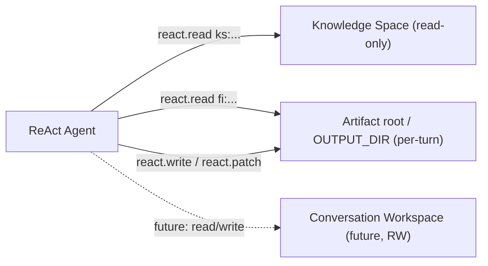

# ReAct v2 — Context + Turn Data

This doc is the single source of truth for what ReAct agents see and how context is built in v2.

---

## 1) What the Decision Agent Sees

The decision agent sees a **system message** and a **single human message** composed of blocks:

```
SYSTEM MESSAGE
  - policies + protocol
  - tool catalog
  - skills catalog
  - time guardrail

HUMAN MESSAGE
  - timeline blocks (history → current user → in‑turn progress)
  - optional sources pool (tail, uncached)
  - optional announce block (tail, uncached)
```

The human message blocks are created by `ContextBrowser.timeline(...)`.

---

## 2) Timeline Block Layout (v2)

`ContextBrowser.load_context(...)` builds and caches:
- **history blocks** (prior turns + summaries)
- **current turn user blocks** (user prompt + attachments)

Agents then append **in‑turn progress blocks** via `ContextBrowser.contribute(...)`.

Final timeline order:
```
[HISTORY BLOCKS]
[CURRENT TURN USER BLOCKS]
[TURN PROGRESS LOG]
[SOURCES POOL]   (optional, uncached)
[ANNOUNCE]       (optional, uncached)
```

Block formatting lives in:
- `src/kdcube-ai-app/kdcube_ai_app/apps/chat/sdk/solutions/react/layout.py`

---

## 2.5) Data Spaces (Knowledge vs Artifact Root vs Future Workspace)

ReAct interacts with **three data spaces**. Only two exist today:

- **Knowledge Space** (`ks:`) — read‑only reference files prepared by the system (docs, indexes, cloned repos).
- **Artifact root / OUTPUT_DIR** (`fi:`) — per-turn execution output and hosted artifacts (read/write during the turn).
- **Conversation Workspace** (future) — shared, writable workspace across turns (not implemented yet).



Notes:
- **Knowledge Space** is **read‑only** and accessed via `ks:<relpath>`.
- **OUTPUT_DIR** is where tools write artifacts during a turn. It points to the artifact root (`out/workdir` in local host storage). Turn outputs map to `fi:<turn_id>.files/...` or `fi:<turn_id>.outputs/...`, and readable artifact files can be loaded with `fi:<artifact-root-relative-path>`.
- Runtime metadata such as `timeline.json`, `tool_calls_index.json`, tool-call JSON, and logs lives in the sibling runtime root `out/`; it is platform state, not the normal agent artifact namespace.
- **Conversation Workspace** will be the long‑lived, writable project state for copilot‑style flows.

Other owner-domain namespaces can also become readable context when their
owning module registers an event-source reader. Examples are `mem:` for memory
items and `cnv:` for canvas boards. In that case the decision agent still uses
`react.read(paths=[...])`; the namespace owner resolves the ref and its
event-source policies render the blocks.

---

## 3) In‑turn Progress Blocks

Any agent can append progress blocks (gate/coordinator/react/etc.).
These represent work done **so far** in response to the current request.

```
ctx_browser.contribute(
    scratchpad=scratchpad,
    blocks=[...],
    persist=True,  # store in turn log
)
```

If `persist=True`, blocks are written to the turn log blocks.

---

## 4) Compaction

If the timeline is too large:
- `timeline(force_sanitize=True)` compacts the context and inserts `conv.range.summary`.
- Summaries are stored in the index, **not** in the turn log.

Compaction can happen mid‑turn and rewrites the cached stream.

See: `context-progression.md` + `context-caching-README.md`.

---

## 5) Turn Log (v2)

Turn log is persisted as a single JSON artifact (`artifact:turn.log`).
It is the source of truth for next‑turn reconstruction.

Minimal schema:
```
{
  "turn_id": "...",
  "ts": "...",
  "user": {
    "prompt": "...",
    "prompt_summary": "...",
    "attachments": [ ... ]
  },
  "assistant": {
    "completion": "...",
    "files": [ ... ],
    "blocks": [ ... ],
    "react_state": { ... }
  }
}
```

See: `turn-log-README.md` and `turn-data-README.md`.

---

## 6) Coordinator (v2)

Coordinator is a planning agent only:
- emits plan steps + budgets
- produces `instructions_for_downstream`
- no contract/slots in v2

Its output is contributed to the timeline as an in‑turn progress block.

---

## 7) Reference Docs

- `context-layout.md`
- `context-progression.md`
- `context-caching-README.md`
- `react-tools-README.md`
- `turn-log-README.md`
- `turn-data-README.md`
- `conversation-artifacts-README.md`
