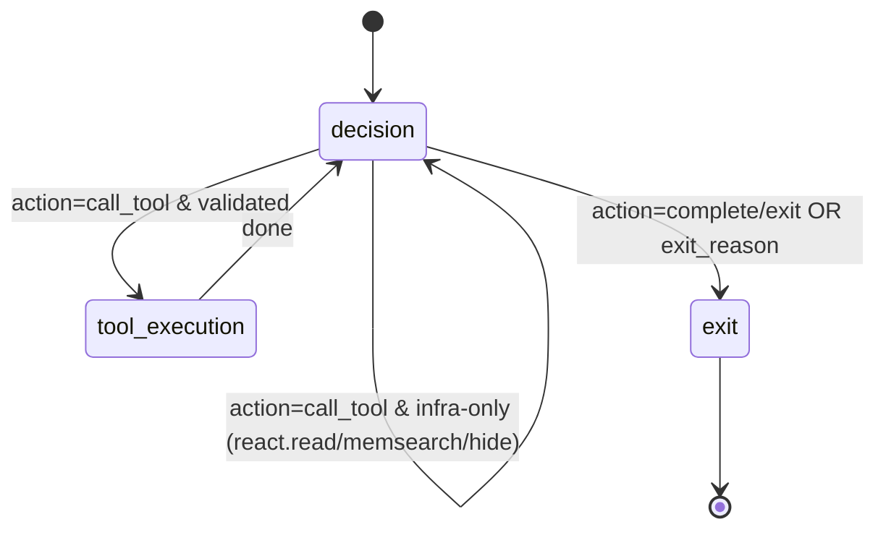

# ReAct v2 State Machine

This describes the current React runtime loop and its control gates.
The state-machine shape is shared by `v2` and `v3`. `v3` additionally brings:
one decision generation may emit multiple action-channel instances governed
ONLINE (the action overseer accepts the first valid action and drops later
candidates incompatible with already-accepted moves), early tool execution
(accepted tool actions may start while the generation still streams, drained
before the round closes), and steer checkpoints (a live steer cancels the
active decision and routes the turn into a finalize phase).

---

## High‑Level Loop

The ReAct loop is a state machine with these nodes:
- `decision`
- `tool_execution`
- `exit`

Each iteration starts at `decision` and typically follows:

```
decision -> tool_execution -> decision
```

The loop exits when `exit_reason` is set or the iteration/budget is exhausted.

---

## Mermaid Diagram



Notes:
- Infra tools (`react.read`, `react.memsearch`, `react.hide`) are handled in‑loop and return to `decision` without a tool_execution pass (react.hide uses logical paths, not queries).
- Tool call protocol validation happens inside the decision node (no separate protocol state).

---

## Decision Node (Core Rules)

The action set is `call_tool | complete | exit`. Decision output is validated
and may be rejected when:
- the response carries text before the first channel
  (`decision_preamble_before_first_channel`) or does not open with
  `<channel:thinking>` / misses required channels
- the action JSON does not parse or validate (`action_schema_error`)
- `tool_call.tool_id` is missing for `call_tool`
- the action is incompatible with the round's strategy/trait gates

If invalid, a **protocol violation block** is contributed and the loop returns
to `decision` (bounded by the retry/iteration gates).

### Streaming and failed rounds (critical)

Decision channels stream to the USER while generation is still running.
Enforcement is ordered:

1. **Online ReAct prefix guard:** the raw-delta callback permits leading
   whitespace and then requires `<channel:thinking>`. An impossible prefix
   raises `StreamPolicyViolation` before the generic parser, subscribers, or
   early tool execution can observe it.
2. **Online action overseer:** each action candidate is judged immediately
   for strategy/trait compatibility. Only accepted gated lanes can emit.
3. **Post-stream defense:** the complete response is checked again; action
   JSON is parsed and validated, and channel/action consistency is enforced.

Two invariants follow:

- **Incremental and complete-response parsers agree on JSON container
  boundaries.** This includes JSON beginning on the opening fence line and a
  complete fenced JSON wrapper emitted on one physical line.
  Both shapes are locked in `streaming/test_fenced_action_parsing.py` because
  disagreement here can otherwise turn one delivered answer into a retry and
  a duplicate.
- **Delivery facts determine retry behavior.** If an allowed final-answer
  lane already emitted and a post-stream check then fails,
  `_keep_and_stop_if_answer_streamed` finalizes with that exact emitted text.
  It does not ask the model to repeat the answer. Progress without a final
  answer remains progress and follows the normal notice/retry path.

### Completion rounds
A `complete`/`exit` round carries the user-facing `final_answer` and exactly
one `<channel:summary>` for continuity; plan progress is acknowledged in
`notes` as steps become verifiable (inaccurate marks are protocol errors).

## Plan Acknowledgement Notes
The decision must acknowledge plan progress in `notes`:
- **DONE**: `✓ [n] <step>`
- **FAILED**: `✗ [n] <step> — <reason>`
- **IN PROGRESS**: `… [n] <step> — in progress` (does not change status)

Acknowledgements are appended to the turn progress log as `react.decision` blocks.
These blocks are visible to the decision on subsequent rounds so it can track prior notes.

---

## Budget + Iteration Gates

The loop uses `BudgetStateV2`:
- `exploration_budget` / `exploitation_budget`
- `explore_used` / `exploit_used`
- `max_iterations`
- `decision_rounds_used`

Hard stop:
- if `decision_rounds_used >= max_iterations` ⇒ exit with `max_iterations`

Important nuance:
- `max_iterations` is not always static for the whole turn.
- the runtime starts from `base_max_iterations`
- when the active turn consumes a live reactive external event such as `followup`, it may mint extra iteration credit
- that raises the effective `max_iterations` before the next decision gate
- the extra credit is capped by `reactive_iteration_credit_cap`

The budget snapshot is exposed to the decision agent in the timeline’s active state block.

---

## Compaction in the Loop

Compaction can happen **inside the loop** when `timeline(...)` is requested:
- if context size exceeds limits, the browser compacts and inserts a `conv.range.summary`
- the loop retries with `force_sanitize=True` on context‑limit errors

Compaction emits hooks (optional):
- `on_before_compaction` (start status)
- `on_after_compaction` (finish status + stats)

---

## Tool Execution Path

For `action=call_tool`:
1) `decision` validates tool call structure.
2) `tool_execution` executes the tool.
3) Results are converted into contribution blocks (`react.tool.call` / `react.tool.result`).

Artifacts are registered as files (kind=file or kind=display) and stored in the outdir.

---

## Exit Reasons

Common exit reasons:
- `complete`
- `max_iterations`
- `protocol_violation`
- `tool_error`

---

## Where Context Lives

All context is provided by `ContextBrowser.timeline(...)`:
- history blocks
- current user blocks
- in‑turn progress blocks
- optional sources pool / announce (tail, uncached)

See:
- `context-layout.md`
- `context-progression.md`
- `react-context-README.md`
