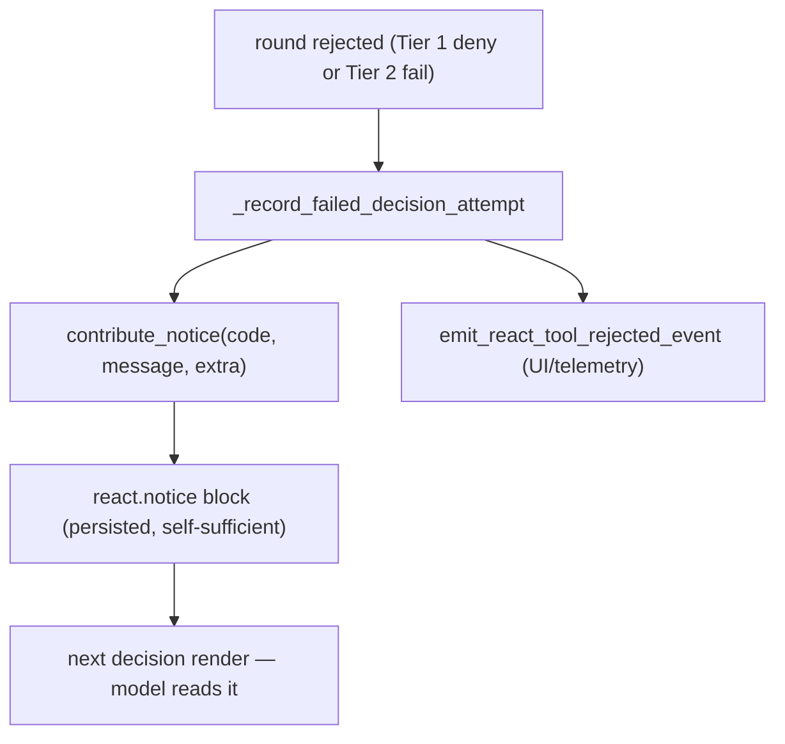

# Round Generation: real-time gating and feedback to the model

A ReAct decision round is a single streamed model response. Its channels are
parsed **as they stream**, checked **while they stream**, and — crucially —
some of them **reach the user while the model is still generating**. This
document explains how the runtime detects problems in real time, what the
user sees versus what is caught first, and how every interruption or
rejection is reported back to the model.

The governing principle, stated once:

> **The harness must be fully transparent to the model about what was done
> with its output.** No silent re-runs, no silent drops. The brain must know
> what the hand did — otherwise it cannot make the right next move.

---

## 1. The two-tier gate (not "validate after generation")

A common mental model — "the model generates, then we validate" — is WRONG
for v3. Validation is two-tiered, and the first tier runs live:

```
  model tokens ─────────────────────────────────────────────▶ time
       │
       ▼
  ┌──────────────────────────────────────────────────────┐
  │  CHANNEL STREAM PARSER (char-level)                    │
  │  splits <channel:thinking|action|code|summary>         │
  │  decodes the action JSON path incrementally            │
  └──────────────────────────────────────────────────────┘
       │                         │
       │ thinking / notes        │ action instance observed
       │ (stream immediately)    │ (action + tool_id known)
       ▼                         ▼
  ┌───────────────┐        ┌──────────────────────────────┐
  │ USER TIMELINE │        │  TIER 1 — ACTION OVERSEER      │  ◀── ONLINE
  │ (live)        │        │  strategy/trait compatibility  │      (real time)
  └───────────────┘        │  vs already-accepted actions   │
                           └──────────────────────────────┘
                                 │ allow          │ deny
                                 ▼                ▼
                           ┌───────────┐    ┌──────────────┐
                           │ ANSWER    │    │  buffer       │
                           │ LANE →    │    │  DROPPED —    │
                           │ USER      │    │  never shown  │
                           │ (live)    │    └──────────────┘
                                 │
        ── generation ends ──────┼─────────────────────────────
                                 ▼
                           ┌──────────────────────────────┐
                           │  TIER 2 — SHAPE + SCHEMA        │  ◀── POST HOC
                           │  channel order, required        │      (after gen)
                           │  channels, JSON parse/validate  │
                           └──────────────────────────────┘
```

- **Tier 1 (online, the action overseer).** Each action instance is judged
  the instant its `action` + `tool_id` are known — for strategy/trait
  compatibility against actions already accepted this round. Its output lane
  streams to the user **only if allowed**. A denied candidate is buffered and
  never reaches the user.
- **Tier 2 (post hoc, shape + schema).** After generation ends, the channel
  shape (preamble, first-channel, required channels) and the action JSON
  (parse + `Action` model validation) are checked.

The consequence that drives everything below: **a round can pass Tier 1,
stream its answer to the user, and still fail Tier 2.** When that happens the
streamed text stays on the user's screen — it cannot be unsent.

Code: `solutions/react/v3/action_overseer.py` (Tier 1),
`solutions/react/v3/agents/decision.py` `validate_decision_protocol_shape`
and the `Action` model (Tier 2), `solutions/react/v3/runtime.py` (the
decision node that wires both).

---

## 2. The action overseer up close (Tier 1)

The overseer holds one **gate** per lane of each observed action. A gate is a
tiny buffered valve:

```
  ObservedAction[i]
     ├── action_gate   (the action JSON lane)
     └── answer_gate   (the final_answer lane — user-visible)

  gate.status:  pending ──allow()──▶ allowed  ──▶ flush buffer + pass through
                   │
                   └────deny()───▶ denied   ──▶ drop buffered + swallow future
```

- While `pending`, deltas are **buffered** (not sent).
- `allow()` flushes the buffer and lets subsequent deltas pass to the user.
- `deny()` discards the buffer and swallows everything after — the user sees
  nothing from that lane.

`observe_action_signal(...)` fires as soon as an action instance is
recognized. The overseer resolves the action's strategy traits and decides:

- **Trait compatibility** — is this action compatible with the ones already
  accepted this round? (The strategy matrix; see
  `online-strategic-governance-README.md`.) Incompatible later candidate →
  `deny()`.
- **Answer-lane gate** — `_answer_gate_allowed`: a `final_answer` lane streams
  only when the action can legitimately close the turn. A `complete`/`exit`
  answer streams only when every action accepted so far is itself final or a
  neutral tool; otherwise the answer lane stays closed even though the action
  is observed.

```
  round with two observed actions:
     A0 = call_tool web_search   (exploration)   ── allowed
     A1 = complete final_answer  (final)          ── answer lane?
          _answer_gate_allowed(A1):
             A1.is_final and all-prior-are-final-or-neutral?
             A0 is exploration, NOT neutral  ──▶  answer lane DENIED
          the user does not see A1's final_answer;
          A1 is dropped as trait-incompatible with A0.
```

This is why "the model's answer streamed" is never an accident — it means the
overseer explicitly allowed that lane.

---

## 3. What the user saw — the load-bearing distinction

Every feedback decision downstream turns on ONE question: **did this
generation reach the user?** There are exactly two classes.

```
 ┌──────────────────────────────────────────────────────────────────────┐
 │ CLASS 1 — STREAMED (the user saw it)                                   │
 │  gated lanes the overseer ALLOWED and that emitted:                    │
 │    • thinking / notes (always stream; not action-gated)               │
 │    • an allowed final_answer lane                                      │
 │  → the text is on the user's screen; it cannot be unsent              │
 │  → feedback names what the user saw; if a final answer exists,        │
 │    KEEP IT AND STOP (§5)                                               │
 ├──────────────────────────────────────────────────────────────────────┤
 │ CLASS 2 — NEVER REACHED THE USER                                      │
 │  • preamble before the first channel (rejected on sight)              │
 │  • overseer-DENIED action candidates (buffer discarded)              │
 │  • a tool_call rejected before execution (nothing user-visible)      │
 │  → feedback is ONLY the fact of the rejection + the structured        │
 │    self-diagnosis; NEVER an echo of the dropped text (§6)             │
 └──────────────────────────────────────────────────────────────────────┘
```

The two classes get fundamentally different feedback. Conflating them is the
bug: telling the model "the user saw X" when they didn't is as harmful as
silence — a wrong "already streamed" claim plants a false belief. Feedback
must come from REAL streamed state, never a guess.

---

## 4. How feedback is delivered — `react.notice`

All feedback to the model is a **`react.notice`** block contributed into the
timeline. It is a first-class, persisted timeline block — not a transient
debug line — so it survives into the next decision render.

`ContextBrowser.contribute_notice(code, message, extra, call_id, meta)`
builds the block. The mechanic that matters:

```
  payload = { "code": code, "message": message }
  payload.update(extra)          # ← the whole extra dict is merged in
  block.text = json.dumps(payload, indent=2)   # ← serialized verbatim
```

So the notice the model reads carries, inline and in full: the `code`, the
human `message`, AND every structured field passed as `extra` — `tool_id`,
`index`, the concrete `violations` list, `parser_error`, `diagnostic_excerpt`.
**The notice is self-sufficient by construction.**

Why self-sufficiency is mandatory, not a nicety:

```
  react.decision.raw  (the model's raw generation)
     → DEBUG ONLY.  Filtered out in production.
     → in production the model does NOT get its raw generation back.
  react.notice
     → PERSISTED.  The only thing the model receives about a failed round.
```

The notice must therefore carry the decisive diagnosis itself — never lean on
raw steps that production strips away.



---

## 5. Class 1: streamed-then-failed → keep it and stop

The incident that defined this path: a model emitted a valid `complete` whose
`final_answer` the overseer allowed and streamed to the user — then Tier 2's
JSON parse failed on a fence quirk (see
[fence-bug-problem](../../../../deployment/cicd/kdcube/procedures/agents/skills/explain-the-issues-and-fixes/example/fence-bug-problem.md)).
The old behavior retried blindly; the model, never told its answer had
already shown, answered again → **duplicate on the user's screen.**

The rule: **we have the answer? that's it — keep it and stop.**

```
  action=complete, final_answer STREAMED, Tier 2 parse FAILS
        │
        ▼
  salvage the streamed final_answer text
        │
        ▼
  DO NOT retry the model.  Synthesize the complete the model meant:
      action=complete, final_answer=<salvaged>, attributed to THIS lineage
        │
        ▼
  return through the NORMAL completion path
        │
        ├── pending live events?  → fold them, continue (new lineage)
        └── none?                 → the turn ends here
```

The single legitimate reason to continue after a salvaged answer is **more
events to process** — handled for free because we return through the normal
completion path, which already folds pending events.

Scope discipline (a turn has as many final answers as live events produce —
there is **no** "turn final answer"): the salvage is valid ONLY between a
failed round and its immediate retry within the **same completion lineage**.
Any accepted live event clears it; a fresh non-empty close supersedes it.

```
  lineage boundary example (why per-turn salvage is WRONG):

    round R1: answer A streams, Tier 2 fails      salvage = A
    followup folds ─────────────────────────────  salvage = ""   ← cleared
    round R2 (new lineage): model closes empty     → NOT backfilled with A
```

If the model is nonetheless asked to close (any path still reaching a retry),
the notice tells it the answer already streamed and invites an **empty
close** — the platform keeps the streamed text; the model need not repeat it.
An empty `final_answer` on `complete`/`exit` is ACCEPTED when a live salvage
is on record (else `final_answer_required` holds as before).

Code: `runtime.py` — the `action_schema_error` branch (finalize-instead-of-
retry) and `_validate_decision` (empty-close acceptance + lineage clears).

---

## 6. Class 2: never-reached-the-user → the fact + the diagnosis

These rounds produced nothing the user saw. The model gets **only** that it
happened and the structured reason — never a replay of the dropped content.

| Code | What happened | Reached user? | Notice carries |
| --- | --- | --- | --- |
| `decision_preamble_before_first_channel` | text before the first `<channel:...>` | no (rejected on sight) | the bare fact + preamble length/preview for self-correction |
| `decision_first_channel_not_thinking` | first channel wasn't `thinking` | no | the fact + which channel opened |
| `decision_missing_protocol_channels` | required channels absent | no (for the action) | the fact + which channels are missing |
| `tool_call_invalid` | tool call failed protocol validation | no (rejected before execution) | `tool_id` + concrete `violations` list |
| `tool_signature_red` | tool params failed signature validation | no | `tool_id` + signature diagnosis |
| `tool_not_allowed_in_react` | tool not permitted in the loop | no | `tool_id` + the constraint |

The key property, already guaranteed by §4: for `tool_call_invalid` the
`extra` carries `{index, tool_id, violations:[...]}`, all of which land in the
model-visible notice JSON. The model sees exactly which tool and which rule —
no raw-step dependency.

Preamble is the purest Class 2: the generation is interrupted the moment the
preamble is observed; there is nothing useful to hand back. Reporting the
dropped text would only replant what was just refused. Report the fact,
nothing more.

```
   ┌── Class 2 notice anatomy (tool_call_invalid) ──────────┐
   │ {                                                        │
   │   "code": "protocol_violation.tool_call_invalid",        │
   │   "message": "tool_call failed protocol validation …",  │
   │   "index": 0,                                            │
   │   "tool_id": "web_tools.web_search",                     │
   │   "violations": ["param 'queries' must be a list", …]   │  ← the diagnosis
   │ }                                                        │     travels inline
   └──────────────────────────────────────────────────────────┘
```

---

## 7. Interruptions that are not the model's fault

Not every "problem" is a protocol violation. Two runtime interruptions must
also be reported to the model, honestly:

- **`max_tokens` truncation.** The generation was cut off by the token
  budget, not by the model's choice. The model must be told the completion
  was truncated (so it does not treat a half-written artifact as finished),
  and it must be logged with evidence. Silent truncation makes the model —
  and the user — guess.
- **Steer cancel + finalize.** A live steer cancels the active decision and
  routes the turn into a finalize phase. The finalizing model should know
  what the cancelled decision had already shown the user (Class 1 content
  from the cancelled round), so its wrap-up neither repeats nor contradicts
  visible work.

Both are the same principle as §5–§6: the effect happened; the model is told
the fact from real state.

---

## 8. The per-code decision map (summary)

```
  a round finished / was interrupted
        │
        ├─ passed Tier 1 + Tier 2 ─────────────▶ execute / complete normally
        │
        ├─ Tier 2 parse fail, answer STREAMED ─▶ CLASS 1: keep it and stop (§5)
        │                                         salvage + finalize, no re-kick
        │
        ├─ preamble / shape, nothing shown ────▶ CLASS 2: fact only (§6)
        │
        ├─ tool_call_invalid / signature ──────▶ CLASS 2: fact + structured
        │                                         diagnosis in the notice (§6)
        │
        ├─ overseer denied a candidate ────────▶ CLASS 2: the drop is reported,
        │                                         no echo of the dropped text
        │
        └─ max_tokens / steer cancel ──────────▶ report the interruption fact
                                                  from real state (§7)
```

---

## 9. What is complete vs. what remains

**Complete and shipped:**
- Two-tier gating (overseer online + shape/schema post hoc).
- `react.notice` self-sufficiency (structured `extra` merged into the
  model-visible block).
- Class 1 keep-and-stop for `action_schema_error` with a streamed answer,
  scoped per completion lineage; empty-close acceptance.
- Class 2 structured diagnosis already carried for tool-call codes.

**Remaining (the transparency generalization):**
- **Per-lane streamed-state in the decision packet.** Today the runtime infers
  "the answer streamed" from the raw for `action_schema_error` only. The
  general build records, per lane and per action instance, whether the
  overseer allowed it and how much text emitted — so EVERY code can be placed
  into Class 1 vs Class 2 from FACT, not inference, and keep-and-stop can
  extend to the mixed shape codes (e.g. a missing-summary round whose answer
  lane did stream).
- **Steer-finalize disclosure.** State to the finalizing model what the
  cancelled decision already showed (needs the per-lane state above).
- **`max_tokens` in-band notice.** A first-class truncation notice on the
  same `react.notice` seam.

The design constraints for that work are fixed: feedback from REAL streamed
state (never guesses); Class 1 discloses what the user saw and stops when an
answer exists; Class 2 gives the fact plus self-sufficient diagnosis and never
echoes dropped content; no UI dedup tricks. The brain must always know what
the hand did.
