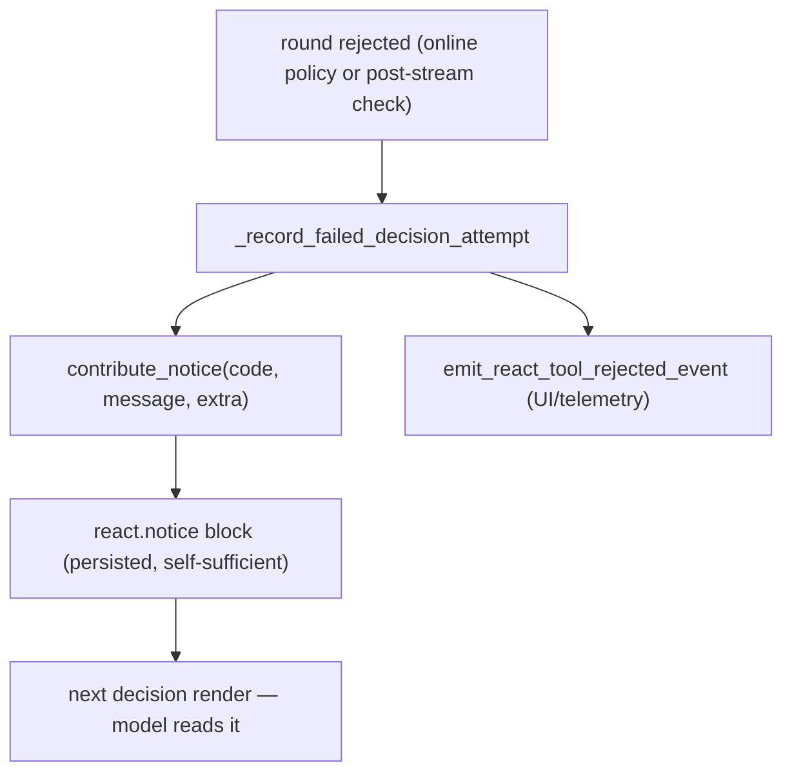

# Round Generation: real-time gating and feedback to the model

A ReAct decision round is a single streamed model response. Its channels are
parsed **as they stream**, checked **while they stream**, and — crucially —
some of them **reach the user while the model is still generating**. This
document explains how the runtime detects problems in real time, what the
user sees versus what is caught first, and how every interruption or
rejection is reported back to the model.

The governing principle, stated once:

> **The harness must be fully transparent to the model about what was done
> with its output.** No silent re-runs, no silent drops. The brain must know
> what the hand did — otherwise it cannot make the right next move.

---

## 1. Enforcement order (not "validate after generation")

A common mental model — "the model generates, then we validate" — is WRONG
for v3. Two boundaries enforce policy online before the post-stream defense:

```
  model tokens ─────────────────────────────────────────────▶ time
       │
       ▼
  ┌──────────────────────────────────────────────────────┐
  │  REACT PREFIX GUARD — ONLINE                          │
  │  leading whitespace + first <channel:thinking>        │
  └──────────────────────────────────────────────────────┘
       │ valid                       │ invalid
       ▼                             └─▶ interrupt provider stream
  ┌──────────────────────────────────────────────────────┐
  │  CHANNEL STREAM PARSER (char-level)                    │
  │  splits <channel:thinking|action|code|summary>         │
  │  decodes the action JSON path incrementally            │
  └──────────────────────────────────────────────────────┘
       │                         │
       │ thinking / notes        │ action instance observed
       │ (stream immediately)    │ (action + tool_id known)
       ▼                         ▼
  ┌───────────────┐        ┌──────────────────────────────┐
  │ USER TIMELINE │        │  ACTION OVERSEER               │  ◀── ONLINE
  │ (live)        │        │  strategy/trait compatibility  │      (real time)
  └───────────────┘        │  vs already-accepted actions   │
                           └──────────────────────────────┘
                                 │ allow          │ deny
                                 ▼                ▼
                           ┌───────────┐    ┌──────────────┐
                           │ ANSWER    │    │  buffer       │
                           │ LANE →    │    │  DROPPED —    │
                           │ USER      │    │  never shown  │
                           │ (live)    │    └──────────────┘
                                 │
        ── generation ends ──────┼─────────────────────────────
                                 ▼
                           ┌──────────────────────────────┐
                           │  POST-STREAM DEFENSE            │  ◀── AFTER GEN
                           │  full shape, JSON/Action model, │
                           │  channel/action consistency     │
                           └──────────────────────────────┘
```

- **Online prefix guard (owned by ReAct).** It consumes raw model deltas
  before the generic channel parser. Plain invalid text raises a generic
  stream-policy violation immediately; a wrong first channel is rejected when
  its opening tag completes. The provider stream unwinds, and no subscriber
  or early action path sees the rejected response.
- **Online action overseer.** Each action instance is judged
  the instant its `action` + `tool_id` are known — for strategy/trait
  compatibility against actions already accepted this round. Its output lane
  streams to the user **only if allowed**. A denied candidate is buffered and
  never reaches the user.
- **Post-stream defense.** After generation, the full response shape, action
  JSON (`Action` model), and channel/action consistency are checked again.

The consequence that drives everything below: **a round can pass both online
boundaries, stream its answer, and still fail a post-stream check.** When that
happens the streamed text stays on the user's screen — it cannot be unsent.

Code: `solutions/react/v3/agents/decision.py`
`ReactDecisionPrefixGuard`, `validate_decision_protocol_shape`, and `Action`;
`streaming/workspace_streamer_v3.py` (raw policy propagation);
`solutions/react/v3/action_overseer.py`; and `solutions/react/v3/runtime.py`
(the decision node that wires them).

---

## 2. The action overseer up close

The overseer holds one **gate** per lane of each observed action. A gate is a
tiny buffered valve:

```
  ObservedAction[i]
     ├── action_gate   (the action JSON lane)
     └── answer_gate   (the final_answer lane — user-visible)

  gate.status:  pending ──allow()──▶ allowed  ──▶ flush buffer + pass through
                   │
                   └────deny()───▶ denied   ──▶ drop buffered + swallow future
```

- While `pending`, deltas are **buffered** (not sent).
- `allow()` flushes the buffer and lets subsequent deltas pass to the user.
- `deny()` discards the buffer and swallows everything after — the user sees
  nothing from that lane.

`observe_action_signal(...)` fires as soon as an action instance is
recognized. The overseer resolves the action's strategy traits and decides:

- **Trait compatibility** — is this action compatible with the ones already
  accepted this round? (The strategy matrix; see
  `online-strategic-governance-README.md`.) Incompatible later candidate →
  `deny()`.
- **Answer-lane gate** — `_answer_gate_allowed`: a `final_answer` lane streams
  only when the action can legitimately close the turn. A `complete`/`exit`
  answer streams only when every action accepted so far is itself final or a
  neutral tool; otherwise the answer lane stays closed even though the action
  is observed.

```
  round with two observed actions:
     A0 = call_tool web_search   (exploration)   ── allowed
     A1 = complete final_answer  (final)          ── answer lane?
          _answer_gate_allowed(A1):
             A1.is_final and all-prior-are-final-or-neutral?
             A0 is exploration, NOT neutral  ──▶  answer lane DENIED
          the user does not see A1's final_answer;
          A1 is dropped as trait-incompatible with A0.
```

This is why "the model's answer streamed" is never an accident — it means the
overseer explicitly allowed that lane.

---

## 3. What the user saw — the load-bearing distinction

The duplicate-prevention decision turns on one exact question: **did an
allowed final-answer lane reach the user?** There are three outcomes.

```
  final_answer emitted  → keep exact answer and stop (§5)
  progress only emitted → preserve progress + notice; retry when allowed
  no lane emitted       → notice only; retry when allowed
```

`thinking` is persisted through its own timeline path; it is not evidence that
a final answer streamed. Conflating progress with an answer is the bug.
Feedback must come from real delivery state, never a guess.

---

## 4. How feedback is delivered — `react.notice`

All feedback to the model is a **`react.notice`** block contributed into the
timeline. It is a first-class, persisted timeline block — not a transient
debug line — so it survives into the next decision render.

`ContextBrowser.contribute_notice(code, message, extra, call_id, meta)`
builds the block. The mechanic that matters:

```
  payload = { "code": code, "message": message }
  payload.update(extra)          # ← the whole extra dict is merged in
  block.text = json.dumps(payload, indent=2)   # ← serialized verbatim
```

So the notice the model reads carries, inline and in full: the `code`, the
human `message`, AND every structured field passed as `extra` — `tool_id`,
`index`, the concrete `violations` list, `parser_error`, `diagnostic_excerpt`.
**The notice is self-sufficient by construction.**

Why self-sufficiency is mandatory, not a nicety:

```
  react.decision.raw  (the model's raw generation)
     → DEBUG ONLY.  Filtered out in production.
     → in production the model does NOT get its raw generation back.
  react.notice
     → PERSISTED.  The authoritative diagnosis for the failed round.
```

The notice must therefore carry the decisive diagnosis itself — never lean on
raw steps that production strips away. Other effects that really occurred,
such as accepted tool results, remain in their own timeline blocks.



---

## 5. Final answer streamed, then rejected → keep it and stop

The incident that defined this path: a model emitted a valid `complete` whose
`final_answer` the overseer allowed and streamed to the user — then the
complete-response JSON parse failed on a fence quirk (see
[fence-bug-problem](../../../../deployment/cicd/kdcube/procedures/agents/skills/explain-the-issues-and-fixes/example/fence-bug-problem.md)).
The old behavior retried blindly; the model, never told its answer had
already shown, answered again → **duplicate on the user's screen.**

The rule: **we have the answer? that's it — keep it and stop.**

```
  action=complete, final_answer STREAMED, post-stream parse FAILS
        │
        ▼
  salvage the streamed final_answer text
        │
        ▼
  DO NOT retry the model.  Synthesize the complete the model meant:
      action=complete, final_answer=<salvaged>, attributed to THIS lineage
        │
        ▼
  return through the NORMAL completion path
        │
        ├── pending live events?  → fold them, continue (new lineage)
        └── none?                 → the turn ends here
```

The single legitimate reason to continue after a salvaged answer is **more
events to process** — handled for free because we return through the normal
completion path, which already folds pending events.

Scope discipline (a turn has as many final answers as live events produce —
there is **no** "turn final answer"): the salvage is valid ONLY between a
failed round and its immediate retry within the **same completion lineage**.
Any accepted live event clears it; a fresh non-empty close supersedes it.

```
  lineage boundary example (why per-turn salvage is WRONG):

    round R1: answer A streams, post-check fails salvage = A
    followup folds ─────────────────────────────  salvage = ""   ← cleared
    round R2 (new lineage): model closes empty     → NOT backfilled with A
```

The determination is FACT, not inference: the salvaged text is the
overseer's `streamed_state.answer_text` (§2) — exactly what the gate passed
to the user — carried on the decision packet. And the rule is not tied to one
code: `_keep_and_stop_if_answer_streamed` runs for post-stream rejection
branches (`action_schema_error` and packet channel-consistency/shape codes).
Any post-stream rejection whose answer already emitted finalizes with that
text; nothing emitted follows the normal notice/retry route. Online prefix
rejections happen before a channel lane exists and therefore cannot salvage
an answer.

If a path still reaches a retry, the notice tells the model the answer already
streamed and invites an **empty close** — the platform keeps the streamed
text. An empty `final_answer` on `complete`/`exit` is ACCEPTED when a live
salvage is on record (else `final_answer_required` holds as before).

Code: `runtime.py` — `_keep_and_stop_if_answer_streamed` (both rejection
branches), `_validate_decision` (empty-close acceptance + lineage clears);
`action_overseer.py` `streamed_state()`.

---

## 6. No final answer → preserve facts + add the diagnosis

These rounds produced no final answer. Progress that really streamed remains
in the timeline; rejected material is not promoted into a tool call/result.

| Code | What happened | Rejected material reached a user lane? | Notice carries |
| --- | --- | --- | --- |
| `decision_preamble_before_first_channel` | prefix became invalid | no; stream interrupted before parsing | fact + bounded prefix preview |
| `decision_first_channel_not_thinking` | first channel was not `thinking` | no; interrupted before its body | fact + detected channel |
| `decision_missing_protocol_channels` | no usable action shape | no action executed | post-stream shape diagnosis |
| `tool_call_invalid` | tool call failed protocol validation | no tool execution | `tool_id` + concrete `violations` list |
| `tool_signature_red` | tool params failed signature validation | no tool execution | `tool_id` + signature diagnosis |
| `tool_not_allowed_in_react` | tool not permitted in the loop | no tool execution | `tool_id` + the constraint |

The key property, already guaranteed by §4: for `tool_call_invalid` the
`extra` carries `{index, tool_id, violations:[...]}`, all of which land in the
model-visible notice JSON. The model sees exactly which tool and which rule —
no raw-step dependency.

Preamble is the cleanest no-effect case: generation is interrupted on the
first delta that cannot still become a valid prefix. The notice carries a
bounded diagnostic preview, not the rest of the rejected generation.

```
   ┌── Rejection notice anatomy (tool_call_invalid) ────────┐
   │ {                                                        │
   │   "code": "protocol_violation.tool_call_invalid",        │
   │   "message": "tool_call failed protocol validation …",  │
   │   "index": 0,                                            │
   │   "tool_id": "web_tools.web_search",                     │
   │   "violations": ["param 'queries' must be a list", …]   │  ← the diagnosis
   │ }                                                        │     travels inline
   └──────────────────────────────────────────────────────────┘
```

---

## 7. Interruptions that are not the model's fault

Not every "problem" is a protocol violation. Two runtime interruptions must
also be reported to the model, honestly:

- **`max_tokens` truncation.** The generation was cut off by the token
  budget, not by the model's choice. The model must be told the completion
  was truncated (so it does not treat a half-written artifact as finished),
  and it must be logged with evidence. Silent truncation makes the model —
  and the user — guess.
- **Steer cancel + finalize.** A live steer cancels the active decision and
  routes the turn into a finalize phase. What is ALREADY visible to the
  finalize decision, no extra work needed: the interrupted generation's raw
  (its `react.decision.raw` block is exempt from the debug filter when
  `meta.interrupted` — always rendered), AND any tool an accepted action
  already executed during streaming — its `react.tool.result` block is
  contributed by the tool handler itself (`add_block` →
  `ctx_browser.contribute`) at execution time, before the steer, so a
  parallel-executed tool's result survives the finalize path. The narrow
  final-answer delivery is separately recorded by the overseer gates in
  `streamed_state`; thinking remains on its normal timeline path.

Both are the same principle as §5–§6: the effect happened; the model is told
the fact from real state.

---

## 8. The per-code decision map (summary)

```
  a round finished / was interrupted
        │
        ├─ passed online + post checks ────────▶ execute / complete normally
        │
        ├─ post-check fail, answer STREAMED ───▶ keep it and stop (§5)
        │                                         salvage + finalize, no re-kick
        │
        ├─ invalid prefix ─────────────────────▶ interrupt before parser;
        │                                         notice + retry (§6)
        │
        ├─ tool_call_invalid / signature ──────▶ fact + structured
        │                                         diagnosis in the notice (§6)
        │
        ├─ overseer denied a candidate ────────▶ the drop is reported,
        │                                         no echo of the dropped text
        │
        └─ max_tokens / steer cancel ──────────▶ report the interruption fact
                                                  from real state (§7)
```

---

## 9. What is complete vs. what remains

**Complete and shipped:**
- Online ReAct prefix enforcement before the generic parser.
- Online action-overseer gating plus post-stream shape/schema defense.
- **Per-lane streamed-state at the gates.** `ActionStreamGate` counts only
  emissions that reach the user; `streamed_state()` reports
  `{answer_streamed, answer_text, lanes[]}` on the decision packet — the fact
  the feedback layer reads (replaces the earlier `action_schema_error` regex).
- **Keep-and-stop for every post-stream rejection path** whose answer emitted
  (schema-error and packet shape/consistency), scoped per completion lineage;
  empty-close acceptance as the fallback.
- `react.notice` self-sufficiency (structured `extra` merged into the
  model-visible block); structured diagnosis for tool-call codes.
- **Steer-finalize verified transparent for executed tools:** a
  parallel-executed tool's `react.tool.result` is contributed by the tool
  handler at execution time (before the steer), and the interrupted
  `react.decision.raw` is always rendered — so the finalize decision already
  sees both.

**Remaining:**
- **`max_tokens` in-band notice.** The one confirmed still-open gap: the
  streaming layer's final event carries `usage` but no `stop_reason` /
  `finish_reason`, so a first-class truncation notice needs finish-reason
  plumbing across the providers (anthropic/openai/gemini/custom) into the
  final event, then a `react.notice` on truncation.
The design constraints for that work are fixed: feedback from REAL streamed
state (never guesses); a delivered final answer stops the retry; rejected
material gets a self-sufficient diagnosis and is never promoted into a
phantom action/result; no UI dedup tricks. The brain must always know what the
hand did.
