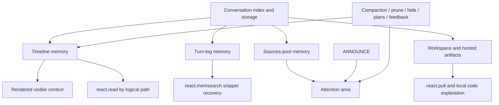

# Memory Architecture

React does not have one single memory bucket.

It works with a **memory architecture** composed of several cooperating surfaces:

- the **timeline** as durable temporal event memory
- the **attention area** (`SOURCES POOL + ANNOUNCE`) as always-visible rolling state
- the **turn log** as structured per-turn reconstruction memory
- **event-source policy projections** as the model-facing views over durable event blocks
- the **workspace** as project/produced-file memory
- the **conversation artifact store + index** as durable persisted memory
- derived memory forms such as **summaries**, **replacement text**, **feedback**, and **plans**
- a durable beacon lane of **Internal Memory Beacons** inside the timeline
- adjacent readable memory realms exposed through **logical namespaces** such as `sk:`
- registered external artifact namespaces that can be rehosted into React-readable `conv:fi:` refs

The key design choice is this:

- **visible context is only one slice of memory**
- **policies decide how durable event memory becomes visible model context**
- **logical paths are the routing layer that let React reopen what is no longer visible**

## 1. Design Goal

The system is designed so that React can:

- keep the most useful state directly visible
- let older or bulky state fall out of the visible window
- still recover it cheaply later by path, search, or explicit workspace activation
- combine many memory realms without flattening them into one format

That is why React memory is organized around:

- **surfaces**: where the information lives
- **visibility rules**: whether it is always visible, tail-only, searchable, or hidden
- **retrieval handles**: the logical paths and tools that reopen it

## 2. Memory Surfaces

| Surface | Role | Visibility | Persistence |
|---|---|---|---|
| Timeline | Durable temporal event memory | Visible slice only | Persisted as `conv.timeline.v1` |
| SOURCES POOL | Rolling source registry and citation memory | Tail, always easy to find | Persisted as `conv:sources_pool` |
| ANNOUNCE | Operational attention board / signal memory | Tail, always easy to find | Rebuilt each round; final state persisted on exit |
| Turn log | Per-turn reconstruction memory | Not directly the model view | Persisted as `artifact:turn.log` |
| Event-source policy projections | Source-specific model views over durable blocks | Render-time only | Derived from timeline blocks and source policies |
| Workspace | Project/file continuity memory | Local filesystem + `conv:fi:` refs | Files/outputs in the artifact root, optionally git-backed |
| Conversation artifact index | Searchable/indexed memory | Not directly visible | Postgres index rows + storage blobs |
| Summaries / hidden replacements / feedback / plans | Derived memory layers | Sometimes visible, sometimes retrievable | Persisted as blocks and/or artifacts |

## 3. The Timeline Is Memory, Not Just Chat History

The timeline is the core temporal memory surface.

It stores ordered blocks such as:

- user prompt events
- user attachment events
- assistant completions
- tool call/result events
- accepted external event occurrences
- canvas, wizard, snapshot, focus, and other bundle/widget event facts
- plan snapshots and plan history
- feedback blocks
- system messages such as TTL pruning notices
- compaction summaries (`conv.range.summary`)

The timeline is persisted as:

- `artifact:conv.timeline.v1`

The persisted payload carries:

- ordered `blocks`
- conversation metadata
- cache TTL state such as `cache_last_touch_at`
- a compact `sources_pool` snapshot for indexing/local access

Important semantic rule:

- the timeline is the **durable event memory**
- the model does **not** always see the full durable timeline
- it sees a rendered, pruned, compacted slice of it

So “in memory” and “currently visible” are not the same thing.

Event-source policies are part of this distinction. Durable blocks should carry
enough structured data and refs to remain authoritative. The model-facing view
of those blocks is produced later by timeline projection, ANNOUNCE production,
and compaction projection policies. A canvas snapshot event, for example, can
leave a compact causal fact in the timeline while its current board projection
is rendered in ANNOUNCE.

### Internal Memory Beacons

React also has a small, explicit memory-beacon mechanism inside the timeline.

- Agents write them with `react.write(channel="internal")`
- Fresh beacons are stored as `react.note`
- After compaction, preserved copies are stored as `react.note.preserved`
- TTL pruning keeps both visible

This feature is called **Internal Memory Beacons**. It is meant for stable facts worth carrying forward:
- `[P]` preferences
- `[D]` decisions
- `[S]` technical/spec context
- `[A]` achievements or milestones
- `[K]` key artifacts with logical path and why they matter

The intended behavior is not “note every step.” The agent should usually write one or a few telegraphic beacons
when it has something actionable and reusable to preserve, often near the end of the turn.

### Session view is a derived memory view

The model-facing **session view** is derived from the timeline at render time.

It is the visible slice after:

- TTL pruning
- optional compaction
- hidden-block replacement
- cache-point recomputation
- appending `SOURCES POOL` and `ANNOUNCE`

So the session view is not a separate authoritative store.

It is:

- the current **visible memory window**
- built from the deeper durable memory surfaces

## 4. Logical Paths Are the Memory Routing Layer

React memory is unified by **logical paths**.

Logical paths do two jobs:

- they identify memory objects across storage surfaces
- they remind the agent how to reopen something after it became hidden or fell out of the visible window

### Main namespaces

| Namespace | Meaning | Typical role in memory |
|---|---|---|
| `conv:ar:` | Timeline / conversation artifact memory | prompts, completions, feedback blocks, plan aliases, internal events |
| `conv:fi:` | File/artifact/workspace memory | project state under `git/projects`, produced artifacts under `files`, snapshots, attachments, logs |
| `conv:so:` | Sources pool memory | source rows and citations |
| `conv:su:` | Summary memory | `conv.range.summary` blocks and compacted ranges |
| `conv:tc:` | Tool call/result memory | exact call/result artifacts from tool execution |
| `conv:ev:` | Event occurrence memory | accepted external events and their durable event refs |
| `sk:` | Skill memory | loaded skill instructions and sources |
| registered external namespaces such as `nmsp:`, `cnv:`, or `mem:` | External owner refs | domain-owned content resolved and rehosted through `react.pull` |

Some of these are strictly conversation memory (`conv:ar:`, `conv:so:`, `conv:su:`, `conv:tc:`, `conv:ev:`), while others connect adjacent reusable memory realms (`sk:`) or bundle/domain artifact stores (`nmsp:`, `cnv:`, `mem:`, and other registered namespaces). React treats them as one readable system because the retrieval contract is unified at the path level.

Examples:

- `conv:ar:<turn_id>.user.prompt`
- `conv:ar:<turn_id>.assistant.completion`
- `conv:ar:<turn_id>.assistant.completion.<n>`
- `conv:ar:plan.latest:<plan_id>`
- `conv:fi:<turn_id>.files/<path>`
- `conv:fi:<turn_id>.files/<path>`
- `conv:fi:<turn_id>.user.attachments/<name>`
- `conv:so:sources_pool[1-5]`
- `conv:su:<turn_id>.conv.range.summary`
- `conv:tc:<turn_id>.<tool_call_id>.result`
- `conv:ev:turn_<id>.events/<event_id>`
- `conv:ev:conv_<conversation_id>.turn_<id>.events/<event_id>`
- `cnv:users/<user_id>/canvases/<canvas_id>/latest.json`

This is one of the main reasons the memory system stays coherent:

- the agent does not have to remember every storage backend
- it remembers a path family and the tool that can reopen it

Registered external refs do not have a deterministic `conv:fi:` mapping until the
namespace rehoster runs. React calls `react.pull(paths=["cnv:..."])`,
`react.pull(paths=["mem:..."])`, or an equivalent registered namespace ref. The
namespace rehoster resolves the external object, places the bytes into a
React-readable artifact location, and returns the resulting `conv:fi:` logical path
and physical path. After that,
ordinary file-oriented tools use the returned `conv:fi:` path.

## 5. Attention Area: Always-On-Top Memory

React also has a dedicated **attention area** at the tail of the rendered context:

- `SOURCES POOL`
- `ANNOUNCE`

This area is intentionally different from the main historical timeline.

### Why it exists

The attention area is where the system keeps things that should be:

- easy to find every round
- visually stable in location
- fresh and allowed to evolve quickly
- outside the stable cached prefix

### SOURCES POOL

The sources pool is rolling memory for:

- web sources
- eligible image/file sources
- skill-provided sources
- citable source identifiers (`sid`)

It is:

- conversation-level
- authoritative as `conv:sources_pool`
- rendered as one compact tail block
- the place where React can reliably find current source ids and short previews

It is both:

- **citation memory**
- **retrieval memory**

### ANNOUNCE

ANNOUNCE is operational memory, not long-form history.

It is the fixed place where React can expect to find things that must stay in front of its eyes, for example:

- budget / iteration state
- temporal ground truth
- open plans
- workspace state
- current canvas map and legend when a canvas is attached as context
- current wizard/task snapshot summary and refs when a snapshot is attached as context
- publish/prune notices
- new feedback notices
- bundle/runtime signals
- other conversation-wide rolling state that the solution wants always visible, such as preferences, recalls, or similar bundle-defined memory cues

This is why ANNOUNCE matters even beyond caching:

- it is not just an uncached tail block
- it is a **known attention board**

The model learns:

- “if something is important right now, it will be there”

This is deliberately different from writing the full live object body into the
timeline every round. Timeline memory records that an event happened and stores
durable refs. ANNOUNCE is where policy-rendered current state lives while it is
operationally relevant.

## 6. Turn Log: Per-Turn Reconstruction Memory

The turn log is the minimal structured record of what happened in one turn.

It is persisted as:

- `artifact:turn.log`

Its payload contains:

- `turn_id`
- `ts`
- `blocks`
- `end_ts`
- `sources_used`
- `blocks_count`
- `tokens`

The crucial distinction:

- the **timeline** is the conversation-level temporal memory
- the **turn log** is the per-turn reconstruction substrate

Turn logs are used for:

- reconstructing fetched turn views
- rebuilding historical user/assistant/file artifacts
- resolving snippets for `react.memsearch`
- carrying feedback summaries in compact index text

The turn log is also one of the places where memory becomes searchable through the conversation index.

## 7. Workspace Is Memory Too

Workspace is not just scratch disk.

It is the memory surface for:

- evolving project trees
- earlier produced files
- active current-turn editable state
- artifacts the agent may need to inspect or continue later

### Namespace split

Workspace-related file memory is intentionally split:

- `files/...`
  - durable workspace/project state
- `files/...`
  - produced artifacts that should not become workspace history

That split matters because “user-visible artifact” and “workspace member” are different questions.

### Two workspace implementations

React supports two workspace backends:

- `custom`
- `git`

#### `custom`

- historical `.files/...` snapshots are hydrated from artifact/timeline/hosting-backed state
- the agent is not instructed to treat the workspace as git
- future design work adds a rolling mental map of latest known workspace state

#### `git`

- the current turn root is a sparse local repo
- historical `.files/...` pulls resolve against lineage snapshots
- the worktree starts sparse; files are not assumed to be present locally
- React must explicitly activate slices with `react.pull(...)`

### Attachments and binaries

Attachments and non-text hosted artifacts are also part of memory, but they behave differently:

- they are often reopened by exact `conv:fi:` path
- they may be hosted rather than stored as readable text in context
- folder pulls do not imply binary descendants

Workspace memory therefore spans:

- local filesystem state
- historical version refs
- hosted artifact references
- logical paths that reconnect all of the above

Registered external artifact refs extend this model. A domain may expose an
owner ref such as `nmsp:...`, `cnv:...`, or `mem:...` for a user attachment,
canvas object, memory item, or snapshot.
`react.pull` invokes the registered namespace rehoster, which decides whether
the resolved object belongs under `files/`, `files/`, `git/snapshots/`, or another
React-readable artifact shape, and returns the resulting `conv:fi:` handle. The
agent should use that returned handle for later `react.read`, `react.rg`, exec,
or checkout decisions.

## 8. Fetch and Stream Artifacts Are Delivery Views

The system also materializes client-facing views over memory.

Examples:

- conversation fetch payloads
- `conv.timeline_text.stream`
- `conv.artifacts.stream`
- synthesized `conv.thinking.stream`

These are useful, but they are not the primary reasoning memory stores.

They are derived from:

- timeline blocks
- turn logs
- sources pool
- hosted artifact metadata

So the rule is:

- timeline / turn log / sources pool / workspace / hosted artifacts = memory substrates
- fetch payloads and stream artifacts = delivery views over those substrates

## 9. Derived Memory Forms

Not all memory is raw original content.

React deliberately creates **derived memory** that preserves continuity while shrinking visible load.

### Event-source projections

Event-source projections are derived memory views, not new authoritative
stores.

Source policies can produce:

- durable timeline blocks from a raw event/tool occurrence
- timeline projection text for the visible session view
- ANNOUNCE records for uncached live state
- compaction projection text for older ranges

This is why a tool result, an accepted external event, a canvas revision, and a
wizard snapshot can share the same memory architecture without sharing the same
raw data shape. The timeline keeps the structured facts and refs; projections
decide what the model sees in each context phase.

### Compaction summaries

Compaction inserts:

- `conv.range.summary`
- logical path family `conv:su:...`

These summaries are durable memory for ranges of earlier turns.

They are:

- stored as index-only artifacts
- embedded for retrieval
- used as the visible replacement for older dense history

### Hidden replacement text

Two mechanisms can replace visible content while preserving recoverability:

- TTL pruning
- `react.hide`

In both cases the original blocks remain in the timeline/artifact memory, while the visible stream shows short replacement text.

That replacement text is itself a memory layer:

- it tells the agent what used to be there
- it preserves a reopening handle
- it reduces token cost without destroying continuity

`react.hide` is especially important because it lets the agent intentionally forget irrelevant recent material while keeping a path-based route back to it.

### Plans

Plans are memory, not just control flow.

React stores plan snapshots and history as timeline blocks such as:

- `react.plan`
- `react.plan.history`

and exposes stable recovery handles such as:

- `conv:ar:plan.latest:<plan_id>`

Plans therefore exist in three memory forms at once:

- persisted timeline blocks
- stable retrieval aliases
- current plan presentation in ANNOUNCE

### Feedback

Feedback is another derived memory layer.

It is persisted as:

- `artifact:turn.log.reaction`

and mirrored into:

- turn log payloads
- timeline `turn.feedback` blocks when cache is cold
- ANNOUNCE notices when cache is hot

So feedback can be:

- searchable/indexable memory
- timeline history
- live operational signal

## 10. Indexed Conversation Memory: Postgres + Storage

The React memory system is backed by two cooperating persistence layers:

- **blob/object storage** for full payload bodies
- **conversation index rows** in PostgreSQL (`conv_messages`) for compact searchable records

In practice:

- large or structured bodies live in storage via the conversation store
- compact summaries live in `conv_messages.text`
- some artifacts also carry embeddings for semantic retrieval

Important examples:

| Artifact kind | Blob | Index text | Embedding |
|---|---|---|---|
| `conv.timeline.v1` | yes | compact summary | yes |
| `conv:sources_pool` | yes | compact summary | yes |
| `turn.log` | yes | compact JSON summary | no |
| `turn.log.reaction` | yes | reaction JSON | no |
| `conv.range.summary` | no (index-only) | summary text | yes |

This means “memory in the system” includes both:

- what is stored as full content
- what is searchable/indexed as compact representation

## 11. Retrieval Paths: How React Gets Memory Back

React can reopen memory in several ways.

### `react.read`

Use when the agent already knows the logical path.

Examples:

- reopen a hidden prompt or completion via `conv:ar:...`
- reopen a summary via `conv:su:...`
- reopen source rows via `conv:so:...`
- reopen project files, produced artifacts, snapshots, or attachments via `conv:fi:...`
- reopen an accepted event occurrence via `conv:ev:...`
- load a skill via `sk:...`
- read the `conv:fi:` path returned by `react.pull` for a registered external ref

This is the most direct path-based memory retrieval tool.

### `react.memsearch`

Use when the agent does **not** know the exact turn/path but remembers the topic, ordinal, or time window.

`react.memsearch` searches the semantic conversation index by default and then resolves hits back into concrete turn snippets from turn-log/timeline blocks. It also supports deterministic turn-catalog lookup for ordinal and temporal questions.

So memsearch is:

- indexed semantic memory lookup first
- Postgres-backed temporal / ordinal turn lookup when requested
- exact turn-snippet reconstruction second
- assistant hits can return multiple visible `assistant.completion` snippets from one matched turn
- attachment hits can return both original turn attachments and external followup attachment paths

### `react.rg`

Use to search the current local filesystem surface:

- files already materialized under the artifact root

It does not search hidden/pruned timeline, unpulled historical snapshots, or
registered external refs. Use visible refs or `react.memsearch` to identify
older `conv:fi:` or registered external refs, then `react.pull` or `react.checkout`
them before local search.

It returns `logical_path` for hits, and content matches include `read_item` ranges so the agent can immediately reopen exact regions with `react.read({"items":[...]})`.

### `react.pull`

Use to materialize historical workspace/file memory and registered external
artifact memory locally.

This is the materialization tool for:

- subtree pulls for `.files/...`
- exact file pulls for `.files/...` and attachments
- registered external namespace refs such as `nmsp:...`, `cnv:...`, or `mem:...`, resolved through a
  namespace rehoster into returned `conv:fi:` refs

### `react.checkout`

Use to materialize the active current-turn workspace itself under
`turn_<current_turn>/git/projects/...` when React needs a runnable/searchable/testable
project snapshot.

`react.checkout` remains a workspace activation tool. It works from materialized
workspace file refs, not directly from arbitrary external namespace refs. Pull
first, then use the returned `conv:fi:...git/projects...` ref when a checkout is needed.

### Generated code / exec

When needed, React can also explore local materialized memory with code:

- local workspace files
- logs
- pulled files
- owner-provided material only after an explicit resolver, rehoster, or service
  operation materializes it for the current auth context

This is still part of the memory system, because the code is operating on previously persisted or explicitly activated memory surfaces.

## 12. Visibility vs Memory Availability

One of the most important principles in this system is:

- **if something is not visible, that does not mean it is gone**

The memory system keeps information available across several states:

| State | Meaning |
|---|---|
| Visible in current rendered context | Immediately in front of the model |
| Present in attention area | Always-on-top operational memory |
| Hidden with replacement text | Still present; temporarily compressed |
| Summarized by compaction | Older detail collapsed into durable summary memory |
| Persisted in timeline / turn log / storage | Durable but not currently visible |
| Indexed/searchable | Recoverable by semantic or tag-based retrieval |
| Materializable into workspace | Recoverable by `react.pull` / `react.read` / code |

This is why the React memory architecture can stay both:

- information-dense
- operationally manageable

## 13. A Working Mental Model

A useful way to think about React memory is:

In short:

- the **timeline** is the main temporal memory
- the **attention area** is the always-visible memory
- the **turn log** is the reconstruction memory
- the **workspace** is the project/file memory
- the **index + storage** provide durable searchable memory
- **logical paths** connect them all

## 14. Practical Design Rules

### Keep memory types distinct

Do not collapse these into one concept:

- durable historical memory
- operational attention memory
- local workspace memory
- indexed semantic memory

They cooperate, but they are not interchangeable.

### Prefer explicit recovery handles

Whenever React sees a logical path, it should treat that as a durable retrieval handle.

That is why paths are surfaced in:

- timeline blocks
- tool results
- replacement text
- workspace artifacts

### Use compression without losing reopenability

The system is designed so that:

- pruning does not destroy history
- compaction does not destroy continuity
- hiding does not destroy recoverability

Memory gets smaller in the visible window, not smaller in the system as a whole.

## 15. Memory Flow Across a Turn

At turn start, React memory is reassembled from several stores:

1. workspace bootstrap prepares the local execution surface
2. latest timeline artifact is loaded
3. latest sources-pool artifact is loaded
4. the in-memory timeline is initialized
5. the accepted event batch is folded in order, so context events such as
   snapshots, canvas/focus changes, prompt events, and attachment events land in
   their causal order
6. feedback refresh updates either ANNOUNCE or the timeline, depending on cache state

During the turn:

- React contributes new blocks into the timeline
- event-source policies project durable blocks into timeline text, ANNOUNCE
  records, and compaction views
- the turn log grows as the per-turn reconstruction memory
- SOURCES POOL and ANNOUNCE are refreshed as the attention area
- hidden replacements, TTL pruning, and compaction may change the visible window without destroying deeper memory
- workspace memory may be expanded explicitly through `react.pull(...)` or local code execution

At turn finish:

- assistant completion is added
- turn log is persisted
- timeline artifact is persisted
- sources-pool artifact is persisted
- stream/fetch-facing delivery artifacts may be persisted or synthesized
- in `git` workspace mode, the current workspace snapshot may also be published to the lineage backend

So memory management in React is continuous:

- load durable memory
- expose a useful visible slice
- let the agent contribute and compress
- persist the updated memory surfaces again

## 16. Summary

React memory is an architecture, not a single store.

It combines:

- temporal event memory in the timeline
- always-visible operational memory in the attention area
- event-source policy projections for model-facing timeline, ANNOUNCE, and
  compaction views
- per-turn reconstruction memory in turn logs
- file/project memory in workspace and hosted artifacts
- indexed/searchable memory in the conversation index
- derived memory forms such as summaries, replacements, feedback, and plans

The glue across all of this is:

- **logical paths**
- **source policies**

That is what allows React to work with memory that is:

- partially visible
- partially compressed
- partially local
- partially hosted
- still recoverable as one coherent system
