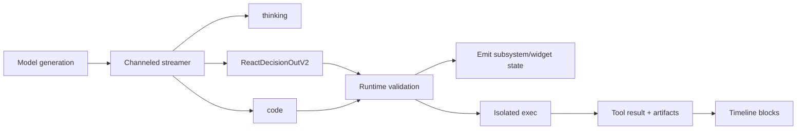
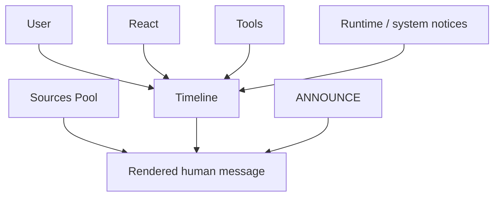

# Why Not Simply Tool Calling

This note explains why **React does not use provider-native tool calling as
its primary orchestration protocol**, even though React is still very much a
tool-using agent.

The short version is:

- React is **not anti-tool**
- React is **not anti-structured output**
- React is **not limited to non-tool-calling-capable models**
- React rejects **provider-native tool calling as the main contract** because
  the system it operates in is richer than a linear:
  - assistant message
  - tool call
  - tool result
  - assistant message
  loop

React lives inside a broader event landscape:
- append-only timeline blocks
- uncached ANNOUNCE tail state
- rolling sources pool
- multi-channel streaming
- subsystem/widget delivery
- distributed isolated execution
- explicit logical-path-based workspace activation

That landscape is the main reason the React protocol is custom.

---

## 1) What question this document is actually answering

When we ask:

> why not simply tool calling?

we do **not** mean:
- why not use tools at all
- why not use JSON
- why not use structured outputs
- why not use models that support tool calling

We mean:

> why is the React agent loop not built primarily around the provider-native
> tool-calling message protocol?

React today still uses tools heavily:
- `react.read`
- `react.write`
- `react.pull`
- `react.patch`
- `react.plan`
- `exec_tools.execute_code_python`
- bundle tools
- SDK tools
- MCP tools

But those tools are executed through **our own protocol and timeline model**,
not through the provider's built-in function-calling turn semantics.

---

## 2) Position

The core design choice is:

- **React is timeline-first, not tool-call-first**

More precisely:

- the primary shared state is the **timeline**
- the primary immediate operational surface is **ANNOUNCE**
- the primary output surface is **channeled generation**
- tools are one important kind of event inside that system
- tools are **not** the only kind of event the agent must react to

This makes React:
- event-reactive
- operator-transparent
- distributed-runtime-friendly
- compatible with both tool-calling-capable and non-tool-calling models

at the cost of more engineering complexity in our own runtime.

---

## 3) What React actually sees and emits today

### 3.1 Input surface

React does not consume a provider-managed sequence of:
- system
- user
- assistant tool call
- tool result
- assistant

Instead, the decision model sees:

- a **system message** containing protocol + tool catalog + skills + policies
- a **single human message** containing:
  - timeline blocks
  - sources pool tail
  - ANNOUNCE tail

See:
- `react-context-README.md`
- `react-announce-README.md`

That human message is an engineered render of the current event landscape, not
just a transcript of tool invocations.

### 3.2 Output surface

The current React decision protocol is channeled:

```text
<channel:thinking>...</channel:thinking>
<channel:ReactDecisionOutV2>...</channel:ReactDecisionOutV2>
<channel:code>...</channel:code>
```

Where:
- `thinking` is short user-visible progress text
- `ReactDecisionOutV2` is the structured decision payload
- `code` is the raw code stream for exec tools

Important point:
- the code is **not** placed inside tool params
- it is streamed separately
- runtime validates and binds it to the exec step

This is already a strong signal that the native tool-calling message model is
too narrow for the behavior we need.

The deeper distinction is this:
- with provider-native tool calling, the model is still generating inside the
  provider's tool-calling protocol shape
- with React, the model is generating inside **our** protocol shape

That means React can ask directly for:
- raw code
- validated decision JSON
- progress/thinking text
- subsystem/widget payloads

without forcing those outputs to masquerade as:
- tool-call arguments
- assistant text
- or the provider's own tool/result event schema

---

## 4) Why provider-native tool calling is not enough

### 4.1 Reason 1: React context is not a linear assistant/tool transcript

The React timeline is multi-contributor and only partially agent-caused.

It can contain:
- user prompts
- attachments
- tool calls and tool results
- plan events
- workspace/publish notices
- feedback or steer events
- cache/pruning notices
- bundle or service alerts
- other system-originated blocks

Some of these events are caused by the agent.
Some are caused by engineering/runtime.
Some are caused by the operator or surrounding systems.

That means the model must reason over an **event landscape**, not only over the
causal chain of its own function calls.

Provider-native tool calling assumes that the important world state is mainly:
- assistant decides to call tool
- tool returns result
- assistant continues

React's world is broader:
- external signals can arrive independently
- those signals must land naturally on the timeline
- the agent must react to them even if they were not caused by its last action

This is a poor fit for a strictly tool-call-centered transcript.

---

### 4.2 Reason 2: ANNOUNCE is a first-class uncached operational surface

React relies on **ANNOUNCE** as an uncached tail board.

ANNOUNCE is where the runtime places:
- authoritative temporal context
- open plan state
- workspace status
- current operational notices
- compaction/pruning warnings
- short-lived guidance that should grab attention immediately

ANNOUNCE is important because:
- it is cheap to keep fresh
- it is not cache-bound in the same way as older timeline text
- it can evolve between rounds, not only between turns

This is exactly the kind of surface that is awkward in provider-native
tool-calling semantics.

Yes, one can always inject another system or user message.
But that is not the same as having a deliberate:
- ephemeral
- re-rendered
- uncached
- operational tail board

as part of the agent contract.

React uses ANNOUNCE as an attention surface by design.
That is a core architectural choice.

---

### 4.3 Reason 3: React output is layered, not monolithic

React does not emit one flat assistant message that later turns into a tool
call.

Instead, one generation can simultaneously produce:
- short progress text
- structured decision JSON
- raw code

and those streams may be consumed differently.

This is implemented via the SDK channeled streamer.

Why this matters:
- the UI can show progress immediately from `thinking`
- the runtime can validate the tool payload from `ReactDecisionOutV2`
- exec tooling can capture code from `code`

These are separate concerns with separate consumers.

Provider-native tool calling usually gives you:
- assistant text
- tool call structure

It does not naturally give you:
- a dedicated raw code stream
- independent routing of different output layers
- strict multi-channel streaming in one model pass
- arbitrary runtime-defined channels with independent subscribers

React needs exactly that.

Put differently:
- provider-native tool calling can certainly stream
- but the streamed generation is still fundamentally tool-calling-shaped
- React streams an SDK-owned generation contract that is **not** constrained to
  assistant/tool/result framing

---

### 4.4 Reason 4: subsystem/widget streaming is part of the contract

React is not only about what the model thinks.
It is also about what the operator sees while the round is still running.

The platform already supports client-visible delivery patterns such as:
- `thinking`
- `answer`
- `canvas`
- `timeline_text`
- `subsystem`

`subsystem` payloads are especially important because they let the client route
structured events to specialized panels or widgets.

Examples:
- code execution status
- widget-specific JSON payloads
- managed inline artifact updates

What older internal notes called *service widgets* maps today to this
subsystem/widget streaming model.

React's protocol is designed so that one agent round can:
- stream progress
- stream or prepare widget state
- stream code
- then trigger isolated execution
- then update the widget status again through the engineering layer

Subscribers can act on those channels while the same round is still running.
That is more than “the client saw some streamed tokens”.
It is a real channel-delivery contract.

This is much more naturally modeled as:
- channeled generation
- runtime validation
- subsystem/canvas delivery

than as plain provider-native tool-calling turns.

---

### 4.5 Reason 5: exec requires code as a separate governed artifact

The exec path is the clearest example.

React does **not** pass code in the tool params.
Instead:
- it declares the exec action in `ReactDecisionOutV2`
- it streams code in `<channel:code>`
- engineering validates:
  - contract
  - paths
  - references
  - packaging rules
- then exec runs in isolated runtime

This separation matters because the code:
- is large
- is streamable
- needs its own consumer
- must be validated independently from the tool signature
- should stay natural as code instead of being squeezed into JSON tool params
- should not lose shape for indentation-sensitive languages like Python

That contract is simply better expressed in our own protocol than in native
provider tool-call arguments.

---

### 4.6 Reason 6: React must work in a distributed isolated runtime

React is intentionally not a machine-bound personal agent.

It is designed for:
- multi-user
- multi-tenant
- cluster/distributed execution
- isolated code execution
- turn startup on arbitrary nodes

That pushes the architecture toward:
- logical namespaces
- engineered workspace activation
- explicit pull/materialization
- runtime-controlled tool surfaces

For example:
- React tools operate mostly on logical paths such as `fi:`, `ar:`, `so:`, `tc:`, `ks:`, `sk:`
- historical files are activated explicitly with `react.pull(...)`
- code execution happens in isolated runtime
- only certain tools are available directly in the React loop
- others are used via code inside isolated exec

This is not only a “tool calling vs non-tool calling” issue.
It is also a consequence of choosing a **distributed safe runtime contract**
instead of a machine-local copilot contract.

---

### 4.7 Reason 7: tool calling assumes tools are the main ontology; React does not

React is not tool-centric.
It is problem-centric and event-centric.

The timeline may contain events that are:
- caused by the user
- caused by React
- caused by tools
- caused by engineering/runtime
- caused by external systems

Those events can still all matter for the next decision.

In other words:
- tool results are important
- but they are not the only meaningful state transitions

That is why the timeline is the main carrier.
Tool calling alone is too narrow as the primary worldview.

---

## 5) Concrete example: exec widget lifecycle

The exec flow is a good illustration of why React uses its own protocol.



Operationally:

1. React emits short progress text on `thinking`
2. React emits the tool call intent on `ReactDecisionOutV2`
3. React emits code on `code`
4. runtime validates the decision + code
5. the client can already show a code-exec widget/panel
6. engineering moves the exec state through:
   - preparing
   - executing
   - success/error
7. timeline receives durable tool-result/artifact blocks

This is a richer lifecycle than:
- assistant issues tool call
- tool returns result

The richer lifecycle is intentional.

---

## 6) Concrete example: multi-contributor context



The point is not just that many systems exist.
The point is that **the agent must be aware of their contributions in temporal
order** and react accordingly.

That is why the input surface is a rendered context block landscape rather than
just a provider-managed transcript of tool invocations.

---

## 7) Why this is still compatible with tool-calling-capable models

This design does **not** require the underlying model to be “incapable” of tool
calling.

It simply means:
- we do not outsource the primary orchestration contract to the provider
- we keep the orchestration contract inside the SDK/runtime

Benefits:
- provider portability
- same protocol across models
- same timeline semantics across models
- same streaming contract across models

So the real comparison is not:
- tool-calling models vs non-tool-calling models

It is:
- provider-native orchestration
vs
- SDK-owned orchestration

React chooses the second one.

---

## 8) Tradeoffs and costs

This design is not free.

We accept these costs:

- we own parsing and validation of the decision protocol
- we own channel parsing and channel routing
- we own tool-call validation instead of delegating it to provider-native tool calls
- we own more prompt discipline
- we own more documentation burden
- we own more runtime engineering complexity

We accept those costs because they buy us:

- a richer context model
- better operator transparency
- better streaming control
- better distributed-runtime fit
- better portability across model providers

---

## 9) What this document is *not* saying

This note is **not** claiming that provider-native tool calling is bad.

It is often a good fit when:
- the agent is mostly linear
- the tool loop is the dominant form of state transition
- there is no custom uncached tail state like ANNOUNCE
- there is no need for multi-channel generation
- there is no separate raw code stream
- there is no need for complex mid-turn widget/subsystem streaming

That is simply not the shape of React.

So the decision is:
- **not “tool calling is wrong”**
- but **“React's requirements exceed what simple tool calling expresses well”**

---

## 10) Adjacent but different question: why not a machine-bound personal agent?

This came up in earlier notes as “why not Claude Code?”

That is related, but it is a slightly different question.

The answer is:
- React is designed to run turns safely anywhere in the cluster
- not as a long-lived agent bound to one personal machine state

There is also a protocol distinction:
- Claude Code uses the model's tool-calling protocol, so generation remains in
  that format even when Claude Code streams it very well
- React does not use provider-native tool calling as the model contract, so we
  are free to ask for our own channels directly

That requires:
- isolated exec
- explicit workspace activation
- logical path namespaces
- runtime-controlled tool exposure
- host-side governance of publish, storage, and delivery

So even if React had used provider-native tool calling, it would still need a
substantial custom runtime around:
- workspace
- isolation
- delivery
- timeline
- storage

The distributed runtime constraint reinforces the case for owning the whole
protocol ourselves.

---

## 11) Current implementation mapping

The current React implementation that reflects this design includes:

- timeline-driven context rendering:
  - `react-context-README.md`
  - `flow-README.md`
- ANNOUNCE as uncached operational tail:
  - `react-announce-README.md`
- channeled generation:
  - `decision.py`
  - `channeled-streamer-README.md`
- tool calls/results as timeline blocks:
  - `tool-call-blocks-README.md`
- distributed/isolated exec:
  - `external-exec-README.md`
- explicit workspace activation and logical-path-oriented artifacts:
  - `react.pull(...)`
  - `fi:`, `ar:`, `so:`, `tc:`, `ks:`, `sk:`

Current output protocol:

```text
<channel:thinking>...</channel:thinking>
<channel:ReactDecisionOutV2>...</channel:ReactDecisionOutV2>
<channel:code>...</channel:code>
```

Current workspace model:
- current-turn `files/...` = durable workspace/project state
- current-turn `outputs/...` = non-workspace produced artifacts
- historical workspace activation is explicit
- in `git` mode, the current turn root is a sparse local git repo

These are not side details.
They are the practical reasons the orchestration layer cannot be “just native
tool calling”.

And they are the practical reason React differs from products like Claude Code:
- Claude Code may stream beautifully, but the model contract is still native
  tool calling
- React owns the generation contract itself
- therefore React can define its own channels, subscribers, and delivery
  semantics without forcing everything through assistant/tool/result framing

---

## 12) Practical conclusion

If a future agent in this ecosystem is:
- simpler
- mostly linear
- not timeline-centric
- not ANNOUNCE-centric
- not multi-channel
- not code-stream-driven

then provider-native tool calling may be a good choice.

React v2 is different.

Its core contract is:
- **timeline-first**
- **announce-aware**
- **channeled**
- **distributed**
- **workspace-governed**

That is why React does not simply use provider-native tool calling as the main
protocol.
