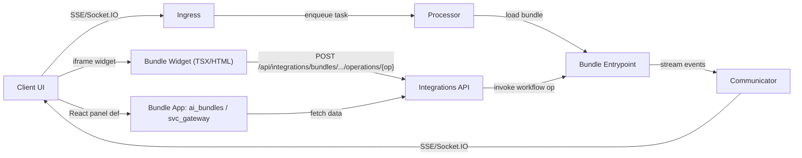

# Bundle Interfaces (Streaming + Widgets + Operations)

This doc describes how a bundle connects to clients:
- **Streaming** via SSE/Socket.IO through the async communicator
- **Widgets + React panels** returned by bundles
- **Operations API** to invoke bundle methods over REST
- **Artifacts & attachments** surfaced in the timeline and SSE events



---

## 0) Streaming interface (SSE / Socket.IO)

Bundles stream output through the platform communicator. Clients receive events over:
- SSE (`/sse/*`)
- Socket.IO (`/socket.io`)

Docs:
- SSE events: [docs/clients/sse-events-README.md](../../clients/sse-events-README.md)
- Comm system: `docs/service/comm/README-comm.md`

The communicator is **asynchronous**: bundle execution and streaming can happen on
separate workers and still route events back to the active client channel.

Common stream payloads:
- `delta` (token streams)
- `step` (progress events)
- `event` (custom widgets)
- `followups` (suggested actions)
- `citations` (sources)

See:
- [docs/clients/sse-events-README.md](../../clients/sse-events-README.md)

---

## 1) Exposing a widget from a bundle

Bundles can expose a widget by implementing an entrypoint method that returns a list of HTML strings. The SDK will embed the widget in an iframe on the client.

Example pattern (see `kdcube_ai_app/apps/chat/proc/rest/integrations/AIBundleDashboard.tsx` for a widget):
- Resolve bundle root from `ai_bundle_spec`.
- Load a TSX/HTML asset from bundle resources.
- Use `ClientSideTSXTranspiler` to compile TSX into HTML.

```python
from kdcube_ai_app.apps.chat.sdk.viz.tsx_transpiler import ClientSideTSXTranspiler

class MyEntrypoint(BaseEntrypoint):
    def price_model(self, user_id: Optional[str] = None, **kwargs):
        bundle_root = self._bundle_root()
        if not bundle_root:
            return ["<p>No price model.</p>"]

        dashboard_path = self.configuration.get("subsystems").get("price-model").get("dashboard")
        with open(os.path.join(bundle_root, dashboard_path), "r", encoding="utf-8") as f:
            content = f.read()
        html = ClientSideTSXTranspiler().tsx_to_html(content, title="Price Model")
        return [html]
```

## 2) Widget config in bundle configuration

Widgets are typically declared in the bundle configuration to map a subsystem key to a TSX asset:

```python
@property
def configuration(self):
    return {
        "subsystems": {
            "ai-bundles": {"dashboard": "service/integrations/AIBundleDashboard.tsx"},
            "price-model": {"dashboard": "service/price/PriceModel.tsx"},
        }
    }
```

This allows the entrypoint to locate widget resources relative to the bundle root.

## 3) Auth + backend calls from widgets

Widgets use a configuration handshake (see `ConversationBrowser.tsx` and `AIBundleDashboard.tsx`) to receive:
- `baseUrl`
- `accessToken` / `idToken`
- `idTokenHeader`
- default tenant/project

From the widget, build API URLs as:

```
${baseUrl}/api/...
```

and attach auth headers. This ensures cookies or tokens are applied correctly in the iframe.

The important integration rule is:
- the widget must follow the real platform request contract exactly
- do not invent an ad hoc widget-to-bundle transport
- if the widget calls bundle or platform REST, it must use the real integrations
  request shape and the real auth/config handshake

Reference examples:
- `src/kdcube-ai-app/kdcube_ai_app/apps/chat/proc/rest/integrations/AIBundleDashboard.tsx`
- `src/kdcube-ai-app/kdcube_ai_app/journal/26/03/widgets/App.tsx`
- `src/kdcube-ai-app/kdcube_ai_app/apps/chat/sdk/examples/bundles/versatile@2026-03-31-13-36/ui/PreferencesBrowser.tsx`

## 4) Bundle operations endpoint (loop-back)

Widgets can call bundle-defined operations via the integrations endpoint:

```
POST /api/integrations/bundles/{tenant}/{project}/operations/{op}
```

The `{op}` is a method name on the bundle entrypoint (e.g., `suggestions`, `price_model`, or any custom op). The SDK resolves the bundle and calls the operation with the user context.

Current POST body shape:

```json
{
  "bundle_id": "my.bundle",
  "conversation_id": null,
  "config_request": null,
  "data": {
    "some_param": "value"
  }
}
```

`data` is forwarded into the bundle method as kwargs.

Example:
- widget sends:

```json
{
  "bundle_id": "versatile",
  "data": {
    "recency": 10,
    "kwords": "timezone email"
  }
}
```

- bundle operation receives:

```python
async def preferences_exec_report(self, recency: int = 10, kwords: str = "", **kwargs):
    ...
```

This allows UI → backend → bundle round-trips without exposing a separate service.

## 5) Reading bundle props from cache

Bundles can store UI config or parameters in bundle props. The admin UI writes props to Redis (KV cache), and the bundle reads them at runtime. Define defaults in `entrypoint.configuration` and read effective values from `bundle_props` (defaults + overrides).

See: `kdcube_ai_app/apps/chat/sdk/solutions/chatbot/entrypoint.py`.

---

## 6) Bundle apps (React panels)

Bundles can return React app definitions (panels) via the base entrypoint.
Examples include the admin bundle apps: `ai_bundles`, `svc_gateway`.

Entry point:
- `src/kdcube-ai-app/kdcube_ai_app/apps/chat/sdk/solutions/chatbot/entrypoint.py`

---

## 7) Files, attachments, and citations

Bundles can emit files (artifacts) and citations. The platform stores them and
emits references through SSE so clients can render downloads and previews.

Bundles can also expose **knowledge space files** (read‑only) via `react.read`.
`ks:` is one bundle-defined logical path space rooted at the bundle's prepared knowledge root.
Common real-path examples in this repo:
- `ks:docs/<path>` — documentation
- `ks:src/kdcube-ai-app/<path>` — source files
- `ks:deployment/<path>` — deployment artifacts (compose, env, Dockerfiles)

See `bundle-dev-README.md` for how these roots are configured.

Docs:
- Attachments system: [docs/hosting/attachments-system.md](../../hosting/attachments-system.md)
- SSE events: [docs/clients/sse-events-README.md](../../clients/sse-events-README.md)

---

## References (code)

- Integrations ops API: `src/kdcube-ai-app/kdcube_ai_app/apps/chat/proc/rest/integrations/integrations.py`
- Example widget: `src/kdcube-ai-app/kdcube_ai_app/apps/chat/proc/rest/integrations/AIBundleDashboard.tsx`
- Base entrypoint: `src/kdcube-ai-app/kdcube_ai_app/apps/chat/sdk/solutions/chatbot/entrypoint.py`
