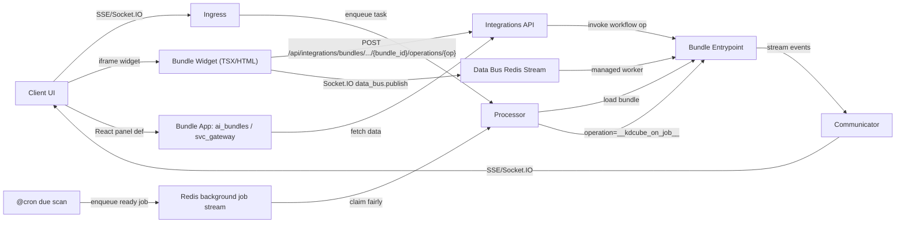
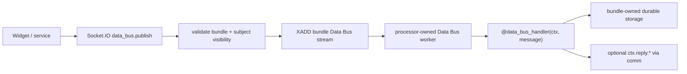
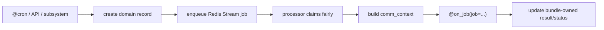
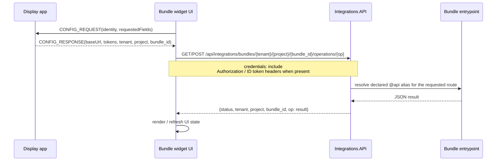

# Bundle Interfaces (Streaming + Widgets + Operations)

This doc describes how a bundle connects to clients:
- **Streaming** via SSE/Socket.IO through the async communicator
- **Data Bus** handlers for durable, bundle-owned non-conversation messages
- **Widgets + React panels** returned by bundles
- **Operations API** to invoke bundle methods over REST
- **Background jobs** claimed by proc from Redis Streams and handled by `@on_job`
- **Artifacts & attachments** surfaced in the timeline and chat stream events
- **Execution boundaries** when selected helper functions run through `@venv(...)`

For the higher-level transport map, including how `@mcp(...)` and Data Bus fit
beside REST/widget/browser routes, use
[bundle-transports-README.md](bundle-transports-README.md).



---

## 0) Streaming interface (SSE / Socket.IO)

Bundles stream output through the platform communicator. Clients receive events over:
- SSE (`/sse/*`)
- Socket.IO (`/socket.io`)

Docs:
- client request contract:
  [bundle-client-communication-README.md](bundle-client-communication-README.md)
- Chat stream events: [bundle-chat-stream-events-README.md](bundle-chat-stream-events-README.md)
- Comm system: `docs/service/comm/README-comm.md`

The communicator is **asynchronous**: bundle execution and streaming can happen on
separate workers and still route events back to the active client channel.

Targeting model:

- if communicator has a peer target (`target_sid` / connected stream id), one
  exact SSE or Socket.IO peer receives the event
- otherwise the event is broadcast to all peers connected on that session

Common stream payloads:
- `delta` (token streams)
- `step` (progress events)
- `event` (custom widgets)
- `followups` (suggested actions)
- `citations` (sources)

See:
- [bundle-chat-stream-events-README.md](bundle-chat-stream-events-README.md)

### Concrete bundle-to-client examples

Main answer text:

```python
await self.comm.delta(
    text="Here is the answer.",
    index=0,
    marker="answer",
    agent="answer.generator",
)
```

Structured subsystem payload:

```python
await self.comm.delta(
    text='{"status":"running","progress":42}',
    index=0,
    marker="subsystem",
    agent="tool.exec",
    sub_type="code_exec.status",
    format="json",
    artifact_name="code_exec.status",
)
```

Canvas payload:

```python
await self.comm.delta(
    text='{"type":"chart","data":{"points":[1,2,3]}}',
    index=0,
    marker="canvas",
    agent="viz",
    format="json",
    artifact_name="canvas.chart.v1",
    title="Chart",
)
```

Custom typed semantic event:

```python
await self.comm.event(
    type="bundle.preferences.updated",
    step="preferences.updated",
    status="completed",
    title="Preferences updated",
    data={"keys": ["city", "diet"]},
    agent="preferences",
)
```

Client rule:

- built-in markers and built-in event families are already understood by the
  platform client
- custom markers or custom event types are allowed, but client code must opt in
  to render them specially

Important for `@venv(...)` helpers:
- the subprocess venv does not own the SSE/Socket.IO stream
- communicator use should stay in proc
- if a venv-backed job needs progress, emit step/delta events in proc before or after the call, or split the work into multiple proc-orchestrated calls
- the venv child does **not** receive proc-bound runtime bindings such as communicator instances, request context helpers, tool bindings, KV cache bindings, or DB/Redis clients

Important for bundle REST/public API methods:
- proc binds the request communicator into runtime context for the duration of the call
- proc does not pass a separate `communicator=` kwarg to bundle API methods by default
- use `self.comm` / `self.comm_context` in `BaseEntrypoint`-style bundles
- otherwise use:
  - `kdcube_ai_app.apps.chat.sdk.runtime.comm_ctx.get_current_comm()`
  - `kdcube_ai_app.apps.chat.sdk.runtime.comm_ctx.get_current_request_context()`
  - `kdcube_ai_app.apps.chat.sdk.runtime.comm_ctx.get_current_user_identity()`

---

## Durable Data Bus interface (`@data_bus_handler`)

Data Bus handlers are the bundle-facing interface for durable non-chat domain
messages. Use them when a widget or service needs to mutate bundle-owned state
without creating a conversation turn.

Typical flow:



Minimal handler:

```python
from kdcube_ai_app.apps.chat.sdk.data_bus import data_bus_handler

@data_bus_handler(
    subject="task_tracker.canvas.patch",
    partition_by="object_ref",
    ordering="serial_per_partition",
    idempotency="required",
)
async def handle_canvas_patch(self, ctx, message):
    result = await self.canvas.apply_patch(message.payload)
    await ctx.reply.ok({"revision": result.revision})
    return {"status": "ok", "data": {"revision": result.revision}}
```

Rules:

- `messages[]` are accepted through Socket.IO `data_bus.publish`
- clients without a platform browser session can connect with a scoped
  federated token claimed through a bundle public API
- accepted messages are written to a bundle-scoped Redis Stream
- proc owns worker lifecycle, retry, result stream, DLQ, and clean shutdown
- bundles register handlers by subject; they do not start Redis consumers
- use `idempotency="required"` for mutations
- use `partition_by="object_ref"` and `ordering="serial_per_partition"` for
  shared objects that must not be processed concurrently
- handler replies are optional client delivery through comm; durable truth is
  the bundle's storage mutation

Data Bus messages stay outside `chat_message`, `/sse/chat`,
`external_events[]`, and ReAct timelines unless bundle code explicitly bridges
a handled message into conversation ingress.

Routing model:

| Surface | Route key | Partition key | Handler |
| --- | --- | --- | --- |
| Conversation event bus | `target.agent_id` / `external_events[].agent_id` | conversation event lane | one `@on_reactive_event` method |
| Data Bus | `messages[].subject` | optional `messages[].object_ref` | one `@data_bus_handler(...)` per subject |

Use `agent_id` to choose an internal conversation agent. Use Data Bus `subject`
to choose a durable domain-message handler. Use `object_ref` only when the
handler needs serialized work for one durable object.

See:

- [Data Bus](../../service/comm/data-bus-README.md)
- [Bus Routing And Partitioning](../../service/comm/bus-routing-and-partitioning-README.md)
- [Bundle Federated Auth For Data Bus](auth-bundle-federated-README.md)
- [bundle-client-communication-README.md#data-bus-contract](bundle-client-communication-README.md#data-bus-contract)
- [bundle-platform-integration-README.md#110-data_bus_handler](bundle-platform-integration-README.md#110-data_bus_handler)

---

## 1) Background job interface (`@on_job`)

`@on_job` is the bundle entrypoint for ready background jobs. It is not a
browser route, public webhook, widget operation, or chat ingress endpoint.

Typical flow:



Rules:

- declare at most one `@on_job` method per bundle
- define it as `async def`
- receive a job envelope with platform routing fields plus bundle-owned
  `work_kind`, `source`, `metadata`, and `payload`
- if the bundle derives from SDK mixins that can handle their own background
  work, call `await super().handle_job(**kwargs)` first and return when it says
  `handled=true`
- use the reserved `bundle_call_context` for metadata that nested tools or
  external runtimes must inherit, such as task id, execution id, or a compact
  task definition
- validate `work_kind` inside the bundle
- load durable bundle-owned records by id from `payload`
- update execution/status/result records in bundle storage
- assume retry is possible until the stream message is acknowledged

Example:

```python
from kdcube_ai_app.infra.plugin.bundle_loader import on_job

class MyBundle(BaseEntrypoint):
    @on_job
    async def on_job(self, job: dict, **kwargs) -> dict:
        handled = await super().handle_job(job=job, **kwargs)
        if handled.get("handled"):
            return handled

        work_kind = job.get("work_kind")
        payload = job.get("payload") or {}
        if work_kind == "task.execution.due":
            return await self.tasks.run_execution(payload["task_id"], payload["execution_id"])
        return {"ok": False, "error": {"code": "unsupported_job"}}
```

Use `@cron(...)` only to discover due work. Use `@on_job` to run the ready work
after it has been enqueued and claimed by the processor.

Mixin rule:

- mixins must expose normal dispatch helpers such as `handle_job(...)`
- mixins must not add their own decorated `@on_job` method
- the bundle owns the single decorated `@on_job` method and dispatches by
  `work_kind`

See:

- [background-jobs-README.md](../../service/streams/background-jobs-README.md)

---

## 2) Exposing a widget from a bundle

Bundles can expose a widget by implementing an entrypoint method that returns a list of HTML strings. The SDK embeds the widget in an iframe on the client.

Preferred pattern now:
- decorate the widget method with `@ui_widget(alias=..., icon=..., user_types=..., roles=...)`
- if the same method is also called through the integrations operations route,
  add `@api(alias=..., route="operations", ...)` on that method too
- prefer a provider-aware icon map such as `icon={"tailwind": "...", "lucide": "SlidersHorizontal"}`
- let the platform discover it through:
  - `GET /api/integrations/bundles/{tenant}/{project}/{bundle_id}/widgets`
  - `GET /api/integrations/bundles/{tenant}/{project}/{bundle_id}/widgets/{alias}`

Widget fetching and widget operation calls are separate interface surfaces:
- `@ui_widget(...)` makes the widget discoverable/fetchable through `/widgets`
- `@api(..., route="operations")` makes the method callable through `/operations`
- undecorated same-name methods are not part of the HTTP contract

Example pattern (see `kdcube_ai_app/apps/chat/proc/rest/integrations/AIBundleDashboard.tsx` for a widget):
- Resolve bundle root from `ai_bundle_spec`.
- Load a TSX/HTML asset from bundle resources.
- Use `ClientSideTSXTranspiler` to compile TSX into HTML.

```python
from kdcube_ai_app.infra.plugin.bundle_loader import ui_widget
from kdcube_ai_app.apps.chat.sdk.viz.tsx_transpiler import ClientSideTSXTranspiler

class MyEntrypoint(BaseEntrypoint):
    @ui_widget(alias="price_model", user_types=("registered",))
    def price_model(self, user_id: Optional[str] = None, **kwargs):
        bundle_root = self._bundle_root()
        if not bundle_root:
            return ["<p>No price model.</p>"]

        dashboard_path = self.configuration.get("subsystems").get("price-model").get("dashboard")
        with open(os.path.join(bundle_root, dashboard_path), "r", encoding="utf-8") as f:
            content = f.read()
        html = ClientSideTSXTranspiler().tsx_to_html(content, title="Price Model")
        return [html]
```

## 3) Widget config in bundle configuration

Widgets are typically declared in the bundle configuration to map a subsystem key to a TSX asset:

```python
@property
def configuration(self):
    return {
        "subsystems": {
            "ai-bundles": {"dashboard": "service/integrations/AIBundleDashboard.tsx"},
            "price-model": {"dashboard": "service/price/PriceModel.tsx"},
        }
    }
```

This allows the entrypoint to locate widget resources relative to the bundle root.

## 4) Auth + backend calls from widgets

Widgets use a configuration handshake (see `ConversationBrowser.tsx` and `AIBundleDashboard.tsx`) to receive:
- `baseUrl`
- `accessToken` / `idToken`
- `idTokenHeader`
- default tenant/project

From the widget, build API URLs as:

```
${baseUrl}/api/...
```

and attach auth headers. This ensures cookies or tokens are applied correctly in the iframe.

The important integration rule is:
- the widget must follow the real platform request contract exactly
- do not invent an ad hoc widget-to-bundle transport
- if the widget calls bundle or platform REST, it must use the real integrations
  request shape and the real auth/config handshake

Reference examples:
- `src/kdcube-ai-app/kdcube_ai_app/apps/chat/proc/rest/integrations/AIBundleDashboard.tsx`
- `src/kdcube-ai-app/kdcube_ai_app/journal/26/03/widgets/App.tsx`
- `src/kdcube-ai-app/kdcube_ai_app/apps/chat/sdk/examples/bundles/versatile@2026-03-31-13-36/ui/PreferencesBrowser.tsx`

This is not bundle-specific magic. Widget/frontend code is regular platform
client code and should follow:

- [bundle-client-communication-README.md](bundle-client-communication-README.md)
- [bundle-chat-stream-events-README.md](bundle-chat-stream-events-README.md)

## 5) Bundle operations endpoint (loop-back)

Widgets can call bundle-defined operations via the integrations endpoint:

```
GET  /api/integrations/bundles/{tenant}/{project}/{bundle_id}/operations/{op}
POST /api/integrations/bundles/{tenant}/{project}/{bundle_id}/operations/{op}
GET  /api/integrations/bundles/{tenant}/{project}/{bundle_id}/public/{op}
POST /api/integrations/bundles/{tenant}/{project}/{bundle_id}/public/{op}
```

The `{op}` is the declared operation alias.

Current rule:
- `/operations/{op}` resolves only methods decorated with
  `@api(..., route="operations")`
- `/public/{op}` resolves only methods decorated with
  `@api(..., route="public")`
- `route` defaults to `"operations"` when omitted
- `route="public"` methods must also declare `public_auth`
  - `public_auth="none"` means explicitly unauthenticated public endpoint
  - `public_auth={"mode":"header_secret","header":"X-Telegram-Bot-Api-Secret-Token","secret_key":"telegram.webhook_secret"}` verifies the incoming header against the bundle secret
  - `public_auth="bundle"` means proc forwards the request and the bundle
    method authenticates it itself
- undecorated same-name methods are not invokable through HTTP

Use `public_auth="bundle"` for a `federated_token_claim` operation when a
bundle-validated client needs a short-lived token for Socket.IO Data Bus.

Bundle operations may call helpers marked with `@venv(...)`, but the HTTP contract still belongs to proc:
- request parsing, auth, and route dispatch stay in proc
- the decorated helper receives serialized arguments and returns serialized output
- the cached venv is per bundle id and is rebuilt only when that helper's referenced `requirements.txt` content changes
- live request-bound objects such as communicator instances, DB pools, Redis clients, or framework request objects must not cross the `@venv(...)` boundary
- proc-only bundle/runtime bindings such as `get_current_comm()`, `get_current_request_context()`, `TOOL_SUBSYSTEM`, `COMMUNICATOR`, `KV_CACHE`, and `CTX_CLIENT` are not provided inside the venv child
- normal bundle code reload is still a separate step; changing Python source does not by itself rebuild the cached venv

For the proc-side reload sequence and the Bundle Admin equivalent, see
[KDCube CLI / Bundle Reload Flow](../../service/cicd/cli-README.md#bundle-reload-flow).

Preferred rule:
- bundle-specific clients and widgets should use the explicit `/{bundle_id}/operations/{op}` route
- generic platform callers may still use the legacy route without `bundle_id`

Legacy route:

```
POST /api/integrations/bundles/{tenant}/{project}/operations/{op}
```

When that legacy route is used:
- body `bundle_id` is honored if provided
- otherwise proc resolves the current default bundle id

Current POST body shape:

```json
{
  "conversation_id": null,
  "config_request": null,
  "data": {
    "some_param": "value"
  }
}
```

`data` is forwarded into the bundle method as kwargs.

Example:
- widget sends:

```json
{
  "data": {
    "recency": 10,
    "kwords": "timezone email"
  }
}
```

- bundle operation receives:

```python
async def preferences_exec_report(self, recency: int = 10, kwords: str = "", **kwargs):
    ...
```

Example declaration:

```python
from kdcube_ai_app.infra.plugin.bundle_loader import api, ui_widget

class MyEntrypoint(BaseEntrypoint):
    @ui_widget(alias="preferences_exec_report", user_types=("registered",))
    @api(alias="preferences_exec_report", route="operations", user_types=("registered",))
    async def preferences_exec_report(self, recency: int = 10, kwords: str = "", **kwargs):
        ...
```

Use the visibility selectors like this:

- `user_types=(...)`
  - inferred internal user types such as `registered`, `paid`, `privileged`, `anonymous`
- `roles=(...)`
  - raw external auth roles such as `kdcube:role:super-admin`
- if both are provided, both conditions must match

This allows UI → backend → bundle round-trips without exposing a separate service.

Recommended pattern for dependency-heavy operations:

```python
from kdcube_ai_app.infra.plugin.bundle_loader import api, venv

@venv(requirements="requirements.txt")
def _build_sheet_snapshot(payload: dict) -> dict:
    ...

class MyEntrypoint(BaseEntrypoint):
    @api(alias="sync_sheet", route="operations")
    async def sync_sheet(self, **kwargs):
        result = _build_sheet_snapshot(kwargs)
        await self.comm.event(
            type="bundle.sync.completed",
            step="sync_sheet",
            status="completed",
            title="Sync finished",
            data={"rows": result.get("row_count", 0)},
        )
        return result
```

This keeps:
- routing and client communication in proc
- dependency-heavy Python execution in the cached bundle venv

Important:
- the explicit `/{bundle_id}/operations/{op}` route supports both `GET` and `POST`
- widgets should call it with the real tenant/project scope and the intended `bundle_id` in the path
- the integration wiring should match the reference widgets above without ad-hoc deviations

Legacy note:
- if a caller still uses the legacy route without `/{bundle_id}/`, body `bundle_id`
  is still accepted there for backward compatibility
- if the bundle operation may emit communicator events that should go back only
  to the initiating peer, the request must also carry the configured stream-id
  header (default `KDC-Stream-ID`) with the already-connected peer id

### Widget ↔ bundle exchange



Declarative discovery endpoints for widgets:

```text
GET /api/integrations/bundles/{tenant}/{project}/{bundle_id}
GET /api/integrations/bundles/{tenant}/{project}/{bundle_id}/widgets
GET /api/integrations/bundles/{tenant}/{project}/{bundle_id}/widgets/{alias}
```

These endpoints expose the bundle's declared widget/API surface to the client.
`GET /bundles/{tenant}/{project}/{bundle_id}` includes `api_endpoints` metadata,
and each declared endpoint includes its `route` (`operations` or `public`).

Concrete example:
- runtime config handshake:
  `src/kdcube-ai-app/kdcube_ai_app/journal/26/03/widgets/App.tsx`
- platform widget with the same auth/config pattern:
  `src/kdcube-ai-app/kdcube_ai_app/apps/chat/proc/rest/integrations/AIBundleDashboard.tsx`
- bundle-operation backend:
  `src/kdcube-ai-app/kdcube_ai_app/apps/chat/proc/rest/integrations/integrations.py`

## 6) Reading effective bundle props

Bundles can store UI config or parameters in bundle props. Define defaults in
`entrypoint.configuration` / `configuration_defaults()` and read effective
values with `self.bundle_prop(...)`.

Effective bundle props are code defaults deep-merged with descriptor/admin
props. Descriptor/admin writes persist through the configured bundle descriptor
authority and update Redis as the runtime cache. For the full lifecycle, see
[Bundle Properties And Secrets Lifecycle](bundle-properties-and-secrets-lifecycle-README.md).

Use `dict(self.bundle_props or {})` only when a method needs the whole effective
props snapshot. Deployment-scoped bundle secrets are separate: read them with
`await get_secret("b:...")`.

See: `kdcube_ai_app/apps/chat/sdk/solutions/chatbot/entrypoint.py`.

---

## 7) Bundle apps (React panels)

Bundles can return React app definitions (panels) via the base entrypoint.
Examples include the admin bundle apps: `ai_bundles`, `svc_gateway`.

Entry point:
- `src/kdcube-ai-app/kdcube_ai_app/apps/chat/sdk/solutions/chatbot/entrypoint.py`

---

## 8) Files, attachments, and citations

Bundles can emit files (artifacts) and citations. The platform stores them and
emits references through SSE so clients can render downloads and previews.

Bundle/catalog tools can expose generated or materialized files by returning the
strict tool result payload `ret.artifact_type: "files"` with `ret.files[]`, or
by calling `bundle_tool_context.host_files(...)` and returning the hosted rows.
Both paths produce normal hosted file metadata and `chat.files` stream events.
The helper is available in normal trusted tool execution and in isolated
supervisor/runtime tool execution; generated executor code should call a catalog
tool through `agent_io_tools.tool_call(...)` to use it. The helper requires
prepared tool context: a hosting-capable `ToolSubsystem`, tenant, project, user
id, conversation id, turn id, conversation storage, and output directory.

Bundles can also expose **knowledge space files** (read‑only) via `react.read`.
`ks:` is one bundle-defined logical path space rooted at the bundle's prepared knowledge root.
Common real-path examples in this repo:
- `ks:docs/<path>` — documentation
- `ks:src/kdcube-ai-app/<path>` — source files
- `ks:deployment/<path>` — deployment artifacts (compose, env, Dockerfiles)

See `bundle-developer-guide-README.md` for how these roots are configured.

Docs:
- Attachments system: [docs/hosting/attachments-system.md](../../hosting/attachments-system.md)
- Chat stream events: [bundle-chat-stream-events-README.md](bundle-chat-stream-events-README.md)

---

## References (code)

- Integrations ops API: `src/kdcube-ai-app/kdcube_ai_app/apps/chat/proc/rest/integrations/integrations.py`
- Example widget: `src/kdcube-ai-app/kdcube_ai_app/apps/chat/proc/rest/integrations/AIBundleDashboard.tsx`
- Base entrypoint: `src/kdcube-ai-app/kdcube_ai_app/apps/chat/sdk/solutions/chatbot/entrypoint.py`
