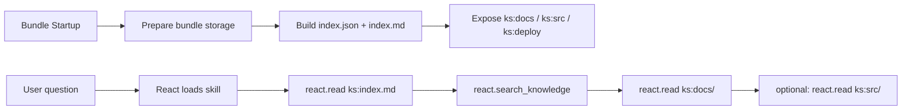

# Bundle Knowledge Space

The **knowledge space** is a bundle‑defined, read‑only namespace that React can
navigate with `ks:` paths (e.g., `ks:docs/...`, `ks:src/...`). It is **not a global
filesystem**—each bundle decides what to expose and how to resolve those paths.

This feature is built on **shared bundle local storage** (`BUNDLE_STORAGE_ROOT`):
the bundle can store docs/indexes there and expose them via a resolver.

This doc explains how to:
- prepare the knowledge space on bundle startup
- implement a `ks:` resolver and a search function
- integrate with React via runtime hooks

---

## 1) Prepare the knowledge space (bundle startup)

Use `on_bundle_load(...)` to prepare the bundle’s shared storage and build an index.
This runs **once per process per tenant/project** and is ideal for cloning docs,
building indexes, or caching read‑only assets.

```python
class MyWorkflow(BaseEntrypoint):
    def on_bundle_load(self, *, storage_root=None, bundle_spec=None, logger=None, **_):
        if not storage_root:
            return
        root = Path(storage_root)
        (root / "docs").mkdir(parents=True, exist_ok=True)
        (root / "index.json").write_text("{\"items\": []}")
```

Where is `storage_root`?
- The platform resolves `storage_root` from **shared bundle local storage**.
- Default location: `<bundles_root>/_bundle_storage/<tenant>/<project>/<bundle_id>`.
- Configure with `BUNDLE_STORAGE_ROOT`.

See: [docs/sdk/bundle/bundle-storage-cache-README.md](bundle-storage-cache-README.md).

---

## 2) Provide a resolver for `ks:` paths

React does **not** know how to read `ks:` by default. Your bundle must provide:
- **read resolver**: `knowledge_read_fn(path) -> ReadResult`
- **search resolver**: `knowledge_search_fn(query, root?, keywords?, top_k?) -> list`

These are attached to `RuntimeCtx` (see below), and `react.read` calls them when
it sees a `ks:` path.

A minimal resolver usually:
- maps `ks:docs/<path>` to a local file under `<bundle_storage>/docs/...`
- maps `ks:src/<path>` to a local file under `<bundle_storage>/src/...`
- returns clear errors when a path is missing or unreadable

---

## 3) Integrate with React runtime

React supports bundle‑supplied knowledge hooks:
- `knowledge_read_fn` — used by `react.read` for `ks:` paths
- `knowledge_search_fn` — exposed to the agent as `react.search_knowledge`

You set these in the bundle entrypoint when the workflow is constructed:

```python
from kdcube_ai_app.apps.chat.sdk.solutions.react.v2.proto import RuntimeCtx
from .knowledge import resolver as knowledge_resolver

runtime_ctx.knowledge_read_fn = knowledge_resolver.read_knowledge
runtime_ctx.knowledge_search_fn = knowledge_resolver.search_knowledge
```

Now the agent can do:
- `react.read(["ks:docs/...", "ks:src/..."])`
- `react.search_knowledge(query="...", root="ks:docs")`

---

## 4) How `ks:` paths are used

Typical scheme:

```
ks:index.md
ks:docs/<relative_doc_path>
ks:src/<relative_source_path>
ks:deploy/<relative_deploy_path>
```

Important:
- `ks:` is **bundle‑local**. Different bundles can expose different layouts.
- If a bundle doesn’t supply a resolver, `react.read(ks:...)` will return a clear
  error (not a file).

---

## 5) Example bundle (reference)

Reference implementation:
`services/kdcube-ai-app/kdcube_ai_app/apps/chat/sdk/examples/bundles/react.doc@2026-03-02-22-10`

This bundle:
- clones docs + sources in `on_bundle_load`
- builds `index.json` and `index.md`
- exposes `ks:docs`, `ks:src`, `ks:deploy`
- registers `react.search_knowledge` in bundle tools

See:
- `.../react.doc@2026-03-02-22-10/doc-reader-README.md`
- `.../react.doc@2026-03-02-22-10/knowledge/resolver.py`
- `.../react.doc@2026-03-02-22-10/knowledge/index_builder.py`

---

## Read + search flow (visual)



---

## Checklist (bundle author)

- [ ] Implement `on_bundle_load` to prepare docs / index.
- [ ] Provide `knowledge_read_fn` and `knowledge_search_fn`.
- [ ] Register `react.search_knowledge` in bundle tools descriptor.
- [ ] Add a product/knowledge skill that teaches the agent how to navigate `ks:`.
- [ ] Validate `ks:` references in docs (optional, but recommended).
