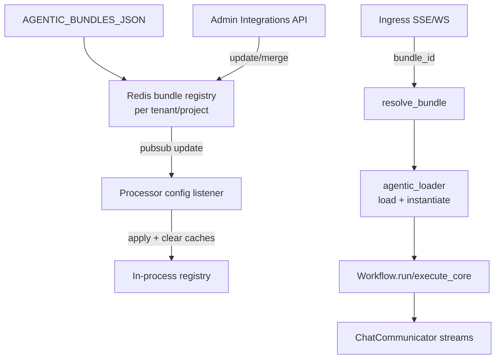

# Bundle Ops Guide (Registry, Delivery, Git)

This guide is for **ops/deployment** owners who configure bundle registries, delivery, and upgrades.

If you need **authoring** guidance, see:
[docs/sdk/bundle/bundle-dev-README.md](bundle-dev-README.md).

---

## Registry + runtime flow (overview)



Notes:
- Registry is tenant/project scoped.
- Updates are published to a tenant/project channel; each processor listens only to its own channel.
- Only **new requests** use the updated bundle path.

Runtime touchpoints:
- Task runner: `src/kdcube-ai-app/kdcube_ai_app/apps/chat/processor.py` (loads bundle + calls `run`)
- Config listener: `src/kdcube-ai-app/kdcube_ai_app/apps/chat/processor.py` (subscribes to bundles update channel)
- Integrations API: `src/kdcube-ai-app/kdcube_ai_app/apps/chat/proc/rest/integrations/integrations.py`
  - `POST /bundles/{tenant}/{project}/operations/{operation}` invokes `workflow.<operation>(...)`

---

## Delivery modes

Choose one delivery mode per deployment:
- **Mounted path** (EC2 compose, local dev): bundles exist on disk and are mounted into proc.
- **Git‑defined** (ECS or EC2): proc clones bundles from git at startup/config update.

**Git pull policy (runtime):**
- Git pulls happen **only during registry sync** (processor startup or a bundle config update).
- Request‑time `resolve_bundle()` **never** pulls from git.

---

## Registry source of truth

At runtime, the source of truth is Redis:
- key: `kdcube:config:bundles:mapping:{tenant}:{project}`
- channel: `kdcube:config:bundles:update:{tenant}:{project}`

Processors load Redis on startup and subscribe to the channel.

---

## Configuration sources

### 1) `AGENTIC_BUNDLES_JSON`

Accepted shape:
```json
{
  "default_bundle_id": "with.codegen",
  "bundles": {
    "with.codegen": {
      "id": "with.codegen",
      "name": "Codegen Agentic App",
      "path": "/bundles",
      "module": "with.codegen.entrypoint",
      "singleton": false,
      "description": "Codegen Agentic App"
    }
  }
}
```

Fields:
- `id` (required)
- `name` (optional)
- `path` (required for local bundles, parent dir)
- `module` (required for local bundles, includes bundle folder)
- `singleton` (optional)
- `description` (optional)
- `version` (optional)
- `repo` / `ref` / `subdir` (git bundles)
- `git_commit` (optional, filled after clone)

### 2) Admin APIs (update registry + broadcast)

- `GET /admin/integrations/bundles`
- `POST /admin/integrations/bundles`
  - `{ op: "replace"|"merge", bundles: {...}, default_bundle_id?: "..." }`
- `POST /admin/integrations/bundles/reset-env`

**CI/CD friendly option (no admin tokens):**
Set `BUNDLES_FORCE_ENV_ON_STARTUP=1` on **processor**.

`reset-env` and proc startup force-env do two things authoritatively for the
current tenant/project scope:
- replace the Redis bundle registry from `AGENTIC_BUNDLES_JSON` / `bundles.yaml`
- replace the descriptor-backed bundle props layer in Redis

If a bundle prop key was removed from `bundles.yaml`, that key is deleted from
Redis during env reset. Runtime/admin overrides are also discarded by env reset,
which makes `bundles.yaml` the startup source of truth.

**Bundle secrets + sidecar tokens (important):**
Bundle secrets can be added at any time (admin UI or bundles.secrets.yaml),
so services must be able to read them long after startup. If you use
`bundles.secrets.yaml`, keep the secrets sidecar **read tokens non‑expiring**:
- `SECRETS_TOKEN_TTL_SECONDS=0`
- `SECRETS_TOKEN_MAX_USES=0`
These live in the workdir `.env` (compose) and ensure `get_secret()` keeps
working for bundle secrets at runtime.

**Admin UI UX:** bundle secrets are write‑only. The UI shows **keys only**
(values are never returned). Keys are tracked in Redis per bundle.

When secrets are provisioned via `bundles.secrets.yaml`, the CLI also stores
the key list under `bundles.<bundle_id>.secrets.__keys` in the secrets sidecar
so the UI can show keys without exposing values.

Important:
- this authoritative env reset applies to the registry and bundle props layer
  only
- `bundles.secrets.yaml` provisioning is currently upsert-only
- removing a secret from the descriptor does not auto-delete it from the
  configured secrets provider

---

## Runtime env controls

| Setting                               | Default   | Purpose                                                                 |
|---------------------------------------|-----------|-------------------------------------------------------------------------|
| `AGENTIC_BUNDLES_JSON`                | _(unset)_ | Bundle registry descriptor (inline JSON or path to JSON/YAML file).     |
| `BUNDLE_STORAGE_ROOT`                | _(unset)_ | Shared local filesystem root for bundle data (used by ks:), default: `<bundles_root>/_bundle_storage`. |
| `BUNDLES_FORCE_ENV_ON_STARTUP`        | `0`       | Force overwrite Redis registry and descriptor-backed bundle props from `AGENTIC_BUNDLES_JSON` at startup. |
| `BUNDLES_FORCE_ENV_LOCK_TTL_SECONDS`  | `60`      | Redis lock TTL for startup env reset.                                   |
| `BUNDLES_INCLUDE_EXAMPLES`            | `1`       | Auto‑add example bundles from `src/kdcube-ai-app/kdcube_ai_app/apps/chat/sdk/examples/bundles`.                   |
| `BUNDLES_PRELOAD_ON_START`            | `0`       | Eagerly load all configured bundle modules and run `on_bundle_load` hooks at proc startup. Eliminates cold start on first request. Proc `/health` returns 503 until preload completes. |
| `BUNDLE_GIT_RESOLUTION_ENABLED`       | `1`       | Enable git clone/pull for bundles with `repo`.                          |
| `BUNDLE_GIT_ALWAYS_PULL`              | `0`       | Always pull even if local path exists (useful for branch refs).         |
| `BUNDLE_GIT_ATOMIC`                   | `1`       | Use atomic checkout (clone to temp dir then rename).                    |
| `BUNDLE_GIT_PREFETCH_ENABLED`         | `1`       | Prefetch git bundles once on startup to gate readiness.                 |
| `BUNDLE_GIT_REDIS_LOCK`               | `0`       | Redis lock for git pulls (per instance; key includes `INSTANCE_ID`).    |
| `BUNDLE_GIT_REDIS_LOCK_TTL_SECONDS`   | `300`     | Redis lock TTL for git pulls.                                           |
| `BUNDLE_GIT_REDIS_LOCK_WAIT_SECONDS`  | `60`      | Max wait to acquire git lock.                                           |
| `BUNDLE_GIT_FAIL_BACKOFF_SECONDS`     | `60`      | Initial backoff after git failure (cooldown).                           |
| `BUNDLE_GIT_FAIL_MAX_BACKOFF_SECONDS` | `300`     | Max backoff after repeated failures.                                    |
| `BUNDLE_GIT_CLONE_DEPTH`              | _(unset)_ | Git clone depth (shallow clone).                                        |
| `BUNDLE_GIT_SHALLOW`                  | _(unset)_ | Shallow clone (depth=50) when clone depth is unset.                     |
| `BUNDLE_GIT_KEEP`                     | `3`       | Number of old git bundle folders to keep (cleanup).                     |
| `BUNDLE_GIT_TTL_HOURS`                | `0`       | If >0, delete git bundle folders older than this TTL (hours).           |
| `GIT_SSH_COMMAND`                     | _(unset)_ | Full SSH command for git (overrides other SSH envs).                    |
| `GIT_SSH_KEY_PATH`                    | _(unset)_ | Path to private SSH key used for git clone/pull.                        |
| `GIT_SSH_KNOWN_HOSTS`                 | _(unset)_ | Path to `known_hosts` for SSH host verification.                        |
| `GIT_SSH_STRICT_HOST_KEY_CHECKING`    | _(unset)_ | `yes`/`no` for StrictHostKeyChecking.                                   |
| `GIT_HTTP_TOKEN`                      | _(unset)_ | HTTPS token for private repos (uses GIT_ASKPASS).                       |
| `GIT_HTTP_USER`                       | _(unset)_ | HTTPS username (defaults to `x-access-token`).                          |

**Auth precedence:** if `GIT_HTTP_TOKEN` is set, HTTPS token auth is used and SSH settings are ignored (a warning is logged when both are set).

---

## Shared bundle local storage (compose / ECS)

If you use bundles that expose `ks:` (doc/knowledge or any shared local data),
mount a shared local store and set:

```
BUNDLE_STORAGE_ROOT=/bundle-storage
```

Examples:
- **Docker compose**: bind a host dir to `/bundle-storage`.
- **ECS**: mount EFS to `/bundle-storage` (access point `uid=1000`, `gid=1000`).

## Bundles root resolution

Bundles are stored under a root directory. Resolution order:
1. `HOST_BUNDLES_PATH`
2. `AGENTIC_BUNDLES_ROOT`
3. `/bundles`

In containers, prefer `AGENTIC_BUNDLES_ROOT=/bundles`.

---

## Git bundle path derivation

```
<bundles_root>/<repo>__<bundle_id>__<ref>/<subdir?>
```

If `ref` is omitted:
```
<bundles_root>/<repo>__<bundle_id>/<subdir?>
```

**Ref policy (recommended):**
- Tag (release)
- Commit SHA (deterministic)
- Branch name (dev only, requires `BUNDLE_GIT_ALWAYS_PULL=1`)

---

## Built‑in bundles and reserved IDs

These IDs are reserved and cannot be overridden:
- `kdcube.admin`
- example bundles from `src/kdcube-ai-app/kdcube_ai_app/apps/chat/sdk/examples/bundles` (when enabled)

To disable example bundles:
```
BUNDLES_INCLUDE_EXAMPLES=0
```

---

## Bundle props (runtime overrides)

Bundles can expose runtime props stored per tenant/project/bundle in Redis.
These props can be provided in `bundles.yaml` **or** updated at runtime.
Bundle defaults come from `entrypoint.configuration` (bundle-defined). Effective
props are computed as a deep merge: defaults → bundles.yaml → runtime overrides.

Some prop paths are platform-reserved and have built-in behavior:
- `role_models`
- `embedding`
- `economics.reservation_amount_dollars`
- `execution.runtime`
- `mcp.services`

Canonical reference:
[docs/sdk/bundle/bundle-platform-properties-README.md](bundle-platform-properties-README.md).

Example: MCP service config in bundle props

```yaml
config:
  mcp:
    services:
      mcpServers:
        docs:
          transport: http
          url: https://mcp.internal.example.com
          auth:
            type: bearer
            secret: bundles.react.mcp@2026-03-09.secrets.docs.token
        firecrawl:
          transport: stdio
          command: npx
          args: ["-y", "firecrawl-mcp"]
          env:
            FIRECRAWL_API_KEY: ${secret:bundles.react.mcp@2026-03-09.secrets.firecrawl.api_key}
```

Notes:
- `mcp.services` is the preferred platform contract for MCP connector config.
- `MCP_SERVICES` env remains only as a legacy/local-dev fallback.
- `auth.secret` is the preferred way to wire HTTP/SSE auth through named bundle secrets.
- `${secret:...}` is supported for stdio server `env` values and resolves through `get_secret()` at session creation time.

Important:
- during normal runtime, admin edits act as the top override layer
- during `reset-env` or proc startup with `BUNDLES_FORCE_ENV_ON_STARTUP=1`,
  Redis props are rebuilt from `bundles.yaml` authoritatively
- stale keys removed from `bundles.yaml` are deleted from Redis
- runtime overrides do not survive that authoritative env reset

Admin APIs:
- `GET /admin/integrations/bundles/{bundle_id}/props`
- `POST /admin/integrations/bundles/{bundle_id}/props`
- `POST /admin/integrations/bundles/{bundle_id}/props/reset-code`

Example: set knowledge repo + docs roots for a bundle that uses knowledge search:

```
POST /admin/integrations/bundles/<bundle_id>/props
{
  "tenant": "<tenant>",
  "project": "<project>",
  "op": "merge",
  "props": {
    "knowledge": {
      "repo": "git@github.com:kdcube/kdcube-ai-app.git",
      "ref": "v0.3.2",
      "docs_root": "app/ai-app/docs",
      "src_root": "app/ai-app/src/kdcube-ai-app/kdcube_ai_app",
      "deploy_root": "app/ai-app/deployment",
      "validate_refs": true
    }
  }
}
```

### Props in bundles.yaml

You can also set props per bundle item in `bundles.yaml`:

```yaml
bundles:
  version: "1"
  items:
    - id: "react@2026-02-10-02-44"
      repo: "git@github.com:kdcube/kdcube-ai-app.git"
      ref: "v0.3.2"
      subdir: "app/ai-app/src/kdcube-ai-app/kdcube_ai_app/apps/chat/sdk/examples/bundles"
      module: "react@2026-02-10-02-44.entrypoint"
      config:
        knowledge:
          repo: "git@github.com:kdcube/kdcube-ai-app.git"
          ref: "v0.3.2"
          docs_root: "app/ai-app/docs"
          src_root: "app/ai-app/src/kdcube-ai-app/kdcube_ai_app"
          deploy_root: "app/ai-app/deployment"
          validate_refs: true
```

Resolved values are stored in Redis as bundle props.
On `reset-env` / startup force-env this Redis layer is synchronized
authoritatively from the descriptor, not merged additively.

Example: per-bundle Fargate exec override

```yaml
config:
  execution:
    runtime:
      mode: fargate
      enabled: true
      cluster: arn:aws:ecs:eu-west-1:100258542545:cluster/kdcube-staging-cluster
      task_definition: kdcube-staging-exec
      container_name: exec
      subnets: ["subnet-xxxx", "subnet-yyyy"]
      security_groups: ["sg-xxxx"]
      assign_public_ip: DISABLED
```

This lets a specific bundle opt into distributed exec even if proc also has
global env fallbacks for Docker/Fargate execution.

Bundles can also declare multiple supported exec profiles in props:

```yaml
config:
  execution:
    runtime:
      default_profile: fargate
      profiles:
        docker:
          mode: docker
        fargate:
          mode: fargate
          enabled: true
          cluster: arn:aws:ecs:eu-west-1:100258542545:cluster/kdcube-staging-cluster
          task_definition: kdcube-staging-exec
          container_name: exec
          subnets: ["subnet-xxxx", "subnet-yyyy"]
          security_groups: ["sg-xxxx"]
          assign_public_ip: DISABLED
```

That keeps the supported runtime set inside bundle props while still allowing
the bundle to choose the actual profile at runtime.

### Inspect effective props in Redis
```
kdcube:config:bundles:props:<tenant>:<project>:<bundle_id>
```

Example:
```bash
redis-cli GET "kdcube:config:bundles:props:demo-tenant:demo-project:react.doc@2026-03-02-22-10"
```

---

## Bundles descriptor

Bundles descriptors define bundle versions for CI/CD.
Canonical docs:
- [docs/service/configuration/bundle-configuration-README.md](../../service/configuration/bundle-configuration-README.md)
- [docs/service/cicd/release-bundle-README.md](../../service/cicd/release-bundle-README.md)

Use `repo/ref/subdir/module` in `bundles.yaml` and set:
```
AGENTIC_BUNDLES_JSON=/config/bundles.yaml
```

Bundles descriptors define **bundle versions** and can include **bundle props**.

---

## Cleanup of old git bundles

Use cleanup to drop old git bundle folders:
- automatic cleanup via `BUNDLE_GIT_KEEP` and `BUNDLE_GIT_TTL_HOURS`
- admin cleanup endpoint (if enabled) for module cache eviction

---

## Bundle cache cleanup loop (proc)

These control the periodic cleanup that removes stale bundle module caches:
- `BUNDLE_CLEANUP_ENABLED`
- `BUNDLE_CLEANUP_INTERVAL_SECONDS`
- `BUNDLE_CLEANUP_LOCK_TTL_SECONDS`
- `BUNDLE_REF_TTL_SECONDS`

---

## References (code)

- Bundle registry: `src/kdcube-ai-app/kdcube_ai_app/infra/plugin/bundle_registry.py`
- Git bundle resolver: `src/kdcube-ai-app/kdcube_ai_app/infra/plugin/git_bundle.py`
- Bundle store (Redis): `src/kdcube-ai-app/kdcube_ai_app/infra/plugin/bundle_store.py`
- Task processor + config listener: `src/kdcube-ai-app/kdcube_ai_app/apps/chat/processor.py`
- Integrations API: `src/kdcube-ai-app/kdcube_ai_app/apps/chat/proc/rest/integrations/integrations.py`
