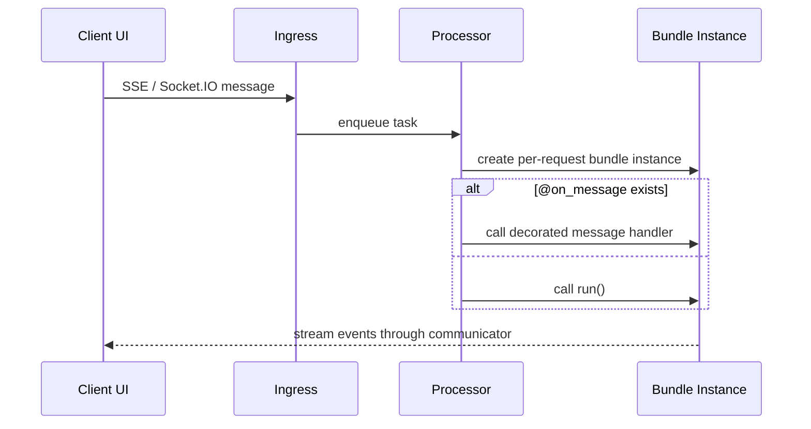
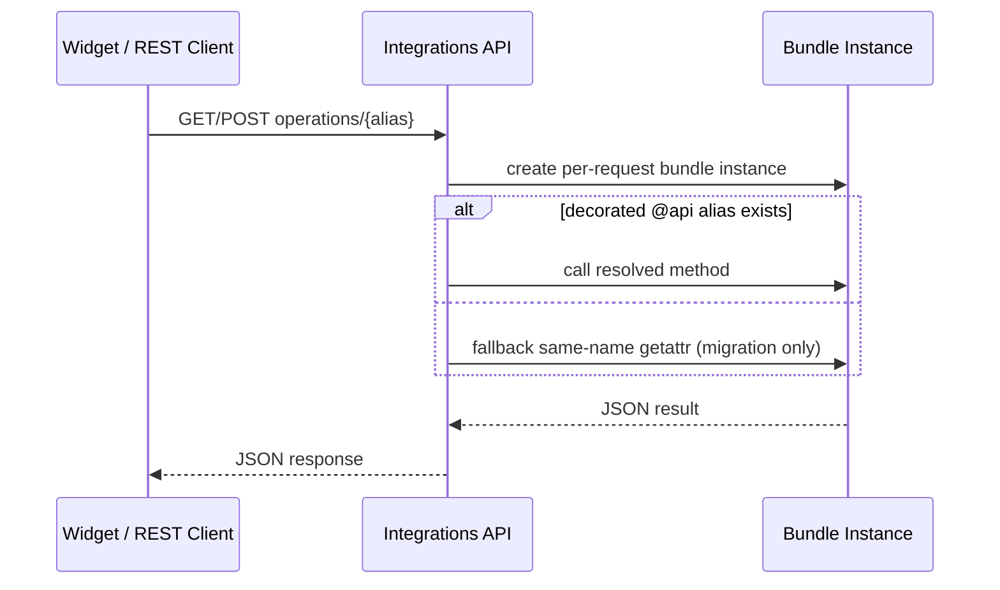
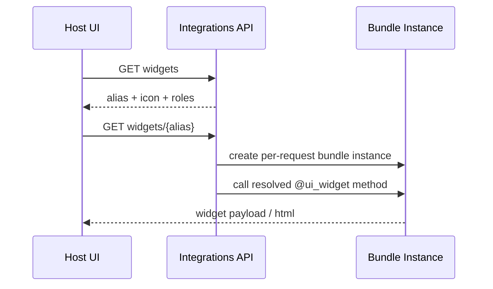

# Bundle Platform Integration

This doc is the **design contract** for how bundles integrate with the platform
outside the core `run()` workflow:
- bundle API methods exposed over REST
- bundle widgets exposed to the frontend
- bundle main UI entrypoint
- bundle message entrypoint used by SSE / Socket.IO processing

The goal is to make bundle integration points:
- **declarative**
- **discoverable**
- **role-aware**
- **backward compatible**

This is intentionally written as a phased design, but the first backend slice is
already implemented.

Current implementation status:
- decorator metadata is live in `agentic_loader.py`
- bundle interface manifest discovery is live
- `GET /api/integrations/bundles/{tenant}/{project}/{bundle_id}` is live
- `GET /api/integrations/bundles/{tenant}/{project}/{bundle_id}/widgets` is live
- `GET /api/integrations/bundles/{tenant}/{project}/{bundle_id}/widgets/{alias}` is live
- `GET /api/integrations/bundles/{tenant}/{project}/{bundle_id}/operations/{alias}` is live
- operations already prefer decorated `@api` aliases and still fall back to same-name method lookup for undecorated bundles
- widget fetch is already decorator-only
- `@on_message` metadata exists, but streaming dispatch is still migration mode and still falls back to `run()`

---

## 1) Current behavior

Today:
- bundle discovery relies on `@agentic_workflow` on the entrypoint class
- streaming requests still eventually call `workflow.run(...)`
- integrations operations can now resolve `@api` metadata first, then fall back to same-name method lookup
- widgets can now be discovered as a platform contract through `@ui_widget`

This still leaves open migration work:
- streaming dispatch is not yet decorator-driven
- legacy broad operation exposure still exists for backward compatibility
- full bundle frontend entrypoints are not yet resolved through `@ui_main`

---

## 2) Core design rules

### 2.1 Bundle instance model

The bundle instance remains **per request**.

That means:
- one bundle instance for each SSE / Socket.IO message request
- one bundle instance for each `integrations/operations/...` REST request
- one bundle instance for each widget fetch request

Request context is attached to the instance and is available through `self.comm`.

Bundle methods should treat `self.comm` as the authoritative request/session
context for:
- user id
- fingerprint
- tenant / project
- roles
- permissions
- request metadata

Forwarded REST inputs are for **business parameters**, not for reconstructing
platform context.

### 2.2 Public integration points must be declared

The platform should discover public bundle integration points from decorators,
not from broad `hasattr(...)` probing.

`@agentic_workflow` remains the class-level decorator that marks the entrypoint.

Method-level decorators define which entrypoint methods are intended to be:
- message handlers
- REST API operations
- widgets
- main UI entrypoints

### 2.3 Backward compatibility first

The rollout must stay **recognition-first**, not **enforcement-first**.

That means:
- existing bundles without the new decorators continue to work
- the platform prefers decorated methods when present
- old fallback behavior remains until the migration is complete

Examples:
- streaming may keep falling back to `run()` when no `@on_message` method is declared
- operations may keep falling back to same-name method lookup when no `@api` metadata exists

---

## 3) Decorators to add

These decorators should live in the same module as `@agentic_workflow`:
- `src/kdcube-ai-app/kdcube_ai_app/infra/plugin/agentic_loader.py`

That keeps all bundle entrypoint discovery metadata in one place.

### 3.1 `@ui_widget(...)`

Marks a method as a widget endpoint that returns widget content for the platform.

Proposed decorator:

```python
@ui_widget(
    icon={
        "tailwind": "heroicons-outline:adjustments-horizontal",
        "lucide": "SlidersHorizontal",
    },
    alias="preferences",
    roles=["registered", "privileged"],
)
def preferences_widget(self, **kwargs):
    ...
```

Purpose:
- declares a widget as platform-discoverable
- provides display metadata for bundle widget listings
- provides the public widget alias used in REST routes

Icon rules:
- preferred shape is a provider map such as `{"tailwind": "...", "lucide": "..."}`
- current supported providers are `tailwind` and `lucide`
- legacy string icons are still accepted and are normalized to `{"tailwind": "<value>"}` for backward compatibility

### 3.2 `@api(...)`

Marks a method as a public REST operation.

Proposed decorator:

```python
@api(method="POST", alias="preferences_exec_report", roles=["registered"])
async def preferences_exec_report(self, recency: int = 10, kwords: str = "", **kwargs):
    ...
```

Rules:
- default HTTP method is `POST`
- alias defaults to method name if omitted
- `roles` is optional
- kwargs come from request body (`POST`) or query params (`GET`)

### 3.3 `@on_message`

Marks the method that should handle streaming message requests.

Proposed decorator:

```python
@on_message
async def run(self, **kwargs):
    ...
```

Why this exists:
- it makes the streaming entrypoint explicit
- later, SSE / Socket.IO processing can resolve the message handler via metadata
  instead of assuming `run()`

### 3.4 `@ui_main`

Marks the method that returns the main UI HTML for the bundle, if the bundle has
one.

Proposed decorator:

```python
@ui_main
def main_ui(self, **kwargs):
    ...
```

This is the future stable surface for full bundle frontend entrypoints.

---

## 4) Metadata model

The decorator attributes should be stored as **dataclasses**, not loose dicts.

This makes discovery safer and allows the platform to return a typed manifest.

### 4.1 `APIEndpointSpec`

```python
@dataclass(frozen=True)
class APIEndpointSpec:
    method_name: str
    alias: str
    http_method: str = "POST"
    roles: tuple[str, ...] = ()
```

### 4.2 `UIWidgetSpec`

```python
@dataclass(frozen=True)
class UIWidgetSpec:
    method_name: str
    alias: str
    icon: dict[str, str]
    roles: tuple[str, ...] = ()
```

### 4.3 `OnMessageSpec`

```python
@dataclass(frozen=True)
class OnMessageSpec:
    method_name: str
```

### 4.4 `UIMainSpec`

```python
@dataclass(frozen=True)
class UIMainSpec:
    method_name: str
```

### 4.5 Aggregate manifest

The bundle loader should be able to produce an aggregate manifest:

```python
@dataclass(frozen=True)
class BundleInterfaceManifest:
    bundle_id: str
    ui_widgets: tuple[UIWidgetSpec, ...] = ()
    api_endpoints: tuple[APIEndpointSpec, ...] = ()
    ui_main: UIMainSpec | None = None
    on_message: OnMessageSpec | None = None
```

This metadata is **derived from code**. It should not be copied into
`AgenticBundleSpec` or bundle registry entries.

Why:
- registry/spec data is deployment configuration
- interface metadata is entrypoint code metadata
- they change for different bundle versions and should be rediscovered from the
  actual loaded bundle

---

## 5) Discovery rules

Discovery should happen after the bundle entrypoint class is resolved through
`@agentic_workflow`.

The loader should inspect the decorated entrypoint class and collect:
- all `@api` methods
- all `@ui_widget` methods
- zero or one `@ui_main`
- zero or one `@on_message`

Recommended rules:
- method alias defaults to Python method name if alias is omitted
- duplicate aliases for the same category are invalid
- `@ui_main` must be unique
- `@on_message` must be unique

The platform now exposes helper functions such as:
- `discover_bundle_interface_manifest(...)`
- `resolve_bundle_api_endpoint(...)`
- `resolve_bundle_widget(...)`
- `resolve_bundle_message_method(...)`

---

## 6) REST surface to add

Bundle id should be part of the request path for the new integration routes.

That avoids the current ambiguity where the body supplies `bundle_id`.

### 6.1 Bundle manifest

```text
GET /api/integrations/bundles/{tenant}/{project}/{bundle_id}
```

Returns bundle integration metadata visible to the current user, for example:

```json
{
  "bundle_id": "versatile",
  "tenant": "demo-tenant",
  "project": "demo-project",
  "ui_widgets": [
    {
      "alias": "preferences",
      "icon": {
        "tailwind": "heroicons-outline:adjustments-horizontal",
        "lucide": "SlidersHorizontal"
      },
      "roles": ["registered", "privileged"]
    }
  ],
  "api_endpoints": [
    {
      "alias": "preferences_exec_report",
      "http_method": "POST",
      "roles": ["registered"]
    }
  ],
  "ui_main": {
    "method_name": "main_ui"
  }
}
```

### 6.2 Operations

```text
POST /api/integrations/bundles/{tenant}/{project}/{bundle_id}/operations/{alias}
GET  /api/integrations/bundles/{tenant}/{project}/{bundle_id}/operations/{alias}
```

Current semantics:
- `POST`: `payload.data` is forwarded as kwargs
- `GET`: query params are forwarded as kwargs
- request/session context still comes from `self.comm`
- decorated aliases are resolved first
- if an alias exists only for another method, the endpoint returns `405`
- if no decorated alias exists, proc still falls back to same-name method lookup for backward compatibility

Backward-compatible legacy route:

```text
POST /api/integrations/bundles/{tenant}/{project}/operations/{alias}
```

Legacy semantics:
- if the request body provides `bundle_id`, proc resolves that bundle
- otherwise proc resolves the current default bundle id
- generic platform panels may still use this route while bundle-specific clients
  should prefer the explicit `/{bundle_id}/operations/...` form

### 6.3 Widgets list

```text
GET /api/integrations/bundles/{tenant}/{project}/{bundle_id}/widgets
```

Returns only widget metadata visible to the current user.

### 6.4 Widget fetch

```text
GET /api/integrations/bundles/{tenant}/{project}/{bundle_id}/widgets/{alias}
```

This resolves the `@ui_widget` method by alias and returns the widget payload
for the platform to embed.

Current semantics:
- widget fetch is already decorator-only
- unauthorized widget aliases are rejected by role filtering before invocation

---

## 7) Dispatch behavior

### 7.1 Streaming dispatch

Target behavior:



Current status:
- `@on_message` metadata exists
- processor-side streaming dispatch has not switched yet
- streaming still preserves the current `run()` fallback

### 7.2 Operations dispatch

Current behavior:



This phase is already live for REST operations.

### 7.3 Widget dispatch

Current behavior:



This phase is already live for widgets.

Widgets should use the same auth/config handshake already shown in:
- `src/kdcube-ai-app/kdcube_ai_app/apps/chat/proc/rest/integrations/AIBundleDashboard.tsx`
- `src/kdcube-ai-app/kdcube_ai_app/apps/chat/sdk/examples/bundles/versatile@2026-03-31-13-36/ui/PreferencesBrowser.tsx`

---

## 8) Role filtering

The platform, not the widget, must enforce role visibility.

Rules:
- widget list endpoints return only widgets allowed for the current user
- direct widget fetch rejects unauthorized aliases
- operations reject calls when the current user does not satisfy the declared
  roles

Decorator fields:
- widgets use `roles`
- API methods use `roles`

The role strings should align with the existing gateway/session role model.

---

## 9) First implementation phase

The first backend phase should be conservative.

### Phase 1: recognition and new read endpoints

Status: implemented.

Implement:
- decorator dataclasses and decorators in `agentic_loader.py`
- decorator discovery helpers
- `GET` support for bundle operations
- bundle manifest endpoint
- widget list endpoint
- widget fetch endpoint

Behavior:
- widget endpoints use decorator-based discovery immediately
- operations still fall back to old same-name method lookup when no decorator metadata exists
- streaming still falls back to `run()`

### Phase 2: prefer declarative dispatch

Status: pending.

Implement:
- processor resolves `@on_message` first
- operations resolve `@api` first
- alias support becomes the normal routing model

### Phase 3: tighten exposure rules

Status: pending.

After migration:
- public REST operations should require `@api`
- public widgets should require `@ui_widget`
- raw `hasattr(...)` exposure should be considered legacy fallback only

---

## 10) Guidance for bundle authors

When authoring bundles:
- use `@agentic_workflow` on the entrypoint class
- add `@api` to methods that are intentionally public over REST
- add `@ui_widget` to widget-producing methods
- treat undecorated REST methods as legacy compatibility only
- add `@on_message` when you want to be ready for future message-handler dispatch
- use `self.comm` for platform request/session context
- use kwargs for UI/business inputs forwarded from GET/POST requests

The reference bundle for this model is:
- `src/kdcube-ai-app/kdcube_ai_app/apps/chat/sdk/examples/bundles/versatile@2026-03-31-13-36`

The reference bundle already demonstrates:
- `@api`
- `@ui_widget`
- widget → operations calls
- future `@ui_main` if defined
- future message handler declaration if different from `run()`

---

## 11) Design decisions

### Why not store widget/API metadata in bundle registry?

Because registry data is deployment/configuration state, while interface metadata
is part of the bundle code contract.

### Why keep fallback behavior at first?

Because existing bundles already rely on:
- implicit `run()`
- direct operation method lookup

Breaking those immediately would slow migration and bundle adoption.

### Why require bundle id in the path?

Because bundle selection is part of the route identity, not just request body
data. This makes:
- GET support natural
- routing clearer
- frontend integration simpler

---

## References

- Bundle loader decorators:
  `src/kdcube-ai-app/kdcube_ai_app/infra/plugin/agentic_loader.py`
- Processor runtime dispatch:
  `src/kdcube-ai-app/kdcube_ai_app/apps/chat/processor.py`
- Integrations controller:
  `src/kdcube-ai-app/kdcube_ai_app/apps/chat/proc/rest/integrations/integrations.py`
- Current widget/API integration examples:
  `src/kdcube-ai-app/kdcube_ai_app/apps/chat/proc/rest/integrations/AIBundleDashboard.tsx`
  `src/kdcube-ai-app/kdcube_ai_app/apps/chat/sdk/examples/bundles/versatile@2026-03-31-13-36/ui/PreferencesBrowser.tsx`
