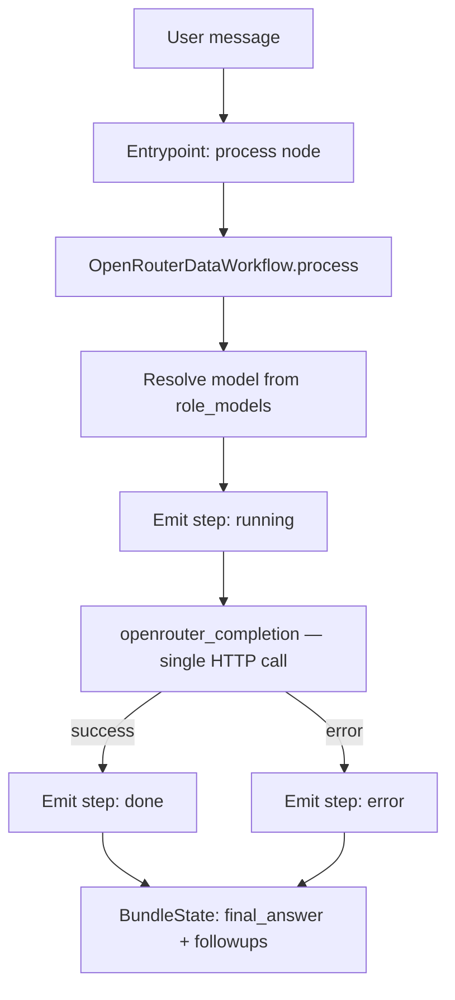

# OpenRouter Data Bundle — Overview

This bundle implements a **single-turn data-processing pipeline backed by OpenRouter**.
It is the simplest bundle pattern in the SDK: one user message → one LLM call → one answer.

Use it when you need deterministic, structured output from an LLM without agent loops,
tool calls, or multi-turn continuity. Common tasks: extraction, classification, tagging,
summarization, schema generation, meta-tagging.

**Not suitable for:** multi-turn conversations, ReAct agent workflows, or anything that
requires context caching (OpenRouter does not support it).

## Why OpenRouter for data processing?

- Access to hundreds of models (Gemini, Mistral, Llama, etc.) through a single API
- Pay-per-token pricing — ideal for batch/ad-hoc processing jobs
- No streaming required — synchronous call is fine for structured output tasks
- Simple to swap models via `role_models` configuration without changing code

## How it works

1. **Bundle registers as `openrouter-data`** via `@agentic_workflow(name="openrouter-data", version="1.0.0", priority=50)`.

2. **Entrypoint builds a single-node LangGraph** (`process` node) and delegates to `OpenRouterDataWorkflow.process()`.

3. **Workflow makes one OpenRouter call**:
   - Resolves the model from `config.role_models["data-processor"]` (default: `google/gemini-2.5-flash-preview`)
   - Prepends a system prompt that instructs the model to produce clean structured output
   - Sends user text + optional attachments in a single-turn messages list
   - Temperature: `0.3` (low, for deterministic structured output)
   - Max tokens: `4096`

4. **Accounting** is captured automatically via the `with_accounting("data-processor", ...)` context manager wrapping the API call.

5. **SSE events** are emitted at each stage so the UI shows progress.

## Execution flow



## Bundle layout

```
openrouter-data@2026-03-11/
  __init__.py              # package marker
  entrypoint.py            # @agentic_workflow(name="openrouter-data"), BaseEntrypoint
  event_filter.py          # pass-through filter (all events forwarded)
  orchestrator/
    __init__.py
    workflow.py            # OpenRouterDataWorkflow — single-call orchestrator
```

## Default model

```
google/gemini-2.5-flash-preview
```

Good balance of quality and cost for structured data tasks. Override via `role_models` configuration (see [Configuration](#configuration)).

## Configuration

The bundle exposes a `data-processor` role. Override it in the bundle config:

```python
# via Config object
config = Config(role_models={
    "data-processor": {
        "provider": "openrouter",
        "model": "anthropic/claude-3-5-haiku",  # any OpenRouter model slug
    }
})
```

Or via the bundle registry env var:

```json
{
  "bundles": {
    "openrouter-data@2026-03-11": {
      "id": "openrouter-data@2026-03-11",
      "role_models": {
        "data-processor": {
          "provider": "openrouter",
          "model": "anthropic/claude-3-5-haiku"
        }
      }
    }
  }
}
```

## Environment requirements

| Variable | Required | Description |
|----------|----------|-------------|
| `OPENROUTER_API_KEY` | Yes | OpenRouter API key |
| `OPENROUTER_BASE_URL` | No | Defaults to `https://openrouter.ai/api/v1` |

## Registering the bundle

```bash
export AGENTIC_BUNDLES_JSON='{
  "default_bundle_id": "openrouter-data@2026-03-11",
  "bundles": {
    "openrouter-data@2026-03-11": {
      "id": "openrouter-data@2026-03-11",
      "name": "OpenRouter Data Bundle",
      "path": "/bundles",
      "module": "openrouter-data@2026-03-11.entrypoint",
      "singleton": false
    }
  }
}'
```

The bundle is auto-discovered via `@agentic_workflow` once the module is loaded.

## SSE event sequence

| Step | Status | When |
|------|--------|------|
| `processing` | `running` | Immediately before the OpenRouter API call |
| `processing` | `done` | After successful response (includes model name + total tokens) |
| `processing` | `error` | If the API call fails (includes error message) |

## Output

```python
{
    "answer": "<LLM response text>",
    "followups": [],          # always empty in current implementation
}
```

`final_answer` is written to `BundleState` and returned to the platform.

## Use cases

| Task | What to put in the user message |
|------|---------------------------------|
| Data extraction | The raw text + extraction schema/instructions |
| Classification | The document + category list |
| Tagging | The content + tagging taxonomy |
| Summarization | The full text + length/format requirements |
| Schema generation | Sample data + schema format requirements |
| Meta-tagging | Content + desired metadata fields |

The system prompt already instructs the model to prefer JSON when the task is structured:

> *"Prefer JSON output when the task is structured."*

For custom instructions, pass them as part of the user message.

## Comparison with other bundles

| Bundle | Pattern | Turns | Tools | OpenRouter |
|--------|---------|-------|-------|------------|
| `openrouter-data` | Single-turn pipeline | 1 | None | Yes |
| `react` | ReAct agent loop | Multi | Python tools | No (Claude direct) |
| `react.mcp` | ReAct + MCP tools | Multi | MCP servers | No (Claude direct) |
| `eco` | ReAct + economics gate | Multi | Python + econ | No |

## Relevant implementation files

- `kdcube_ai_app/apps/chat/sdk/examples/bundles/openrouter-data@2026-03-11/entrypoint.py`
- `kdcube_ai_app/apps/chat/sdk/examples/bundles/openrouter-data@2026-03-11/orchestrator/workflow.py`
- `kdcube_ai_app/apps/chat/sdk/examples/bundles/openrouter-data@2026-03-11/event_filter.py`
- `kdcube_ai_app/infra/service_hub/openrouter.py` — `openrouter_completion()` function
- `kdcube_ai_app/infra/accounting.py` — `with_accounting()` context manager

## Related docs

- Entrypoint deep-dive: [entrypoint.md](entrypoint.md)
- Pricing & cost tracking: [openrouter-data-pricing-README.md](openrouter-data-pricing-README.md)
- Bundle developer guide: [bundle-dev-README.md](../bundle-dev-README.md)
- Bundle interfaces: [bundle-interfaces-README.md](../bundle-interfaces-README.md)
- Bundle index: [bundle-index-README.md](../bundle-index-README.md)