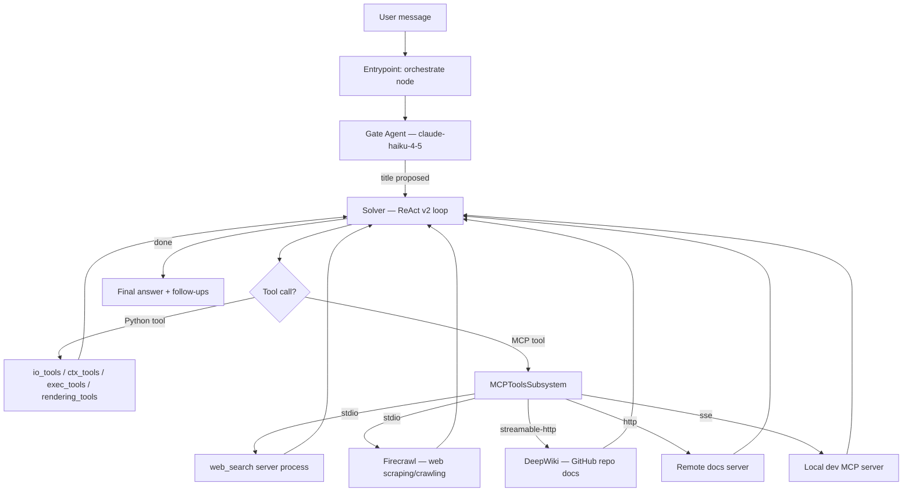

# React.mcp Bundle — Overview

This bundle is a **ReAct agent with MCP tool integration**. It extends the base
`react@2026-02-10-02-44` bundle by replacing the native Python `web_tools` module
with external tool servers connected through MCP (Model Context Protocol).

Motivation:
- decouple tool implementations from the bundle (tools live in separate processes/services)
- allow third-party MCP servers (StackOverflow, custom docs, local dev tools)
- demonstrate all three MCP transports (stdio, HTTP, SSE) in a single bundle

## What changed vs base react bundle

The bundles are **nearly identical**. Only `tools_descriptor.py` differs:

| Area | Base `react` | This bundle (`react.mcp`) |
|------|-------------|---------------------------|
| Web search / fetch | `web_tools` Python module (in-proc) | MCP `web_search` server (stdio) |
| Web scraping / crawling | None | MCP `firecrawl` server (stdio, requires API key) |
| GitHub repo docs | None | MCP `deepwiki` server (streamable-http, public) |
| External tool servers | None | MCP connectors: `stack`, `docs`, `local` |
| Everything else | Identical | Identical (entrypoint, workflow, gate, skills, event filter) |

## How it works (high-level)

1) **Bundle registers as `react`** via `@agentic_workflow(name="react")` in `entrypoint.py`.

2) **Entrypoint builds a single-node LangGraph** (`orchestrate`) that lazily initializes
   all SDK services and delegates to `WithReactWorkflow.process()`.

3) **Workflow runs a two-node pipeline**: `gate → solver`
   - **Gate** (first turn only): proposes a conversation title using Claude Haiku.
   - **Solver** (every turn): runs the ReAct v2 loop with tools from `tools_descriptor.py`.

4) **MCP tools are resolved at runtime**:
   - `MCP_TOOL_SPECS` (descriptor) declares which MCP servers are visible.
   - `MCP_SERVICES` (env) defines how to connect and authenticate.
   - The tool subsystem merges MCP tools into the agent's tool catalog alongside
     native Python tools.

## Execution flow



## Bundle layout

```
react.mcp@2026-03-09/
  entrypoint.py            # @agentic_workflow(name="react"), BaseEntrypoint
  orchestrator/
    workflow.py             # Gate → Solver two-node LangGraph
  agents/
    gate.py                 # Lightweight gate agent (conversation title)
  tools_descriptor.py       # Tool + MCP tool descriptors  ← key file
  skills_descriptor.py      # Skills visibility config
  skills/
    product/                # Product knowledge skill (kdcube)
      SKILL.md
      sources.yaml
      tools.yaml
  event_filter.py           # Outbound event filter (blocklist/allowlist)
  resources.py              # User-facing error messages
```

## Quick start

1. Configure MCP servers (see [react-mcp-configuration-README.md](react-mcp-configuration-README.md)):

```bash
export MCP_SERVICES='{
  "mcpServers": {
    "web_search": {
      "transport": "stdio",
      "command": "python",
      "args": ["-m", "kdcube_ai_app.apps.chat.sdk.tools.mcp.web_search.web_search_server", "--transport", "stdio"]
    },
    "deepwiki": {
      "transport": "streamable-http",
      "url": "https://mcp.deepwiki.com/mcp"
    },
    "firecrawl": {
      "transport": "stdio",
      "command": "npx",
      "args": ["-y", "firecrawl-mcp"],
      "env": {
        "FIRECRAWL_API_KEY": "${secret:services.firecrawl.api_key}"
      }
    }
  }
}'
```

> **Firecrawl** requires an API key. Get one at https://www.firecrawl.dev/ (free tier: 500 credits).
> For secret resolution details, see [react-mcp-configuration-README.md](react-mcp-configuration-README.md) §4.

2. Register the bundle:

```bash
export AGENTIC_BUNDLES_JSON='{
  "default_bundle_id": "react.mcp@2026-03-09",
  "bundles": {
    "react.mcp@2026-03-09": {
      "id": "react.mcp@2026-03-09",
      "name": "React MCP Bundle",
      "path": "/bundles",
      "module": "react.mcp@2026-03-09.entrypoint",
      "singleton": false
    }
  }
}'
```

3. Start the platform — the bundle is auto-discovered via `@agentic_workflow`.

## Relevant implementation files

- `kdcube_ai_app/apps/chat/sdk/examples/bundles/react.mcp@2026-03-09/entrypoint.py`
- `kdcube_ai_app/apps/chat/sdk/examples/bundles/react.mcp@2026-03-09/orchestrator/workflow.py`
- `kdcube_ai_app/apps/chat/sdk/examples/bundles/react.mcp@2026-03-09/tools_descriptor.py`
- `kdcube_ai_app/apps/chat/sdk/examples/bundles/react.mcp@2026-03-09/agents/gate.py`
- `kdcube_ai_app/apps/chat/sdk/examples/bundles/react.mcp@2026-03-09/skills/product/SKILL.md`
- `kdcube_ai_app/apps/chat/sdk/runtime/mcp/mcp_tools_subsystem.py`
- `kdcube_ai_app/apps/chat/sdk/runtime/mcp/mcp_adapter.py`
- `kdcube_ai_app/apps/chat/sdk/runtime/tool_subsystem.py`

## Related docs

- MCP connector configuration: [react-mcp-configuration-README.md](react-mcp-configuration-README.md)
- Bundle properties and integrations: [react-mcp-properties-README.md](react-mcp-properties-README.md)
- SDK MCP integration: [docs/sdk/tools/mcp-README.md](../../tools/mcp-README.md)
- Bundle developer guide: [docs/sdk/bundle/bundle-dev-README.md](../bundle-dev-README.md)
- Base react bundle: `sdk/examples/bundles/react@2026-02-10-02-44/`