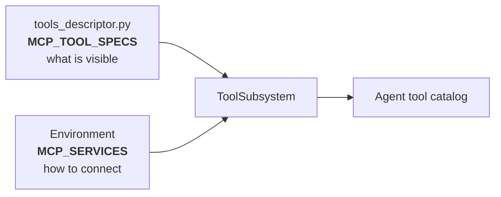
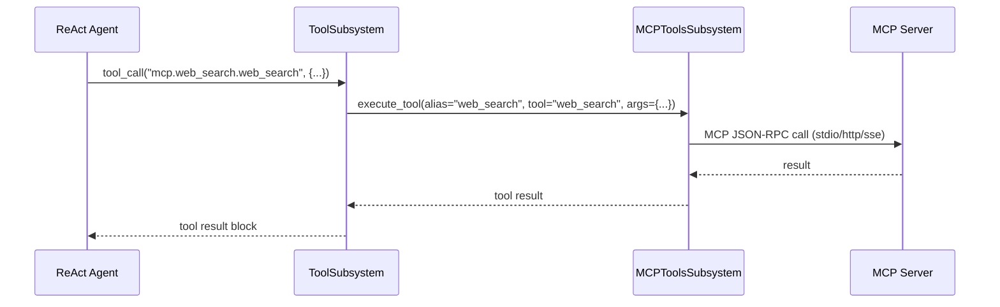

# React.mcp Bundle — MCP Configuration

This document explains how to configure MCP connectors for the `react.mcp` bundle:
what to set, where secrets live, how authentication works, and how to launch each
transport type.

## Two-layer configuration model

MCP is configured in two independent layers:



| Layer | Where | What it controls |
|-------|-------|------------------|
| **Descriptor** | `tools_descriptor.py` → `MCP_TOOL_SPECS` | Which MCP servers and tools are **visible** to the agent |
| **Environment** | `MCP_SERVICES` env variable | **How** to connect: transport, URL/command, auth |

The descriptor says _"expose tools from server X under alias Y"_.
The environment says _"server X is reachable at this URL with this auth"_.

Both must agree on `server_id` — if a descriptor entry has no matching env entry,
that MCP server is silently skipped.

---

## 1) Descriptor: `MCP_TOOL_SPECS`

Defined in `tools_descriptor.py`:

```python
MCP_TOOL_SPECS = [
    {"server_id": "web_search", "alias": "web_search", "tools": ["web_search"]},
    {"server_id": "stack",      "alias": "stack",      "tools": ["*"]},
    {"server_id": "docs",       "alias": "docs",       "tools": ["*"]},
    {"server_id": "local",      "alias": "local",      "tools": ["*"]},
]
```

| Field | Description |
|-------|-------------|
| `server_id` | Must match a key in `MCP_SERVICES` → `mcpServers` |
| `alias` | Prefix for tool IDs: `mcp.<alias>.<tool_id>` |
| `tools` | `["*"]` = expose all tools; `["tool_a"]` = allow-list |

### Declared connectors

| Alias | Transport | Purpose |
|-------|-----------|---------|
| `web_search` | stdio | Built-in web search MCP server (replaces native `web_tools`) |
| `stack` | stdio | StackOverflow via `npx mcp-remote` |
| `docs` | http / streamable-http | Remote documentation server |
| `local` | sse | Local development MCP server |

> The `react.doc` bundle also declares a `deepwiki` connector
> (`streamable-http`, `https://mcp.deepwiki.com/mcp`) for GitHub repo documentation.
> You can add it to this bundle by appending to `MCP_TOOL_SPECS`:
> ```python
> {"server_id": "deepwiki", "alias": "deepwiki", "tools": ["*"]}
> ```

---

## 2) Environment: `MCP_SERVICES`

Set the `MCP_SERVICES` environment variable as a JSON string.
Supported top-level keys: `mcpServers` (preferred) or `servers`.

### Production example (from `.env.proc`)

This is the actual configuration used in the project:

```bash
export MCP_SERVICES='{
  "mcpServers": {

    "web_search": {
      "transport": "stdio",
      "command": "python",
      "args": [
        "-m",
        "kdcube_ai_app.apps.chat.sdk.tools.mcp.web_search.web_search_server",
        "--transport", "stdio"
      ]
    },

    "deepwiki": {
      "transport": "streamable-http",
      "url": "https://mcp.deepwiki.com/mcp"
    }

  }
}'
```

### Extended example (all connector types)

```bash
export MCP_SERVICES='{
  "mcpServers": {

    "web_search": {
      "transport": "stdio",
      "command": "python",
      "args": [
        "-m",
        "kdcube_ai_app.apps.chat.sdk.tools.mcp.web_search.web_search_server",
        "--transport", "stdio"
      ]
    },

    "deepwiki": {
      "transport": "streamable-http",
      "url": "https://mcp.deepwiki.com/mcp"
    },

    "stack": {
      "transport": "stdio",
      "command": "npx",
      "args": ["mcp-remote", "mcp.stackoverflow.com"]
    },

    "docs": {
      "transport": "http",
      "url": "https://mcp.internal.example.com",
      "auth": { "type": "bearer", "env": "MCP_DOCS_TOKEN" }
    },

    "local": {
      "transport": "sse",
      "url": "http://127.0.0.1:8787/sse"
    }

  }
}'
```

### Minimal example (web_search only)

```bash
export MCP_SERVICES='{
  "mcpServers": {
    "web_search": {
      "transport": "stdio",
      "command": "python",
      "args": ["-m", "kdcube_ai_app.apps.chat.sdk.tools.mcp.web_search.web_search_server", "--transport", "stdio"]
    }
  }
}'
```

> **Environment inheritance for stdio servers:**
> - If `env` is **omitted**, the child process inherits the full parent environment.
> - If `env` is **set**, only the listed vars are passed. However, `PYTHONPATH` and
>   `PATH` are **auto-inherited** from the parent process when not explicitly set,
>   so you never need to hardcode `PYTHONPATH` in the config — the runtime infers it
>   dynamically (see `_resolve_stdio_env()` in `mcp_adapter.py`).

---

## 3) Supported transports

| Transport | Required fields | How it works |
|-----------|----------------|--------------|
| `stdio` | `command`, optional `args`, `env` | Platform spawns a child process on demand |
| `http` | `url` | Streamable HTTP JSON-RPC to a remote server |
| `streamable-http` | `url` | Alias of `http` |
| `sse` | `url` | Server-Sent Events to a remote server |

### Running the built-in `web_search` server

**stdio** — no manual start needed, the platform spawns the process automatically
from the `command` + `args` in `MCP_SERVICES`.

**sse** — start manually, then point `MCP_SERVICES` at it:

```bash
python -m kdcube_ai_app.apps.chat.sdk.tools.mcp.web_search.web_search_server \
  --transport sse --host 0.0.0.0 --port 8787
```

```json
{ "web_search": { "transport": "sse", "url": "http://127.0.0.1:8787/sse" } }
```

**http** — start manually:

```bash
python -m kdcube_ai_app.apps.chat.sdk.tools.mcp.web_search.web_search_server \
  --transport http --host 0.0.0.0 --port 8787
```

```json
{ "web_search": { "transport": "http", "url": "http://127.0.0.1:8787" } }
```

---

## 4) Authentication and secrets

### Where secrets are stored

Secrets are passed through **environment variables** only:

- For **stdio** servers: in the `env` block of the `MCP_SERVICES` entry, or
  inherited from the parent process env.
- For **http/sse** servers: in the `auth.env` field, which names the env var
  containing the token/key.
- Secrets are **never written to Redis** cache.
- For production, use your secrets manager (AWS Secrets Manager, Vault, etc.)
  to inject env vars into the container.

### Supported auth types

| Auth type | Config example | Behavior |
|-----------|---------------|----------|
| `bearer` | `"auth": {"type": "bearer", "env": "TOKEN_VAR"}` | Reads token from env, sends `Authorization: Bearer {token}` |
| `api_key` | `"auth": {"type": "api_key", "env": "KEY_VAR"}` | Reads key from env, sends `X-API-Key` header |
| `header` | `"auth": {"type": "header", "name": "X-Custom", "env": "VAR"}` | Custom header injection |

### Example: public streamable-http server (DeepWiki)

DeepWiki (`https://mcp.deepwiki.com/mcp`) is a public MCP server that exposes
GitHub repository documentation. No authentication required:

```json
"deepwiki": {
  "transport": "streamable-http",
  "url": "https://mcp.deepwiki.com/mcp"
}
```

### Example: bearer token for a private server

```bash
# 1. Set the secret in env
export MCP_DOCS_TOKEN="eyJhbGciOi..."

# 2. Reference it in MCP_SERVICES auth block
"docs": {
  "transport": "http",
  "url": "https://mcp.internal.example.com",
  "auth": { "type": "bearer", "env": "MCP_DOCS_TOKEN" }
}
```

### Example: API key for a remote server

```bash
export MY_API_KEY="ak-..."

"my_service": {
  "transport": "http",
  "url": "https://api.service.com/mcp",
  "auth": { "type": "api_key", "env": "MY_API_KEY" }
}
```

### Example: env variables for a stdio server

```json
"web_search": {
  "transport": "stdio",
  "command": "python",
  "args": ["-m", "my_mcp_server"],
  "env": {
    "ANTHROPIC_API_KEY": "sk-ant-...",
    "REDIS_URL": "redis://localhost:6379"
  }
}
```

---

## 5) Runtime execution flow



Key details:
- MCP tool listings are **cached in Redis** (TTL 3600s by default).
- Tool ID format: `mcp.<alias>.<tool_id>`.
- In isolated runtime (Docker/Fargate), MCP calls are delegated to the
  supervisor process via `io_tools.tool_call(...)`.

---

## 6) Troubleshooting

| Symptom | Check |
|---------|-------|
| MCP tools not in agent catalog | `MCP_TOOL_SPECS` has entry with matching `server_id`? `MCP_SERVICES` has matching key? |
| `mcp.<alias>.<tool>` call fails | Server running? Transport fields correct? (`command` for stdio, `url` for http/sse) |
| Auth errors (401/403) | Env var with token is set? `auth.env` points to correct var name? |
| Tools not refreshed after update | MCP tool listings cached in Redis (TTL 3600s). Wait or clear cache. |
| stdio server not starting | `command` is in PATH? `args` correct? Check proc logs for spawn errors. |

---

## Relevant implementation files

- `kdcube_ai_app/apps/chat/sdk/examples/bundles/react.mcp@2026-03-09/tools_descriptor.py`
- `kdcube_ai_app/apps/chat/sdk/runtime/mcp/mcp_tools_subsystem.py`
- `kdcube_ai_app/apps/chat/sdk/runtime/mcp/mcp_adapter.py`
- `kdcube_ai_app/apps/chat/sdk/runtime/tool_subsystem.py`
- `kdcube_ai_app/apps/chat/sdk/tools/mcp/web_search/web_search_server.py`
- `kdcube_ai_app/apps/chat/sdk/runtime/mcp/demo/` (demo scripts)

## Related docs

- Bundle overview: [react-mcp-README.md](react-mcp-README.md)
- Bundle properties: [react-mcp-properties-README.md](react-mcp-properties-README.md)
- SDK MCP integration: [docs/sdk/tools/mcp-README.md](../../tools/mcp-README.md)
- MCP demo: `sdk/runtime/mcp/demo/README.md`