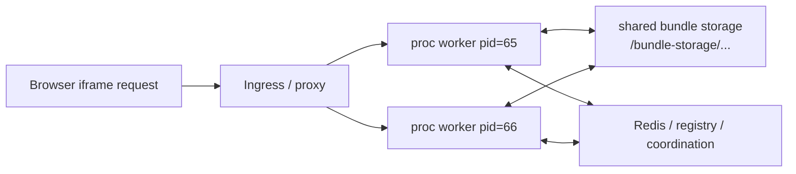
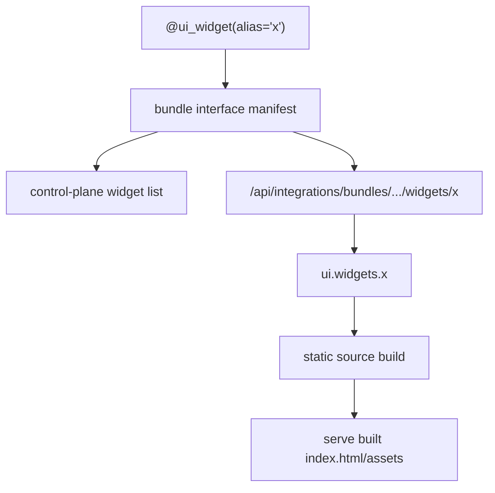
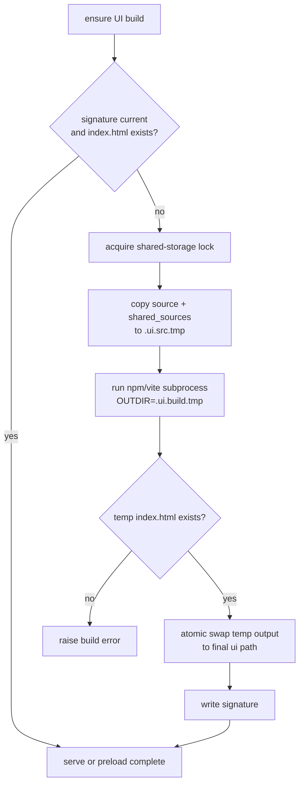
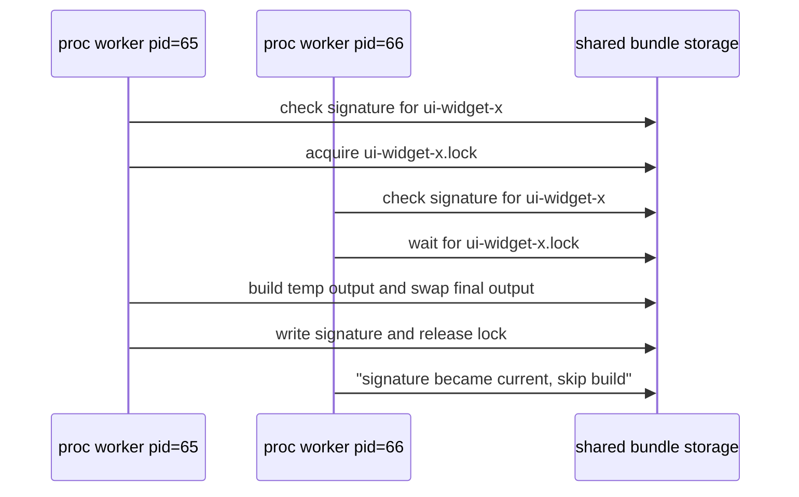
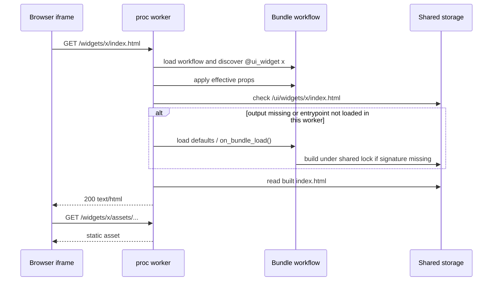
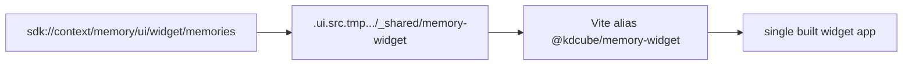

# UI Components Lifecycle

Use this doc when you need to understand why a bundle UI surface appears in the
control plane, when its source folder is built, where the built files are
stored, and what happens under concurrent proc workers.

This page covers source-folder UI components:

- bundle main view configured by `ui.main_view`
- bundle widgets configured by `ui.widgets.<alias>`
- shared SDK UI sources copied by `shared_sources`

It does not describe chat message rendering, ReAct artifacts, or generated
runtime widgets inside model output.

## Runtime Context

Bundle UI builds run inside the chat **proc** service, not inside ISO runtime.
The proc worker that performs the build uses normal Python code plus `npm` /
`vite` subprocesses.

Execution contexts:

| Context | What it does |
| --- | --- |
| Proc worker lifespan | Loads registry, prefetches git bundles, starts optional bundle preload. |
| Proc preload task | Imports bundles and runs `on_bundle_load()` for configured bundles. |
| Proc request handler | Serves widget/main-view routes and may trigger a build if output is missing. |
| Build subprocess | Runs `npm install`, `npm ci`, `vite build`, or the configured command. |
| Shared storage | Stores built UI files, signatures, temporary source/output, and locks. |
| ISO runtime | Not involved in UI component builds. |

In ECS, Docker Compose, or any multi-worker deployment, each Uvicorn worker is a
separate Python process. Workers share bundle storage through the configured
storage root, but they do not share Python module caches, process-local preload
state, or process-local request state.



The route may reach any worker inside the proc task. Therefore every worker
must be able to load the same bundle surfaces from the authoritative bundle
path, and every build must be guarded by shared-storage signatures and locks.

## Surface Discovery Versus Build Config

A widget needs a declared surface. A static build config is not enough.



The contracts are:

- `@ui_widget(alias="x")` declares that widget `x` exists.
- `ui.widgets.x` says widget `x` should be served as a built static app.
- `enabled.widget.x` enables or disables the widget surface.
- `ui.widgets.x.enabled` enables or disables the static-app config for
  that surface.

If `@ui_widget(alias="x")` exists and `ui.widgets.x` does not exist,
the route invokes the decorated Python method.

If `ui.widgets.x` exists and `@ui_widget(alias="x")` does not exist,
the config does not create a widget. The widget route has no surface to resolve
and should fail as an undefined widget.

If both exist, static serving wins for that alias. The decorated method remains
the authoritative manifest surface; the browser receives the built files from
`<bundle_storage_root>/ui/widgets/x` when `ui.widgets.x.src_folder` and
`build_command` are active.

Inherited widgets follow the same rule. A child entrypoint that inherits
`@ui_widget(alias="x")` from a parent has already declared widget `x`. It can:

- suppress the surface with `enabled.widget.x: false`
- replace the served UI with `ui.widgets.x.src_folder/build_command`
- override the same Python method name if it must change decorator metadata

It must not add a different decorated method with the same alias. Duplicate
aliases are rejected during manifest discovery.

Do not confuse these flags:

| Config | Meaning |
| --- | --- |
| `enabled.widget.x: false` | disables the widget surface; route/listing treats it as unavailable |
| `ui.widgets.x.enabled: false` | disables only the static source-folder app for `x`; an existing decorated method may still be served |

Main views are separate:

- `ui.main_view` configures the bundle main view build.
- `ui.widgets.<alias>` configures widget builds.
- A main view is not a widget and does not make a widget toolbar icon appear.

## Config Sources

The effective UI config is built from bundle defaults plus descriptor props.

Bundle code usually owns stable build wiring:

```python
def configuration_defaults(self):
    return {
        "ui": {
            "widgets": {
                "versatile_webapp": {
                    "enabled": False,
                    "src_folder": "ui/widgets/versatile_webapp",
                    "build_command": "npm install --no-package-lock && OUTDIR=<VI_BUILD_DEST_ABSOLUTE_PATH> npm run build",
                    "shared_sources": {
                        "memory_widget": {
                            "src_folder": "sdk://context/memory/ui/widget/memories",
                            "target": "_shared/memory-widget",
                        },
                    },
                },
            },
        },
    }
```

Deployment descriptors usually own environment policy:

```yaml
config:
  enabled:
    widget:
      memories: false
  ui:
    widgets:
      versatile_webapp:
        enabled: true
```

For built-in/reference bundles, prefer putting `src_folder`, `build_command`,
and required `shared_sources` in `configuration_defaults()`. This avoids
forcing every deployment descriptor to repeat internal source wiring.

## Build Inputs And Outputs

For a widget alias `x`, the builder uses:

| Item | Location |
| --- | --- |
| Source folder | `<bundle_root>/<src_folder>` or a resolved `bundle://` / `sdk://` path |
| Temporary source | `<bundle_storage_root>/.ui.src.tmp.<pid>.<uuid>` |
| Temporary output | `<bundle_storage_root>/.ui.build.tmp.<pid>.<uuid>` |
| Final widget output | `<bundle_storage_root>/ui/widgets/x` |
| Widget signature | `<bundle_storage_root>/.ui.widgets/x.signature` |
| Widget lock | `<bundle_storage_root>/.kdcube.once/ui-widget-x.lock` |
| Main-view output | `<bundle_storage_root>/ui` |
| Main-view signature | `<bundle_storage_root>/.ui.signature` |
| Main-view lock | `<bundle_storage_root>/.kdcube.once/ui-main-view.lock` |

The final output must contain `index.html`. For Vite apps, assets should be
relative to the widget route, normally by setting `base: './'`.

## Build Algorithm

For each configured main view or widget:

1. Resolve the bundle storage root.
2. Resolve the bundle root.
3. Resolve `src_folder`.
4. Resolve and validate `shared_sources`.
5. Compute a signature from:
   - component kind (`main-view` or `widget:<alias>`)
   - source path
   - build command
   - bundle delivery id
   - source tree signature
   - shared source tree signatures
6. If signature is current and `index.html` exists, skip.
7. Acquire a shared-storage lock.
8. Copy source into a temporary build source folder.
9. Copy each `shared_sources` item into its configured target under the
   temporary source folder.
10. Run the configured build command in the temporary source folder.
11. Require temporary output `index.html`.
12. Atomically swap temporary output into the final output folder.
13. Write the signature.
14. Release the lock.



The source folder is never modified by the builder. `npm install` runs inside
the copied temporary source tree.

## Startup Preload

When bundle preload is enabled, each proc worker starts a preload task during
lifespan startup.

Preload does this per worker:

1. Wait for git bundle prefetch to finish.
2. Load the active bundle registry.
3. For each configured bundle with a path, import the bundle.
4. Run the bundle's `on_bundle_load()` hook.
5. Validate the discovered bundle manifest.
6. Record per-bundle failures without making the whole proc fail.

Bundles that build UI in `on_bundle_load()` will build during this preload pass.
Shared-storage signatures and locks prevent duplicate final output, but every
worker still needs to load the bundle and validate its own in-process manifest.



Preload is an optimization and a readiness signal. Serving code still has a
request-time fallback because bundles can be reloaded or a storage mount can be
empty after restart.

## Request-Time Static Widget Serving

When the browser opens:

```text
GET /api/integrations/bundles/{tenant}/{project}/{bundle_id}/widgets/{alias}/index.html
```

the route does this:

1. Load the bundle entrypoint for that request's worker.
2. Discover the bundle interface manifest from decorators.
3. Apply effective bundle props to the workflow.
4. Resolve `@ui_widget(alias="<alias>")`.
5. Check endpoint visibility and `enabled.widget.<alias>`.
6. Check whether `ui.widgets.<alias>` is active.
7. For `index.html`, run a process-local entrypoint-load task once per
   tenant/project/bundle/widget/storage key.
8. That entrypoint load may call bundle defaults and `on_bundle_load()`.
9. If output still does not exist, call `_ensure_ui_build()` from the workflow.
10. Serve `index.html`, injecting a `<base href=".../widgets/<alias>/">`.
11. Serve assets from the same widget route, with immutable cache headers for
    `assets/*`.



The request-time build happens in the proc worker that received the request.
The actual npm/vite command is a subprocess of that worker.

## Cancellation And Timeouts

Browser iframe requests can be canceled by:

- switching bundle selection
- closing the panel
- reloading the page
- navigating the iframe
- network/proxy timeout

The platform must not let a canceled browser request poison shared UI state.
The current static entrypoint loader shields the entrypoint load/build task from
request cancellation. This means:

- the original HTTP request may still fail or return a client-disconnect
  response
- the build task should continue inside the worker
- the shared-storage signature should be written when the build completes
- a later request should see a cache hit or "became current" instead of
  restarting the same build

Build subprocess timeout:

- each npm/vite subprocess is limited to 600 seconds
- timeout kills the subprocess
- no signature is written
- the lock is released in `finally`
- the next request/preload can attempt the build again

Shared-lock wait behavior:

- default wait is controlled by `BUNDLE_UI_BUILD_LOCK_WAIT_SECONDS`, default
  `600`
- lock TTL is controlled by `BUNDLE_UI_BUILD_LOCK_TTL_SECONDS`, default `900`
- static UI builds do not serve stale output while locked unless the code
  explicitly opts into that mode

## Concurrency Rules

KDCube assumes concurrent proc workers and possibly concurrent tasks in future
deployments.

Correct behavior depends on these rules:

- every worker can import the authoritative bundle path
- every worker can discover the same decorators for the same bundle version
- every worker computes the same UI build signature for the same bundle version
- only one worker holds a given shared-storage build lock at a time
- waiting workers re-check the signature while waiting
- completed builds write a signature only after `index.html` exists
- final output is swapped atomically from a temporary output folder
- request cancellation does not cancel the shared build task

What is process-local:

- imported Python modules
- bundle singletons
- manifest cache
- process-local static entrypoint-load "done" set
- request state

What is shared:

- bundle registry authority
- managed bundle files
- bundle storage root
- built UI output
- UI signatures
- UI locks
- Redis/Postgres-backed platform state

## Main View Versus Widget Lifecycle

Main view and widgets use the same build machinery but different routes and
storage destinations.

| Surface | Config | Discovery | Output |
| --- | --- | --- | --- |
| Main view | `ui.main_view` | bundle main-view route / main-view support | `<bundle_storage_root>/ui` |
| Widget | `ui.widgets.<alias>` | `@ui_widget(alias="<alias>")` | `<bundle_storage_root>/ui/widgets/<alias>` |

The main view can build successfully while a widget is still cold. A widget can
build successfully while the main view is absent. Do not use one as proof of
the other.

## Shared Sources Lifecycle

`shared_sources` are copied at build time, not imported at runtime from the
KDCube repository.



Rules:

- `sdk://...` resolves under the installed SDK package.
- `bundle://...` resolves under the bundle root.
- relative paths resolve under the bundle root.
- absolute paths are for local testing only.
- copied shared source is part of the build signature.
- shared source must not be edited in the temporary folder.

If a widget import fails with a missing SDK UI path, check `shared_sources`
first. Do not patch the temporary source directory.

## Logs To Read

UI build logs are emitted by the bundle entrypoint logger with `[bundle.ui]`.

Important lines:

```text
[bundle.ui] lock acquired op=ui-widget-<alias> storage=...
[bundle.ui] waiting for lock op=ui-widget-<alias> ... owner=host=...,pid=...
[bundle.ui] widget:<alias> materialized shared source ...
[bundle.ui] widget:<alias> build start: src=... build_src=... dest=...
[bundle.ui] widget:<alias> build command: npm install ...
[bundle.ui] widget:<alias> build command: vite build
[bundle.ui] widget:<alias> build done: dest=... index_html=True
[bundle.ui] done: op=ui-widget-<alias> storage=...
[bundle.ui] skipped: signature cache hit op=ui-widget-<alias> storage=...
[bundle.ui] skipped: became current op=ui-widget-<alias> storage=...
[bundle.ui] widget:<alias> build failed: ...
```

For ECS CloudWatch:

```bash
aws logs filter-log-events --region eu-west-1 \
  --log-group-name /kdcube/demo/demo-march/chat-proc \
  --start-time <epoch_ms> \
  --end-time <epoch_ms> \
  --filter-pattern "versatile_webapp build" \
  --query 'events[].{ts:timestamp,msg:message}' \
  --output json
```

Useful filters:

- `<alias> build`
- `<alias> done`
- `<alias> failed`
- `ui-widget-<alias>`
- `waiting for lock`
- `Request ended without response`

## Troubleshooting Matrix

| Symptom | Likely cause | Check |
| --- | --- | --- |
| Widget icon does not appear | `@ui_widget` missing, visibility hides it, bundle disabled, or listing did not see effective props | Manifest widgets, `enabled.widget.<alias>`, roles/user types |
| Widget icon appears but route says undefined widget | Serving worker did not discover `@ui_widget(alias)` for that bundle path/version | Manifest validation logs, worker PID headers, bundle path |
| Widget route says not available | `enabled.widget.<alias>` resolves false | Effective props after defaults + descriptor |
| Widget route returns method-rendered payload instead of static app | `ui.widgets.<alias>` missing/disabled | Effective `ui.widgets` |
| Static widget iframe is blank | Built `index.html` references root-relative assets | Vite `base: './'`, browser asset URLs |
| Build repeats across workers | Signature not written, request cancellation before shielded build, stale lock, or differing signatures | `[bundle.ui] done`, `.ui.widgets/<alias>.signature`, lock owner logs |
| One worker fails and another succeeds | Process-local manifest/cache/preload mismatch or request cancellation | `X-KDCube-Worker-Pid`, manifest validation logs |
| Request returns client-disconnect wrapper | Browser/proxy canceled while route was loading/building | Compare request time with `[bundle.ui] build start/done` |

## Author Checklist

Before shipping a source-folder widget:

- add `@ui_widget(alias="<alias>")` to the bundle method
- add `@api(route="operations", alias="<alias>_widget")` only if the method
  also needs to be callable as an operation
- put stable `ui.widgets.<alias>` wiring in bundle defaults
- enable the widget in deployment descriptor or bundle defaults
- include every imported SDK UI source in `shared_sources`
- set Vite `base: './'`
- make `build.outDir` read `process.env.OUTDIR`
- avoid hardcoded tenant/project/bundle ids in widget source
- request runtime config with `CONFIG_REQUEST`
- accept both `CONFIG_RESPONSE` and `CONN_RESPONSE`
- call backend operations through the runtime-provided KDCube base URL and auth
- check logs for `build done` and `done: op=ui-widget-<alias>`
