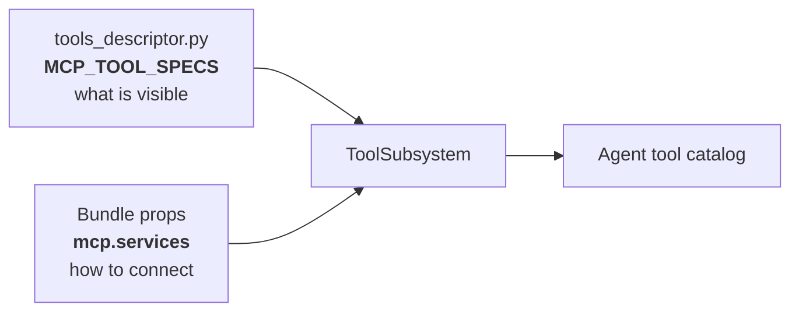
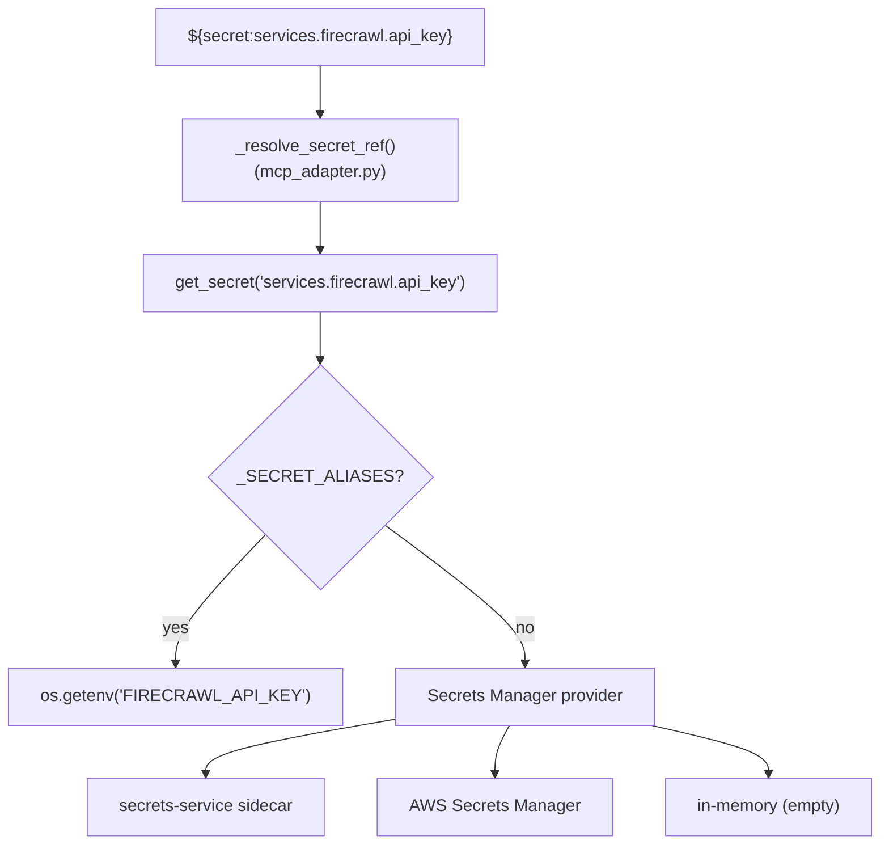
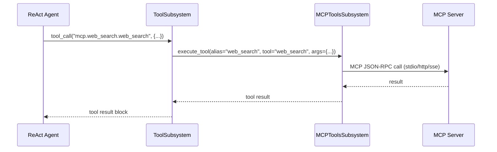

# React.mcp Bundle — MCP Configuration

This document explains how to configure MCP connectors for the `react.mcp` bundle:
what to set, where secrets live, how authentication works, and how to launch each
transport type.

## Two-layer configuration model

MCP is configured in two independent layers:



| Layer | Where | What it controls |
|-------|-------|------------------|
| **Descriptor** | `tools_descriptor.py` → `MCP_TOOL_SPECS` | Which MCP servers and tools are **visible** to the agent |
| **Bundle props** | `mcp.services` | **How** to connect: transport, URL/command, auth |

The descriptor says _"expose tools from server X under alias Y"_.
The bundle props say _"server X is reachable at this URL with this auth"_.

Both must agree on `server_id` — if a descriptor entry has no matching service entry,
that MCP server is silently skipped.

---

## 1) Descriptor: `MCP_TOOL_SPECS`

Defined in `tools_descriptor.py`:

```python
MCP_TOOL_SPECS = [
    # {"server_id": "web_search", "alias": "web_search", "tools": ["web_search"]},  # Built-in web search (optional)
    {"server_id": "deepwiki",   "alias": "deepwiki",   "tools": ["*"]},   # Streamable HTTP — GitHub repo docs
    {"server_id": "firecrawl",  "alias": "firecrawl",  "tools": ["*"]},   # Web scraping/crawling via Firecrawl
    {"server_id": "stack",      "alias": "stack",      "tools": ["*"]},   # Stdio transport
    {"server_id": "docs",       "alias": "docs",       "tools": ["*"]},   # HTTP / Streamable HTTP
    {"server_id": "local",      "alias": "local",      "tools": ["*"]},   # SSE transport
]
```

| Field | Description |
|-------|-------------|
| `server_id` | Must match a key in bundle props `mcp.services` → `mcpServers` |
| `alias` | Prefix for tool IDs: `mcp.<alias>.<tool_id>` |
| `tools` | `["*"]` = expose all tools; `["tool_a"]` = allow-list |

### Declared connectors

| Alias | Transport | Auth required | Purpose |
|-------|-----------|---------------|---------|
| `web_search` | stdio | No | Built-in web search MCP server (replaces native `web_tools`). Disabled by default. |
| `deepwiki` | streamable-http | No | GitHub repository documentation (public server) |
| `firecrawl` | stdio | Yes (`FIRECRAWL_API_KEY`) | Web scraping, crawling, structured extraction via Firecrawl |
| `stack` | stdio | No | StackOverflow via `npx mcp-remote` |
| `docs` | http / streamable-http | Optional (bearer) | Remote documentation server |
| `local` | sse | No | Local development MCP server |

---

## 2) Bundle props: `mcp.services`

Set bundle props `mcp.services`.
Supported top-level keys: `mcpServers` (preferred) or `servers`.

### Production-style example (bundle props)

This is the actual configuration used in the project:

```yaml
mcp:
  services:
    mcpServers:
      deepwiki:
        transport: streamable-http
        url: https://mcp.deepwiki.com/mcp
      firecrawl:
        transport: stdio
        command: npx
        args: ["-y", "firecrawl-mcp"]
        env:
          FIRECRAWL_API_KEY: ${secret:bundles.react.mcp@2026-03-09.secrets.firecrawl.api_key}
```

> **Note:** `web_search` is not included in the production config above but can be
> re-enabled by adding its entry to both `MCP_TOOL_SPECS` and bundle props `mcp.services`.

### Extended example (all connector types)

```yaml
mcp:
  services:
    mcpServers:
      web_search:
        transport: stdio
        command: python
        args:
          - -m
          - kdcube_ai_app.apps.chat.sdk.tools.mcp.web_search.web_search_server
          - --transport
          - stdio
      deepwiki:
        transport: streamable-http
        url: https://mcp.deepwiki.com/mcp
      firecrawl:
        transport: stdio
        command: npx
        args: ["-y", "firecrawl-mcp"]
        env:
          FIRECRAWL_API_KEY: ${secret:bundles.react.mcp@2026-03-09.secrets.firecrawl.api_key}
      stack:
        transport: stdio
        command: npx
        args: ["mcp-remote", "mcp.stackoverflow.com"]
      docs:
        transport: http
        url: https://mcp.internal.example.com
        auth:
          type: bearer
          secret: bundles.react.mcp@2026-03-09.secrets.docs.token
      local:
        transport: sse
        url: http://127.0.0.1:8787/sse
```

### Minimal example (web_search only)

```yaml
mcp:
  services:
    mcpServers:
      web_search:
        transport: stdio
        command: python
        args: ["-m", "kdcube_ai_app.apps.chat.sdk.tools.mcp.web_search.web_search_server", "--transport", "stdio"]
```

> **Environment inheritance for stdio servers:**
> - If `env` is **omitted**, the child process inherits the full parent environment.
> - If `env` is **set**, only the listed vars are passed. However, `PYTHONPATH` and
>   `PATH` are **auto-inherited** from the parent process when not explicitly set,
>   so you never need to hardcode `PYTHONPATH` in the config — the runtime infers it
>   dynamically (see `_resolve_stdio_env()` in `mcp_adapter.py`).

---

## 3) Supported transports

| Transport | Required fields | How it works |
|-----------|----------------|--------------|
| `stdio` | `command`, optional `args`, `env` | Platform spawns a child process on demand |
| `http` | `url` | Streamable HTTP JSON-RPC to a remote server |
| `streamable-http` | `url` | Alias of `http` |
| `sse` | `url` | Server-Sent Events to a remote server |

### Running the built-in `web_search` server

**stdio** — no manual start needed, the platform spawns the process automatically
from the `command` + `args` in bundle props `mcp.services`.

**sse** — start manually, then point bundle props `mcp.services` at it:

```bash
python -m kdcube_ai_app.apps.chat.sdk.tools.mcp.web_search.web_search_server \
  --transport sse --host 0.0.0.0 --port 8787
```

```json
{ "web_search": { "transport": "sse", "url": "http://127.0.0.1:8787/sse" } }
```

**http** — start manually:

```bash
python -m kdcube_ai_app.apps.chat.sdk.tools.mcp.web_search.web_search_server \
  --transport http --host 0.0.0.0 --port 8787
```

```json
{ "web_search": { "transport": "http", "url": "http://127.0.0.1:8787" } }
```

---

## 4) Authentication and secrets

### Secret resolution: two paths

MCP server secrets are resolved through `get_secret()` (in `sdk/config.py`),
which supports two resolution paths depending on the deployment mode:



**Local dev (no sidecar):** secrets come from env vars in `.env.proc`.
`get_secret()` finds them via `_SECRET_ALIASES` mapping in `sdk/config.py`:

```python
_SECRET_ALIASES = {
    "services.firecrawl.api_key": ["FIRECRAWL_API_KEY"],
    "services.openai.api_key": ["OPENAI_API_KEY"],
    # ...
}
```

**CLI deploy (docker-compose / ECS):** the CLI reads `secrets.yaml` and
`bundles.secrets.yaml`, flattens them into dot-path keys, and injects into
the secrets-service sidecar (or AWS SM). `get_secret()` then reads from the
configured secrets provider.

### `auth.secret` for HTTP/SSE auth blocks

```yaml
auth:
  type: bearer
  secret: bundles.react.mcp@2026-03-09.secrets.docs.token
```

`auth.secret` resolves through `get_secret()` and is the preferred way to wire
bundle-specific MCP credentials in platform deployments.

### `${secret:...}` syntax for stdio env blocks

For stdio MCP servers, env values can reference secrets via the
`${secret:dot.path.key}` syntax. These are resolved at session creation
time by `_resolve_secret_ref()` in `mcp_adapter.py`:

```json
"firecrawl": {
  "transport": "stdio",
  "command": "npx",
  "args": ["-y", "firecrawl-mcp"],
  "env": {
    "FIRECRAWL_API_KEY": "${secret:services.firecrawl.api_key}"
  }
}
```

The `${secret:...}` pattern calls `get_secret()` which checks, in order:
1. Environment variables (via `_SECRET_ALIASES`)
2. Settings attributes (Pydantic BaseSettings)
3. Secrets manager provider (secrets-service / AWS SM / in-memory)

If the value does not match `${secret:...}`, it is passed through as-is.

### Where secrets are stored

- For **stdio** servers: in the `env` block of the `mcp.services` entry, or
  inherited from the parent process env.
- For **http/sse** servers: in the `auth.env` field, which names the env var
  containing the token/key.
- Secrets are **never written to Redis** cache.

### Supported auth types

| Auth type | Config example | Behavior |
|-----------|---------------|----------|
| `bearer` | `"auth": {"type": "bearer", "secret": "bundles.react.mcp@2026-03-09.secrets.docs.token"}` | Reads token via `get_secret()`, sends `Authorization: Bearer {token}` |
| `api_key` | `"auth": {"type": "api_key", "secret": "bundles.react.mcp@2026-03-09.secrets.firecrawl.api_key"}` | Reads key via `get_secret()`, sends `X-API-Key` header |
| `header` | `"auth": {"type": "header", "name": "X-Custom", "secret": "bundles.react.mcp@2026-03-09.secrets.custom.value"}` | Custom header injection via named secret |

### Example: Firecrawl (stdio with `${secret:...}`)

```bash
# Local dev: set the env var in .env.proc
FIRECRAWL_API_KEY=fc-your-key-here

# CLI deploy: add to secrets.yaml
# services:
#   firecrawl:
#     api_key: fc-your-key-here
# And to bundles.secrets.yaml under the relevant bundle.
```

```json
"firecrawl": {
  "transport": "stdio",
  "command": "npx",
  "args": ["-y", "firecrawl-mcp"],
  "env": {
    "FIRECRAWL_API_KEY": "${secret:services.firecrawl.api_key}"
  }
}
```

Get API key at https://www.firecrawl.dev/ (free tier: 500 credits).
Tools exposed: `firecrawl_scrape`, `firecrawl_crawl`, `firecrawl_map`,
`firecrawl_search`, `firecrawl_extract`, and more (12 tools total).

### Example: public streamable-http server (DeepWiki)

DeepWiki (`https://mcp.deepwiki.com/mcp`) is a public MCP server that exposes
GitHub repository documentation. No authentication required:

```json
"deepwiki": {
  "transport": "streamable-http",
  "url": "https://mcp.deepwiki.com/mcp"
}
```

### Example: bearer token for a private server

```bash
# 1. Set the secret in env
export MCP_DOCS_TOKEN="eyJhbGciOi..."

# 2. Reference it in mcp.services auth block
"docs": {
  "transport": "http",
  "url": "https://mcp.internal.example.com",
  "auth": { "type": "bearer", "secret": "bundles.react.mcp@2026-03-09.secrets.docs.token" }
}
```

### Example: API key for a remote server

```bash
export MY_API_KEY="ak-..."

"my_service": {
  "transport": "http",
  "url": "https://api.service.com/mcp",
  "auth": { "type": "api_key", "env": "MY_API_KEY" }
}
```

### Example: env variables for a stdio server

```json
"web_search": {
  "transport": "stdio",
  "command": "python",
  "args": ["-m", "my_mcp_server"],
  "env": {
    "ANTHROPIC_API_KEY": "sk-ant-...",
    "REDIS_URL": "redis://localhost:6379"
  }
}
```

---

## 5) Runtime execution flow



Key details:
- MCP tool listings are **cached in Redis** (TTL 3600s by default).
- Tool ID format: `mcp.<alias>.<tool_id>`.
- In isolated runtime (Docker/Fargate), MCP calls are delegated to the
  supervisor process via `io_tools.tool_call(...)`.

---

## 6) Troubleshooting

| Symptom | Check |
|---------|-------|
| MCP tools not in agent catalog | `MCP_TOOL_SPECS` has entry with matching `server_id`? `mcp.services` has matching key? |
| `mcp.<alias>.<tool>` call fails | Server running? Transport fields correct? (`command` for stdio, `url` for http/sse) |
| Auth errors (401/403) | Env var with token is set? `auth.env` points to correct var name? |
| `${secret:...}` not resolving | Is `_SECRET_ALIASES` in `sdk/config.py` configured for this key? Is the env var set in `.env.proc`? (local dev) Or is the secret injected into secrets-service? (CLI deploy) |
| Tools not refreshed after update | MCP tool listings cached in Redis (TTL 3600s). Wait or clear cache. |
| stdio server not starting | `command` is in PATH? `args` correct? Check proc logs for spawn errors. |

---

## Relevant implementation files

- `kdcube_ai_app/apps/chat/sdk/examples/bundles/react.mcp@2026-03-09/tools_descriptor.py`
- `kdcube_ai_app/apps/chat/sdk/runtime/mcp/mcp_tools_subsystem.py`
- `kdcube_ai_app/apps/chat/sdk/runtime/mcp/mcp_adapter.py`
- `kdcube_ai_app/apps/chat/sdk/runtime/tool_subsystem.py`
- `kdcube_ai_app/apps/chat/sdk/tools/mcp/web_search/web_search_server.py`
- `kdcube_ai_app/apps/chat/sdk/runtime/mcp/demo/` (demo scripts)

## Related docs

- Bundle overview: [sample-bundle-README.md](sample-bundle-README.md)
- Bundle properties: [sample-bundle-properties-README.md](sample-bundle-properties-README.md)
- SDK MCP integration: [docs/sdk/tools/mcp-README.md](../../tools/mcp-README.md)
- MCP demo: `sdk/runtime/mcp/demo/README.md`
