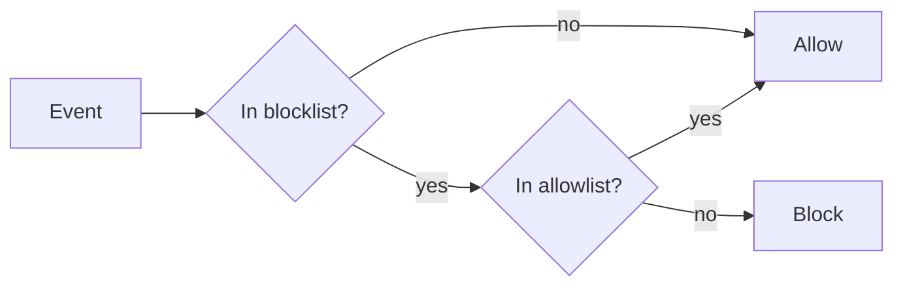

# React.mcp Bundle — Properties & Integrations

Configuration reference for the `react.mcp` bundle: model roles, built-in tools,
MCP integrations, skills, event filtering, runtime properties, and deployment.

---

## 1) Model configuration (role_models)

Five logical roles mapped to concrete LLM models in `entrypoint.py` →
`configuration`:

| Role | Model | Purpose |
|------|-------|---------|
| `gate.simple` | `claude-haiku-4-5-20251001` | Gate agent — conversation title (fast, lightweight) |
| `answer.generator.simple` | `claude-sonnet-4-5-20250929` | Final answer generation |
| `solver.coordinator.v2` | `claude-sonnet-4-5-20250929` | ReAct solver coordinator |
| `solver.react.v2.decision.v2.strong` | `claude-sonnet-4-5-20250929` | Solver — hard reasoning steps |
| `solver.react.v2.decision.v2.regular` | `claude-haiku-4-5-20251001` | Solver — routine steps |

---

## 2) Built-in tools (Python modules)

Declared in `tools_descriptor.py` → `TOOLS_SPECS`:

| Alias | Module | Description |
|-------|--------|-------------|
| `io_tools` | `sdk.tools.io_tools` | File read/write |
| `ctx_tools` | `sdk.tools.ctx_tools` | Context and memory |
| `exec_tools` | `sdk.tools.exec_tools` | Code execution (in-proc or isolated) |
| `rendering_tools` | `sdk.tools.rendering_tools` | Charts and rendering |

> **`web_tools` is disabled** (commented out). Web search is provided via the
> MCP `web_search` connector instead.

---

## 3) MCP integrations

Declared in `tools_descriptor.py` → `MCP_TOOL_SPECS`:

| Alias | Transport | Tools | Description |
|-------|-----------|-------|-------------|
| `web_search` | stdio | `web_search` | Built-in web search server (replaces native `web_tools`) |
| `deepwiki` | streamable-http | `*` (all) | GitHub repository documentation (public, no auth) |
| `firecrawl` | stdio | `*` (all) | Web scraping/crawling via Firecrawl (requires `FIRECRAWL_API_KEY`) |
| `stack` | stdio | `*` (all) | StackOverflow via `npx mcp-remote` |
| `docs` | http | `*` (all) | Remote documentation server |
| `local` | sse | `*` (all) | Local development MCP server |

Tool ID format: `mcp.<alias>.<tool_id>` (e.g., `mcp.web_search.web_search`, `mcp.firecrawl.firecrawl_scrape`).

Full configuration guide: [sample-bundle-configuration-README.md](sample-bundle-configuration-README.md).

---

## 4) Tool runtime overrides

Declared in `tools_descriptor.py` → `TOOL_RUNTIME`:

| Tool ID | Runtime | Notes |
|---------|---------|-------|
| `web_tools.web_search` | `local` (subprocess) | Legacy — only applies if `web_tools` is re-enabled |
| `web_tools.fetch_url_contents` | `local` (subprocess) | Same |

All other tools run **in-memory** (default, fastest).

---

## 5) Skills

Bundle ships one skill:

### `product.kdcube`

| Field | Value |
|-------|-------|
| Location | `skills/product/SKILL.md` |
| Namespace | `product` |
| Sources | `sources.yaml` — KDCube official site |
| Recommended tools | `tools.yaml` — `web_tools.web_search` |
| When to use | Platform/architecture questions, product capabilities, deployment |

Skills visibility (`AGENTS_CONFIG`): no filters applied — all skills visible
to all agents.

---

## 6) Event filtering

Defined in `event_filter.py`. Uses a two-list model:



**Blocklist** (suppressed for regular users on `chat_step` route):
- `chat.step`

**Allowlist** (always delivered, overrides blocklist):
- `chat.conversation.accepted`, `chat.conversation.title`,
  `chat.conversation.topics`, `chat.followups`,
  `chat.clarification_questions`, `chat.files`, `chat.citations`,
  `chat.conversation.turn.completed`, `ticket`

Privileged users (`user_type=privileged`) bypass all filtering.

---

## 7) Runtime properties

Set in `orchestrator/workflow.py`:

| Property | Value | Description |
|----------|-------|-------------|
| `max_iterations` | `15` | ReAct loop iteration cap |
| `debug_log_announce` | `true` | Verbose announce block logging |
| `debug_log_sources_pool` | `true` | Verbose sources pool logging |
| `debug_timeline` | `true` | Timeline debug output |

---

## 8) Bundle registration

### Local dev

```bash
export AGENTIC_BUNDLES_JSON='{
  "default_bundle_id": "react.mcp@2026-03-09",
  "bundles": {
    "react.mcp@2026-03-09": {
      "id": "react.mcp@2026-03-09",
      "name": "React MCP Bundle",
      "path": "/bundles",
      "module": "react.mcp@2026-03-09.entrypoint",
      "singleton": false,
      "description": "ReAct agent with MCP tool integration"
    }
  }
}'
```

### Git delivery (release.yaml)

```yaml
bundles:
  default_bundle_id: "react.mcp@2026-03-09"
  items:
    - id: "react.mcp@2026-03-09"
      repo: "git@github.com:kdcube/kdcube-ai-app.git"
      ref: "v0.4.0"
      subdir: "app/ai-app/services/kdcube-ai-app/kdcube_ai_app/apps/chat/sdk/examples/bundles"
      module: "react.mcp@2026-03-09.entrypoint"
```

### Bundle props (runtime overrides via API)

```bash
POST /admin/integrations/bundles/react.mcp@2026-03-09/props
{
  "tenant": "acme",
  "project": "myproj",
  "op": "merge",
  "props": {
    "knowledge": {
      "repo": "git@github.com:kdcube/kdcube-ai-app.git",
      "ref": "v0.4.0",
      "docs_root": "app/ai-app/docs"
    },
    "mcp": {
      "services": {
        "mcpServers": {
          "docs": {
            "transport": "http",
            "url": "https://mcp.internal.example.com",
            "auth": {
              "type": "bearer",
              "secret": "bundles.react.mcp@2026-03-09.secrets.docs.token"
            }
          }
        }
      }
    }
  }
}
```

---

## 9) Environment variables

| Variable | Required | Description |
|----------|----------|-------------|
| `MCP_SERVICES` | No | Legacy/local-dev fallback for MCP service config; platform deployments should use bundle props `mcp.services` |
| `AGENTIC_BUNDLES_JSON` | Yes | Bundle registry (inline JSON or path) |
| `ANTHROPIC_API_KEY` | Yes | API key for Claude models |
| `REDIS_URL` | Yes | Redis connection URL |
| `AGENTIC_BUNDLES_ROOT` | No | Bundles root directory (default `/bundles`) |
| `BUNDLE_STORAGE_ROOT` | No | Shared local bundle storage path |
| `CB_BUNDLE_STORAGE_URL` | No | Per-bundle storage backend (`file://` or `s3://`) |
| `FIRECRAWL_API_KEY` | If using `firecrawl` | API key for Firecrawl MCP server (https://www.firecrawl.dev/) |
| `MCP_DOCS_TOKEN` | Optional legacy fallback | Only needed if you still use `auth.env`; prefer bundle secret via `auth.secret` |

---

## Relevant implementation files

- `kdcube_ai_app/apps/chat/sdk/examples/bundles/react.mcp@2026-03-09/entrypoint.py`
- `kdcube_ai_app/apps/chat/sdk/examples/bundles/react.mcp@2026-03-09/orchestrator/workflow.py`
- `kdcube_ai_app/apps/chat/sdk/examples/bundles/react.mcp@2026-03-09/tools_descriptor.py`
- `kdcube_ai_app/apps/chat/sdk/examples/bundles/react.mcp@2026-03-09/skills_descriptor.py`
- `kdcube_ai_app/apps/chat/sdk/examples/bundles/react.mcp@2026-03-09/event_filter.py`
- `kdcube_ai_app/apps/chat/sdk/examples/bundles/react.mcp@2026-03-09/resources.py`
- `kdcube_ai_app/apps/chat/sdk/solutions/chatbot/entrypoint.py` (BaseEntrypoint)
- `kdcube_ai_app/apps/chat/sdk/solutions/chatbot/base_workflow.py` (BaseWorkflow)

## Related docs

- Bundle overview: [sample-bundle-README.md](sample-bundle-README.md)
- MCP connector configuration: [sample-bundle-configuration-README.md](sample-bundle-configuration-README.md)
- Bundle ops guide: [docs/sdk/bundle/bundle-ops-README.md](../bundle-ops-README.md)
- Bundle developer guide: [docs/sdk/bundle/bundle-dev-README.md](../bundle-dev-README.md)
