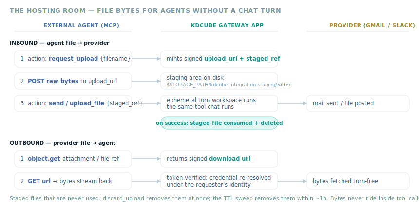

# File Hosting For Turn-Less Transports

Inside a chat turn, files live in the ReAct turn workspace: integration tools
read outbound attachments from it and materialize downloaded provider files
into it as conversation artifacts. An external MCP client has no turn — yet it
must attach a file to an email, upload one to Slack, and pull a mail
attachment or Slack file out. This solution is the hosting room that makes
both directions work over plain JSON transports, with bytes always traveling
out-of-band over HTTP.



## Where the pieces live

| Piece | Module | Role |
| --- | --- | --- |
| Staging area | `sdk/integrations/file_staging.py` | Holds inbound files between upload and use: `staged:<id>:<filename>` refs, save/load/delete, single-use consumption, 25MB per file, 1h TTL sweep. Rooted under `STORAGE_PATH` (temp-dir fallback) so all proc workers on a host agree. |
| Provider byte fetch | `sdk/integrations/file_delivery.py` | Turn-free outbound bytes: resolves the provider credential through the Connection Hub facade (`ensure_claim`) under the token-bound identity and fetches the Gmail attachment or Slack file directly. Owns no credentials, re-implements no broker logic. |
| Ephemeral workspace | `sdk/integrations/inline_files.py` | Lets the unchanged tools run without a turn: binds a disposable outdir plus a synthetic turn id around a single tool call (task-local contextvars), materializes payload files into it, deletes it afterwards. Normalizes payload entries (`staged_ref` or tiny inline `content_base64`) to bytes. |
| Signed tokens | `sdk/solutions/conversation/download_links.py` | Stateless HMAC stamp binding one object ref + requester (tenant/project/user) + expiry. The same mint/verify pair signs conversation file links, integration downloads, and upload slots. |
| Public routes + slot minting | `kdcube-services@1-0` entrypoint | `integration_file_download` (GET: verify token → fetch provider bytes → stream), `integration_file_upload` (POST: verify token → body lands in staging), and the `_integration_file_url` / `_integration_upload_slot` factories injected into the mail/slack named-service providers. |

One descriptor secret signs everything the gateway app serves:
`conversations.file_download_secret` in that bundle's `bundles.secrets.yaml`.
Scoping lives in each token's payload, never in the key. Absent secret means
no links are minted and providers fall back to inline delivery or a clear
`upload_not_configured` error — the system fails closed.

## Outbound: provider file → agent

`object.get` on a mail attachment ref or Slack file ref — and the
`download_attachments` / `download_file` actions when the tool reports no turn
workspace — return `download: {encoding: "url", url, expires_at}`. The agent
GETs the URL over HTTP; the route re-resolves the provider credential under
the verified token's identity and streams the bytes. Mail attachment refs
carry the Gmail **part id** (`mail:…:attachment:<message_id>:<part_id>`)
because Gmail rotates attachment ids on every fetch; the part id is the stable
key, and the fetch re-resolves the current attachment id at download time.
`Content-Disposition` is RFC 5987 (ASCII fallback plus UTF-8 `filename*`), so
filenames outside latin-1 — macOS screenshot names embed U+202F — survive.

## Inbound: agent file → provider

```text
1. object.action request_upload {filename}         (mail or slack namespace)
     -> {upload_url, staged_ref, expires_at, max_bytes}
2. POST raw bytes to upload_url                    (body = file; no form encoding)
     -> {ok, staged_ref, size_bytes}
3. send / forward  attachments=[{staged_ref}]      (mail)
   upload_file     {staged_ref, channel, ...}      (slack)
   — or —
   discard_upload  {staged_ref}                    (changed your mind)
```

The action loads the staged bytes, materializes them into the ephemeral
workspace, and runs the same tool chat runs. Staged refs are single-use:
consumed and deleted after a successful send/upload; unconsumed files expire
with the TTL sweep. Tiny files (≤10MB, 25MB per action) may instead ride
inline as `{filename, content_base64}` for clients that hold bytes but cannot
issue HTTP requests.

## Storage and lifecycle

Staged bytes live on the **local filesystem of the proc host**, one directory
per staged id:

```text
$STORAGE_PATH/kdcube-integration-staging/<staged-id>/<filename>
```

`STORAGE_PATH` comes from the entrypoint settings and is shared by all proc
workers on the host; when it is unset or is a URI (an object-store path), the
system temp dir is used instead. The upload route and the consuming action
derive the root from the same settings, so they always agree. Staging is
deliberately NOT durable storage: it is a hand-off buffer between two HTTP
calls. On multi-host deployments the staging root must be a shared mount
(for example EFS) — otherwise the upload may land on one host and the
consuming action run on another.

Bounds: 25MB per staged file (`MAX_STAGED_FILE_BYTES`), one file per slot.

A staged file leaves the staging area in exactly one of three ways:

| How | When | Mechanism |
| --- | --- | --- |
| **Consumed** | the send/forward/upload action succeeds | the action deletes every staged ref it used — refs are single-use |
| **Discarded** | the agent changes its mind | `object.action discard_upload {staged_ref}` (mail and slack namespaces) — idempotent, removes the file at once |
| **Expired** | nothing ever used it | the TTL sweep removes directories older than 1h (`STAGED_TTL_SECONDS`); the sweep runs on every save |

A ref that was consumed, discarded, or expired answers subsequent loads with
"staged file not found (expired, already used, or never uploaded)".

## Adding hosting to a bundle

The named-service providers accept two factory callables; the gateway app
shows the reference wiring:

```python
make_mail_named_service_provider(
    entrypoint=self,
    bundle_id=self._named_services_bundle_id(),
    file_url_factory=self._integration_file_url,      # outbound signed links
    upload_slot_factory=self._integration_upload_slot, # inbound signed slots
)
```

Both factories receive `(ns_ctx, info)` and return the URL payload or `None`
when the public origin or the signing secret is unavailable. A bundle that
hosts the providers without the factories still serves everything except
out-of-band file transfer.

## Related

- Task-oriented walkthrough with the exact agent calls:
  [Hosting recipe](../../../recipes/resource_sharing/hosting-README.md).
- The agent-facing schema language (`files`, `account_selection`,
  `consent_errors` blocks) lives in the namespace schemas; see
  [Make A Named Service Agent-Friendly](../../../recipes/kdcube_for_agents/named-services-mcp-README.md).
