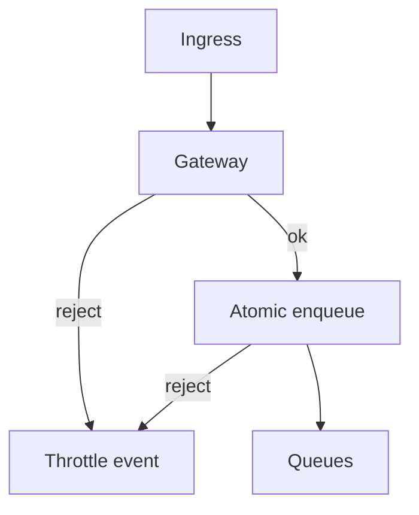
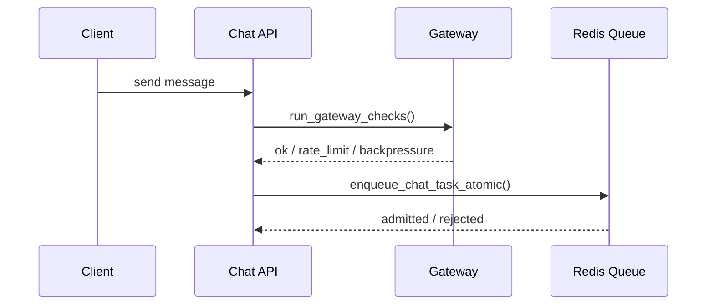

# Monitoring & Observability (Gateway / Chat)

This document describes the **current monitoring endpoints** for the gateway, chat ingress,
chat proc, and the internal Metrics service.
It reflects the actual behavior in code (SSE/Socket.IO are gated; REST is session‑only by default).

---

## 1) What is monitored

- **Gateway admission**: rate limiting + backpressure
- **Queue pressure**: per user type queue sizes + thresholds
- **Process health**: heartbeat‑based detection of active chat processes
- **Circuit breakers**: auth/rate/backpressure failure states
- **Throttling analytics**: recent throttle events and per‑period summaries
- **SSE connections**: current + rolling windows (tenant/project‑global)
- **Connection pools**: Postgres + Redis utilization + max in‑use (aggregated across workers)
- **Latency percentiles**:
  - Processor queue wait + execution time (p50/p95/p99, 1m/15m/1h)
  - Ingress REST latency (p50/p95/p99, 1m/15m/1h)
- **Draining indicator**: instances that stopped heartbeating recently are marked as *draining* before becoming stale
- **Proc runtime metadata in raw heartbeats**: queue/config loop lag, recent Redis errors, and proc watchdog state (idle/hard-cap config plus active-task ages) are attached to proc process heartbeats

Reference: [gateway-README.md](gateway-README.md)

---

## 2) Current enforcement scope

- **SSE / Socket.IO chat ingress** → full gateway checks + atomic enqueue
- **REST APIs** → session resolution by default, with **guarded heavy endpoints gated** via policy

If you want REST to be gated or exempted, configure **endpoint policy lists** in gateway config:
- `guarded_rest_patterns` (rate limit + backpressure)
- `bypass_throttling_patterns` (skip rate limiting for public endpoints like webhooks)

These lists are component‑aware (`ingress` / `proc`) and live in the effective
gateway config, or are updated via `/admin/gateway/update-config`.

---

## 3) Endpoints

### System status
`GET /monitoring/system`

Auth:
- Uses `auth_without_pressure()`
- Requires a super-admin session
- Bypasses throttling/backpressure for the monitoring request itself

Location:
- This route is mounted on the chat ingress/control-plane service.
- It aggregates ingress, proc, queue, and heartbeat state from Redis.
- The current proc FastAPI app does **not** expose its own separate `/monitoring/system` route.

Returns gateway status + queue pressure + capacity transparency, plus:
- `components.ingress.sse` (current + rolling windows)
- `components.proc.queue` (depth + pressure windows)
- `components.proc.latency` (queue wait + exec percentiles)
- `components.ingress.latency` (REST latency percentiles)
- `components.*.pools_aggregate` (pool utilization + max in‑use windows)
- `throttling_windows` (1m/15m/1h 429/503 counts)
- `components.*.instances[*].draining` (true during a grace window after heartbeat stops)

Pool reporting note:
- `components.proc.pools_aggregate.redis` may only contain `async` for proc.
- That is expected because proc now uses a single steady-state shared async Redis pool per worker.
- Ingress and metrics services can still report `async`, `async_decode`, and `sync`.

Proc stall note:
- Detailed proc runtime metadata is attached to the raw process heartbeat JSON in Redis.
- Use the Redis Browser or direct Redis access to inspect heartbeat `metadata.processor.*` fields such as queue loop lag, last queue error, `task_idle_timeout_sec`, `task_max_wall_time_sec`, `oldest_active_task_wall_age_sec`, and `max_active_task_idle_age_sec`.
- These watchdog fields are not first-class exported metrics from the Metrics service; they are raw runtime observability signals.

### Metrics service
Internal metrics endpoints are served by `kdcube_ai_app.apps.metrics.web_app`:
- `GET /health`
- `GET /metrics/ingress/system`
- `GET /metrics/proc/system`
- `GET /metrics/combined`
- `GET /metrics/export`
- `GET /metrics`

Mode note:
- In `redis` mode, the Metrics service computes the system payload directly from Redis.
- In `proxy` mode, it calls ingress/proc `/monitoring/system`.
- Because proc does not currently mount `/monitoring/system`, proxy mode usually targets ingress only unless another upstream exposes proc monitoring data.
- `GET /metrics` exposes a smaller exported scalar subset, not the full monitoring payload.
- The collection/export/publish contract of the Metrics service itself is documented in [scale/metric-server-README.md](scale/metric-server-README.md).

### Circuit breakers
- `GET /admin/circuit-breakers`
- `POST /admin/circuit-breakers/{circuit_name}/reset`

### Gateway config
- `POST /admin/gateway/validate-config`
- `POST /admin/gateway/update-config` (can update `guarded_rest_patterns` and `bypass_throttling_patterns`)

### Debug
- `GET /debug/capacity-calculation`
- `GET /debug/environment`

See implementation: [monitoring.py](../../src/kdcube-ai-app/kdcube_ai_app/apps/chat/ingress/monitoring/monitoring.py)

---

## 4) Admission flow (SSE/Socket.IO)

---

## 5) Key files

- Gateway middleware: [web_app.py](../../src/kdcube-ai-app/kdcube_ai_app/apps/chat/ingress/web_app.py)
- Gateway policy: [gateway_policy.py](../../src/kdcube-ai-app/kdcube_ai_app/apps/middleware/gateway_policy.py)
- Gateway core: [infra/gateway](../../src/kdcube-ai-app/kdcube_ai_app/infra/gateway/gateway.py)
- Backpressure + queue: [backpressure.py](../../src/kdcube-ai-app/kdcube_ai_app/infra/gateway/backpressure.py)
- SSE transport: [sse/chat.py](../../src/kdcube-ai-app/kdcube_ai_app/apps/chat/ingress/sse/chat.py)
- Socket.IO transport: [socketio/chat.py](../../src/kdcube-ai-app/kdcube_ai_app/apps/chat/ingress/socketio/chat.py)

---

## 6) Notes

- Queue names are tenant/project‑scoped and stored in Redis.
- Throttling stats are calculated per user type (anonymous/registered/privileged).
- Circuit breakers are for **system failures**, not policy errors (429/401/403).
- `/admin/gateway/update-config` persists config in Redis and publishes update events.
- `/admin/gateway/reset-config` resets the tenant/project config to env defaults and publishes update events.
  Use `{"dry_run": true}` to preview the env defaults without writing.
- Each service instance applies **only its own tenant/project config** (from env),
  but can publish updates for other tenants/projects via the admin API.
- Update payload uses **role‑based rate limits** and supports endpoint policy lists
  (`guarded_rest_patterns`, `bypass_throttling_patterns`). See gateway README for schema.
- Component‑aware configs (`ingress`/`proc`) are supported; each service selects its slice
  based on `GATEWAY_COMPONENT`.
- Changes to worker count or Redis pool sizing still require service restart to affect existing processes.
