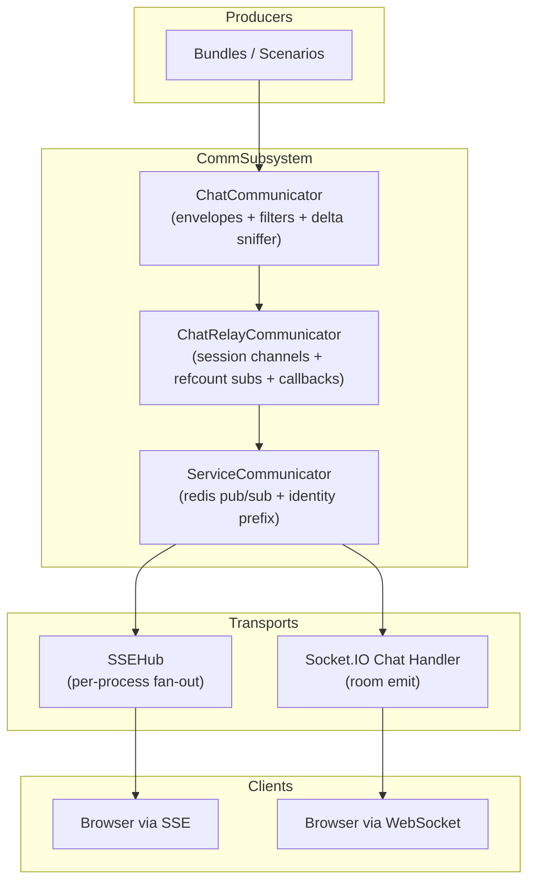
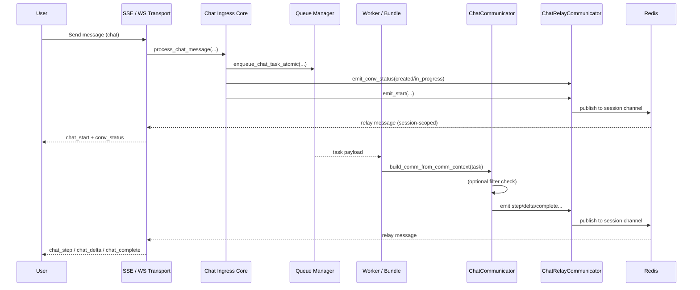
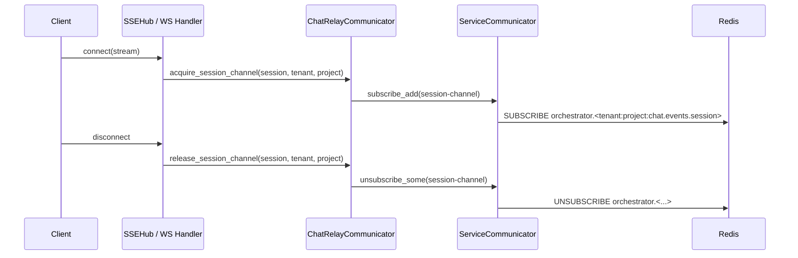

# Communication Subsystem Architecture

> Integration guide: for client-facing transports (REST/SSE/Socket.IO), auth token sources,
> attachments, and Redis relay overview, see
> [README-comm.md](README-comm.md).

This README describes the **communication subsystem** that delivers **async server events** from chat scenarios/bundles to connected clients via **Redis Pub/Sub**, **SSE**, and **WebSocket**.

The design goal is:

* **low fan-out cost**
* **per-session isolation**
* **transport-agnostic producers**
* **policy-driven delivery**
* **minimal useless Pub/Sub traffic**

---

## High-level picture

Comm stack is a three-layer pipeline:

1. **Service relay** — raw Redis Pub/Sub abstraction
2. **Chat relay** — session-aware channeling and subscription orchestration
3. **Chat communicator** — producer-friendly envelope + filtering + delta sniffing

Transports (SSE / Socket.IO) hook into the chat relay to dynamically subscribe/unsubscribe **per connected user session**.

---

## Components and responsibilities

### 1) Service Relay — `ServiceCommunicator`

**What it abstracts**

* A unified Redis Pub/Sub interface with:

    * publishing (`pub`)
    * incremental subscribe/unsubscribe (`subscribe_add`, `unsubscribe_some`)
    * listener lifecycle (`start_listener`, `stop_listener`)
* Automatic **identity prefixing** to keep producers and consumers aligned:

    * `orchestrator_identity.<logical_channel>`

**What it captures**

* A consistent wire message schema:

  ```json
  {
    "target_sid": "optional exact connection id",
    "session_id": "room / user session",
    "event": "socket-level event name",
    "data": { "envelope payload" },
    "timestamp": 1730000000.0
  }
  ```

**Why it exists**

* Separate infrastructure concerns from chat semantics.
* Allow other subsystems to reuse the same relay pattern.

---

### 2) Chat Relay — `ChatRelayCommunicator`

**What it wires**

* A chat-specific adapter on top of `ServiceCommunicator`.

**Core responsibilities**

* **Dynamic session subscriptions** (with refcounting).
* **Dynamic tenant/project subscriptions** for SSE clients that opt into
  project-level events.
* **Tenant/project-aware channel naming**.
* **Fan-out into transport callbacks** (SSE hub, WS handler).
* **Single publishing entry** for standard chat envelope types.

**What it captures**

* The session-scoped channel:

    * Base channel optionally namespaced:

        * `"{tenant}:{project}:{channel}"`
    * Final channel shards by session:

        * `"{tenant}:{project}:chat.events.{session_id}"`
* The tenant/project channel for project-scoped SSE events:

    * `"{tenant}:{project}:chat.events.__project__"`

**Why this matters**

* It prevents every transport worker from subscribing to a global firehose.
* The Pub/Sub traffic becomes proportional to *active sessions*, not *total system volume*.
* Project-scoped updates are still opt-in; only SSE clients that request
  `project_events=true` subscribe to the tenant/project channel.

---

### 3) Chat Communicator — `ChatCommunicator`

**What it abstracts**

* The **producer API** used by bundles/scenarios.
* A consistent envelope builder tied to:

    * `service` context
    * `conversation` context
* A single choke point for:

    * route selection
    * filters
    * delta sniffing/recording
    * optional recording and sink dispatch

**Core responsibilities**

* Build and emit standard envelopes:

    * `start`, `step`, `delta`, `complete`, `error`
* Provide a generic typed event API:

    * `event(...)`
    * `service_event(...)`
    * `project_event(...)`
* **Record deltas** into an internal cache:

    * `get_delta_aggregates`, `export_delta_cache`, etc.
* Apply **policy filters** (optional):

    * `IEventFilter.allow_event(...)`

### Envelope Identity Metadata

Every standard `ChatCommunicator` envelope may include top-level `metadata`
derived from the communicator service context:

```json
{
  "type": "accounting.usage",
  "metadata": {
    "agent_id": "default.react.agent",
    "app_bundle_id": "workspace@2026-03-31-13-36",
    "bundle_id": "workspace@2026-03-31-13-36",
    "component": "chatbot"
  },
  "event": {
    "agent": "default.react.agent",
    "step": "accounting",
    "status": "completed"
  }
}
```

`metadata.agent_id` is the stable ReAct agent identity used for producer
attribution, routing diagnostics, accounting correlation, recording, and event
sink output. `event.agent` is the visible actor/source label in the emitted
event. Consumers should identify accounting refresh signals by
`type == "accounting.usage"` and use `metadata.agent_id` when they need the
specific producer identity.

### Bundle‑level outbound firewall

Bundles can attach an **event filter** that acts as an outbound firewall.
It receives the event metadata and user/session details and decides whether
the package should be **emitted or suppressed**.

See: [docs/sdk/bundle/bundle-firewall-README.md](../../sdk/bundle/bundle-firewall-README.md)

---

## Delivery Scopes

The communicator exposes three distinct delivery scopes. Bundle code should
choose the smallest scope that matches the UI behavior.

| Primitive | Delivery scope | Client requirement | Typical use |
| --- | --- | --- | --- |
| `comm.service_event(..., broadcast=False)` | direct peer when the request supplied `KDC-Stream-ID`; otherwise current session | open SSE/Socket.IO peer; pass `KDC-Stream-ID` for REST operations that need a direct reply | progress for the tab that launched a bundle operation |
| `comm.service_event(..., broadcast=True)` | all connected peers in the current authenticated session | normal session stream | update every tab for the same user session |
| `comm.project_event(...)` | all SSE clients for the same tenant/project that opened `/sse/stream?project_events=true` | SSE stream with `tenant`, `project`, and `project_events=true` | compact debounced project snapshots, such as usage dashboards |

`broadcast=True` remains an emitter-owned decision. It publishes to the current
authenticated session channel, not to every project listener and not to the
Data Bus. For example, the chat ReAct entrypoint emits its own
`accounting.usage` session broadcast after it settles a turn; other accountable
surfaces choose their own delivery path.

`comm.project_event(...)` is not a replacement for telemetry streams or raw
logs. It publishes a `chat_service` envelope to the tenant/project channel
`{tenant}:{project}:chat.events.__project__`. Use it for small, bounded,
already-aggregated payloads.

Socket.IO project subscriptions are not part of the current contract. Use SSE
for tenant/project broadcast receivers.

## Data Bus Boundary

The comm relay is a **client delivery** subsystem. It publishes envelopes to
already-connected peers, user sessions, or opt-in tenant/project SSE listeners.
It is intentionally transient.

The **Data Bus** is a separate **durable inbound** subsystem for bundle-owned
domain messages. It reuses auth/session resolution and the Socket.IO connection
as a transport, but ingress routes Data Bus packages to Data Bus Redis Streams,
not to the chat turn queue and not to the comm Pub/Sub relay.

Use the Data Bus when:

- the message changes bundle state;
- the bundle must process it even if the browser disconnects;
- handlers need idempotency, retry, dead-letter handling, and optional
  per-object serialization;
- the message is not automatically part of a conversation or ReAct timeline.

Use comm relay when:

- bundle code already handled a request and needs to notify connected clients;
- delivery can be transient;
- the payload is compact and already safe for the selected delivery scope.

This does not change the current note above: Socket.IO project subscriptions
are not part of the comm broadcast contract. Data Bus publish, whether through
Socket.IO or HTTP `POST /sse/data_bus.publish`, is an inbound durable message
package, not a project-broadcast subscription.

See [Bus Routing And Partitioning](bus-routing-and-partitioning-README.md),
[Conversation Event Bus And Data Bus](conversation-event-bus-and-data-bus-README.md),
and [Data Bus](data-bus-README.md).

---

## Comm Recording And Event Sink Boundary

`ChatCommunicator` is already the widely used bundle-facing path for chat,
progress, custom typed, service, completion, and error events. Recording and
event sinks should reuse that choke point where possible instead of asking
bundles to emit a second parallel event for every signal.

The same communicator may also expose `comm.data_bus`, but this is a separate
API surface. `comm.service_event(...)` and related relay methods continue to
send transient session/conversation UI events. `comm.data_bus.publish(...)`
writes durable bundle-scoped Data Bus messages to Redis Streams and does not
create conversation `external_events[]`, ReAct timeline entries, or agent turns
unless bundle code explicitly bridges a result back into conversation ingress.

Proposed generic flow:

```text
bundle code
  |
  | self.comm.start / step / delta / event / service_event / project_event / complete / error
  v
ChatCommunicator
  |
  | build normal client envelope
  | apply outbound filter/firewall
  | publish to chat relay when client-visible
  |
  +--> optional recording buffer
          |
          | selected post-filter envelopes
          | privacy-filtered compact records
          | bounded in memory
          |
          +--> sink dispatch, e.g. send_recorded_events(...)
                 |
                 | selected batch
                 | sink-owned normalization / delivery
                 v
             configured event sink
```

Recording and sink dispatch are side effects of the existing comm path. They
should be configurable per environment and should not change the client-visible
relay contract.

Rules:

- recording must be bounded so chat delivery is not held by external sinks;
- sink payloads must follow the relevant privacy contract and avoid raw
  prompt/answer text by default; telemetry sinks should normalize to the
  telemetry contract;
- event ids must be stable enough for retry dedupe;
- comm filtering/firewall decisions must be respected or explicitly modeled in
  the telemetry policy;
- non-comm sources, such as lower-level MCP/accounting hooks, may still use a
  direct telemetry emitter when there is no comm envelope.

See:

- [Comm Recording And Event Sinks](comm-recording-event-sinks-README.md)
- [Telemetry Streams](../streams/telemetry-README.md)

---

## Delta markers (producer-facing)

`chat.delta` events carry a `marker` that tells the client how to render the stream.

Recommended for most bundles:
- `thinking` — side-channel thoughts
- `answer` — main assistant answer

Additional built-in markers:
- `subsystem` — subsystem/widget stream
- `canvas` — inline artifact/canvas stream
- `timeline_text` — compact timeline entries

Custom markers are allowed, but they require client support to be visible.
When in doubt, stick to `thinking` and `answer`.

Example delta envelope:

```json
{
  "type": "chat.delta",
  "event": { "agent": "gate", "step": "thinking", "status": "update" },
  "delta": { "text": "…", "marker": "thinking" }
}
```

---

## Where filters live and what they see

Filters are evaluated **inside `ChatCommunicator.emit()`**, before the event is published to Redis.

They receive:

* `user_type`, `user_id`
* derived `EventFilterInput` (from payload + socket event):

    * `type`
    * `route`
    * `socket_event`
    * `agent`
    * `step`
    * `status`
    * `broadcast`

Key detail:

* `route_key = route OR socket_event`

This means:

* Typed events carried via `chat_step` transport can still be distinguished if `route` is explicitly provided in the envelope.

---

## Dynamic per-session subscription lifecycle

The system subscribes to Redis **only when at least one live connection for that session exists**.

### SSE path

* `SSEHub.register(client)`

    * calls `chat_comm.acquire_session_channel(session_id, tenant, project, callback)`
* `SSEHub.unregister(client)`

    * calls `chat_comm.release_session_channel(session_id, tenant, project)`

### WS path

* `SocketIOChatHandler.connect`

    * joins the socket room: `session.session_id`
    * calls `acquire_session_channel(...)`
* `disconnect`

    * calls `release_session_channel(...)`

### Why refcounting exists

Multiple tabs / multiple connections can share:

* same session
* same tenant/project

So:

* first client triggers subscription
* last client triggers unsubscribe

---

## The “channeling” optimization

Without channeling:

* every server instance would need to subscribe to `chat.events`
* and filter in-process for relevance

With channeling:

* events are published into **session-specific channels**
* only workers with connected clients for that session subscribe

This reduces:

* Redis message delivery overhead
* CPU in transport servers
* memory pressure in fan-out hubs

---

## Supported opcode families

### Standard chat streaming events

Typically emitted via `ChatCommunicator` and mapped to socket events:

| Envelope type   | Socket event    |
| --------------- | --------------- |
| `chat.start`    | `chat_start`    |
| `chat.step`     | `chat_step`     |
| `chat.delta`    | `chat_delta`    |
| `chat.complete` | `chat_complete` |
| `chat.error`    | `chat_error`    |

### Conversation state events (`conv_status`)

These are **also served through the same comm path**.

They are emitted when:

* a turn is accepted and state transitions to `created` / `in_progress`
* a turn is rejected and state rolls back
* `conv_status.get` is called with `publish=True`

They are published via:

* `ChatRelayCommunicator.emit_conv_status(...)`
* under event name:

    * `conv_status`

Transports treat them like any other message:

* SSE wraps into frames
* WS emits to `target_sid` or `session_id` room

---

## Authentication, user types, and policy delivery

Transport entrypoints support:

* anonymous sessions
* token-based upgrade at connection time

### Upgrade flow

* SSE `/stream`
* WS `connect`

Both can:

* accept bearer / id_token
* upgrade anonymous to:

    * `registered`
    * `privileged`
      depending on roles

### Policy gate flags

You can enforce hard blocking at transport boundary:

* `CHAT_SSE_REJECT_ANONYMOUS`
* `CHAT_WS_REJECT_ANONYMOUS`

### Token sources (transport parity)

Accepted sources (by transport):

* Headers: `Authorization: Bearer <token>`, `X-ID-Token`
* Cookies: `__Secure-LATC` (auth), `__Secure-LITC` (id)
* SSE query params: `bearer_token`, `id_token`
* Socket.IO auth payload: `bearer_token`, `id_token`

See [README-comm.md](README-comm.md) for precedence and examples.

### Attachments (transport parity)

Attachments are supported by both SSE and Socket.IO:

* SSE `/sse/chat` accepts `multipart/form-data` with `event_submission` and `files`.
* Socket.IO `chat_message` accepts an event submission object plus binary frames for each `event.user.attachment.*` event.

See [attachments-system.md](../../hosting/attachments-system.md) for schema details and client expectations.

### Filter role

Even when transport allows a user, filters can still restrict:

* which events are delivered
* especially inside `chat_step` route traffic

This gives you two layers:

1. **who may connect**
2. **what they may receive**

---

## End-to-end diagrams

### A) Subsystem architecture (who wires what)



---

### B) User request + async event journey

This shows the **full exchange** from a user message to streamed results.



---

### C) Dynamic subscribe / unregister



---

## Summary

This subsystem provides:

* **Infrastructure abstraction**

    * `ServiceCommunicator`
* **Session-aware transport wiring**

    * `ChatRelayCommunicator`
* **Bundle-friendly producer API**

    * `ChatCommunicator`
* **Policy control**

    * `IEventFilter`
* **Traffic reduction**

    * per-session redis channeling
* **Transport symmetry**

    * SSE and WS share the same event bus

---

---

# README 2 — Bundle Developer Guide (ChatCommunicator)

This README explains how to emit events from Python bundles so they reliably arrive in the client over SSE/WS.

---

## The mental model

As a bundle author, you only need to care about:

1. building a `ChatCommunicator` from the task
2. calling high-level emit helpers
3. optionally supplying a filter

The communicator will:

* attach service + conversation context
* enforce policy (if provided)
* route to the correct session channel
* ensure the transport receives the right socket-level event name

---

## Create a communicator

```python
from kdcube_ai_app.apps.chat.emitters import build_comm_from_comm_context
from kdcube_ai_app.apps.chat.sdk.comm.event_filter import DefaultEventFilter

async def run_task(task):
    comm = build_comm_from_comm_context(
        task,
        event_filter=DefaultEventFilter(),  # optional
    )

    # Now stream events...
```

---

## Built-in event helpers

### 1) Turn start

```python
await comm.start(
    message="Starting your request...",
    queue_stats={"high_priority": 0, "batch": 2}
)
```

Emits:

* socket event: `chat_start`
* payload type: `chat.start`

---

### 2) Step updates

```python
await comm.step(
    step="retrieval",
    status="running",
    title="Retrieving documents",
    agent="my.bundle",
    data={"k": 5}
)

await comm.step(
    step="retrieval",
    status="completed",
    title="Documents ready",
    agent="my.bundle",
    data={"count": 5}
)
```

Emits:

* socket event: `chat_step`
* payload type: `chat.step`

---

### 3) Streaming deltas

```python
for i, chunk in enumerate(["Hello ", "world", "!"]):
    await comm.delta(
        text=chunk,
        index=i,
        marker="answer",
        agent="assistant",
        completed=(i == 2)
    )
```

Emits:

* socket event: `chat_delta`
* payload type: `chat.delta`

Markers (common):

* `answer` — main assistant answer stream.
* `thinking` — optional side stream (plans/notes).
* `subsystem` — widget streams (code exec, web search, etc.); include `sub_type`, `artifact_name`, `format`.
* `canvas` — inline artifacts for a client canvas panel (if enabled).
* `timeline_text` — compact timeline entries (react solver).

Subsystem widget refs:
* `kdcube_ai_app/apps/chat/sdk/solutions/widgets/exec.py`

Example subsystem delta:

```python
await comm.delta(
    text="{\"status\":\"gen\"}",
    index=0,
    marker="subsystem",
    agent="tool.codegen",
    format="json",
    artifact_name="code_exec.status",
    sub_type="code_exec.status",
    execution_id="exec_123",
)
```

Example canvas delta:

```python
await comm.delta(
    text="{\"title\":\"Design\",\"nodes\":[]}",
    index=0,
    marker="canvas",
    agent="tool.generator",
    format="json",
    artifact_name="canvas.design.v1",
)
```

Also:

* records chunks into the internal delta cache
* **Reset behavior:** if a new delta arrives with `index=0` for the same
  `{conversation_id, turn_id, agent, marker, format, artifact_name, title}`,
  the cache resets the accumulated chunks for that artifact before recording.

---

### 4) Turn complete

```python
await comm.complete(
    data={"result": "ok"}
)
```

Emits:

* socket event: `chat_complete`
* payload type: `chat.complete`

---

### 5) Error

```python
await comm.error(
    message="Model unavailable",
    agent="my.bundle",
    step="generation",
    title="Generation Error"
)
```

Emits:

* socket event: `chat_error`
* payload type: `chat.error`

---

## Generic typed events

When you need a domain-specific UI block:

```python
await comm.event(
    agent="my.bundle",
    type="chat.followups",
    step="followups",
    status="completed",
    title="Suggested follow-ups",
    data={"items": ["Option A", "Option B"]},
    route="chat.followups",   # important for filter visibility
)
```

This produces:

* an envelope with `type="chat.followups"`
* **transported** through `chat_step` unless you later extend mapping

---

## Writing filters

### Base interface

```python
from kdcube_ai_app.apps.chat.sdk.comm.event_filter import IEventFilter, EventFilterInput

class MyFilter(IEventFilter):
    def allow_event(self, *, user_type, user_id, event: EventFilterInput, data=None) -> bool:
        return True
```

---

### Example 1 — block some types for non-privileged users

```python
class FollowupsForPrivilegedOnly(IEventFilter):
    def allow_event(self, *, user_type, user_id, event: EventFilterInput, data=None) -> bool:
        ut = (user_type or "anonymous").lower()
        if ut == "privileged":
            return True
        return event.type != "chat.followups"
```

---

### Example 2 — route-aware policy

Default idea: filter only inside `chat_step` transport.

```python
class StepRouteWhitelist(IEventFilter):
    ALLOWED = {
        "chat.conversation.title",
        "chat.followups",
        "chat.files",
        "chat.citations",
        "chat.turn.summary",
    }

    def allow_event(self, *, user_type, user_id, event: EventFilterInput, data=None) -> bool:
        ut = (user_type or "anonymous").lower()
        if ut == "privileged":
            return True

        if event.route_key == "chat_step":
            t = event.type or ""
            return t in self.ALLOWED

        return True
```

---

## Where filters are applied

Filters are executed here:

* `ChatCommunicator.emit(...)`

So they affect **all high-level helpers**:

* `start/step/delta/complete/error/event`

If the filter throws:

* the communicator **fails open** (event still sent)

---

## Best-practice bundle pattern

```python
async def run_bundle(task):
    comm = build_comm_from_comm_context(task)

    await comm.start(message=task.request.message)

    await comm.step(
        step="analysis",
        status="running",
        title="Analyzing request",
        agent="my.bundle",
    )

    text = "Short answer streamed."
    for i, ch in enumerate(text.split()):
        await comm.delta(text=ch + " ", index=i)

    await comm.event(
        agent="my.bundle",
        type="chat.followups",
        step="followups",
        status="completed",
        title="Follow-ups",
        data={"items": ["Ask for examples", "Request a summary"]},
        route="chat.followups",
    )

    await comm.complete(data={"final": text})
```

---

## How this reaches the client

You don’t need to know SSE vs WS specifics.
The relay + transport layer ensures:

* events are published to:

    * `"{tenant}:{project}:chat.events.{session_id}"`
* only servers with an active connection for that session are subscribed
* the correct client receives:

    * direct message if `target_sid` is set
    * broadcast to session room otherwise

---

## Quick troubleshooting checklist

If your UI event doesn’t appear:

1. Confirm you used the right helper:

    * `comm.step` vs `comm.event`
2. If it’s a typed event transported inside `chat_step`,
   **set `route`** so filters can distinguish it:

   ```python
   route="chat.followups"
   ```
3. Check user role:

    * anonymous vs registered vs privileged
4. Verify that the client is connected to the correct session:

    * session-based channeling means wrong session = silence
