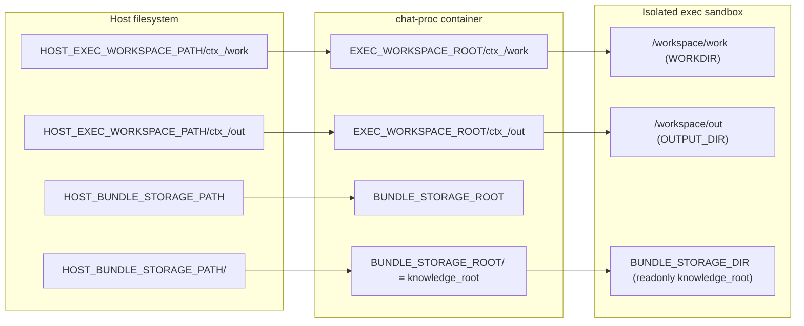
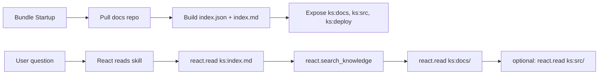

# React.doc Bundle — Doc Reader Flow

This bundle is a **documentation reader** that exposes the platform docs and related
source files through the React knowledge space (`ks:`). It is intended for **product
and architecture Q&A** where answers must cite internal docs and code references.

Motivation:
- keep docs/source browsing deterministic (no ad‑hoc file paths in prompts)
- allow React to search & read a curated set of files via `ks:` paths
- expose deployment + source references alongside docs

## How it works (high‑level)

1) **Knowledge space is prepared before each turn (cached)**
   - Entry: `entrypoint.py` calls `_ensure_knowledge_space()` in `pre_run_hook`.
   - A signature cache prevents rebuilding unless repo/ref/roots change.
   - The builder scans `docs/` for front‑matter and builds:
     - `index.json` (structured list of docs)
     - `index.md` (human‑readable list)
   - Files: `knowledge/index_builder.py`, `knowledge/resolver.py`.

2) **Knowledge source (repo + roots)**
The docs, sources, and deployment artifacts are pulled from a git repo defined in **bundle props**:

Required bundle props:
- `knowledge.repo`: git URL of the repo that contains docs and source code.
- `knowledge.ref`: git tag/commit/branch (tag/commit recommended for deterministic releases).
- `knowledge.docs_root`: docs root inside the repo (relative to repo root).
- `knowledge.src_root`: source root inside the repo (relative to repo root).
- `knowledge.deploy_root`: deployment root inside the repo (relative to repo root).
- `knowledge.tests_root`: test-fixture root exposed as exact-read `ks:tests/...` paths.

There are **no implicit defaults** for docs/src roots when `knowledge.repo` is set.
You must define both roots explicitly. `deploy_root` is optional. `tests_root` is optional and is intended for reusable bundle-test fixtures or similar exact-read content.

If **all** `knowledge.*` fields are empty, the bundle tries to auto‑detect a local
repo (host dev) or falls back to `KDCUBE_KNOWLEDGE_REPO` (default: public repo).

Example (this repo):
```yaml
knowledge:
  repo: git@github.com:kdcube/kdcube-ai-app.git
  ref: <tag-or-sha>
  docs_root: app/ai-app/docs
  src_root: app/ai-app/services/kdcube-ai-app/kdcube_ai_app
  deploy_root: app/ai-app/deployment
  tests_root: app/ai-app/services/kdcube-ai-app/kdcube_ai_app/apps/chat/sdk/examples/tests
  validate_refs: true
```

The repo is cloned into **bundle local storage** under this bundle's own storage subtree:
```
<bundle_storage>/repos/<repo>__<bundle_id>__<ref>/
```

Then `knowledge.docs_root` and `knowledge.src_root` are resolved against that repo root.

3) **Knowledge space layout**
```
<knowledge_root>/
  docs/            # symlink or copy of ai-app/docs
  src/             # symlink to ai-app/services/kdcube-ai-app/kdcube_ai_app
  deploy/          # symlink or copy of ai-app/deployment
  tests/           # symlink or copy of exact-read test fixtures
  index.json
  index.md
```

For this bundle specifically:
- `self.bundle_storage_root()` returns the bundle's per-bundle storage directory
- `entrypoint.py` passes that path as `knowledge_root=ws_root`

So in `react.doc`:
- `knowledge_root == self.bundle_storage_root()`
- but `knowledge_root` is **not** the same thing as the shared `BUNDLE_STORAGE_ROOT`
- it is one bundle-specific subtree under that shared root

That subtree contains both:
- the built knowledge-space files (`docs/`, `src/`, `deploy/`, `index.json`, `index.md`)
- and helper storage such as `repos/...` used to clone/fetch the source repository

In external isolated execution, this directory is now transported too:

- Docker external exec: the per-bundle storage dir is bind-mounted read-only into the child container
- Fargate external exec: the per-bundle storage dir is snapshotted and restored into the exec task

Inside isolated exec, `BUNDLE_STORAGE_DIR` points at that physical directory.
`knowledge/resolver.py` falls back to `BUNDLE_STORAGE_DIR` when `KNOWLEDGE_ROOT`
has not already been initialized by the main bundle entrypoint.

### Where the data is physically

This bundle uses three distinct physical areas during external exec:
- `workdir` — generated Python program and scratch runtime files
- `outdir` — writable outputs and logs
- bundle storage / `knowledge_root` — readonly knowledge space data for the child runtime

#### Path matrix

| Area | Host-side root in Docker-on-EC2 mode | `chat-proc` visible path | Isolated exec visible path | Notes |
| --- | --- | --- | --- | --- |
| workdir | `HOST_EXEC_WORKSPACE_PATH/ctx_<id>/work` | `EXEC_WORKSPACE_ROOT/ctx_<id>/work` | `WORKDIR=/workspace/work` | generated `main.py`, scratch files |
| outdir | `HOST_EXEC_WORKSPACE_PATH/ctx_<id>/out` | `EXEC_WORKSPACE_ROOT/ctx_<id>/out` | `OUTPUT_DIR=/workspace/out` | contract files, logs, execution results |
| shared bundle-storage root | `HOST_BUNDLE_STORAGE_PATH` | `BUNDLE_STORAGE_ROOT` | not directly exposed as an agent contract | shared parent root |
| `react.doc` per-bundle subtree | `HOST_BUNDLE_STORAGE_PATH/<bundle-subdir>` | `BUNDLE_STORAGE_ROOT/<bundle-subdir>` | `BUNDLE_STORAGE_DIR=<same bundle subdir path>` | readonly in external exec |

Notes:
- `knowledge_root` for this bundle is that per-bundle storage subtree.
- The exact `<bundle-subdir>` is not a public agent contract. Bundle/runtime code computes it.
- Inside that subtree, `react.doc` stores both `repos/...` and the built knowledge-space files.
- In external exec, the child should treat `BUNDLE_STORAGE_DIR` as readonly.

#### What `react.doc` stores in that subtree

```text
<per-bundle-subtree>/              # this bundle's knowledge_root
  repos/
    <repo>__react.doc.knowledge__<ref>/...
  docs/
  src/
  deploy/
  index.json
  index.md
```

#### Docker external exec on ECS/EC2



Interpretation:
- `workdir` and `outdir` are rebased into `/workspace/...` inside the sandbox.
- `BUNDLE_STORAGE_ROOT` is the shared parent root in `chat-proc`.
- `knowledge_root` is the `react.doc` per-bundle subtree under that parent root.
- `knowledge_root` is not rebased into `OUTPUT_DIR`.
- The knowledge space is exposed as its own readonly subtree through `BUNDLE_STORAGE_DIR`.

#### Fargate external exec

In Fargate mode there is no shared host bind mount into the child runtime.
Instead:
- `workdir` is snapshotted and restored into `/workspace/work`
- `outdir` is snapshotted and restored into `/workspace/out`
- bundle storage / `knowledge_root` is snapshotted and restored into `BUNDLE_STORAGE_DIR`

So the child runtime still sees the same three classes of data:
- scratch `workdir`
- writable `outdir`
- readonly knowledge space

4) **Path scheme**
- `ks:index.md` — short index for navigation.
- `ks:docs/<path>` — doc pages (Markdown).
- `ks:src/<path>` — source files referenced by docs (read‑only).
- `ks:deploy/<path>` — deployment files (compose, env, Dockerfiles).
- `ks:tests/<path>` — exact-read test fixtures and instructions; not indexed for `react.search_knowledge`.

5) **Doc ↔ code resolution**
Docs may reference code like:
`kdcube_ai_app/apps/chat/sdk/solutions/react/v2/runtime.py`
When React reads a doc, the reader surfaces resolvable `ks:src/...` paths so the
agent can jump to the exact file without guessing.

## How React uses it

React tooling (bundle‑provided):
- `react.search_knowledge(query, root="ks:docs")` — search docs (metadata search).
- `react.read(["ks:docs/<path>"])` — open a doc.
- `react.read(["ks:src/<path>"])` — open a source file.
- `react.search_knowledge(query, root="ks:deploy")` — search deployment docs.
- `react.read(["ks:deploy/<path>"])` — open deployment files.
- `react.read(["ks:tests/<path>"])` — open exact test fixtures or README guidance.
- `bundle_data.resolve_namespace(logical_ref)` — exec-only resolver for generated code. Returns `{ok, error, ret}` where `ret` is `{physical_path: str | null, access: 'r' | 'rw', browseable: bool}`.
  - `physical_path` is usable only inside isolated exec.
  - use the input `logical_ref` itself as the logical base for later `react.read(...)` follow-up.
You can optionally pass `keywords=[...]` to `react.search_knowledge` to bias ranking
toward specific tags or terms.

Important:
- `bundle_data.resolve_namespace(...)` is **not** a normal planning-time browsing tool.
- It is intended only for generated Python running inside `execute_code_python(...)`.
- Outside isolated exec it returns an error by design.
- Because this tool runs only inside generated exec code, the agent sees its result only if that code propagates it out:
  - write a summary/result file under `OUTPUT_DIR/...`
  - and/or print short diagnostics to `user.log`
- Practical pattern:
  - set `logical_base = "ks:src"`
  - resolve `logical_base`
  - inspect files under the returned `physical_path`
- if code finds a useful file at relative path `foo/bar.py`, emit logical ref `f"{logical_base}/foo/bar.py"`
- the agent can later call `react.read(["ks:src/foo/bar.py"])`
- the same rule applies for test browsing:
  - keep `logical_base = "ks:tests"`
  - browse descendants under the exec-only `physical_path`
  - emit follow-up logical refs as `f"{logical_base}/{relative_path}"`
- For the exact propagation model, see:
  - `ks:docs/exec/exec-logging-error-propagation-README.md`

The **product skill** (`skills/product/kdcube/SKILL.md`) tells the agent to:
1) Read `ks:index.md` for entry points.
2) Search + read docs from `ks:docs/...`.
3) Read referenced code/deploy files via exact `ks:` paths when the mapping is obvious.
4) If the exact source/deploy path is unclear, use generated exec code plus `bundle_data.resolve_namespace(...)` to browse the namespace and emit the exact follow-up `ks:` refs before calling `react.read(...)`.

Tool registration:
- The bundle defines `react.search_knowledge` in `tools/react_tools.py`.
- The bundle defines `bundle_data.resolve_namespace` in `tools/exec_space_tools.py`.
- Tools are registered via `tools_descriptor.py` with alias `react`.
  The exec-only resolver is registered separately with alias `bundle_data`.

## Search resolver (how it works)

`react.search_knowledge` is backed by a simple resolver in:
`knowledge/resolver.py`.

Behavior (current):
- Loads `index.json` generated at startup.
- Filters items by `root`:
  - If `root="ks:docs"` then only paths starting with `ks:docs` are searched.
  - If `root` is omitted, all indexed items are searched.
- Performs **hybrid metadata search** (case‑insensitive) across:
  - `title`
  - `summary`
  - `tags` + `keywords`
  - `path`
- Ranks hits by weighted signals:
  - Title phrase match (highest)
  - Tag/keyword match
  - Summary match
  - Path match (lowest)
- Returns `path`, `title`, and `score` (no full‑text search yet).

This means search is **metadata‑level**, not content‑level.
For precise answers, the agent must open docs via `react.read(...)`.

## Read + search flow (visual)



## What’s still missing / TODO

1) **Semantic search** for knowledge space (current search is lexical).
2) **Auto‑refresh** of the index when docs change (currently on startup).
3) **DB/graph knowledge resolvers** (Postgres / Neo4j / hybrid).
4) **Explicit “doc roots”** beyond `docs/` (e.g., product specs, ADRs).
5) **Structured doc metadata enforcement** (validate required front‑matter fields).
6) **External link validation** (only code refs are validated today).

## Relevant implementation files

- `kdcube_ai_app/apps/chat/sdk/examples/bundles/react.doc@2026-03-02-22-10/knowledge/index_builder.py`
- `kdcube_ai_app/apps/chat/sdk/examples/bundles/react.doc@2026-03-02-22-10/knowledge/resolver.py`
- `kdcube_ai_app/apps/chat/sdk/examples/bundles/react.doc@2026-03-02-22-10/tools/react_tools.py`
- `kdcube_ai_app/apps/chat/sdk/examples/bundles/react.doc@2026-03-02-22-10/entrypoint.py`
- `kdcube_ai_app/apps/chat/sdk/solutions/react/v2/tools/read.py`

## EC2 docker‑compose: what you need to add for the doc bundle

1. Create host dir:
```shell
mkdir -p /path/to/bundle-storage
```

2. In compose .env:
```shell
HOST_BUNDLE_STORAGE_PATH=/path/to/bundle-storage
BUNDLE_STORAGE_ROOT=/bundle-storage
```

3. In .env.proc:
```shell
BUNDLE_STORAGE_ROOT=/bundle-storage
```

4. Ensure proc can write (index build happens on startup):
```shell
sudo chown -R 1000:1000 /path/to/bundle-storage
# or
sudo chmod -R 0777 /path/to/bundle-storage
```
