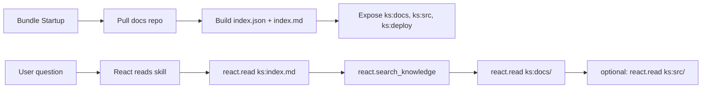

# React.doc Bundle — Doc Reader Flow

This bundle is a **documentation reader** that exposes the platform docs and related
source files through the React knowledge space (`ks:`). It is intended for **product
and architecture Q&A** where answers must cite internal docs and code references.

Motivation:
- keep docs/source browsing deterministic (no ad‑hoc file paths in prompts)
- allow React to search & read a curated set of files via `ks:` paths
- expose deployment + source references alongside docs

## How it works (high‑level)

1) **Knowledge space is prepared on bundle startup**
   - Entry: `entrypoint.py` calls `_ensure_knowledge_space()` in `pre_run_hook`.
   - The builder scans `docs/` for front‑matter and builds:
     - `index.json` (structured list of docs)
     - `index.md` (human‑readable list)
   - Files: `knowledge/index_builder.py`, `knowledge/resolver.py`.

2) **Knowledge source (repo + roots)**
The docs, sources, and deployment artifacts are pulled from a git repo defined in **bundle props**:

Required bundle props:
- `knowledge.repo`: git URL of the repo that contains docs and source code.
- `knowledge.ref`: git tag/commit/branch (tag/commit recommended for deterministic releases).
- `knowledge.docs_root`: docs root inside the repo (relative to repo root).
- `knowledge.src_root`: source root inside the repo (relative to repo root).
- `knowledge.deploy_root`: deployment root inside the repo (relative to repo root).

There are **no implicit defaults** for docs/src roots when `knowledge.repo` is set.
You must define both roots explicitly. `deploy_root` is optional but recommended.

Example (this repo):
```yaml
knowledge:
  repo: git@github.com:kdcube/kdcube-ai-app.git
  ref: <tag-or-sha>
  docs_root: app/ai-app/docs
  src_root: app/ai-app/services/kdcube-ai-app/kdcube_ai_app
  deploy_root: app/ai-app/deployment
  validate_refs: true
```

The repo is cloned into **bundle local storage** (shared bundle storage root):
```
<bundle_storage>/repos/<repo_name>/
```

Then `knowledge.docs_root` and `knowledge.src_root` are resolved against that repo root.

3) **Knowledge space layout**
```
<knowledge_root>/
  docs/            # symlink or copy of ai-app/docs
  src/             # symlink to ai-app/services/kdcube-ai-app/kdcube_ai_app
  deploy/          # symlink or copy of ai-app/deployment
  index.json
  index.md
```

4) **Path scheme**
- `ks:index.md` — short index for navigation.
- `ks:docs/<path>` — doc pages (Markdown).
- `ks:src/<path>` — source files referenced by docs (read‑only).
- `ks:deploy/<path>` — deployment files (compose, env, Dockerfiles).

5) **Doc ↔ code resolution**
Docs may reference code like:
`kdcube_ai_app/apps/chat/sdk/solutions/react/v2/runtime.py`
When React reads a doc, the reader surfaces resolvable `ks:src/...` paths so the
agent can jump to the exact file without guessing.

## How React uses it

React tooling (bundle‑provided):
- `react.search_knowledge(query, root="ks:docs")` — search docs (metadata search).
- `react.read(["ks:docs/<path>"])` — open a doc.
- `react.read(["ks:src/<path>"])` — open a source file.
- `react.search_knowledge(query, root="ks:deploy")` — search deployment docs.
- `react.read(["ks:deploy/<path>"])` — open deployment files.
You can optionally pass `keywords=[...]` to `react.search_knowledge` to bias ranking
toward specific tags or terms.

The **product skill** (`skills/product/kdcube/SKILL.md`) tells the agent to:
1) Read `ks:index.md` for entry points.
2) Search + read docs from `ks:docs/...`.
3) Read referenced code via `ks:src/...` when a detail needs verification.

Tool registration:
- The bundle defines `react.search_knowledge` in `tools/react_tools.py`.
- Tools are registered via `tools_descriptor.py` with alias `react`.

## Search resolver (how it works)

`react.search_knowledge` is backed by a simple resolver in:
`knowledge/resolver.py`.

Behavior (current):
- Loads `index.json` generated at startup.
- Filters items by `root`:
  - If `root="ks:docs"` then only paths starting with `ks:docs` are searched.
  - If `root` is omitted, all indexed items are searched.
- Performs **hybrid metadata search** (case‑insensitive) across:
  - `title`
  - `summary`
  - `tags` + `keywords`
  - `path`
- Ranks hits by weighted signals:
  - Title phrase match (highest)
  - Tag/keyword match
  - Summary match
  - Path match (lowest)
- Returns `path`, `title`, and `score` (no full‑text search yet).

This means search is **metadata‑level**, not content‑level.
For precise answers, the agent must open docs via `react.read(...)`.

## Read + search flow (visual)



## What’s still missing / TODO

1) **Semantic search** for knowledge space (current search is lexical).
2) **Auto‑refresh** of the index when docs change (currently on startup).
3) **DB/graph knowledge resolvers** (Postgres / Neo4j / hybrid).
4) **Explicit “doc roots”** beyond `docs/` (e.g., product specs, ADRs).
5) **Structured doc metadata enforcement** (validate required front‑matter fields).
6) **External link validation** (only code refs are validated today).

## Relevant implementation files

- `kdcube_ai_app/apps/chat/sdk/examples/bundles/react.doc@2026-03-02-22-10/knowledge/index_builder.py`
- `kdcube_ai_app/apps/chat/sdk/examples/bundles/react.doc@2026-03-02-22-10/knowledge/resolver.py`
- `kdcube_ai_app/apps/chat/sdk/examples/bundles/react.doc@2026-03-02-22-10/tools/react_tools.py`
- `kdcube_ai_app/apps/chat/sdk/examples/bundles/react.doc@2026-03-02-22-10/entrypoint.py`
- `kdcube_ai_app/apps/chat/sdk/solutions/react/v2/tools/read.py`

## EC2 docker‑compose: what you need to add for the doc bundle

1. Create host dir:
```shell
mkdir -p /path/to/bundle-storage
```

2. In compose .env:
```shell
HOST_BUNDLE_STORAGE_PATH=/path/to/bundle-storage
BUNDLE_STORAGE_ROOT=/bundle-storage
```

3. In .env.proc:
```shell
BUNDLE_STORAGE_ROOT=/bundle-storage
```

4. Ensure proc can write (index build happens on startup):
```shell
sudo chown -R 1000:1000 /path/to/bundle-storage
# or
sudo chmod -R 0777 /path/to/bundle-storage
```
