# with-isoruntime bundle (minimal iso-runtime harness)

This bundle is a **minimal iso-runtime harness** that runs a hardcoded Python snippet
inside the selected exec runtime **without ReAct**. It is meant to isolate and validate:
- the execution stack
- tool wiring
- workspace sync behavior
- diagnostics/logging surface

## What it does
1. Creates a `ToolSubsystem` from `tools_descriptor.py`.
2. Bootstraps a **per-user sandbox** from a **per-user workspace**.
3. Executes a scenario-specific Python snippet.
   - Contract mode: `exec_tools.run_exec_tool(...)`
   - Side-effects mode (no contract): `exec_tools.run_exec_tool_no_contract(...)`
4. Syncs **only `out/`** back to the user workspace (overwrite).
5. Emits an execution report (tree + log tails) and raises `comm.error` if
   `user.log` contains `ERROR` lines or a traceback.
6. Writes a note using a **bundle-local tool** (`local_tools.write_note`).

## Exec runtime selection

This bundle passes entrypoint props into the workflow explicitly:

```python
# entrypoint.py
orch = WithIsoRuntimeWorkflow(
    ...,
    bundle_props=self.bundle_props,
)
```

and the workflow forwards them into `BaseWorkflow`:

```python
# workflow.py
super().__init__(
    ...,
    bundle_props=bundle_props,
)
```

This bundle uses the workflow helper:

```python
self.resolve_exec_runtime()
```

That means the actual runtime is driven by bundle props under
`config.execution.runtime`.

Supported shapes:

- single runtime config
- multiple named profiles with `default_profile`

Example with multiple profiles:

```yaml
config:
  execution:
    runtime:
      default_profile: docker_small
      profiles:
        docker_small:
          mode: docker
          image: py-code-exec:small
          network_mode: host
          cpus: "1.0"
          memory: "1g"
        docker_large:
          mode: docker
          image: py-code-exec:large
          network_mode: bridge
          cpus: "2.0"
          memory: "4g"
          extra_args:
            - --pids-limit
            - "256"
        fargate_default:
          mode: fargate
          enabled: true
          cluster: arn:aws:ecs:eu-west-1:100258542545:cluster/kdcube-staging-cluster
          task_definition: kdcube-staging-exec
          container_name: exec
          subnets:
            - subnet-xxxx
            - subnet-yyyy
          security_groups:
            - sg-xxxx
          assign_public_ip: DISABLED
```

Current bundle behavior:
- the workflow uses the resolved default runtime from bundle props for normal scenarios
- scenario `13. Fargate happy path` explicitly picks the profile named `fargate_default`
  from `config.execution.runtime.profiles`
- if you want to force another supported profile in code, use:

```python
self.resolve_exec_runtime(profile="docker_large")
```

For this example, the relation is intentionally direct:

```python
# workflow.py
if str(scenario_id) == "13":
    return self.resolve_exec_runtime(profile="fargate_default")
return self.resolve_exec_runtime()
```

If you want to inspect a concrete configured value by path in the workflow, you
can do that directly as well:

```python
mode = self.bundle_prop("execution.runtime.profiles.fargate_default.mode")
cluster = self.bundle_prop("execution.runtime.profiles.fargate_default.cluster")
```

That keeps the relationship explicit:
- `bundle_prop("execution.runtime.profiles.fargate_default...")` reads the
  named profile from bundle props
- `self.resolve_exec_runtime(profile="fargate_default")` resolves that same
  named profile into the runtime config used for execution

Notes:
- Docker profiles may define Docker-specific keys such as `image`,
  `network_mode`, `cpus`, `memory`, and `extra_args`
- Fargate profiles may define ECS-specific keys such as `cluster`,
  `task_definition`, `subnets`, and `security_groups`
- missing keys still fall back to proc service env vars where applicable

Important detail:
- `self.resolve_exec_runtime(...)` resolves only from `RuntimeCtx.exec_runtime`
- it does **not** read proc service env vars directly
- env vars are only backend-level fallback for missing keys after profile
  selection

### How props connect to runtime selection

```mermaid
flowchart LR
    A["bundles.yaml\nconfig.execution.runtime.profiles.fargate_default"] --> B["Entrypoint loads bundle props"]
    B --> C["RuntimeCtx.exec_runtime\ncanonical runtime config with profiles"]
    C --> D["workflow.py\nself.resolve_exec_runtime(profile='fargate_default')"]
    D --> E["resolved runtime config\nmode=fargate + ECS keys"]
    E --> F["exec_tools.run_exec_tool(...)"]
    F --> G["_InProcessRuntime.execute_py_code(...)"]
    G --> H["Fargate runtime backend"]
    H --> I["ECS exec task"]
```



## Workspace / sandbox layout
```
examples/bundles/data/
  workspace/<user-id>/    # persistent user workspace
  sandbox/<user-id>/      # per-run sandbox (overwritten each run)
```

Inside the sandbox, the exec runtime uses:
```
sandbox/<user-id>/
  work/   # runtime workdir (main.py etc.)
  out/    # runtime outdir (artifacts, logs)
```
Only `out/` is synced back to the user workspace.

## Env vars
Override paths if needed:
- `ISO_RUNTIME_USER_WORKSPACE_ROOT`
  - default: `.../examples/bundles/data/workspace`
- `ISO_RUNTIME_SANDBOX_ROOT`
  - default: `.../examples/bundles/data/sandbox`

## Tools
This bundle registers one bundle-local tool:
```
tools/local_tools.py  -> alias: local_tools
```

It exposes:
```
local_tools.write_note(text: str)
```
which writes: `OUTPUT_DIR/notes/<timestamp>-note.txt`

## Scenarios (clickable in UI)
The workflow selects a scenario from the user input (e.g., `0.` or `scenario 3`).
Each scenario is listed in the UI as a suggested followup.

Scenario **0** is the happy path. It writes:
- `turn_<id>/files/hello-iso-runtime.txt`
and then calls:
```
await agent_io_tools.tool_call(
    fn=local_tools.write_note,
    params={"text": "note from iso-runtime"},
    call_reason="Write a simple note file",
    tool_id="local_tools.write_note",
)
```

Other scenarios simulate timeouts, crashes, partial output, etc. See `exec.py`.

Notable scenario:
- **13. Fargate happy path** — explicitly selects a configured Fargate profile
  by its profile name from the bundle runtime config and is intended as a simple smoke test for
  distributed exec wiring

### Contract vs side-effects
- **Contract mode** (default): the contract defines expected outputs; missing/invalid
  files are reported as errors.
- **Side-effects mode**: no contract is enforced; we diff `out/` before/after and
  report created/modified/deleted files.

Implementation modules:
- `exec_contract.py` — contract execution path
- `exec_side_effects.py` — side-effects execution path (diffs `out/`)

## Docker note
If the selected profile uses Docker, ensure the sandbox root is mounted into the
exec container. The simplest option is to point `ISO_RUNTIME_SANDBOX_ROOT` at a
mounted exec-workspace path.

When proc itself runs on ECS/Fargate, Docker profiles are usually not runnable
unless that proc environment provides a Docker daemon/socket. In that setup,
Fargate profiles are the normal choice for isolated exec.

## Execution diagnostics
After each exec run, the workflow collects:
- A tree of the sandbox root (excluding `logs/`).
- Tail of `out/logs/user.log` (program output only).
- Tail of `out/logs/infra.log` (merged infra logs).
- Extracted `ERROR` lines from the program log.

If `user.log` contains `ERROR` lines or a traceback, the workflow emits:
```
self.comm.error(message="Program error detected in user.log", ...)
```

## Program logging
Use the dedicated program logger to write into `user.log`:
```
import logging
log = logging.getLogger("user")
log.info("hello from program")
```
