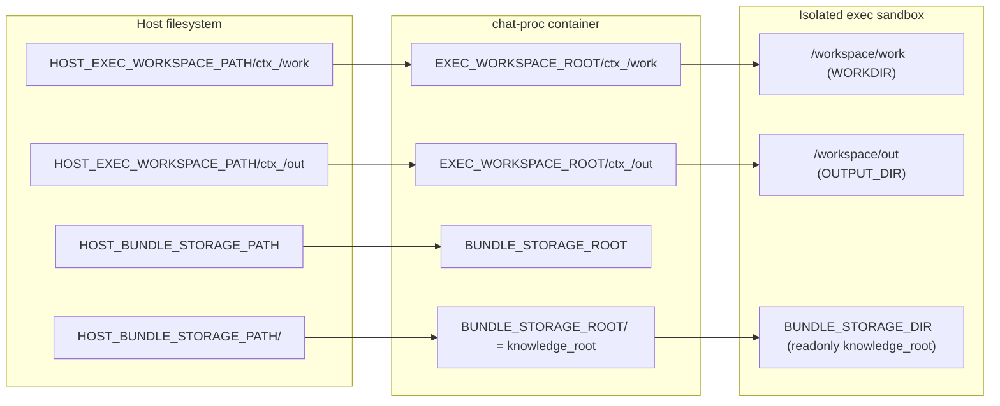
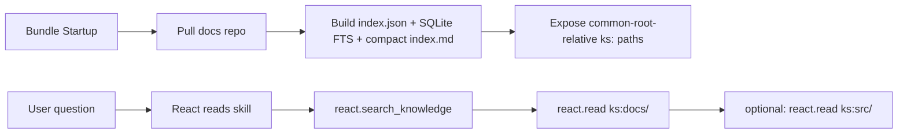

# KDCube Copilot Bundle — Doc Reader Flow

This bundle is a **documentation reader** that exposes the platform docs and related
source files through the React knowledge space (`ks:`). It is intended for **product
and architecture Q&A** where answers must cite internal docs and code references.

Motivation:
- keep docs/source browsing deterministic (no ad‑hoc file paths in prompts)
- allow React to search & read a curated set of files via `ks:` paths
- expose deployment + source references alongside docs

## Bundle Docs

- [Telegram setup](docs/integrations/telegram-setup.md) - webhook, Mini App,
  commands, and the `/start` admin approval flow.

## How it works (high‑level)

1) **Knowledge space is prepared before each turn (cached)**
   - Entry: `entrypoint.py` calls `_ensure_knowledge_space()` in `pre_run_hook`.
   - A signature cache prevents rebuilding unless repo/ref/roots change.
   - The builder scans `docs/` for front‑matter and builds:
     - `.cache/knowledge_search.sqlite` (SQLite FTS retrieval index)
     - `index.json` (structured compatibility metadata)
     - `index.md` (compact builder navigation/status note)
   - Files: `knowledge/index_builder.py`, `knowledge/resolver.py`.

2) **Knowledge source (repo + common root)**
The docs, sources, deployment artifacts, UI files, and test fixtures are pulled from a git repo defined in **bundle props**:

Required bundle props:
- `knowledge.repo`: git URL of the repo that contains docs and source code.
- `knowledge.ref`: git tag/commit/branch (tag/commit recommended for deterministic releases).
- `knowledge.root`: common knowledge root inside the repo (relative to repo root). For this repo that root is `app/ai-app`.

The bundle prepares `ks:` from that one common root. Real logical paths are then derived by prepending `ks:` to the app-relative path:
- `ks:docs/...`
- `ks:deployment/...`
- `ks:src/...`
- `ks:ui/...`

These are examples of real app-relative paths under one common root, not special platform-mandated subnamespaces.

If **all** `knowledge.*` fields are empty, the bundle tries to auto‑detect a local
repo (host dev) or falls back to `KDCUBE_KNOWLEDGE_REPO` (default: public repo).

Example (this repo):
```yaml
knowledge:
  repo: git@github.com:kdcube/kdcube-ai-app.git
  ref: <tag-or-sha>
  root: app/ai-app
  validate_refs: true
```

The repo is cloned into **bundle local storage** under this bundle's own storage subtree:
```
<bundle_storage>/repos/<repo>__<bundle_id>__<ref>/
```

Then `knowledge.root` is resolved against that repo root.

3) **Knowledge space layout**
```
<knowledge_root>/
  docs/            # symlink or copy of app/ai-app/docs
  deployment/      # symlink or copy of app/ai-app/deployment
  src/             # symlink or copy of app/ai-app/src
  ui/              # symlink or copy of app/ai-app/ui
  .cache/knowledge_search.sqlite
  index.json
  index.md
```

For this bundle specifically:
- `self.bundle_storage_root()` returns the bundle's per-bundle storage directory
- `entrypoint.py` passes that path as `knowledge_root=ws_root`

So in `kdcube.copilot`:
- `knowledge_root == self.bundle_storage_root()`
- but `knowledge_root` is **not** the same thing as the shared `BUNDLE_STORAGE_ROOT`
- it is one bundle-specific subtree under that shared root

That subtree contains both:
- the built knowledge-space files (`docs/`, `deployment/`, `src/`, `ui/`, `index.json`, `index.md`)
- and helper storage such as `repos/...` used to clone/fetch the source repository

In external isolated execution, this directory is now transported too:

- Docker external exec: the per-bundle storage dir is bind-mounted read-only into the child container
- Fargate external exec: the per-bundle storage dir is snapshotted and restored into the exec task

Inside isolated exec, `BUNDLE_STORAGE_DIR` points at that physical directory.
`knowledge/resolver.py` falls back to `BUNDLE_STORAGE_DIR` when `KNOWLEDGE_ROOT`
has not already been initialized by the main bundle entrypoint.

### Where the data is physically

This bundle uses three distinct physical areas during external exec:
- `workdir` — generated Python program and scratch runtime files
- `outdir` — writable outputs and logs
- bundle storage / `knowledge_root` — readonly knowledge space data for the child runtime

#### Path matrix

| Area | Host-side root in Docker-on-EC2 mode | `chat-proc` visible path | Isolated exec visible path | Notes |
| --- | --- | --- | --- | --- |
| workdir | `HOST_EXEC_WORKSPACE_PATH/ctx_<id>/work` | `EXEC_WORKSPACE_ROOT/ctx_<id>/work` | `WORKDIR=/workspace/work` | generated `main.py`, scratch files |
| outdir | `HOST_EXEC_WORKSPACE_PATH/ctx_<id>/out` | `EXEC_WORKSPACE_ROOT/ctx_<id>/out` | `OUTPUT_DIR=/workspace/out` | contract files, logs, execution results |
| shared bundle-storage root | `HOST_BUNDLE_STORAGE_PATH` | `BUNDLE_STORAGE_ROOT` | not directly exposed as an agent contract | shared parent root |
| `kdcube.copilot` per-bundle subtree | `HOST_BUNDLE_STORAGE_PATH/<bundle-subdir>` | `BUNDLE_STORAGE_ROOT/<bundle-subdir>` | `BUNDLE_STORAGE_DIR=<same bundle subdir path>` | readonly in external exec |

Notes:
- `knowledge_root` for this bundle is that per-bundle storage subtree.
- The exact `<bundle-subdir>` is not a public agent contract. Bundle/runtime code computes it.
- Inside that subtree, `kdcube.copilot` stores both `repos/...` and the built knowledge-space files.
- In external exec, the child should treat `BUNDLE_STORAGE_DIR` as readonly.

#### What `kdcube.copilot` stores in that subtree

```text
<per-bundle-subtree>/              # this bundle's knowledge_root
  repos/
    <repo>__kdcube.copilot.knowledge__<ref>/...
  docs/
  deployment/
  src/
  ui/
  .cache/knowledge_search.sqlite
  index.json
  index.md
```

#### Docker external exec on ECS/EC2



Interpretation:
- `workdir` and `outdir` are rebased into `/workspace/...` inside the sandbox.
- `BUNDLE_STORAGE_ROOT` is the shared parent root in `chat-proc`.
- `knowledge_root` is the `kdcube.copilot` per-bundle subtree under that parent root.
- `knowledge_root` is not rebased into `OUTPUT_DIR`.
- The knowledge space is exposed as its own readonly subtree through `BUNDLE_STORAGE_DIR`.

#### Fargate external exec

In Fargate mode there is no shared host bind mount into the child runtime.
Instead:
- `workdir` is snapshotted and restored into `/workspace/work`
- `outdir` is snapshotted and restored into `/workspace/out`
- bundle storage / `knowledge_root` is snapshotted and restored into `BUNDLE_STORAGE_DIR`

So the child runtime still sees the same three classes of data:
- scratch `workdir`
- writable `outdir`
- readonly knowledge space

4) **Path scheme**
- `react.search_knowledge(...)` is the catalog for docs and deployment markdown.
- Search hits return exact `ks:` paths that can be opened with `react.read(...)`.
- Any real `app/ai-app`-relative path can be read as `ks:<relative path>` when the path is already known.
- Common examples in this bundle:
  - `ks:docs/<path>` — doc pages (Markdown).
  - `ks:src/<path>` — source files under the real `app/ai-app/src` tree.
  - `ks:deployment/<path>` — deployment files under the real `app/ai-app/deployment` tree.
  - `ks:src/kdcube-ai-app/kdcube_ai_app/apps/chat/sdk/tests/bundle/<path>` — bundle pytest files under the real source tree.

### Advertised roots for this bundle

These are the intended starting points this bundle advertises to the agent.
They are real app-relative paths under one common `ks:` root, not special platform namespaces.
The search/index rules are separate from the namespace rules:
- `ks:src/...` paths are still normal paths under the same common `ks:` root
- but `react.search_knowledge(...)` currently indexes docs metadata and deployment markdown, not the whole `ks:src/...` tree

| Logical base                                                      | Intended content                         | `react.search_knowledge`  | `react.read`                     | Exec browsing via `bundle_data.resolve_namespace(...)` |
|-------------------------------------------------------------------|------------------------------------------|---------------------------|----------------------------------|--------------------------------------------------------|
| `ks:docs`                                                         | platform docs                            | yes                       | yes                              | yes                                                    |
| `ks:deployment`                                                   | deployment files and deployment markdown | deployment markdown only  | yes                              | yes                                                    |
| `ks:src/kdcube-ai-app/kdcube_ai_app/apps/chat/sdk`                | SDK source                               | no                        | yes, when exact path is known    | yes                                                    |
| `ks:src/kdcube-ai-app/kdcube_ai_app/apps/infra`                   | infra source                             | no                        | yes, when exact path is known    | yes                                                    |
| `ks:src/kdcube-ai-app/kdcube_ai_app/apps/chat/sdk/tests/bundle` | bundle pytest suite                     | no                        | yes, when exact path is known    | yes                                                    |

Guidance:
- Use `react.search_knowledge(...)` first for docs and deployment markdown.
- Use exact `react.read(...)` when a doc or prior result already gives you the concrete `ks:` path.
- Use exec-time namespace resolution only when you need directory-style browsing under one of the advertised roots.

5) **Doc ↔ code resolution**
Docs may reference code like:
`src/kdcube-ai-app/kdcube_ai_app/apps/chat/sdk/solutions/react/v2/runtime.py`
The agent should convert that directly to:
`ks:src/kdcube-ai-app/kdcube_ai_app/apps/chat/sdk/solutions/react/v2/runtime.py`

## How React uses it

React tooling (bundle‑provided):
- `react.search_knowledge(query, root="ks:docs")` — search docs through the SQLite FTS retrieval index.
- `react.read(["ks:docs/<path>"])` — open a doc.
- `react.read(["ks:src/<path>"])` — open a source file.
- `react.search_knowledge(query, root="ks:deployment")` — search deployment docs.
- `react.read(["ks:deployment/<path>"])` — open deployment files.
- `react.read(["ks:src/kdcube-ai-app/kdcube_ai_app/apps/chat/sdk/tests/bundle/<path>"])` — open exact bundle pytest files or suite guidance.
- `bundle_data.resolve_namespace(logical_ref)` — exec-only resolver for generated code. Returns `{ok, error, ret}` where `ret` is `{physical_path: str | null, access: 'r' | 'rw', browseable: bool}`.
  - `physical_path` is usable only inside isolated exec.
  - use the input `logical_ref` itself as the logical base for later `react.read(...)` follow-up.
You can optionally pass `keywords=[...]` to `react.search_knowledge` to bias ranking
toward specific tags or terms.

## MCP endpoint for documentation tools

This bundle also serves the documentation reader over bundle MCP using the
bundle-owned `@mcp(...)` surface.

Route:
- public endpoint, no KDCube credentials or bundle token:
  `/api/integrations/bundles/{tenant}/{project}/{bundle_id}/public/mcp/kdcube-doc`
- authenticated operations endpoint, for controlled/internal clients:
  `/api/integrations/bundles/{tenant}/{project}/{bundle_id}/mcp/doc_reader`

Transport:
- streamable HTTP, stateless

The doc reader MCP server is stateless because every tool call is an
independent documentation search/read operation. This avoids sticky-session
requirements when the public endpoint is reached through ingress, ngrok, or a
load-balanced processor deployment.

The bundle returns a fresh FastMCP app for each proxied request. That is
intentional: the Python streamable HTTP session manager cannot be restarted on
the same app instance after its lifespan exits.

Public URL example:

```text
https://dev.kdcube.tech/api/integrations/bundles/demo/demo-march/kdcube.copilot@2026-04-03-19-05/public/mcp/kdcube-doc
```

Use the registry bundle id from `bundles.yaml` in the URL. In the local OSS
descriptor this is `kdcube.copilot@2026-04-03-19-05`, even though the workflow
decorator name is `kdcube.copilot`.

Use the `kdcube-doc` alias for anonymous external MCP clients. The MCP
client must speak streamable HTTP and accept `text/event-stream`. Use the
`doc_reader` alias only when the caller can send the configured bundle token
header.

Exposed MCP tools:
- `search_knowledge(query, root="ks:docs", keywords=None, top_k=20)`
  - same knowledge-space search primitive used by the bundle's React tooling
- `read_knowledge(path)`
  - reads one exact `ks:` path and returns the same file payload shape used by
    the bundle-side knowledge resolver

Practical use:
- MCP clients can search docs/deployment markdown first with `search_knowledge`
- then open the exact `ks:` path with `read_knowledge`

Boundary:
- `bundle_data.resolve_namespace(...)` remains exec-only and is not exposed over
  MCP
- the MCP endpoint is for documentation search/read, not physical filesystem
  browsing inside isolated execution
- the public MCP endpoint exposes documentation search/read only; it does not
  grant KDCube user identity or access to operations APIs

## Telemetry Sink

The copilot bundle can send selected comm-recorded events to an external
telemetry collector. The collector is configured as one plain POST endpoint
plus a bearer token. The copilot bundle does not construct KDCube bundle URLs
and does not write a local telemetry file.

Config:

```yaml
telemetry_sink:
  endpoint_url: "https://stats.example.internal/telemetry/events"
  auth_header: "X-Telemetry-Token"
```

Secret:

```yaml
telemetry_sink:
  auth:
    token: "<bearer-token>"
```

Implementation:
- `_configure_event_recording()` installs the SDK `StatsTelemetrySink` on the
  turn communicator when `telemetry_sink.endpoint_url` and
  `b:telemetry_sink.auth.token` are both configured.
- `pre_run_hook()` scopes the recorder to `{"owner": "react", "runtime":
  "on_message"}` before the ReAct workflow starts.
- `post_run_hook()` sends the recorded batch with `comm.send_recorded_events(...)`
  after workflow completion.
- `_record_doc_reader_mcp_call()` uses `async with comm.recording(...)` so each
  doc-reader MCP call records and sends only its `kdcube.copilot.mcp.call`
  event.
- Doc-reader MCP calls report `mcp_address` for the exposed MCP route and
  `mcp_endpoint` for the API called inside it. `search_knowledge` also reports
  a bounded `reported_values[]` item with concept `search query` so downstream
  stats surfaces can show recent explicitly reported query labels without
  reading raw prompts or tool arguments.

Current selected event types come from the SDK stats selector:

| Source | Event types |
| --- | --- |
| Copilot workflow | `kdcube.copilot.workflow.turn.started`, `.completed`, `.failed` |
| React runtime | `react.tool.call`, `react.skill.read` |
| Accounting | `accounting.usage` |
| Chat boundary | `chat.conversation.turn.completed`, `chat.complete`, `chat.error` |
| Copilot MCP | `kdcube.copilot.mcp.call` |

If the endpoint URL or token is missing, event sending is disabled. The WebApp
events page only reports sink configuration status; actual event inspection
belongs to the configured receiver, such as the stats bundle dashboard.

See also:
- `docs/README.md`
- `config/bundles.template.yaml`
- `config/bundles.secrets.template.yaml`
- `ks:docs/sdk/bundle/bundle-event-recording-and-sinks-README.md`

Important:
- `bundle_data.resolve_namespace(...)` is **not** a normal planning-time browsing tool.
- It is intended only for generated Python running inside `execute_code_python(...)`.
- Outside isolated exec it returns an error by design.
- Because this tool runs only inside generated exec code, the agent sees its result only if that code propagates it out:
  - write a summary/result file under `OUTPUT_DIR/...`
  - and/or print short diagnostics to `user.log`
- Practical pattern:
  - set `logical_base = "ks:src/kdcube-ai-app/kdcube_ai_app/apps/chat/sdk"`
  - resolve `logical_base`
  - inspect files under the returned `physical_path`
- if code finds a useful file at relative path `runtime/execution.py`, emit logical ref `f"{logical_base}/runtime/execution.py"`
- the agent can later call `react.read(["ks:src/kdcube-ai-app/kdcube_ai_app/apps/chat/sdk/runtime/execution.py"])`
- the same rule applies for test browsing:
  - keep `logical_base = "ks:src/kdcube-ai-app/kdcube_ai_app/apps/chat/sdk/tests/bundle"`
  - browse descendants under the exec-only `physical_path`
  - emit follow-up logical refs as `f"{logical_base}/{relative_path}"`
- For the exact propagation model, see:
  - `ks:docs/exec/exec-logging-error-propagation-README.md`

The **product skill** (`skills/product/kdcube/SKILL.md`) tells the agent to:
1) Search + read docs from `ks:docs/...`.
2) Search + read deployment markdown from `ks:deployment/...`.
3) Prefer the advertised roots above as browsing start points.
4) Read referenced code/deploy files via exact `ks:` paths when the mapping is obvious.
5) If the exact source/deploy path is unclear, use generated exec code plus `bundle_data.resolve_namespace(...)` to browse the real subtree and emit the exact follow-up `ks:` refs before calling `react.read(...)`.

## Bundle-authoring cross-reference

This knowledge bundle is the narrow reference for `ks:` and namespace resolution.
For normal bundle authoring, the primary source example remains `versatile`.

Important cross-links:
- `ks:docs/sdk/bundle/bundle-reference-versatile-README.md`
- `ks:src/kdcube-ai-app/kdcube_ai_app/apps/chat/sdk/examples/bundles/versatile@2026-03-31-13-36/README.md`
- `ks:src/kdcube-ai-app/kdcube_ai_app/apps/chat/sdk/examples/bundles/versatile@2026-03-31-13-36/ui/main/src/App.tsx`

That `ui/main/src/App.tsx` file is the current lightweight reference for a bundle-defined
custom main view built through `ui.main_view`. It shows the iframe config handshake,
SSE + REST chat flow, bundle-scoped chat list loading, downloads, followups, and
separate timeline/steps/downloads presentation.

Tool registration:
- The bundle defines `react.search_knowledge` in `tools/react_tools.py`.
- The bundle defines `bundle_data.resolve_namespace` in `tools/exec_space_tools.py`.
- Tools are registered via `tools_descriptor.py` with alias `react`.
  The exec-only resolver is registered separately with alias `bundle_data`.

## Search resolver (how it works)

`react.search_knowledge` is backed by a SQLite FTS resolver in:
`knowledge/resolver.py`.

Behavior (current):
- Uses `.cache/knowledge_search.sqlite` generated at startup.
- Falls back to `index.json` metadata search when an old storage tree has not been rebuilt yet.
- Returns a compact virtual response for oversized `ks:index.md` reads so old
  generated catalogs do not replace structured search.
- Filters items by `root`:
  - If `root="ks:docs"` then only paths starting with `ks:docs` are searched.
  - If `root` is omitted, all indexed items are searched.
- Performs full-text search across:
  - `title`
  - `summary`
  - `path`
  - headings
  - excerpt and body text
  - tags, keywords, and see-also references
- Returns compact hits with `path`, `title`, `summary`, `excerpt`, `score`, and metadata.

For precise answers, the agent must open docs via `react.read(...)`.

The generated `index.md` is a compact builder map, not the exhaustive catalog.
It starts with checked landing docs people normally need when building or
integrating apps: bundle authoring, local run/config/test/release, client
UI/widgets/streaming, storage/isolation/execution, agents/tools/skills, Claude
Code, jobs, configuration, secrets, and properties. More technical docs stay
available through `react.search_knowledge(...)`.

## Read + search flow (visual)



## What’s still missing / TODO

1) **Semantic search** for knowledge space (current search is SQLite lexical FTS).
2) **Auto‑refresh** of the index when docs change (currently on startup).
3) **DB/graph knowledge resolvers** (Postgres / Neo4j / hybrid).
4) **Explicit “doc roots”** beyond `docs/` (e.g., product specs, ADRs).
5) **Structured doc metadata enforcement** (validate required front‑matter fields).
6) **External link validation** (only code refs are validated today).

## Relevant implementation files

- `kdcube_ai_app/apps/chat/sdk/examples/bundles/kdcube.copilot@2026-04-03-19-05/knowledge/index_builder.py`
- `kdcube_ai_app/apps/chat/sdk/examples/bundles/kdcube.copilot@2026-04-03-19-05/knowledge/resolver.py`
- `kdcube_ai_app/apps/chat/sdk/examples/bundles/kdcube.copilot@2026-04-03-19-05/tools/react_tools.py`
- `kdcube_ai_app/apps/chat/sdk/examples/bundles/kdcube.copilot@2026-04-03-19-05/entrypoint.py`
- `kdcube_ai_app/apps/chat/sdk/solutions/react/v2/tools/read.py`

## EC2 docker‑compose: what you need to add for the doc bundle

1. Create host dir:
```shell
mkdir -p /path/to/bundle-storage
```

2. In compose .env:
```shell
HOST_BUNDLE_STORAGE_PATH=/path/to/bundle-storage
BUNDLE_STORAGE_ROOT=/bundle-storage
```

3. In .env.proc:
```shell
BUNDLE_STORAGE_ROOT=/bundle-storage
```

4. Ensure proc can write (index build happens on startup):
```shell
sudo chown -R 1000:1000 /path/to/bundle-storage
# or
sudo chmod -R 0777 /path/to/bundle-storage
```
