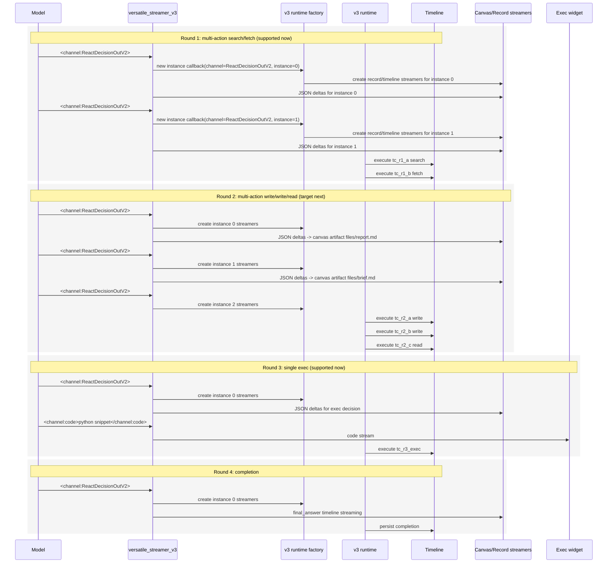

# React v3 Multiple Tools Calling

This note describes the `v3` implementation path for multi-action rounds and the limits that still apply.

## Current Status

| Area | Status in `v3` | Notes |
|---|---|---|
| Repeated `ReactDecisionOutV2` channel instances | Implemented | Parsed and routed as distinct channel instances |
| Per-instance subscriber factory | Implemented | Done in `versatile_streamer_v3.py` |
| Per-instance record/timeline streamers | Implemented | Spawned on `ReactDecisionOutV2` channel-open |
| Safe multi-action bundle execution | Implemented | Sequential only |
| Multi-action read/search tools | Implemented | `react.read`, `react.memsearch`, `react.search_files`, `web_tools.*` |
| Multi-action `react.write` / `react.patch` / rendering tools | Not enabled yet | Router supports per-instance streamers, policy still blocks these bundles |
| Exec + code | Implemented only for single-action round | Exactly one `ReactDecisionOutV2` plus one `code` channel |
| Multiple actions plus `code` | Explicitly rejected | Not supported |
| Parallel/interleaved tool execution | Not implemented | Sequential only by design |

## Why `v3` Exists

The old implementation was single-action by construction in several places:

- `v2/agents/decision.py` assumed one `ReactDecisionOutV2`
- `versatile_streamer.py` keyed streaming state by channel name only
- `v2/runtime.py` wired one JSON subscriber set, one decision streamer set, one pending tool call
- widget streamers were effectively single-instance per decision round

`v3` isolates the changes needed to make repeated decision-channel instances first-class without destabilizing `v2`.

## Core Design

The new live routing model is:

1. The model emits repeated `<channel:ReactDecisionOutV2>...</channel:ReactDecisionOutV2>` sections.
2. `versatile_streamer_v3.py` detects each new channel instance and assigns `channel_instance = 0, 1, 2, ...`.
3. A subscriber factory is invoked on channel-open.
4. `v3/runtime.py` uses that factory to create per-instance streamers:
   - record/canvas streamers
   - per-instance decision timeline streamer
5. Each action still executes as a normal tool round with its own `tool_call_id`.
6. Execution remains sequential, so timeline grouping, compaction, caching points, and turn-log semantics remain stable.

## Important Code Rule

This is valid:

```xml
<channel:thinking>...</channel:thinking>
<channel:ReactDecisionOutV2>...</channel:ReactDecisionOutV2>
<channel:code>...</channel:code>
```

but only if the single decision is `exec_tools.execute_code_python`.

This is invalid:

```xml
<channel:thinking>...</channel:thinking>
<channel:ReactDecisionOutV2>...</channel:ReactDecisionOutV2>
<channel:ReactDecisionOutV2>...</channel:ReactDecisionOutV2>
<channel:code>...</channel:code>
```

Reason:

- `code` is attached only to a single exec action
- multi-action bundles must leave `code` empty
- exec never participates in a multi-action bundle

## 4-Round Example

The example below shows the desired end-state flow. Round 1 and Round 3 are supported now. Round 2 is the next policy widening target; the streamer/router shape already supports it, but current safe-bundle validation still blocks multi-action `react.write`.

### Mermaid



### ASCII

```text
ROUND 1  supported now
-------
Model output:
  <ReactDecisionOutV2 #0> web_tools.web_search
  <ReactDecisionOutV2 #1> web_tools.web_fetch

Channel-open callbacks:
  instance 0 -> create:
    react.record.tc_r1.i0
    timeline_text.react.decision.0.0
    react.final_answer.0.0
  instance 1 -> create:
    react.record.tc_r1.i1
    timeline_text.react.decision.0.1
    react.final_answer.0.1

Execution:
  tc_r1_a = web_tools.web_search
  tc_r1_b = web_tools.web_fetch

Timeline shape:
  react.decision.raw
  react.tool.call   tc_r1_a
  react.tool.result tc_r1_a
  react.tool.call   tc_r1_b
  react.tool.result tc_r1_b


ROUND 2  target next, not enabled by current safe_fanout policy
-------
Model output:
  <ReactDecisionOutV2 #0> react.write path=files/report.md channel=canvas
  <ReactDecisionOutV2 #1> react.write path=files/brief.md channel=canvas
  <ReactDecisionOutV2 #2> react.read  paths=[files/report.md]

Channel-open callbacks:
  instance 0 -> create streamers for report.md
  instance 1 -> create streamers for brief.md
  instance 2 -> create streamers for read decision

Artifacts created by streamers:
  instance 0 record artifact -> react.record.tc_r2.i0
  instance 0 canvas artifact -> files/report.md
  instance 1 record artifact -> react.record.tc_r2.i1
  instance 1 canvas artifact -> files/brief.md
  instance 2 record artifact -> react.record.tc_r2.i2

Execution order stays sequential:
  tc_r2_a = react.write(report.md)
  tc_r2_b = react.write(brief.md)
  tc_r2_c = react.read(report.md)


ROUND 3  supported now
-------
Model output:
  <ReactDecisionOutV2 #0> exec_tools.execute_code_python
  <code> ...python snippet... </code>

Rules:
  exactly one decision instance
  exactly one code stream
  no bundle fanout here

Artifacts created:
  react.record.tc_r3.i0
  react.exec.exec_tc_r3
  contracted exec outputs under files/... or outputs/...


ROUND 4  supported now
-------
Model output:
  <ReactDecisionOutV2 #0> action=complete

Artifacts/streaming:
  timeline_text.react.decision.3.0
  react.final_answer.3.0
  final persisted assistant completion
```

## What the New Streamer Actually Adds

`versatile_streamer_v3.py` adds two important capabilities:

1. `channel_instance`
   - every repeated channel instance is identified as `(channel_name, instance_idx)`

2. `subscribe_factory(channel, instance_idx)`
   - runtime can provide a factory instead of one static subscriber
   - when a new `ReactDecisionOutV2` instance opens, the streamer asks runtime for the subscribers to pin to that instance

This is the key mechanism that keeps the live path correct for repeated decision channels.

## Why Timeline Management Stays Safe

For the supported `v3` path, timeline management is intentionally unchanged in structure:

- timeline blocks are still written by `ReactRound.*`
- each executed action still gets its own `tool_call_id`
- multi-action bundles still execute sequentially
- no interleaved round commits are introduced

So:

- caching points remain valid
- compaction logic still sees the same block kinds/order
- session pruning logic is not disrupted by the new subscriber routing

The router changes live streaming behavior, not the persisted block model.

## Can We Drop In `v3` To Test It?

Yes, with two constraints:

1. use the version switch
   - `AI_REACT_AGENT_VERSION=v3`

2. understand what is actually enabled
   - safe read/search multi-action bundles: yes
   - multi-action write/render bundles: not yet
   - exec with code: yes, but only as single-action round

That makes `v3` usable for controlled testing without changing the persisted timeline schema.

## Conversation Fetch Compatibility

The conversation details/fetch path in:

- `app/ai-app/src/kdcube-ai-app/kdcube_ai_app/apps/chat/ingress/conversations/conversations.py`

does not depend on live subscriber routing. It reads persisted conversation rows and stored artifacts through the conversation browser/store path.

So the new router does not break fetch-by-conversation as long as:

- timeline blocks are still contributed normally
- turn log is still persisted normally
- assistant completion persistence remains unchanged

That is the current `v3` design.

## Steer / Followup Safety

`v3` was forked from `v2`, and the steer/followup machinery remains in the same runtime phase-watch path:

- timeline hook acceptance
- external-event watch during active phase
- steer cancellation of decision/tool phase
- followup/steer folding into the live turn timeline

The multiple-tools work changed:

- decision-channel parsing
- decision-channel live subscriber routing
- decision packet normalization

It did **not** redesign the external-event flow itself.

So the intent is that steer/followup behavior remains intact in `v3`. That said, it should still be validated explicitly when `AI_REACT_AGENT_VERSION=v3` is turned on in a real environment, because live phase cancellation and decision streaming now meet at a different subscriber/router layer.
